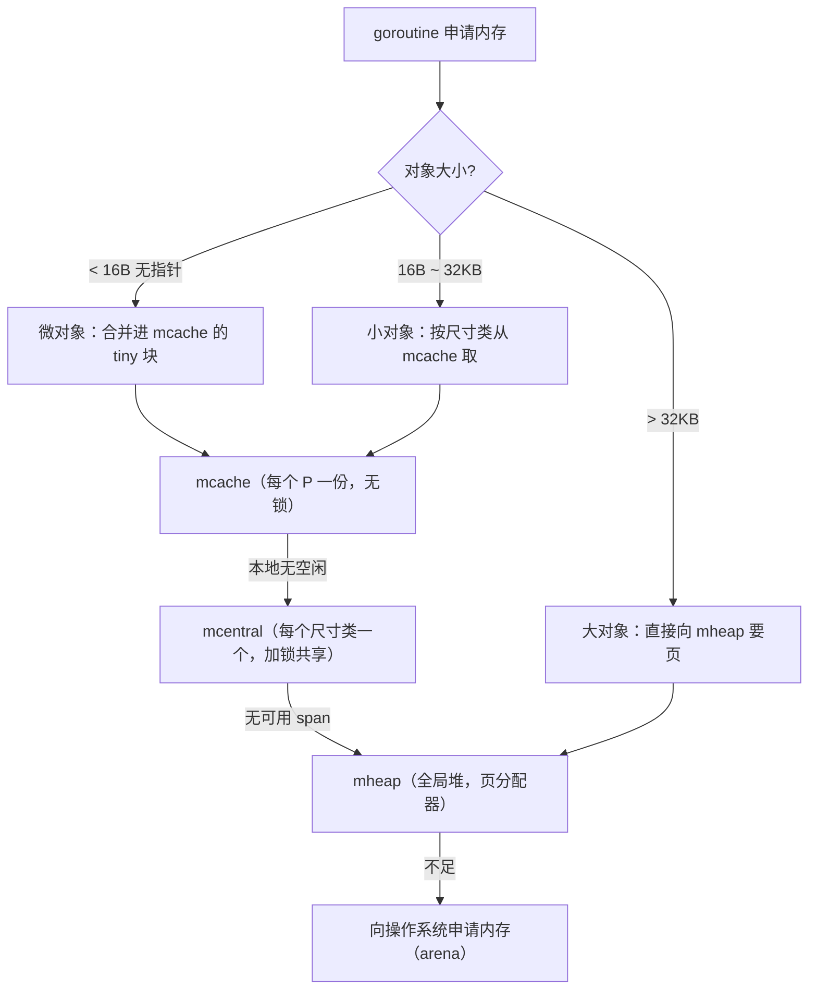

# 12.2 组件

[12.1](./basic.md) 说分配器是"快路径无锁、慢路径加锁"的分层结构。这一节给这套结构里的几个
核心组件命名、定位,理解了它们之间的关系，后面的分配路径就只是"在这张图上走一遍"。

## 12.2.1 三级缓存加一种内存块

- **mspan**：一切的基本单位,一段连续的内存页，被切成同一尺寸类的若干等大槽位。每个 span
  记着自己的尺寸类、空闲槽位图、以及供 GC 用的存活标记。分配小对象，本质就是从某个 span 里
  取一个空槽。
- **mcache**：**每个 P 一份**的本地缓存（[9.3](../../part3concurrency/ch09sched/mpg.md)）。它为
  每个尺寸类各持有一两个 span。从 mcache 分配**完全无锁**,这是绝大多数分配走的快路径，也是
  分配器高性能的根本。
- **mcentral**：**每个尺寸类一个**的中心仓库，被所有 P 共享，故访问需**加锁**。当某个 P 的
  mcache 里某尺寸类的 span 用尽，就来对应的 mcentral 换一个有空槽的 span。
- **mheap**：**全局唯一**的堆，管理所有页。mcentral 缺 span 时向它要;大对象直接向它按页申请。
  mheap 之下是页分配器（[12.7](./pagealloc.md)）与向操作系统申请的 **arena**（[12.3](./init.md)）。

## 12.2.2 一条补货链

这四者构成一条**自下而上的补货链**：mcache（无锁、最快）← mcentral（加锁、按尺寸类）←
mheap（全局、管页）← 操作系统。分配时由上往下找：本地 mcache 有就直接拿（绝大多数情况）；
没有才逐级向下、付出越来越大的同步代价去补货。回收（清扫，[13.x](../../part4memory/ch13gc)）则
反向：span 用空了还给 mcentral，整段空闲的页还给 mheap，乃至还给操作系统
（[11.6](../../part3concurrency/ch11sync/pool.md) 提过的 scavenge）。

这套结构把 [12.1](./basic.md) 的设计原则落成了具体的零件：**每 P 无锁缓存**消除了快路径的争用，
**按尺寸类组织**让分配退化成"取一个等大槽位"，**分层补货**把加锁限制在不常走的慢路径上。
它与调度器的"本地队列 ← 全局队列 ← 窃取"（[9.2](../../part3concurrency/ch09sched/steal.md)）
是同一种分层减争的思想,在 Go 运行时里，你会反复遇见这个模式。

## 延伸阅读的文献

1. The Go Authors. *runtime/mcache.go、mcentral.go、mheap.go（各组件定义）.*
   https://github.com/golang/go/tree/master/src/runtime
2. The Go Authors. *runtime/malloc.go（分配器总览）.*
   https://github.com/golang/go/blob/master/src/runtime/malloc.go
3. Sanjay Ghemawat, Paul Menage. *TCMalloc design.* https://google.github.io/tcmalloc/design.html
4. 本书 [12.4](./largealloc.md)–[12.7](./pagealloc.md)（各分配路径）.

## 许可

&copy; 2018-2026 The [golang.design](https://golang.design) Initiative Authors. Licensed under [CC-BY-NC-ND 4.0](https://creativecommons.org/licenses/by-nc-nd/4.0/).
