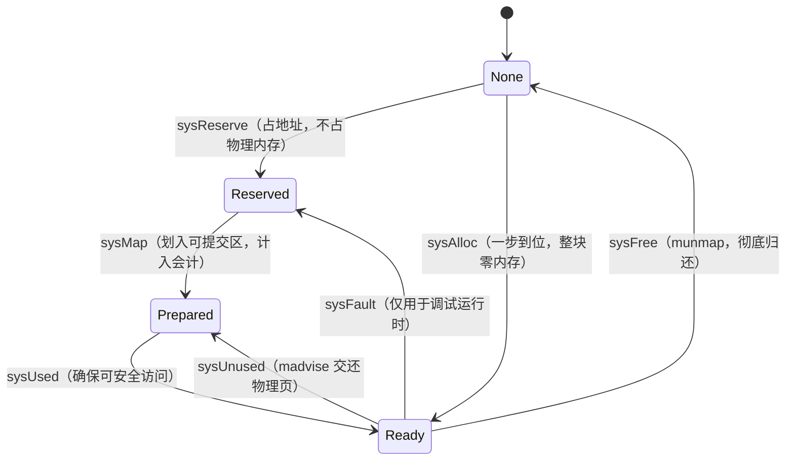

# 12.3 初始化

[12.2](./component.md) 把分配器拆成了 mcache、mcentral、mheap、arena 几样零件，但那是一张
静态的图。这些零件并非凭空就位，它们要在程序启动之初被一次性安放好。本节回答的问题是：
当 `main` 还没运行、第一次 `new` 还没发生时，运行时究竟为分配器铺好了哪些基础设施。

读懂初始化，关键不在于逐行复述 `mallocinit`，而在于看清两件被它确立下来、此后再不更改的
事实：其一，**地址空间是怎样被组织成 arena 的**，这决定了运行时如何从任意一个堆地址反查出
「它属于哪个 span、里面是不是指针、是否还存活」，是垃圾回收（[13](../ch13gc)）赖以工作的地基；
其二，**「预留地址」与「提交物理内存」是两件事**，这解释了为何一个 Go 进程的虚拟内存（VIRT）
常常远大于其常驻内存（RES），而这并不是泄漏。

分配器是除执行栈外最先完成初始化的子系统之一，由调度器引导阶段调用 `mallocinit`
（[3.5](../../part1overview/ch03life/boot.md)）。

## 12.3.1 mallocinit：启动时铺好地基

`mallocinit` 做三类事：一批关于常量的自检（编译期算出的 arena 尺寸、位图字数、物理页大小
必须自洽），初始化全局堆 `mheap_`，以及为 64 位地址空间播下一组「arena 增长提示」。裁剪后的
速写如下：

```go
func mallocinit() {
	// 1. 自检：编译期常量必须自洽。例如堆位图字数须为 2 的幂（取模寻址要用），
	//    物理页大小须落在 [minPhysPageSize, maxPhysPageSize] 且为 2 的幂。
	if heapArenaBitmapWords&(heapArenaBitmapWords-1) != 0 {
		throw("heapArenaBitmapWords not a power of 2")
	}
	if physPageSize == 0 {
		throw("failed to get system page size")
	}
	// ... 更多关于 physHugePageSize、size class 边界的检查

	// 2. 初始化全局堆，并为引导线程分配第一个 mcache。
	mheap_.init()
	mcache0 = allocmcache()

	// 3. 在 64 位机器上播下 arena 增长提示，从地址空间中部开始。
	if goarch.PtrSize == 8 {
		for i := 0x7f; i >= 0; i-- {
			var p uintptr
			switch {
			case GOARCH == "arm64" && GOOS == "darwin":
				p = uintptr(i)<<40 | uintptrMask&(0x0013<<28)
			default:
				p = uintptr(i)<<40 | uintptrMask&(0x00c0<<32)
			}
			hint := (*arenaHint)(mheap_.arenaHintAlloc.alloc())
			hint.addr = p
			hint.next, mheap_.arenaHints = mheap_.arenaHints, hint
		}
	}
}
```

那串自检不是仪式。分配器的许多快路径靠位运算寻址，前提是这些尺寸恰为 2 的幂、彼此整除；
若某次移植或改尺寸破坏了前提，与其让程序在运行时给出难解的越界，不如在启动时当场 `throw`。
这是运行时代码的一种笔法：把「本应恒真」的不变量写成启动期断言，把错误挡在最前面。

第三步的「增长提示」`arenaHints` 值得多说一句。Go 不在启动时就向操作系统索要整片堆，而是
记下一串「将来想从这里开始长堆」的地址。默认从 `0x00c0...` 起（在小端机上内存里呈现为
`c0 00`、`c1 00` ...，调试时一眼可辨），从地址空间中部铺开，便于把堆扩展成一段连续区域而
不撞上别的映射。真正向操作系统要地址，要等到第一次堆增长时（[12.7](./pagealloc.md)）才发生。

`mheap_.init` 则把堆里各种定长元数据的 `fixalloc`（[12.2](./component.md)）逐一初始化：
mspan、mcache、各类 special 记录都有自己的定长分配器。其中一处细节值得点出：

```go
func (h *mheap) init() {
	h.spanalloc.init(unsafe.Sizeof(mspan{}), recordspan, unsafe.Pointer(h), &memstats.mspan_sys)
	h.cachealloc.init(unsafe.Sizeof(mcache{}), nil, nil, &memstats.mcache_sys)
	h.arenaHintAlloc.init(unsafe.Sizeof(arenaHint{}), nil, nil, &memstats.other_sys)
	// ... 还有十余个 special 记录的 fixalloc

	// 不对 mspan 清零：后台清扫会与「分配一个 span」并发地检视它，
	// 故 span 的 sweepgen 须在释放后重分配时存活，以防后台清扫错误地把它从 0 CAS 走。
	// 因为 mspan 不含堆指针，不清零是安全的。
	h.spanalloc.zero = false

	for i := range h.central {
		h.central[i].mcentral.init(spanClass(i))
	}
}
```

`h.spanalloc.zero = false` 是分配器与 GC 共生（[12.2](./component.md)）在初始化阶段就显形的
一处证据：mspan 的内存被回收后重分配时不清零，好让 `sweepgen` 这个清扫代字段跨越「释放、
重分配」而存活，从而让后台清扫不会把一个其实正在被复用的 span 误判为可回收。一个看似只是
「省一次 memclr」的开关，背后是清扫器与分配器之间的一条并发约定。

## 12.3.2 arena：地址空间的组织

堆不是一整块，它由许多固定大小的 **arena** 拼成。64 位 Linux 上每个 arena 为 64MB
（`heapArenaBytes = 1 << logHeapArenaBytes`，`logHeapArenaBytes = 26`），堆向操作系统索取地址
始终以 arena 为粒度、且对齐到 arena 边界。为什么要切成 arena，而不是把堆当作一段无结构的
连续内存？因为运行时需要一种**从任意地址 $O(1)$ 反查元数据**的能力，而对齐的定长分块让这种
反查退化成几次移位与查表。

给定一个堆地址 `p`，运行时先把它换算成 arena 编号，再用这个编号查一张二级表 `arenas`：

```go
type mheap struct {
	// ...
	// 地址空间按 arena 组织；arenas 是 arena 编号到 heapArena 元数据的二级索引。
	// 64 位非 Windows 上 arenaL1Bits == 0，于是 L1 维只有一项，实际退化为一级表。
	arenas [1 << arenaL1Bits]*[1 << arenaL2Bits]*heapArena
}

// 由堆地址算出 arena 编号（amd64 上先减去 arenaBaseOffset，把符号位区间折叠掉）
func arenaIndex(p uintptr) arenaIdx {
	return arenaIdx((p - arenaBaseOffset) / heapArenaBytes)
}
```

为何是**二级**表而非一级？若用一张平坦数组覆盖整个 64 位可寻址堆区间
（`heapAddrBits = 48`），单是这张指针表就要占去可观的内存，而绝大部分项永远为空。二级化
（`arenas[L1][L2]`）让 L2 子表**按需分配**：只有真正映射了某个 arena，对应的 L2 子表才会
被创建。在 64 位非 Windows 平台，`arenaL1Bits = 0`，L1 维退化为单项，索引实际是一级的；
Windows 因地址空间布局不同才启用 L1。这又是一处「为不常用的情形省内存」的工程选择。

每个 arena 配一份 `heapArena` 元数据，存放在堆之外。它就是「反查」的答案所在：

```go
// heapArena：一个 arena 的元数据，存于 Go 堆之外，经 mheap_.arenas 索引（速写）
type heapArena struct {
	// 本 arena 内「页号 -> *mspan」的映射。已分配 span 的每一页都指向该 span。
	// 用于从任意地址反查它属于哪个 span。
	spans [pagesPerArena]*mspan

	// 哪些 span 处于 mSpanInUse；按页号索引，只用每个 span 首页对应的位。
	pageInUse [pagesPerArena / 8]uint8
	// 哪些 span 上有被标记存活的对象。清扫时用它快速找出整段可释放的 span。
	pageMarks [pagesPerArena / 8]uint8

	// 本 arena 内尚未用过、因而仍为零的首字节水位。用于判断一次分配是否需要清零。
	zeroedBase uintptr
}
```

`spans` 数组是反查链的第一环：给定地址 `p`，先经 `arenaIndex` 取得 arena，再用
`(p / pageSize) % pagesPerArena` 取得页号，查 `spans` 即得 `*mspan`。拿到 span 之后，
「`p` 是不是指针」「`p` 是否存活」就能从 span 的元数据（[12.2](./component.md) 的 `gcmarkBits`，
以及小对象的堆位图）继续问下去。这条「地址 -> arena -> span -> 对象元数据」的链，是垃圾
回收能够在 $O(1)$ 内对一个指针做扫描决策的根本（[13](../ch13gc)）。

> 关于指针位图的存放，Go 1.22 起做过一次重要演进。早先每个 arena 配一张覆盖整片 arena 的
> 指针位图；如今多数小对象的指针/标量信息改为**随对象内联或置于 span 头部**
> （`heapBitsInSpan`、span 的 malloc header），仅必要时回退到独立位图。这把元数据从「按
> 地址空间均摊」改成「按实际对象就近存放」，改善了局部性。本书在 [13](../ch13gc) 展开扫描时
> 再回到这条线。读者只需记住：arena 这一层提供的是**地址到 span 的快速反查**，而指针信息的
> 具体落点随版本演进。

## 12.3.3 预留与提交：为何 VIRT 远大于 RES

切好了 arena 的概念，还要回答一个实际问题：运行时是如何从操作系统拿到这些 arena 背后的
内存的。这里有一组容易混淆、却必须分清的动作。**预留地址空间**（reserve）与**提交物理内存**
（commit）是两件事。预留只是向操作系统声明「这段虚拟地址归我」，不消耗任何物理页，几乎
免费；只有当某段地址第一次被真正写入前，运行时才提交它，让操作系统为其分配物理页。

运行时把内存区域抽象成四种状态，所有 OS 层操作都在这四态间迁移（见 `runtime/mem.go`）：



- **None**：默认状态，既未预留也未映射，访问会出错。
- **Reserved**：地址归运行时所有，但访问会触发缺页错误，**不计入进程内存足迹**。
- **Prepared**：已预留，意在不由物理内存支撑（操作系统可懒惰实现），可高效转入 Ready；
  此时访问的结果未定义。
- **Ready**：可安全访问。

理论上只要 None、Reserved、Ready 三态便足以覆盖所有平台，Prepared 是为性能多设的一态。
它的价值在 POSIX 系统上看得最清楚：Reserved 通常是一段 `PROT_NONE` 的私有匿名 `mmap`，
转入 Ready 本需把权限改成 `PROT_READ|PROT_WRITE`；而 Prepared 的「未定义」给了运行时余地，
用 `MADV_FREE` 就能把 Ready 降回 Prepared。于是权限位只在早期设一次，此后运行时随时可以
告诉操作系统「这些页你尽管拿去」，而无需反复改权限。

这套抽象落到 Linux，就是几个 `mmap`/`madvise` 的薄封装（`runtime/mem_linux.go`）：

```go
// 预留：占住地址，但 PROT_NONE 使其不可访问，也就不占物理内存
func sysReserveOS(v unsafe.Pointer, n uintptr, name string) unsafe.Pointer {
	p, err := mmap(v, n, _PROT_NONE, _MAP_ANON|_MAP_PRIVATE, -1, 0)
	if err != 0 {
		return nil
	}
	return p
}

// 提交：把已预留的地址改成可读写，操作系统这才会按需分配物理页
func sysMapOS(v unsafe.Pointer, n uintptr, name string) {
	p, err := mmap(v, n, _PROT_READ|_PROT_WRITE, _MAP_ANON|_MAP_FIXED|_MAP_PRIVATE, -1, 0)
	if err == _ENOMEM {
		throw("runtime: out of memory")
	}
	// ...
}

// 交还：MADV_FREE 告诉内核这些物理页可被回收，地址仍归我
func sysUnusedOS(v unsafe.Pointer, n uintptr) {
	// 优先 MADV_FREE，不支持则退回 MADV_DONTNEED，再不支持则重映射
	madvise(v, n, _MADV_FREE)
}
```

七个跨平台原语与四态的对应关系是：`sysReserve` 取地址（None→Reserved），`sysMap` 划入
可提交区（Reserved→Prepared），`sysUsed` 确保可用（Prepared→Ready），`sysUnused` 交还物理页
（Ready→Prepared），`sysFree` 彻底 `munmap`（Ready→None），`sysFault` 设为必然出错
（Ready→Reserved，仅调试用），`sysAlloc` 则是一步拿到整块零内存（None→Ready）的捷径。
跨平台层（`mem.go`）只做内存会计，真正的系统调用落在各 OS 的 `*OS` 实现里。

需要说明的是，「提交」在不同平台的落点并不一致。在 Linux 这类支持 overcommit 的系统上，
`sysMap` 把权限改为可读写后，物理页是在首次访问时由内核**惰性缺页**补上的，`sysUsed`
（Prepared→Ready）几乎是空操作；而在 Windows 这类有显式提交与硬性额度的系统上，`sysUsed`
才是真正向操作系统提交物理内存的那一步。四态抽象之所以多设一个 Prepared，正是为了让两类
平台共用同一套上层逻辑。

现在可以回答开头那个实际问题了。一个 Go 进程的 VIRT 常常是几个 GB 乃至上百 GB，远超它
实际占用的 RES，因为运行时**预留**了大片 arena 地址空间（Reserved/Prepared），却只对真正
写入过的页**提交**了物理内存（Ready）。预留不计入物理足迹，所以这不是泄漏，而是上述
「廉价占地址、按需付物理页」策略的正常表现。同理，当堆收缩时，运行时用 `sysUnused`
（`MADV_FREE`）把物理页交还内核，但地址仍预留着，这也是为何 RES 的下降有时会滞后于堆的
实际收缩：`MADV_FREE` 让内核「有空再回收」，页面要到内存吃紧时才真正归还。

## 12.3.4 初始化之后：就位的基础设施

`mallocinit` 返回时，分配器的骨架已然成形，尽管此刻堆里还没有一个 arena 被真正提交。
就位的有这样几样：

- **页分配器** `mheap_.pages`（[12.7](./pagealloc.md)）已初始化，准备在第一次堆增长时回答
  「哪段连续页空闲」。
- **每个尺寸类一个 mcentral**（`h.central` 数组）已就位，各自服务一个 `spanClass`，
  等待 mcache 来换 span（[12.2](./component.md)）。
- **arena 二级索引** `arenas` 已建好骨架（L2 子表尚未分配），`arenaHints` 已播下一串增长提示。
- **第一个 mcache**（`mcache0`）已由 `allocmcache` 经 `fixalloc` 从非 GC 内存分出，
  暂挂在引导线程上。它将在 `procresize`（[9.3](../../part3concurrency/ch09sched/mpg.md)）中
  转交给某个 P，从此 mcache 的生命周期与 P 绑定，而非 M。

换言之，初始化建立的是「容器与索引」，而非「内容」。第一个 arena 的提交、第一个 span 的
切分，都推迟到第一次分配真正发生时（[12.4](./largealloc.md)–[12.6](./tinyalloc.md)）。
这种「先搭好查找结构、内容懒加载」的安排，与 arena 二级表按需分配 L2、地址预留而物理内存
按需提交，是同一种思路在不同层次上的复用：把昂贵的动作尽量推迟，只在确知必要时才付出代价。

## 延伸阅读的文献

1. The Go Authors. *runtime/malloc.go*（`mallocinit`、arena 常量、`arenaHints` 与
   `arenaIndex`）. https://github.com/golang/go/blob/master/src/runtime/malloc.go
2. The Go Authors. *runtime/mheap.go*（`mheap.init`、`heapArena`、`arenas` 二级索引、
   `spans` 反查）. https://github.com/golang/go/blob/master/src/runtime/mheap.go
3. The Go Authors. *runtime/mem.go*（None/Reserved/Prepared/Ready 四态抽象与七个 `sys*`
   原语）. https://github.com/golang/go/blob/master/src/runtime/mem.go
4. The Go Authors. *runtime/mem_linux.go*（`mmap`/`madvise` 对 `sysReserve`/`sysMap`/
   `sysUnused` 等的实现）. https://github.com/golang/go/blob/master/src/runtime/mem_linux.go
5. The Go Authors. *runtime/mbitmap.go*（`heapBitsInSpan`、`writeHeapBitsSmall`、
   `gc.MinSizeForMallocHeader`、`span.heapBits()`，即 Go 1.22 起指针位图从 per-arena
   改为内联/span 头部存放的实现）.
   https://github.com/golang/go/blob/master/src/runtime/mbitmap.go
6. 本书 [3.5 调度器初始化](../../part1overview/ch03life/boot.md)、[12.2 组件](./component.md)、
   [12.7 页分配器](./pagealloc.md)、[13 垃圾回收](../ch13gc).
