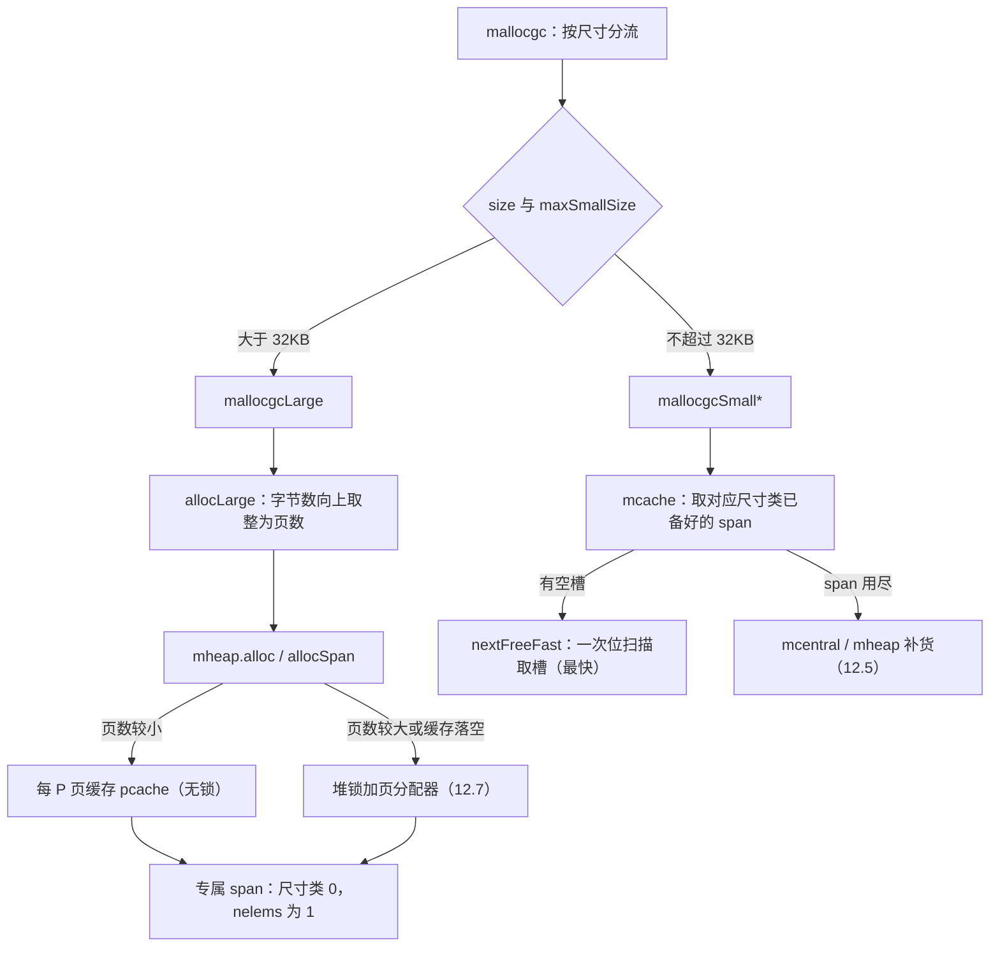

# 12.4 大对象分配

[12.2](./component.md) 的分配层级是为「小而频繁」的对象造的：每 P 一份的 mcache、按尺寸类
共享的 mcentral、全局的 mheap，三层缓存把绝大多数分配收敛成几条无锁位运算。可这套精巧的
机器有一个隐含前提，对象小到能被尺寸类装下。一旦对象超过 `maxSmallSize`（go1.26 中为
32768 字节，即 32KB），它就装不进任何尺寸类的槽位，整条补货链对它失去意义。

大对象（large object）走的是另一条路：跳过 mcache 与 mcentral，**直接向 mheap 按页申请**
一段连续内存，为它单独造一个 span。这条路在代码上比小对象简短得多，但简短不等于廉价。
本节讲清楚它为何被设计成「绕开缓存」，这条路具体怎么走，以及绕开缓存在工程上要付出什么。

## 12.4.1 为什么大对象不进缓存

缓存之所以划算，靠的是两个假设：被缓存的东西**频繁复用**，且**尺寸整齐**到可以预先按类
备货。小对象两条都满足，于是 mcache 为每个尺寸类常备一个 span，命中率高、摊销下来近乎免费。
大对象两条都不满足。

它们低频。一个程序里 32KB 以上的分配，数量级远小于小对象，多是大缓冲区、大切片、
大哈希表的底层数组。为低频对象维护每 P 缓存，备的货大半时间闲置，命中率却上不去，
缓存反而成了纯粹的内存浪费。

它们尺寸离散。小对象被归进 68 个尺寸类，是因为这个区间内的尺寸足够密集，量化到固定档位的
浪费可控（最坏约 12.5%，见 [12.1](./basic.md)）。大对象的尺寸跨度从 32KB 到数百 MB，
若仍按尺寸类备货，类数会爆炸，每类又难得复用一次。与其按类缓存，不如来一个算一个，
按实际页数现切。

这正是分层分配器一以贯之的取舍：**把热路径打磨到极致，让冷路径保持简单**。小对象是热路径，
值得用三层缓存和位图换速度；大对象是冷路径，多写的缓存逻辑省不下多少时间，却凭空添了内存
与复杂度。于是 go1.26 干脆为它另开一个入口 `mallocgcLarge`，与小对象的
`mallocgcSmall*`、微对象的 `mallocgcTiny` 在 `mallocgc` 里就按尺寸分流（见
[12.5](./smallalloc.md)），各走各的代码，互不拖累。

## 12.4.2 直接向堆要页

大对象分配的主干很短。`mallocgcLarge` 拿到 mcache 只是为了借用它的统计与采样字段，
真正要 span 的活交给 `mcache.allocLarge`。后者做两件事：把字节数向上取整成页数，
再向 mheap 要这么多页：

```go
// mcache.allocLarge：为一个大对象造一个专属 span（速写）
func (c *mcache) allocLarge(size uintptr, noscan bool) *mspan {
    // 把字节数向上取整为页数（go1.26 的页大小为 8KB）
    npages := size >> gc.PageShift
    if size&pageMask != 0 {
        npages++
    }
    // 预扣清扫额度：分配 n 页前，先帮着清扫回收 n 页，抑制堆无序增长
    deductSweepCredit(npages*pageSize, npages)

    // 尺寸类 0 即「大对象 span」的标记；noscan 表示对象不含指针
    spc := makeSpanClass(0, noscan)
    s := mheap_.alloc(npages, spc) // 向全局堆按页申请
    if s == nil {
        throw("out of memory")
    }
    // ... 更新 largeAlloc 统计、推进 heapLive、把 span 挂到清扫列表 ...
    s.limit = s.base() + size // 把 limit 收紧到对象实际占用处
    return s
}
```

注意 `makeSpanClass(0, noscan)` 里的那个 0。尺寸类 0 是一个保留档位，专门标记「这个 span
只装一个大对象」。在小对象的 span 里，`elemsize` 是尺寸类查表得来的固定槽位大小，一个 span
切出几十上百个等大槽；而尺寸类 0 的 span，`elemsize` 直接等于整个 span 的字节数，
`nelems` 为 1，整段连续页就是一个对象。回到 `mallocgcLarge`，拿到 span 后只需
`freeindex = 1`、`allocCount = 1`，宣告这唯一的槽已被占用，对象的地址就是 span 的首地址：

```go
span := c.allocLarge(size, typ == nil || !typ.Pointers())
span.freeindex = 1
span.allocCount = 1
span.largeType = nil          // 暂不让 GC 扫描，等内存清零、类型写好再发布
size = span.elemsize
x := unsafe.Pointer(span.base())
```

向堆要页的 `mheap.alloc` 把活推给 `allocSpan`，并放到系统栈上执行，因为它可能要持有堆锁，
而持锁期间不能触发会再次申请堆内存的栈增长。`allocSpan` 内部分两条路取得连续页：

```go
// mheap.allocSpan：取得 npages 连续页，组装成 span（速写，省去清扫/对齐细节）
func (h *mheap) allocSpan(npages uintptr, typ spanAllocType, spc spanClass) (s *mspan) {
    pp := getg().m.p.ptr()
    // 页数较小时，先试每 P 的页缓存（pcache），这条路无需堆锁
    if pp != nil && npages < pageCachePages/4 {
        base, scav = pp.pcache.alloc(npages)
        if base != 0 {
            s = h.tryAllocMSpan()
            if s != nil {
                goto HaveSpan   // 命中页缓存，全程无锁
            }
        }
    }
    // 页缓存不够，或要的页太多：落到堆锁，向页分配器（见 12.7）要连续页
    lock(&h.lock)
    base, scav = h.pages.alloc(npages)
    if base == 0 {
        if _, ok := h.grow(npages); !ok { // 堆里腾不出，向操作系统增长（见 12.7）
            unlock(&h.lock); return nil
        }
        base, scav = h.pages.alloc(npages)
    }
    s = h.allocMSpanLocked()
    unlock(&h.lock)
HaveSpan:
    h.initSpan(s, typ, spc, base, npages, scav) // 设 state、elemsize、清零标记、位图
    return s
}
```

「哪一段连续页是空闲的」这个问题，由 mheap 之下的**页分配器**回答，它的基数树与位图查找是
[12.7](./pagealloc.md) 的主题，这里只把它当作一个「给我 n 页连续空间」的接口。页分配器也腾
不出空间时，`grow` 才向操作系统索取新的 arena，这条更冷的路同样属于 [12.7](./pagealloc.md)。
本节止步于 `h.pages.alloc(npages)`，专注大对象这一段。

## 12.4.3 绕开缓存的代价

大对象省掉了缓存的备货开销，却也丢掉了缓存带来的快路径。逐项看绕开缓存要付出什么。

**同步代价更高，但不是「必然抢全局锁」。** go1.26 在 `allocSpan` 里留了一道缓冲：页数较小
（`npages < pageCachePages/4`，`pageCachePages` 为 64，故约小于 16 页，对应 8KB 页平台上
约 128KB 以内）时，先试每 P 的页缓存 `pcache`，命中则全程无锁。所以 32KB 到约 128KB 的大
对象，常常并不触碰堆锁。真正的差距不在「锁」这一个字，而在于大对象**没有现成的缓存 span 可
摘**：小对象的快路径是从 mcache 里已经备好的 span 上做一次位扫描取槽
（`nextFreeFast`，见 [12.5](./smallalloc.md)），而大对象每次都要跑完整的 `allocSpan`,
预扣清扫额度（`deductSweepCredit`）、向页分配器查找连续页、组装并初始化一个新 span，
页缓存落空或页数过大时还要落到堆锁。即便命中页缓存，这条路的常数也远比一次位扫描重。

**页级内部碎片。** 大对象按页取整，每个对象独占整数页，尾部不足一页的部分白白浪费。一个
32769 字节的对象（刚过 32KB 一个字节），向上取整为 5 页即 40960 字节，浪费近 8KB。
这种碎片不像小对象的尺寸类碎片有 12.5% 的上限，它取决于对象大小相对页大小的余数，
最坏接近一整页。对频繁分配的、尺寸恰好略过页边界的大对象，这笔浪费值得在设计数据结构时留意。

**强烈牵动 GC 步调。** 大对象一次就给堆活跃量（heapLive）添上一大笔。`allocLarge` 里
`gcController.update` 即时把这几十上百 KB 计入 heapLive，而 GC 的触发依据正是 heapLive
相对上轮标记后活跃量的增长比例（GOGC，见 [13](../ch13gc)）。于是 `mallocgcLarge` 结尾专门
测一次触发条件，必要时就地启动一轮 GC：

```go
// 大对象分配尾声：检查是否该触发 GC（mallocgcLarge）
if t := (gcTrigger{kind: gcTriggerHeap}); t.test() {
    gcStart(t)
}
```

小对象分配也会推进 heapLive，但单次增量小、被 mcache 摊薄；大对象单次增量大，
一次几 MB 的分配可能独力把堆推过触发线，立刻引发一轮 GC。换言之，大对象不只是分配慢，
它还会经由 GC 步调把成本转嫁给整个程序。

**用 `sync.Pool` 复用大缓冲区。** 既然大对象分配贵、又强烈牵动 GC，对那些生命周期短、
反复申请释放的大缓冲区（如网络读写缓冲、序列化缓冲），最划算的做法是别让它们反复经过分配器,
用 [11.6](../../part3concurrency/ch11sync/pool.md) 的 `sync.Pool` 把用过的大缓冲存起来重用。
这恰是分配器「不为低频大对象建缓存」之后，留给应用层自己补上的那块缓存：运行时只为通用的
小对象热路径优化，特定的大对象复用模式交由最了解它的使用者按需缓存。

## 12.4.4 与小对象路径的对照

把两条路并排放，大对象分配的设计意图就清楚了：



小对象一侧的全部精巧,尺寸类、每 P 缓存的 span、位图与位扫描、与清扫共生的 `gcmarkBits`,
都是为了把高频路径压到极限。大对象一侧近乎其反面：一个对象一个 span，一次分配一段连续页，
没有缓存可命中、没有槽位可摘。这不是大对象路径不够用心，而是用心之处不同,它选择了简单，
因为在这条冷路径上，简单本身就是正确的设计。

放进谱系看，这种「大对象绕过 thread cache、直接走 page heap」的分工，与原型 tcmalloc
（见 [12.1](./basic.md)）如出一辙：tcmalloc 同样为大对象绕开线程缓存，直接向 page heap 按
页申请；jemalloc 把分配分成 small / large / huge 三档，huge 档亦直接走 chunk 级而不入
tcache。Go 在这套通用骨架上添的，仍是为精确 GC 服务的那层东西,大对象 span 同样带
`gcmarkBits` 与类型信息（`largeType`），同样要在发布前过 publication barrier，让 GC 能正确
扫描这块大内存（见 [13](../ch13gc)）。大对象分配走得简单，但它从未走出 Go「分配与回收
共生」的那条主线。

## 延伸阅读的文献

1. The Go Authors. *runtime/malloc.go.*（`mallocgcLarge`、尺寸分流与 GC 触发）
   https://github.com/golang/go/blob/master/src/runtime/malloc.go
2. The Go Authors. *runtime/mcache.go.*（`mcache.allocLarge`：取整为页、清扫额度与统计）
   https://github.com/golang/go/blob/master/src/runtime/mcache.go
3. The Go Authors. *runtime/mheap.go.*（`mheap.alloc`、`allocSpan`、页缓存与堆锁路径）
   https://github.com/golang/go/blob/master/src/runtime/mheap.go
4. Sanjay Ghemawat, Paul Menage. *TCMalloc: Thread-Caching Malloc.*
   https://google.github.io/tcmalloc/design.html （大对象绕过 thread cache 直走 page heap）
5. 本书 [12.5 小对象分配](./smallalloc.md)：作为对照的小对象精巧路径。
6. 本书 [12.7 页分配器](./pagealloc.md)：`h.pages.alloc` 如何找出连续空闲页、`grow` 如何
   向操作系统增长。
7. 本书 [11.6 缓存池](../../part3concurrency/ch11sync/pool.md) 与 [第 13 章 垃圾回收器](../ch13gc)：
   大缓冲区复用，以及大对象如何牵动 GC 步调。
