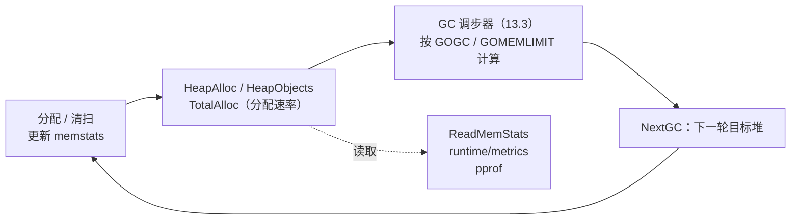

# 12.8 内存统计

分配器一边干活，一边记账。每从操作系统批发一段地址空间、每切出一个 span、每分配或清扫
一个对象，运行时都会把对应的计数累加到一组全局变量里（`runtime.memstats`）。这套账目不是
事后补记的统计报表，而是分配与回收过程中顺手写下的流水。它有两个去处：一是对外，让用户和
监控系统看见进程的内存形态；二是对内，[GC 的调步器（13.3）](../ch13gc/pacing.md)与
[软内存限制 `GOMEMLIMIT`（12.7）](./pagealloc.md)都要读这套账来决定「下一次该在多大的堆上
触发回收」。换言之，记账闭合了一条反馈回路：分配产生数据，数据驱动决策，决策又约束分配。

这一节先讲清楚账目里那几个最常被误读的字段，再讲读取它们的两套接口，最后说明这套数据如何
驱动 GC 的节奏，以及在 pprof 与监控里该怎么看。

## 12.8.1 账目里有什么：关键字段速写

`runtime.MemStats` 是对外暴露的快照结构，字段近三十个。逐个翻译没有意义，真正要分清的是
两条平行的序列。下面是裁剪后的速写，只留与「读懂内存形态」相关的字段，并在注释里说明它
量的是什么：

```go
// runtime.MemStats（速写）：两条平行序列 + GC 节奏
type MemStats struct {
    // [真实在用的内存：Alloc / Inuse 系列]
    HeapAlloc    uint64 // 存活堆对象的字节数：已分配但 GC 尚未清扫的也算在内
    HeapInuse    uint64 // 至少含一个对象的 span 占的字节（含尺寸类带来的内部碎片）
    HeapObjects  uint64 // 存活堆对象个数（= Mallocs - Frees）

    // [向操作系统要来的地址空间：Sys 系列]
    Sys          uint64 // 从 OS 取得的虚拟地址空间总量，是下面各 XSys 之和
    HeapSys      uint64 // 为堆保留的地址空间（含已保留未提交的部分，见 12.3）
    HeapIdle     uint64 // 空闲 span 占的字节：无对象，可还给 OS 或留作复用
    HeapReleased uint64 // 已用 madvise 还给 OS 的物理内存（仍占地址空间）

    // [GC 节奏]
    NextGC       uint64      // 下一轮 GC 的目标堆大小，目标是让 HeapAlloc ≤ NextGC
    NumGC        uint32      // 已完成的 GC 轮数
    PauseTotalNs uint64      // 程序启动至今 STW 暂停的累计纳秒
    PauseNs      [256]uint64 // 最近若干轮的 STW 暂停时长（环形缓冲）
}
```

把字段分成「真实在用」与「地址空间」两摞，是读懂内存统计的全部要害。

第一摞，`HeapAlloc`、`HeapInuse`、`HeapObjects`，量的是程序此刻真正占用的堆。`HeapAlloc`
是存活对象的字节数，注意它把「已不可达但 GC 还没清扫掉」的对象也算作存活。因为清扫是
[增量进行的（13.5）](../ch13gc/sweep.md)，所以 `HeapAlloc` 是平滑变化的，而非传统 STW
回收器那种锯齿。`HeapInuse` 比 `HeapAlloc` 略大，差值是 span 按尺寸类切分后没用满的内部
碎片（[12.1](./basic.md)），它给出碎片的一个上界。

第二摞，`Sys` 及其分项 `HeapSys`、`HeapIdle`、`HeapReleased`，量的是向操作系统要来的
**虚拟地址空间**，而非物理内存。这正是最常被误读的地方。Go 的堆按 [arena（12.3）](./init.md)
为粒度向 OS 保留大段连续地址空间，保留（reserve）只是占住地址，并不提交（commit）物理页；
真正用到时才提交，不用了又可用 `madvise(MADV_FREE/DONTNEED)` 把物理页还给 OS，地址空间却
始终保留不退。于是几条关系值得记住：

$$
\texttt{HeapIdle} - \texttt{HeapReleased} \approx \text{运行时留着备用、未还 OS 的空闲物理内存}
$$

$$
\texttt{HeapInuse} - \texttt{HeapAlloc} \approx \text{已绑定到某尺寸类、暂未使用的内存（碎片上界）}
$$

结论是一句话：`Sys` 系列（地址空间）远大于 `Alloc`/`Inuse` 系列（真实占用）是常态，不是
泄漏。用 `top` 看到的 `VIRT` 偏大，多半只是保留而未提交的地址空间；真正该盯的「物理驻留」
更接近 `Sys - HeapReleased`，或操作系统报告的 `RSS`。判断是否泄漏，要看 `HeapAlloc` 或
`HeapObjects` 是否随时间单调上涨，而不是看 `VIRT`。

## 12.8.2 读账的代价：ReadMemStats 为何昂贵

对外读取这份账目的传统接口是 `runtime.ReadMemStats`：

```go
func ReadMemStats(m *MemStats) {
    _ = m.Alloc // 切栈前先做一次 nil 检查（issue 61158）
    stw := stopTheWorld(stwReadMemStats)
    systemstack(func() {
        readmemstats_m(m)
    })
    startTheWorld(stw)
}
```

它要付的代价写在第一行里：`stopTheWorld`。读取前要暂停整个世界，把所有 P 的 mcache 本地
统计回刷（flush）到全局，再把 `memstats` 整体拷进用户的 `MemStats`，然后才
`startTheWorld`。为什么非 STW 不可？因为这份账目分散在每个 P 的本地缓存里，分配快路径
（[12.5](./smallalloc.md)）为了无锁，只更新本地计数；要得到一致的全局快照，就得让所有 P
停下来，确保没有并发的分配在改账。

代价由此而来：`ReadMemStats` 是一次全局暂停加一次大结构拷贝，字段是固定的一整套，
要么全拿要么不拿。监控系统若每隔几秒调一次，等于周期性地给程序注入 STW 抖动。在追求低延迟
的服务里，这个接口不适合做高频采样。

## 12.8.3 现代接口：runtime/metrics

为了解决「固定字段 + STW + 全拿」这三重僵硬，Go 1.16 引入了
[`runtime/metrics`](https://pkg.go.dev/runtime/metrics)。它把内存统计从一个写死的结构体，
改造成一张「名字到值」的、可扩展的表。每个指标用一个带单位的路径命名，例如
`/memory/classes/total:bytes`、`/gc/heap/live:bytes`、`/gc/pauses:seconds`。读取时只声明
你关心的那几个，运行时只填这几个：

```go
import "runtime/metrics"

// 只采我关心的指标：存活堆、堆目标、地址空间总量、STW 暂停分布
samples := []metrics.Sample{
    {Name: "/gc/heap/live:bytes"},         // 上轮 GC 标记到的存活字节（驱动调步）
    {Name: "/gc/heap/goal:bytes"},         // 下一轮 GC 的目标堆大小，对应 NextGC
    {Name: "/memory/classes/total:bytes"}, // 向 OS 取得的地址空间总量，对应 Sys
    {Name: "/gc/pauses:seconds"},          // STW 暂停时长的直方图
}
metrics.Read(samples)

for _, s := range samples {
    switch s.Value.Kind() {
    case metrics.KindUint64:
        useUint(s.Name, s.Value.Uint64())
    case metrics.KindFloat64:
        useFloat(s.Name, s.Value.Float64())
    case metrics.KindFloat64Histogram:
        useHist(s.Name, s.Value.Float64Histogram()) // 桶边界 + 计数
    }
}
```

相对 `ReadMemStats`，它在三处更优。其一，可选：`metrics.Read` 只计算并填写你传入的那几个
`Sample`，不再「全拿」，采样更轻，且大多数指标不需要 STW。其二，可扩展：新增指标只是往表里
加一行，老代码无需改动就能继续运行，而 `MemStats` 加字段是要改结构体的。其三，能表达分布：
值的种类不止 `uint64` 和 `float64`，还有 `KindFloat64Histogram`，于是「GC 暂停时长」这类
本该看分位数的量，可以直接拿到完整直方图，而 `MemStats.PauseNs` 只是一个 256 槽的环形数组，
要自己算分位。可用的全部指标由 `metrics.All()` 自描述地列出，带名字、单位、种类与文档。

两套接口的取舍可以并表对照：

| | `runtime.ReadMemStats` | `runtime/metrics`（1.16+） |
|---|---|---|
| 形态 | 固定结构体，约 30 字段 | 名字到值的表，可扩展 |
| 采集 | 全拿，一次 STW | 按需，多数无需 STW |
| 分布 | 仅环形数组（要自算分位） | 原生直方图 |
| 演进 | 加字段要改结构体 | 加指标只加一行 |
| 适用 | 偶发的一次性快照 | 高频监控、新代码首选 |

新代码应优先用 `runtime/metrics`。`ReadMemStats` 仍然保留，字段与语义稳定，适合写一次性
诊断脚本，或读取那些尚无对应 metric 的旧字段。

## 12.8.4 账目如何驱动决策

记账的真正价值不在「让人看」，而在「让运行时自己看」。GC 的
[调步器（13.3）](../ch13gc/pacing.md)正是这套账的最大消费者。它的目标可以写成一句：让本轮
分配在堆涨到 `NextGC` 之前恰好完成标记。`NextGC` 由上一轮标记到的存活量 $H_{\text{live}}$
（对应 `/gc/heap/live:bytes`）按 `GOGC` 算出：

$$
\texttt{NextGC} = H_{\text{live}} \times \left(1 + \frac{\texttt{GOGC}}{100}\right)
$$

默认 `GOGC=100`，于是堆每比上轮存活量多涨一倍就触发下一轮回收。调步器还要读分配速率
（由 `Mallocs`、`TotalAlloc` 这类累计计数随时间求导得到）来决定何时启动标记、给多少 CPU
做并发标记，使标记的完成与堆的增长「赛跑」打平。

[软内存限制 `GOMEMLIMIT`（12.7）](./pagealloc.md)是同一套账的另一个消费者。当
`Sys - HeapReleased` 一类的实际占用逼近限额时，运行时会主动调低有效的回收目标、加紧把空闲
物理页还给 OS（`/gc/gomemlimit:bytes` 即当前限额），用更频繁的回收换不越界。这条路径与
`GOGC` 取二者更紧的约束，共同决定 `NextGC`。

于是回路闭合：分配写下 `HeapAlloc`、`HeapObjects`、`TotalAlloc`，调步器读它们算出 `NextGC`
与标记节奏，回收又改写这些计数，下一轮再以新值定调。记账不是旁观者，它是控制系统的传感器。



## 12.8.5 在 pprof 与监控里怎么看

落到工具上，这套数据有几个常见入口。`net/http/pprof` 的 `/debug/pprof/heap` 给的是堆剖面
（哪段代码分配了多少），它顶部的 `# runtime.MemStats` 注释区直接打印了上面这些字段，是
快速判断形态的第一眼。命令行下 `GODEBUG=gctrace=1` 每轮 GC 打印一行，其中的 CPU 占比就是
`GCCPUFraction`，暂停就是 `PauseNs` 那一轮的值。

监控系统则应当走 `runtime/metrics`：周期性 `metrics.Read` 选定的几个指标，导出到 Prometheus
一类的后端。要回答的典型问题与对应指标是固定的几组：是否泄漏看 `/gc/heap/objects:objects`
是否单调上涨；物理占用看 `/memory/classes/total:bytes` 减去
`/memory/classes/heap/released:bytes`；GC 是否过频看 `/gc/cycles/total:gc-cycles` 的增速；
暂停是否超标看 `/gc/pauses:seconds` 直方图的尾分位。把这几条画成时间序列，进程的内存行为
就一目了然，而不必为了一次采样停下整个世界。

读这些数时，请始终带着 12.8.1 那条分界线：地址空间（Sys 系列）天然偏大，真正衡量「程序
吃了多少内存」的，是真实在用的那一摞。混淆这两者，是内存问题排查中最常见、也最浪费时间的
误判。

## 延伸阅读的文献

1. The Go Authors. *Package runtime, type MemStats.*
   https://pkg.go.dev/runtime#MemStats （各字段的权威语义，尤其 Heap 系列的状态划分）
2. The Go Authors. *Package runtime/metrics.* https://pkg.go.dev/runtime/metrics
   （Go 1.16 引入的可扩展接口：`Sample`、`Value`、`All`，及全部指标名与单位）
3. The Go Authors. *runtime/mstats.go、runtime/metrics/description.go.*
   https://github.com/golang/go/tree/master/src/runtime （`ReadMemStats` 的 STW 实现与记账细节）
4. Michael Knyszek. *Proposal: API for unstable runtime metrics (runtime/metrics).* 2020.
   https://github.com/golang/go/issues/37112 （metrics 接口的设计动机与权衡）
5. The Go Authors. *A Guide to the Go Garbage Collector.*
   https://tip.golang.org/doc/gc-guide （`GOGC`、`GOMEMLIMIT` 与存活堆如何决定 GC 节奏）
6. 本书 [13.3 触发频率及其调步算法](../ch13gc/pacing.md)、[12.7 页分配器与内存限制](./pagealloc.md)、
   [12.3 初始化与 arena](./init.md).
7. 本书 [第 16 章 工具与可观测性](../../part5toolchain/ch16tools/readme.md)（pprof、metric 的实操）.
