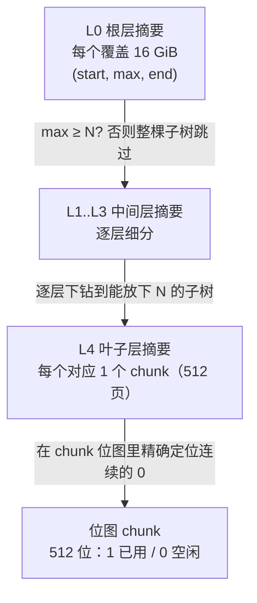

# 12.7 页分配器

mheap（[12.2](./component.md)）之下，回答「哪些页空闲、哪些已用」的，是页分配器。它是整个
分配器的地基：mcentral 缺 span 时向 mheap 要新页，大对象（[12.4](./largealloc.md)）直接按页申请，
所有 span 占的页最终都从这里切出来。页分配器还要把长期闲置的页交还操作系统。这两件事，一头连着
分配的速度，一头连着进程的常驻内存，恰是 Go 内存系统里那条最持久的张力。

本节先把页分配器要解的问题摆清楚，再看早期 treap 的设计与软肋，然后展开 Go 1.14 那次把它换成
位图加基数树的重写，这是「换数据结构换性能」最干净的一个例子。最后看两条与之共生的机制：每 P
的页缓存，以及把内存还给操作系统的 scavenging，连同 `GOMEMLIMIT` 这个软上限。

## 12.7.1 问题：快速找一段连续空闲页

页分配器要回答的核心问题只有一句：在巨大的堆地址空间里，快速找到一段足够长的连续空闲页。
「连续」是硬约束，一个 span 占的是物理上相邻的若干页（[12.2](./component.md)），不能东拼西凑。
围绕这一句，还有几条同样要满足的要求：

- 分配与归还都要快，且归还的页要能被后续分配重新利用；
- 多个 P 会同时申请页，数据结构不能被一把全局锁锁死；
- 元数据本身的内存开销要可控，堆可以很大（64 位上地址空间按 TiB 计）。

把堆想象成一条极长的纸带，每一页是带上的一格。分配是「找一段够长的连续空格、涂黑」，归还是
「把某段涂回空白」。难点全在「够长的连续」与「快」这两个词的合取上：单看某一格是否空闲很容易，
难的是不逐格扫描就知道「从这里往后有没有连着 $N$ 格的空白」。

## 12.7.2 早期的 treap 与它的软肋

Go 1.14 之前，页分配器用一棵 treap（树堆）组织空闲的页区间，按区间的起始地址作二叉搜索树的键、
按一个随机优先级维持堆序，从而在期望意义上保持平衡。每个节点是一段连续空闲页。查找一段长度为
$N$ 的空闲区间、分配后的区间分裂、归还后的相邻区间合并，都借树的结构完成，单次操作的期望复杂度
是 $O(\log n)$，$n$ 为空闲区间的个数。

这套设计能用，但在大堆、高并发下暴露出三处软肋。其一，$O(\log n)$ 看着不坏，可树越大常数越沉，
每次查找都要从根往下走若干层。其二，treap 是指针链接的动态结构，每跳一层就是一次可能未命中缓存的
指针追逐（pointer chasing），在现代 CPU 上，一次 LLC 未命中的代价抵得上上百条算术指令，树的随机
内存布局让缓存几乎帮不上忙。其三，也是最致命的，整棵树由一把全局锁保护，任何一个 P 申请或归还
页都要先抢到这把锁，核数一多，锁争用直接成为吞吐瓶颈。换言之，treap 的问题不在算法复杂度的
渐进阶，而在它的内存访问模式与并发模型，与多核硬件不合。

## 12.7.3 Go 1.14 的重写：位图加基数树

Go 1.14 把页分配器整个换掉，改用位图（bitmap）加基数树摘要（radix tree of summaries）。这次重写
出自 Michael Knyszek 的提案 35112，目标正是上一节那三处软肋。

### 位图：一页一位

底层是一张覆盖整个堆地址空间的位图，每一页对应一位，约定 `1` 表示已用、`0` 表示空闲。一页是
8 KiB，于是「找一段连续空闲页」就化简为「在位图里找一段连续的 0」。位图按 chunk 分片，每个 chunk
管 `pallocChunkPages = 1 << 9 = 512` 位，即 512 页、4 MiB 内存（Wasm 上更小）。chunk 之外还附一张
等长的 `scavenged` 位图，记录哪些空闲页已经还给了操作系统，供 scavenging 用（[12.7.5](#1275-归还内存给操作系统)）：

```go
// pallocData：一个 chunk 的两张位图（速写，见 mpallocbits.go）
type pallocData struct {
    pallocBits           // 512 位：1 已用、0 空闲
    scavenged  pageBits  // 512 位：1 表示该空闲页已交还操作系统
}
```

位图的好处立竿见影：它是一段连续内存，扫描时缓存友好；按 chunk 分片，使锁与归还都能落到 chunk
粒度，不必再锁住全局。可单凭位图还不够，堆很大时位图本身就有几十上百 MiB，从头逐位找连续的 0
依然太慢。真正的加速来自叠在位图之上的那棵摘要树。

### 摘要：把一段位图压成三个数

对位图里任意一段区域，关于「连续空闲页」我们其实只需要三个数：开头连着多少个空闲页（`start`）、
区域内最长的一段连续空闲页有多长（`max`）、结尾连着多少个空闲页（`end`）。这三个数就是这段区域的
摘要。Go 把它们打包进一个 8 字节的 `pallocSum`：

```go
// pallocSum：把 (start, max, end) 三个数打包进 8 字节（速写，见 mpagealloc.go）
type pallocSum uint64

func packPallocSum(start, max, end uint) pallocSum { /* 位移拼接，三段各占 21 位 */ }
func (p pallocSum) start() uint { /* ... */ }
func (p pallocSum) max()   uint { /* 关键：本区域最长的连续空闲段 */ }
func (p pallocSum) end()   uint { /* ... */ }
```

`max` 是查找时最关键的字段：要找长度 $N$ 的空闲段，只要某段区域的 `max < N`，整段就可以跳过，
不必看它内部。`start` 与 `end` 服务于另一种情形：所需的连续段恰好跨在两段相邻区域的边界上，
前一段的 `end` 加后一段的 `start` 凑够 $N$，也是一个候选。三个数合起来，就能在不下钻位图的前提下
判断一段区域「能不能放下 $N$，以及大致放在哪」。

### 基数树：让搜索跳过放不下的子树

摘要按层组织成一棵基数树。叶子层每个摘要对应一个 chunk（512 页）；往上每一层，一个摘要概括
下一层若干个摘要合并后的结果。64 位平台上这棵树有 5 层，根层每个摘要覆盖 16 GiB 地址空间，
逐层细分到叶子的一个 chunk。合并的规则很直观：把相邻摘要的 `(start, max, end)` 拼起来，新的 `max`
取「各段自身的 max」与「相邻两段边界拼出的 end+start」之中的最大值。



查找 $N$ 页时，从根层自顶向下走：在当前层扫一小段相邻摘要，凡 `max < N` 的子树整片跳过，
进入第一个能放下 $N$ 的子树继续下钻，直到叶子层，再到那个 chunk 的位图里用位运算精确定出
那段连续的 0。这是一次「地址有序的最先适配」（address-ordered first-fit）：总是返回满足条件的
最低地址，让堆尽量向低地址紧实。

一个看似随意、实则精心的常数：每层的分叉用 `summaryLevelBits = 3` 位，即一层一次看 $2^3 = 8$ 个
相邻摘要。选 3 的理由是 $8 \times 8 = 64$ 字节，恰好一条缓存行，每下钻一层只触碰一条缓存行。
还有一处省内存的巧思：这棵树不用动态分配的指针节点，而是每层一个大数组，「父子关系」由下标的
位移隐式表达（节点 $i$ 的孩子是 $i \ll 3$ 起的 8 个）。于是遍历摘要树根本没有指针追逐，全是连续
数组上的下标算术，这正是对 treap 第二处软肋的针对性回应。

### 分配与归还：摘要的增量维护

分配定下地址后，把位图对应的位置 `1`，再沿基数树向上把受影响的摘要逐层重算（`pageAlloc.update`）。
归还是它的镜像：把位图相应的位清 `0`，同样向上回溯更新摘要，相邻的空闲段在 `max` 与边界的
`start`/`end` 重算中自然「合并」，无需 treap 那种显式的节点合并与再平衡。由于摘要只在被改动的
那条根到叶的路径上更新，一次分配或归还触碰的摘要数也是常数级。一个配套的小优化是 `searchAddr`：
它记下「此地址以下的页都已分配、不值得再搜」的水位线，归还到更低地址时下移，让下次查找多数
情况下能从一个接近答案的位置起步，而非每次从根重走。

### 复杂度与代价

树高是常数（64 位上恒为 5），每层只扫一条缓存行宽的摘要，因此一次查找触碰的缓存行数有常数上界，
实际表现接近 $O(1)$ 摊还，且对缓存极友好。这里要诚实：最坏情形下若每层都要在 8 个摘要里反复
横扫、或所需区间频繁跨边界，仍可能多走几步，所以严格说不是真正的 $O(1)$，但相对 treap 那种
随机指针布局的 $O(\log n)$，常数与缓存行为都是数量级的改善。代价也实在：摘要数组按整个地址空间
预留，64 位上保留了相当大的虚拟地址空间（仅保留、按需提交，不立即占物理内存），这是用地址空间
换查找速度的一笔交易。把它和 [11.7](../../part3concurrency/ch11sync/map.md) 的字典树、
[9.10](../../part3concurrency/ch09sched/timer.md) 的四叉堆放在一起看，都是「选对数据结构带来质变」
的同一类范例。

## 12.7.4 每 P 的页缓存：无锁快路径

基数树的查找虽快，仍要持 `mheapLock`。为把这把锁也从最热的路径上挪开，Go 1.14 同时引入了
每 P 一份的页缓存 `pageCache`。它缓存一小段 64 页的区域，用一个 64 位整数当位图，分配单页或
少数几页时直接在这个整数上做位运算，全程无锁：

```go
// pageCache：每个 P 一份、缓存 64 页的无锁快路径（速写，见 mpagecache.go）
type pageCache struct {
    base  uintptr // 这段 64 页区域的首地址
    cache uint64  // 位图：1 表示该页空闲（注意与全局位图相反）
    scav  uint64  // 位图：1 表示该页已交还操作系统
}

func (c *pageCache) alloc(npages uintptr) (uintptr, uintptr) {
    if c.cache == 0 {
        return 0, 0 // 缓存空了，回落到加锁的 p.alloc
    }
    if npages == 1 {
        i := uintptr(sys.TrailingZeros64(c.cache)) // 找最低的空闲位
        c.cache &^= 1 << i                          // 标记已用
        return c.base + i*pageSize, /* scav 字节数 */ 0
    }
    return c.allocN(npages) // 多页：在 64 位里找连续的 1
}
```

缓存空了，才持锁调 `allocToCache` 从基数树批一段 64 页回来填充。这与 mcache（[12.2](./component.md)）
对小对象、`sync.Pool`（[11.6](../../part3concurrency/ch11sync/pool.md)）对临时对象、调度器本地运行
队列（[9.2](../../part3concurrency/ch09sched/steal.md)）对 goroutine 是同一种「每 P 分片、把锁挡在
冷路径后方」的招式，在 Go 运行时里反复出现。注意 `cache` 里 `1` 表示空闲，与全局位图的约定相反，
这让「找空闲页」退化成一次 `TrailingZeros64`，与 mspan 里 `allocCache` 的手法如出一辙。

## 12.7.5 归还内存给操作系统

页分配器的另一半职责，是把长期空闲的页交还操作系统，这一过程叫 scavenging。Go 不会一空闲就立即
归还：归还与重新申请都要陷入内核，频繁来回代价高，刚还掉又要用还会触发缺页中断，反而拖慢分配。
所以策略是克制而渐进的。

归还的动作落在 `sysUnused` 上，平台相关：Linux 上默认用 `madvise(MADV_FREE)`，告诉内核「这些页
内容我不要了，物理页你可在内存吃紧时随时回收」，比 `MADV_DONTNEED` 更省（不立刻产生缺页），
必要时可由 `GODEBUG=madvdontneed=1` 切回后者。被归还的页在 chunk 的 `scavenged` 位图里置位，
若随后又被分配出去，则按需重新由内核提供物理页。

scavenging 分两路。一路是后台 scavenger：一个常驻 goroutine `bgscavenge`，软上限只占约 1%（`scavengePercent`）
的 mutator 时间，平时停在 park，被唤醒后从高地址往低地址渐进地归还，归还一批就按工作量睡一会儿，
避免与程序争 CPU。它的唤醒与节流和 `sysmon`（[9.8](../../part3concurrency/ch09sched/sysmon.md)）这条
后台监控线相连。另一路是分配时的同步 scavenger：当一次分配会顶破内存上限、或堆不得不增长时，
就地归还一些页,因为「堆要增长」本身说明现有碎片放不下，正好顺手把别处的碎片还掉。

scavenger 的目标，是让进程的常驻内存（RSS 的估计值）逼近一个目标。这个目标怎么定，取决于有没有
设软内存上限，见下一节。

## 12.7.6 软内存上限 GOMEMLIMIT

没有 `GOMEMLIMIT` 时，scavenger 的归还目标随 GC 的堆目标（heap goal）浮动，并额外保留约
`retainExtraPercent = 10%` 的余量当缓冲：多留一点未归还的内存供分配，省去一些缺页开销。这是「占着
内存复用更快」与「还给系统更省」之间的一个偏向复用的折中。

`GOMEMLIMIT` 由 Knyszek 的提案 48409 引入（Go 1.19 落地，承接 Go 1.16 起 `debug.FreeOSMemory`
等机制的演进），给运行时一个软的内存上限。一旦设了上限，scavenger 的目标改为盯住「已提交内存」
（`memstats.mappedReady`）逼近上限，且把缓冲方向反过来：目标压到上限之下约 `reduceExtraPercent = 5%`，
越接近上限越用力归还，免得真的越界。它「软」在不靠拒绝分配来执行，而是靠更激进的 GC 与 scavenging
把内存压回去，因此设得过低会让程序陷入持续 GC、CPU 被吃光的「GC 抖动」，故官方建议留出余量、
配合 `GOGC` 一起调。

`GOMEMLIMIT` 的价值在于把先前 GC 那种「只认存活堆的相对增长（`GOGC`）、不认绝对内存」的盲点补上：
容器里有固定内存配额时，可设一个略低于配额的软上限，让运行时主动把内存收在配额内，而非等到被
OOM Killer 杀掉。归还策略从「固定比例渐进归还」一路演进到「可由绝对上限驱动」，正是 Go 在内存
占用与分配速度之间持续调校的缩影，这条张力贯穿整个内存系统，也会在 [13 垃圾回收](../ch13gc)
与 GC 的步调控制（pacing）合流。

## 延伸阅读的文献

1. Michael Knyszek. *Proposal: Scalable page allocator.*（Go 1.14 页分配器重写，位图 + 基数树）
   https://go.googlesource.com/proposal/+/master/design/35112-scaling-the-page-allocator.md
2. The Go Authors. *runtime/mpagealloc.go.*（pageAlloc、pallocSum、基数树查找 find）
   https://github.com/golang/go/blob/master/src/runtime/mpagealloc.go
3. The Go Authors. *runtime/mpagecache.go、mpallocbits.go.*（每 P 页缓存、chunk 位图 pallocData）
   https://github.com/golang/go/blob/master/src/runtime/mpagecache.go
4. The Go Authors. *runtime/mgcscavenge.go.*（后台与同步 scavenger、归还目标的推导）
   https://github.com/golang/go/blob/master/src/runtime/mgcscavenge.go
5. Michael Knyszek. *Proposal: Soft memory limit.*（`GOMEMLIMIT`，Go 1.19）
   https://go.googlesource.com/proposal/+/master/design/48409-soft-memory-limit.md
6. The Go Authors. *A Guide to the Go Garbage Collector.*（`GOGC` 与 `GOMEMLIMIT` 的配合与调优）
   https://go.dev/doc/gc-guide
7. 本书 [12.2 组件](./component.md)、[9.8 系统监控](../../part3concurrency/ch09sched/sysmon.md)、
   [13 垃圾回收](../ch13gc).

## 许可

&copy; 2018-2026 The [golang.design](https://golang.design) Initiative Authors. Licensed under [CC-BY-NC-ND 4.0](https://creativecommons.org/licenses/by-nc-nd/4.0/).
