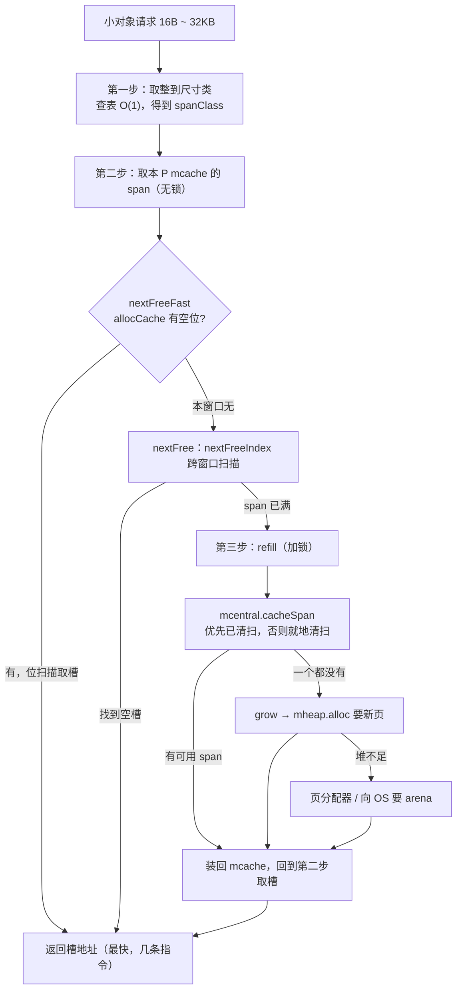

# 12.5 小对象分配

小对象指尺寸在 16B 至 32KB 之间的对象（go1.26 中 `maxSmallSize = 32768`）。它们是 Go 程序里
最常见的一类分配：一个结构体、一个不算太大的切片底层数组、一条字符串拼接的结果，绝大多数都落在
这个区间。分配器为它们设计的路径，是 [12.2](./component.md) 那套 mcache → mcentral → mheap
层级的主舞台，也是整套内存分配器「快路径无锁」设计（[12.1](./basic.md)）兑现性能承诺的地方。

这一节把一次小对象分配拆成三步来读：先把请求的尺寸**取整到一个尺寸类**，再从当前 P 的 **mcache
无锁取槽**，取不到才落入**加锁补货**的慢路径。读完会发现，常态下的小对象分配不过是「查一次表、
扫一次位、推一下游标」，慢路径只是为这条快路径兜底。

## 12.5.1 第一步：把尺寸取整到尺寸类

分配器不会为「恰好 37 字节」单独管理一种内存块。它把 16B 至 32KB 的尺寸空间划成 68 个**尺寸类**
（size class，[12.1](./basic.md)），每个尺寸类对应一个固定的对象大小（8、16、24、32、48……
直到 32768），分配时把请求向上取整到最近的尺寸类。这一步要做到 $O(1)$，靠的是两张预先生成
（由 `mksizeclasses.go` 算出）的查找表：

```go
// 把请求尺寸映射到尺寸类，再取出该类的实际对象大小（速写）
var sizeclass uint8
if size <= gc.SmallSizeMax-8 {           // SmallSizeMax = 1024
    sizeclass = gc.SizeToSizeClass8[divRoundUp(size, gc.SmallSizeDiv)]   // 步长 8
} else {
    sizeclass = gc.SizeToSizeClass128[divRoundUp(size-gc.SmallSizeMax, gc.LargeSizeDiv)] // 步长 128
}
size = uintptr(gc.SizeClassToSize[sizeclass]) // 取整后的真实分配大小
spc := makeSpanClass(sizeclass, noscan)       // 尺寸类 + 是否含指针 = spanClass
```

为何分成两张表？尺寸类在小区间排得密、大区间排得疏（1024 以下按 8 字节一档，以上按 128 字节
一档），用两个不同步长（`SmallSizeDiv = 8`、`LargeSizeDiv = 128`）的表，能把映射压成两次
数组下标读取，避免任何循环或除法。`divRoundUp` 也只是一次乘加，不走真正的除法指令。

取整必然带来**内部碎片**：申请 33 字节会落到 48 字节的尺寸类，浪费 15 字节。尺寸类的档位是
精心调过的，目标是把最坏浪费（`max waste`）压在可接受范围内。表里最大的一档是 class 67，对象
和 span 都是 32768 字节、整页独占、浪费 12.5%。这 12.5% 不是巧合，而是档位设计刻意守住的上界：
尺寸类越密碎片越小，但元数据与 span 种类越多，分配器在「省内存」与「少种类」之间取的折中。

最后那行 `makeSpanClass` 值得一提：尺寸类还要再乘以二，区分**含指针**与**不含指针**（noscan）
两种 `spanClass`。后者的 span 不必被 GC 扫描（[13](../ch13gc)），把它们分开存放，能让清扫和
标记跳过整段无指针内存。所以 mcache 里按 `spanClass` 而非 `sizeclass` 索引，68 个尺寸类对应
136 个 spanClass。

## 12.5.2 第二步：从 mcache 无锁取槽

拿到 `spc` 后，分配器直接取出当前 P 的 mcache 中为这个 spanClass 缓存的那个 mspan，从中摘一个
空槽。因为 mcache 每个 P 一份、同一时刻只被一个 M 持有（[12.2](./component.md)），这一步
**无需任何锁**：

```go
span := c.alloc[spc]       // 取出本 P 为该尺寸类缓存的 span
v := nextFreeFast(span)    // 在 span 内找下一个空槽：一次位扫描
if v == 0 {
    v, span, checkGCTrigger = c.nextFree(spc) // 本地 span 用尽，落入慢路径
}
```

最快的一步藏在 `nextFreeFast` 里。每个 mspan 用一个 `allocCache`（一个 `uint64`）缓存
`freeindex` 附近 64 个槽的占用情况，且存的是**取反后**的位图（空槽为 1）。于是「找下一个空槽」
退化成「找最低的 1 位」，一条 `TrailingZeros64`（数末尾连续的零，即 count trailing zeros）指令
就能定位：

```go
// 在 span 内找下一个空闲槽：一次位运算，无锁（速写）
func nextFreeFast(s *mspan) gclinkptr {
    theBit := sys.TrailingZeros64(s.allocCache) // 找 allocCache 中最低的空闲位
    if theBit < 64 {
        result := s.freeindex + uint16(theBit)
        if result < s.nelems {
            freeidx := result + 1
            if freeidx%64 == 0 && freeidx != s.nelems {
                return 0 // 跨过当前 64 位窗口的边界，交给慢路径去刷新缓存
            }
            s.allocCache >>= uint(theBit + 1) // 推进缓存，已分配的位移走
            s.freeindex = freeidx             // 推进扫描游标
            s.allocCount++
            return gclinkptr(uintptr(result)*s.elemsize + s.base()) // 槽地址 = 基址 + 序号×槽大小
        }
    }
    return 0 // allocCache 已全为 0：本窗口无空槽，需走慢路径
}
```

整个快路径就这几条指令：一次位扫描、一次移位、一次乘加算地址，全程无锁、不深入函数调用栈。
返回 0 只有两种情形：当前 64 位窗口扫完了（`theBit == 64` 或跨窗口边界），或这个 span 真的满了。
两种都交给慢路径处理，慢路径会负责刷新 `allocCache` 或换一个新 span。`nextFreeFast` 不刷新缓存、
不跨窗口，正是为了把它压到最短，让最热的那条路径上没有一丝多余动作。

## 12.5.3 第三步：慢路径补货

`nextFreeFast` 返回 0，就进入 `nextFree`。它先用 `nextFreeIndex` 做一次「完整」的扫描，这个版本
会跨越 64 位窗口、按需调用 `refillAllocCache` 把 `allocBits` 的下一段重新装进 `allocCache`，
因此能找到 `nextFreeFast` 略过的那些槽。只有当扫描走到 `s.nelems`（span 确实满了），才需要
真正的补货：

```go
func (c *mcache) nextFree(spc spanClass) (v gclinkptr, s *mspan, checkGCTrigger bool) {
    s = c.alloc[spc]
    freeIndex := s.nextFreeIndex() // 跨窗口的完整扫描，会按需刷新 allocCache
    if freeIndex == s.nelems {      // span 真的满了
        c.refill(spc)               // 把满 span 还给 mcentral，换一个有空槽的
        checkGCTrigger = true       // 触发了一次补货，顺便检查是否该启动 GC
        s = c.alloc[spc]
        freeIndex = s.nextFreeIndex()
    }
    v = gclinkptr(uintptr(freeIndex)*s.elemsize + s.base())
    s.allocCount++
    return
}
```

`refill` 是补货链的第一环：把当前这个满了的 span 交还给对应尺寸类的 mcentral（`uncacheSpan`），
再从那里 `cacheSpan` 取一个有空槽的新 span 装回 `c.alloc[spc]`。这里访问 mcentral 是**加锁**的，
go1.26 还会顺手刷一批统计（已用槽数、`heapLive`、tiny 计数），并把新 span 的 `sweepgen` 标成
「已缓存」状态，防止它在缓存期间被异步清扫器抢走。

mcentral 这一层是分配与清扫（[13.5](../ch13gc/sweep.md)）的交汇点。`cacheSpan` 取 span 的顺序
体现了「按清扫代分桶」的设计（[12.2](./component.md)）：

```go
// 向 mcentral 要一个有空槽的 span（速写，省去 trace 与统计）
func (c *mcentral) cacheSpan() *mspan {
    deductSweepCredit(spanBytes, 0) // 「分配多少就帮忙清扫多少」的配额机制

    sg := mheap_.sweepgen
    if s = c.partialSwept(sg).pop(); s != nil { // 1. 优先：已清扫、有空槽
        goto havespan
    }
    // 2. 次之：未清扫但可能有空槽，就地清扫后使用（spanBudget 限制最多试 100 个）
    for ; spanBudget >= 0; spanBudget-- {
        s = c.partialUnswept(sg).pop()
        if s == nil { break }
        if s, ok := sl.tryAcquire(s); ok {
            s.sweep(true)             // 就地清扫，把死对象的槽变回可用
            goto havespan
        }
    }
    // 3. 再次之：扫描未清扫的满 span，清扫后若腾出空槽则用（同理，略）
    // 4. 全都没有：向 mheap 要新页切出一个 span
    s = c.grow()

havespan:
    // 用 freeindex 处的 allocBits 刷新 allocCache，调整对齐后交给 mcache
    s.refillAllocCache(s.freeindex / 8)
    s.allocCache >>= s.freeindex % 64
    return s
}
```

`deductSweepCredit` 是「**惰性清扫**」（[13.5](../ch13gc/sweep.md)）的执行点：GC 标记结束后并不
立刻清扫全部 span，而是把清扫摊派到后续的分配里，谁分配谁就帮忙清扫一点，避免一次 stop-the-world
式的大清扫。所以小对象分配的慢路径不只是「取一块内存」，它还顺手推进了垃圾回收。

补货链的尽头是 `grow`：mcentral 一个可用 span 都没有时，向全局 mheap 按页申请，切成等大槽位的
新 span。这一步又会牵出页分配器（[12.7](./pagealloc.md)）乃至向操作系统索取 arena（[12.3](./init.md)），
代价最大、命中最罕，与大对象分配（[12.4](./largealloc.md)）共用 `mheap.alloc`：

```go
func (c *mcentral) grow() *mspan {
    npages := uintptr(gc.SizeClassToNPages[c.spanclass.sizeclass()])
    s := mheap_.alloc(npages, c.spanclass) // 向全局堆要 npages 页
    if s == nil {
        return nil
    }
    s.initHeapBits() // 初始化该 span 的 GC 位图
    return s
}
```

## 12.5.4 span 内部：用空闲位图找槽

三步路径反复出现的核心动作，是「在一个 span 内找下一个空槽」。这件事完全由两组位图驱动，理解了
它，整条路径就连成一气。

每个 mspan 维护两层位图（[12.2](./component.md)）。底层是 `allocBits`，一个 `*gcBits`，每位对应
一个槽，记录它是否已分配。上层是 `allocCache`，一个 `uint64`，把 `freeindex` 起的 64 位
`allocBits` **取反**后缓存进来（空槽为 1），让位扫描能直接用 `TrailingZeros64`。`refillAllocCache`
负责在 `freeindex` 跨过 64 位窗口时，从 `allocBits` 装入下一段：

```go
// 用 allocBits 的下一段（8 字节）刷新 allocCache，取反使空槽为 1（速写）
func (s *mspan) refillAllocCache(whichByte uint16) {
    bytes := (*[8]uint8)(unsafe.Pointer(s.allocBits.bytep(uintptr(whichByte))))
    aCache := uint64(0)
    aCache |= uint64(bytes[0])
    aCache |= uint64(bytes[1]) << (1 * 8)
    // …… 逐字节拼满 8 字节 = 64 位 ……
    aCache |= uint64(bytes[7]) << (7 * 8)
    s.allocCache = ^aCache // 取反：allocBits 里的 0（空）变成 allocCache 里的 1
}
```

`freeindex` 是这套机制的游标：扫描只从 `freeindex` 往后走，从不回头看它前面的槽。这把「找空槽」
从遍历整个 span 降到「在一个滑动的 64 位窗口里做位运算」，是 $O(1)$ 摊销的关键。代价是
`freeindex` 之前、本轮被释放出来的槽，要等到下一轮 GC 清扫重置 `freeindex` 后才会被重新利用。

那么 `allocBits` 里的 1 是何时变回 0、让槽重新可用的？答案在清扫（[13.5](../ch13gc/sweep.md)）。
GC 标记阶段把存活对象记在 `gcmarkBits` 里；清扫时，运行时不去逐个清除死对象的 `allocBits`，
而是**直接让 `allocBits` 指向 `gcmarkBits`**，再给 `gcmarkBits` 分配一块清零的新位图。一次指针
交换，所有死对象的槽就「免清扫」地集体变回可分配。这正是 [12.1](./basic.md) 所说分配器与 GC
**共生**的接口：分配看 `allocBits`，回收写 `gcmarkBits`，两者通过一次指针交换衔接，分配路径
完全不必知道某个槽是「从未用过」还是「上一轮死了被回收」。

## 12.5.5 这样设计为何快，以及它对性能意味着什么

把三步合起来看，一次落在快路径上的小对象分配，成本是：一次尺寸类查表（$O(1)$）、一次
`TrailingZeros64` 位扫描、一次移位、一次算地址，全程无锁。三件设计共同促成了这个「近乎免费」的
常态：

- **尺寸类把定位变成查表**：固定档位让「该分多大、从哪个 span 取」都退化成数组下标，无需任何搜索。
- **每 P 的 mcache 消除争用**：快路径不碰任何共享状态，多核并发分配互不阻塞，代价是每个 P 各占
  一份缓存，且对象在 P 间不能直接复用（要经 mcentral 中转）。这与调度器的本地运行队列
  （[9.2](../../part3concurrency/ch09sched/steal.md)）、`sync.Pool` 的每 P 分片
  （[11.6](../../part3concurrency/ch11sync/pool.md)）是同一种「分层减争」的招式。
- **位图把取槽变成位运算**：`allocBits` + `allocCache` + `freeindex` 把「找空槽」压到一条
  位扫描指令，且与 GC 的清扫通过指针交换衔接，回收对分配几乎零成本。

越往下走，同步代价越大、命中频率越低：mcache 无锁，mcentral 加锁还要顺带清扫，mheap 要动页
分配器，再往下是系统调用。分层缓存的全部意义，就是把最热的路径做成几条无锁位运算，把昂贵的
加锁与系统调用挡在越来越冷的后方。

这条结论对写 Go 程序的人有一个直接推论：**单次小对象分配已经快到几乎可以忽略，真正的成本在于
分配的「次数」与它给 GC 带来的压力**。每一个逃逸到堆上的对象，最终都要被标记、被清扫；分配得
越多越频繁，GC 的工作量越大、触发越勤。所以优化内存的着力点很少是「让单次分配更快」，而是
**让分配更少**：靠逃逸分析（[15.5](../../part5toolchain/ch15compile/escape.md)）把对象留在栈上，根本
不进堆；或用 `sync.Pool`（[11.6](../../part3concurrency/ch11sync/pool.md)）复用对象，把「分配 +
回收」摊薄成「借出 + 归还」。分配器已经把自己的那一份做到了极致，剩下能省的，在调用方手里。

至此小对象的「由近及远」补货路径可以完整画出，它正是 [12.1](./basic.md) 那条补货链的演出：



图中越靠下的分支越冷：绝大多数分配在 `nextFreeFast` 一步即返回，`refill` 之后的环节只在本地
span 用尽时才触发，`grow` 与系统调用更是罕见。这与微对象分配（[12.6](./tinyalloc.md)）和大对象
分配（[12.4](./largealloc.md)）一道，构成了 Go 分配器面对不同尺寸请求的三条主路径。

## 延伸阅读的文献

1. The Go Authors. *runtime/malloc.go（`mallocgcSmallNoscan` / `mallocgcSmallScanNoHeader` /
   `nextFreeFast` / `mcache.nextFree`）.* go1.26.
   https://github.com/golang/go/blob/master/src/runtime/malloc.go
2. The Go Authors. *runtime/mcache.go（`refill`）、mcentral.go（`cacheSpan` / `grow`）.* go1.26.
   https://github.com/golang/go/blob/master/src/runtime/mcache.go
3. The Go Authors. *runtime/mbitmap.go（`nextFreeIndex` / `refillAllocCache`，allocBits 与
   allocCache 的位扫描）.* go1.26.
   https://github.com/golang/go/blob/master/src/runtime/mbitmap.go
4. The Go Authors. *internal/runtime/gc/sizeclasses.go（68 个尺寸类、`SizeToSizeClass8/128`、
   最坏 12.5% 浪费）.* go1.26.
   https://github.com/golang/go/blob/master/src/internal/runtime/gc/sizeclasses.go
5. Sanjay Ghemawat, Paul Menage. *TCMalloc: Thread-Caching Malloc.*
   https://google.github.io/tcmalloc/design.html （尺寸类 + thread cache 的思想原型）
6. 本书 [12.2 组件](./component.md)、[12.6 微对象分配](./tinyalloc.md)、
   [13.5 清扫与位图](../ch13gc/sweep.md)（allocBits ← gcmarkBits 的交换）.
7. 本书 [15.5 逃逸分析](../../part5toolchain/ch15compile/escape.md)、
   [11.6 sync.Pool](../../part3concurrency/ch11sync/pool.md)（减少分配次数的两条途径）.

## 许可

&copy; 2018-2026 The [golang.design](https://golang.design) Initiative Authors. Licensed under [CC-BY-NC-ND 4.0](https://creativecommons.org/licenses/by-nc-nd/4.0/).
