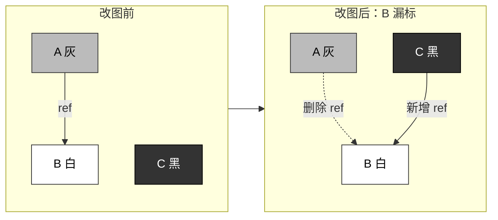
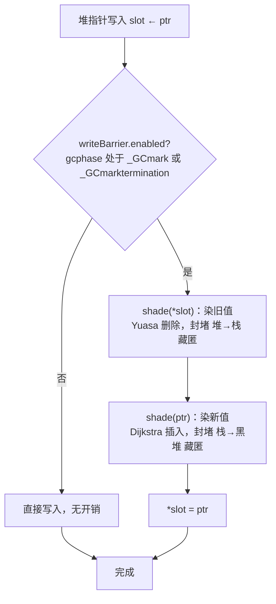

# 13.2 写屏障技术

[13.1](./basic.md) 给出了三色抽象与并发回收的轮廓：回收器把对象从白染灰、由灰染黑，
让一道「灰色波面」在对象图上单调推进，波面扫过之处即为已确认存活。若赋值器（mutator，
即用户态代码）在波面推进时停下不动，这套抽象自洽且会正确收敛。问题恰恰在于赋值器不会停。
并发回收的根本困难是：回收器追踪对象图的同时，赋值器在改写它，两者对同一张图各执一词。

这一节要回答的是：赋值器的一次指针写入，凭什么不会让回收器漏标一个存活对象。答案是**写屏障**
（write barrier）：编译器在堆指针写入处插入的一小段代码，让赋值器把「我动了哪条边」告知回收器。
我们先看清并发改图为何会漏标（[13.2.1](#1321-并发改图为何会漏标)），由此引出两条三色不变性
（[13.2.2](#1322-两条三色不变性)）；再看堵住漏标的两个屏障族（[13.2.3](#1323-两个屏障族-dijkstra-插入与-yuasa-删除)）；
最后落到 Go 自 1.8 起沿用至今的混合写屏障（[13.2.4](#1324-go-的混合写屏障)），
理解它为何能一举消除标记终止阶段那次代价高昂的栈重扫。

需要先厘清一处常见的名词混淆。本节的「写屏障」是垃圾回收意义上的赋值器屏障，是一段**软件**
逻辑，它与 CPU 层面阻止访存重排的内存屏障（memory barrier，见 [11.9](../../part3concurrency/ch11sync/mem.md)）
是两回事。两者唯一的交点在于：Go 的写屏障实现为保证自身在多核下的正确性，确实依赖了一处访存
顺序约束，这一点留到 [13.2.4](#1324-go-的混合写屏障) 再谈。

## 13.2.1 并发改图为何会漏标

考虑回收器正扫到一半的某个瞬间。设灰色对象 $A$ 指向白色对象 $B$，赋值器此时并发地做两件事：
把一个已被染黑的对象 $C$ 指向 $B$，再把 $A$ 到 $B$ 的那条引用抹去。于是 $B$ 现在只挂在黑色
对象 $C$ 之下。回收器认为黑色对象已扫描完毕、不会再访问，而通往 $B$ 的灰色入口又被抹掉了，
$B$ 就此从波面上消失，最终被当作垃圾错误回收。



把这一瞬拆开看，漏标恰由两件事**同时**发生才成立。[Wilson, 1992] 将其精确为两个条件：

- 条件一：赋值器令某个黑色对象引用了白色对象（上例中 $C \to B$）；
- 条件二：从灰色对象出发、尚未被回收器走过的、通往该白色对象的路径，被赋值器破坏（上例中 $A \to B$ 被删）。

只要破坏掉其中任意一个，漏标就不会发生：条件一不成立，则白色对象始终只挂在灰色对象之下，
波面终会扫到它；条件二不成立，则即便白色对象被写进了黑色对象，从灰色对象出发仍存一条未走过的
路径能抵达它。两条屏障族（[13.2.3](#1323-两个屏障族-dijkstra-插入与-yuasa-删除)）正是分别封死这两条路。

这里还藏着一个常被忽略的角色：赋值器自身的颜色。把回收器看作被影响的对象、赋值器看作施加影响的
行为，便可给赋值器也染色。**黑色赋值器**指其根（主要是 goroutine 栈）已被扫描、回收器不会再扫；
**灰色赋值器**指其栈尚未扫描，或虽扫过但仍需重扫。赋值器的颜色直接决定回收能否收尾：只要还存在
灰色赋值器，回收器在结束前就必须重新扫描其根，而重扫时赋值器又可能往根里插入新的非黑引用，如此
往复。最坏情况下，回收器只能停下全部赋值器线程（即 STW）才能取得一份干净的根快照。这正是
pre-1.8 的 Go 所付出的代价，也是本节最终要消除的东西。

与栈相关的还有一个选择：新分配对象染什么色。若染白，可避免无谓地把新对象留到下一轮；但黑色赋值器
已扫描完毕、不会再被回收器触及，它一旦分配出白色对象并藏入栈中，就会直接酿成漏标。为把实现复杂度
压到最低，**令新分配对象一律为黑**通常是安全的，Go 即采此策。这一选择会与下文的混合屏障严丝合缝地
咬合。

## 13.2.2 两条三色不变性

把上一节两个条件翻译成对对象图的约束，就得到两条强弱不同的不变性。

**强三色不变性**（strong tricolor invariant）：不存在黑色对象指向白色对象的指针。这等于直接禁止
条件一。波面之后（黑色区域）是一片「净土」，回收器可以放心不再回看。

**弱三色不变性**（weak tricolor invariant）：黑色对象可以指向白色对象，但该白色对象必须**同时**
存在一条从某个灰色对象出发、尚未被走过的可达路径。这相当于允许条件一发生，却用「保留一条灰色入口」
来禁止条件二。

强不变性：

$$
\nexists\, b \in \text{black},\ w \in \text{white}:\ b \to w
$$

弱不变性：

$$
\forall\, w \in \text{white 且被某 black 引用}:\ \exists\ \text{从某 grey 出发、未访问的路径可达}\ w
$$

强不变性是更苛刻的约束，弱不变性则给了实现更大的回旋余地：**只要还留着一条未走过的、通往白色
对象的路径，就允许黑色对象指向白色对象。**两条屏障族的分野，本质就是各自去维护其中一条不变性。

## 13.2.3 两个屏障族：Dijkstra 插入与 Yuasa 删除

漏标既然由「黑指白」与「断灰路」两件事合成，封堵之法也就分成两族，恰好对应一次指针写入里
两个可被监视的对象：被写入的新指针 `ptr`，与被覆盖的旧值 `*slot`。[Pirinen, 1998] 把屏障可做的
基本动作归纳为三种：把白色对象染灰以扩大波面、扫描对象并染黑以推进波面、把黑色对象退回灰色以
后撤波面。两族屏障都用第一种动作（`shade`，把尚为白色的对象染灰并入队待扫），区别只在染哪个对象。

**Dijkstra 插入屏障**（insertion barrier），又称增量更新屏障（incremental update）[Wilson, 1992]，
监视被写入的新指针，把「插入」这一行为告知回收器，维护强三色不变性。其核心是：凡有指针被写进
对象，无论它将来是否会被删，都先把被指向者染灰 [Dijkstra et al., 1978]。

```go
// Dijkstra 插入屏障：染新写入的指针
func DijkstraWritePointer(slot *unsafe.Pointer, ptr unsafe.Pointer) {
    shade(ptr)
    *slot = ptr
}
```

`shade(ptr)` 保守地假设 `*slot` 所在对象可能已是黑色，于是先把 `ptr` 染灰，确保它不会在写入后
仍为白色，直接堵死条件一。代价有二：其一，被保守染灰的对象里可能混进本应回收的垃圾，要拖到下一轮
才清掉（浮动垃圾）；其二，若对每一次指针写入都设屏障，开销可观，而栈上写入又格外频繁。Go 在
pre-1.8 的折中是**栈上写入不设屏障**，转而把发生过写入的栈标记为「恒灰」（permagrey）。这恰恰
制造出了灰色赋值器，代价就是必须在标记终止阶段 STW，重新扫描这些栈。这次重扫是 pre-1.8 暂停时间
的主要来源，也是混合屏障要除掉的病灶。

**Yuasa 删除屏障**（deletion barrier），又称起始快照屏障（snapshot-at-the-beginning），
监视被覆盖的旧值，维护弱三色不变性。其思路是：赋值器删除一条指针前，先把即将失去的旧目标染灰
[Yuasa, 1990]，仿佛在改图之前为对象图照了一张快照，凡快照中存活者本轮一律不回收。

```go
// Yuasa 删除屏障：染被覆盖的旧值
func YuasaWritePointer(slot *unsafe.Pointer, ptr unsafe.Pointer) {
    shade(*slot)
    *slot = ptr
}
```

`shade(*slot)` 在覆盖前把旧目标染灰，于是这次写入总会留下一条「灰到灰」或「灰到白」的路径，
条件二无从成立。Yuasa 屏障的好处是回收结束时无需重扫即可精确回收所有白色对象；代价是它会拦截
写操作令波面后撤，从而产生冗余扫描，且基于起始快照意味着本轮中变为不可达的对象要等下一轮才回收。

## 13.2.4 Go 的混合写屏障

两族屏障各自只能堵住一条漏标路径，于是各有一处必须 STW 的硬伤：Dijkstra 屏障若放过栈写入，
就欠下一次标记终止时的栈重扫；Yuasa 屏障要求回收开始时对全部根做一次快照，那一刻同样要停下
赋值器。Go 在 1.8 把两者合一，得到**混合写屏障**（hybrid write barrier）[Clements & Hudson, 2016]，
化解了这处两难，沿用至今。`runtime/mbarrier.go` 顶部的注释把它写成这样的伪代码：

```go
// 混合写屏障（mbarrier.go 中的算法形态）
func writePointer(slot *unsafe.Pointer, ptr unsafe.Pointer) {
    shade(*slot)              // Yuasa 删除部分：染被覆盖的旧值
    if current_stack_is_grey {
        shade(ptr)            // Dijkstra 插入部分：仅当本 goroutine 栈尚灰时才需要
    }
    *slot = ptr
}
```

两次 `shade` 各封死一条对象「藏匿」之路，注释把这件事讲得很清楚：

- `shade(*slot)`（删除部分）阻止赋值器把「指向某对象的唯一指针」从堆挪到自己栈上来藏匿它，
  一旦它要从堆里摘走这条指针，旧目标就先被染灰；
- `shade(ptr)`（插入部分）阻止赋值器把这样的唯一指针从栈塞进堆里的黑色对象来藏匿它，
  一旦它要把指针装进黑色对象，被装入者就先被染灰。

关键在那个条件：`shade(ptr)` **仅当本 goroutine 的栈尚为灰色时才需要**。因为要把对象从栈藏进堆，
前提是它先藏在栈上；而一段栈刚被扫描完，其上只剩已染灰的对象，再不藏匿任何东西，配合 `shade(*slot)`
也阻止它在自己栈上新藏指针。这就是混合屏障的枢纽所在：**一段栈只要被扫描、染黑一次，就会一直保持
黑色，永不需要重扫。**回收器在标记开始时把各 goroutine 栈逐一扫描、染黑（这一步可与赋值器并发，
无需全局 STW），此后栈再无重扫之虞。pre-1.8 那次主导暂停时间、必须 STW 的标记终止栈重扫，就此
被彻底拿掉。Go 1.8 的暂停时间因此跌入亚毫秒级，这正是混合屏障最实在的回报。它与「新分配对象染黑」
（[13.2.1](#1321-并发改图为何会漏标)）也正好咬合：栈黑、新对象黑，黑色区域才始终自洽。

代价是写屏障的成本被「摊匀」了：pre-1.8 把开销集中在标记终止那一次 STW 重扫，混合屏障则把它拆成
每次堆指针写入时一份**常数**开销。这是一桩用吞吐换延迟的典型交易，把一段不可预测的长暂停，换成了
散布在程序运行全过程中的、可预测的小额支出。



值得点出两处「伪代码」与「真实现」的落差，它们正是这套机制的精微处。

其一，注释里那个 `if current_stack_is_grey` 的条件，在 Go 的实际汇编实现 `gcWriteBarrier` 里被
**去掉了**：无论栈黑栈灰，`ptr` 一律被染。原因是访存顺序。要让屏障读到的「slot 所在对象的颜色」
与赋值器的写入彼此可见，需要在写与读之间插一道开销高昂的内存屏障；在 386/amd64 这类允许「读越过
较早的写」的硬件上，省掉它会让赋值器与回收器都观察到陈旧的颜色位。Go 团队权衡之后，宁可无条件多
染一次 `ptr`，也不愿为这个条件付内存屏障的代价。这是为绕开硬件内存模型而做的取舍，也是本节开头
所说「软件写屏障与 CPU 内存屏障的唯一交点」。

其二，屏障只对**堆**指针写入生效，且只在标记期才打开。栈上对当前栈帧的写入由编译器略去屏障
（[13.2.1](#1321-并发改图为何会漏标) 所说的「栈写无屏障」）；写入全局变量则照设屏障，免得到标记
终止时还要重扫全局区。开关由 `writeBarrier.enabled` 控制，它在 `gcphase` 进入 `_GCmark` 或
`_GCmarktermination` 时置位，回收一结束即关闭，因此非标记期的指针写入零开销。屏障代码本身不是
赋值器手写的，而是编译器在每处堆指针写入前自动插入（[3.2](../../part1overview/ch03life/compile.md)）。

无条件双染还带来一个直接后果：着色成本翻倍，编译器要插入的代码也随之增多，二进制随之变大。
Go 1.10、1.11 为此引入**批量写屏障缓存**（见 `runtime/mwbbuf.go`）：屏障快路径不立即着色，只把
待染的指针压进一个每 P 私有的缓冲（`wbBuf`，容量 512），缓冲满或遇 GC 状态切换时再统一 flush 到
回收工作队列。快路径写成汇编、不触动通用寄存器，从而省去常规函数调用的开销，把每次写入的常数成本
又压低了一截。

放进谱系看，混合屏障并非 Go 独创。注释指出它等价于 IBM 实时 Java 的 Metronome 所用的双重写屏障；
在那里回收器是增量而非并发的，但同样要面对在严格时限内安全改图的难题。这条思路与 [13.1](./basic.md)
所述的并发标记、[13.6](./termination.md) 的标记终止彼此衔接：写屏障保证的弱三色不变性，正是标记
能够与赋值器并发而不漏标的前提。

## 13.2.5 小结

并发回收的写屏障，归根到底是用一段插在指针写入处的逻辑去维护三色不变性。Go 早期取较易实现的
Dijkstra 插入屏障，为保强不变性不得不把栈留到标记终止时 STW 重扫，这次重扫主导了当时的暂停。
1.8 起改用 Dijkstra 插入与 Yuasa 删除合成的混合屏障，将强不变性弱化为弱不变性，换来「栈扫一次、
此后恒黑、永不重扫」的性质，从而抹去那次集中式 STW，把暂停压进亚毫秒。代价是每次堆指针写入的一份
常数开销，再由批量缓存摊薄。性能的提升从不白来，这一回，它来自把一段不可预测的长暂停，重新安置成
散落于全程的可预测小额支出。

## 延伸阅读的文献

1. Austin Clements, Rick Hudson. *Eliminate STW stack re-scanning (Hybrid write barrier).*
   Go proposal, golang/go#17503, 2016.
   https://github.com/golang/proposal/blob/master/design/17503-eliminate-rescan.md
   （混合屏障的设计与正确性证明，本节主线的一手来源）
2. Taiichi Yuasa. *Real-time garbage collection on general-purpose machines.*
   Journal of Systems and Software, 11(3):181-198, 1990.
   DOI: [10.1016/0164-1212(90)90084-Y](https://doi.org/10.1016/0164-1212(90)90084-Y)
   （删除屏障 / 起始快照的原始论文）
3. Edsger W. Dijkstra, Leslie Lamport, A. J. Martin, C. S. Scholten, E. F. M. Steffens.
   *On-the-Fly Garbage Collection: An Exercise in Cooperation.*
   Communications of the ACM, 21(11):966-975, 1978.
   DOI: [10.1145/359642.359655](https://doi.org/10.1145/359642.359655)
   （插入屏障与三色标记的奠基之作）
4. Paul R. Wilson. *Uniprocessor Garbage Collection Techniques.*
   Proc. International Workshop on Memory Management (IWMM), LNCS 637, 1992.
   （漏标两条件、强 / 弱三色不变性、增量更新与起始快照的综述）
5. Pekka P. Pirinen. *Barrier Techniques for Incremental Tracing.*
   Proc. International Symposium on Memory Management (ISMM), 1998.
   DOI: [10.1145/286860.286863](https://doi.org/10.1145/286860.286863)
   （屏障基本动作的分类框架）
6. The Go Authors. *runtime/mbarrier.go、runtime/mwbbuf.go、runtime/mgc.go.*
   https://github.com/golang/go/tree/master/src/runtime
   （混合屏障实现、批量缓存与 `writeBarrier.enabled` / `gcphase` 门控）
7. 本书 [13.1 垃圾回收的基本想法](./basic.md)、[13.6 标记终止阶段](./termination.md)、
   [11.9 内存一致模型](../../part3concurrency/ch11sync/mem.md).

## 许可

&copy; 2018-2026 The [golang.design](https://golang.design) Initiative Authors. Licensed under [CC-BY-NC-ND 4.0](https://creativecommons.org/licenses/by-nc-nd/4.0/).
