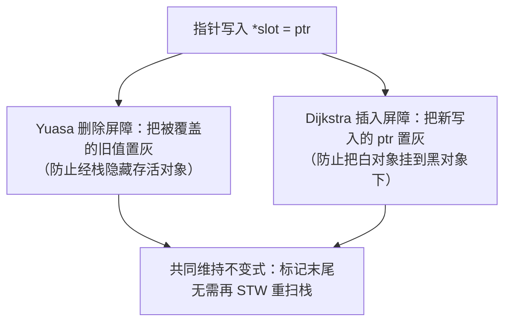

# 13.2 写屏障技术

[13.1](./basic.md) 留下一个危险：并发标记时，用户程序还在改指针，可能让白色对象被误回收。
**写屏障**（write barrier）是化解它的机制,在指针写入处插一小段运行时代码，维持三色不变式。
写屏障的设计是并发 GC 的核心难题之一，Go 的选择（混合写屏障）尤其值得一讲。这一节把它讲清。

## 13.2.1 两条不变式与两类屏障

要安全并发标记，需维持两类三色不变式之一：

- **强三色不变式**：黑色对象**绝不**指向白色对象。
- **弱三色不变式**：黑色对象可以指向白色对象，但该白色对象必须**还能经某条灰色路径被到达**。

维持它们的写屏障历史上有两大流派，对应"误回收"的两种发生方式：

- **Dijkstra 插入屏障**：当把指针 `ptr` 写入某处时，**把 `ptr` 指向的对象置灰**。这防止"把白对象
  挂到黑对象下",新挂上的对象立即变灰，会被扫描。
- **Yuasa 删除屏障**：当一个指针槽被覆盖时，**把被覆盖的旧值置灰**。这防止"经由删除把唯一通往
  某白对象的灰色路径切断、而该对象又被藏到了已扫描处（典型是栈）"。

## 13.2.2 Go 的混合写屏障

早期 Go（1.8 之前）只用 Dijkstra 插入屏障。但插入屏障对**栈**不生效（栈上的写太频繁，加屏障
代价太高），于是标记末尾必须**重新扫描所有栈**,而重扫栈要 stop-the-world，这正是当年 GC 停顿
的大头。

Go 1.8 引入**混合写屏障**（Hybrid Write Barrier），把两者合一（源码注释明确：Yuasa 删除 +
Dijkstra 插入）：

混合屏障的关键红利：它让运行时可以在标记开始时一次性把栈扫描并置黑、此后栈**不必再被重扫**,
从而**消除了标记末尾那次代价高昂的 STW 重扫栈**。这是 Go GC 停顿从数十毫秒降到亚毫秒的决定性
一步。代价是每次堆指针写入都要执行屏障代码（删除 + 插入两侧的置灰），有常数开销,但这笔开销
分摊在每次写上，远比一次集中的 STW 重扫栈划算。

## 13.2.3 屏障只作用于堆，以及它如何落地

一个常被忽略的细节：混合写屏障只对**堆上**的指针写入生效，**栈上**的写不加屏障（太频繁）。
这正是混合屏障要"开始时扫黑栈、之后不再碰栈"的原因,栈不设屏障，就必须保证栈在标记期间
不会把存活对象藏起来，而 Yuasa 删除屏障恰好堵住了这条路。屏障代码由**编译器**在每个堆指针
写入处插入（[3.2](../../part1overview/ch03life/compile.md) 说的编译器与运行时合谋），只在 GC 标记
阶段（`gcphase == _GCmark`）真正生效，非标记期它几乎是空操作。

写屏障是理解 Go 低延迟 GC 的钥匙：**用每次写一点点的常数开销，换掉一次集中的、随栈规模增长
的 STW**。这是一笔典型的"把大块停顿摊薄成持续小开销"的交易,也是低延迟系统设计的通用思路
（对照 [9.7](../../part3concurrency/ch09sched/preemption.md) 缩小 STW 的努力）。

## 延伸阅读的文献

1. Austin Clements, Rick Hudson. *Eliminate STW stack re-scanning / Hybrid write barrier.*
   golang/go#17503, 2016. https://go.dev/issue/17503
2. Taiichi Yuasa. "Real-time garbage collection on general-purpose machines."
   *Journal of Systems and Software*, 11(3), 1990. https://doi.org/10.1016/0164-1212(90)90084-Y
3. Edsger W. Dijkstra et al. "On-the-Fly Garbage Collection." *CACM*, 21(11), 1978.
   https://doi.org/10.1145/359642.359655
4. The Go Authors. *runtime/mbarrier.go（混合屏障实现与论证）.*
   https://github.com/golang/go/blob/master/src/runtime/mbarrier.go

## 许可

&copy; 2018-2026 The [golang.design](https://golang.design) Initiative Authors. Licensed under [CC-BY-NC-ND 4.0](https://creativecommons.org/licenses/by-nc-nd/4.0/).
