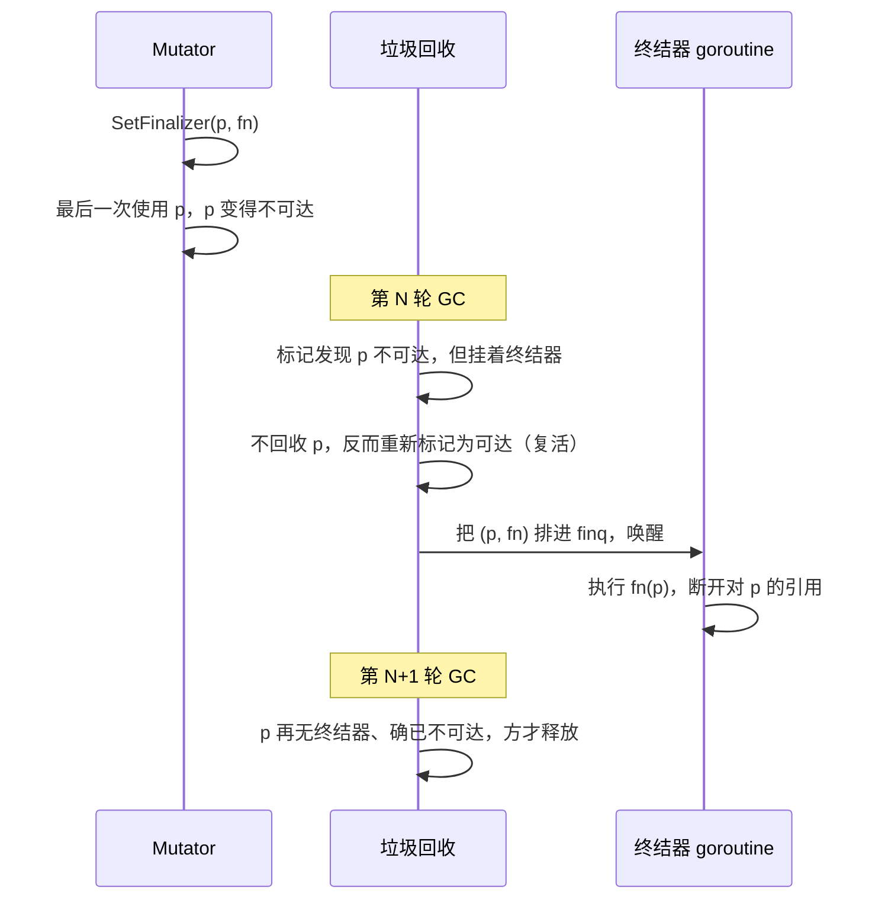

# 13.10 终结器

> 本节内容对标 Go 1.26。

垃圾回收的常规剧情到[清扫（13.5）](./sweep.md)就结束了：标记找出存活对象，清扫把死对象的
槽位归还给分配器。但有一类对象在死之前还想说一句话。它包着一份非内存资源，一个文件描述符、
一段 mmap、一个 C 侧分配的句柄，当 Go 这边的包装对象不可达时，那份底层资源也该随之释放，
而垃圾回收只懂内存，并不知道描述符要 `close`。终结器（finalizer）就是为这条缝隙而设的钩子：
为对象登记一个函数，等垃圾回收判定它不可达时，运行时不立即释放它，而是先调用这个函数。

这是一个诱人却危险的机制。诱人在于它看起来像 C++ 的析构函数，能把「资源释放」自动挂到「对象
消亡」上；危险在于 Go 的对象消亡由垃圾回收决定，时机不可预测，于是一切「必须发生」的释放都
不能托付给它。本节先把 `runtime.SetFinalizer` 的机制讲清楚，再逐条点出它的陷阱，最后介绍
Go 1.24 引入的 `runtime.AddCleanup` 这个更安全的替代品，并给出一条简单的抉择原则。

## 13.10.1 SetFinalizer 的机制

登记一个终结器只需一行：

```go
type File struct{ fd int }

p := &File{fd: openSomeFd()}
runtime.SetFinalizer(p, func(p *File) {
    syscall.Close(p.fd)
})
```

`SetFinalizer(obj, fn)` 要求 `obj` 是一个指针，指向由 `new`、复合字面量取址或局部变量取址
得到的、堆上分配的对象；`fn` 是一个只接收一个参数（类型可由 `obj` 赋值）的函数。运行时把
这对关系记在该对象所在 mspan 的一条 **special** 记录里（[12.2](../ch12alloc/component.md)
讲过 mspan 的元数据），而不是塞进对象本身。`SetFinalizer(obj, nil)` 撤销登记。

真正有意思的是垃圾回收看到这条 special 之后的行为。标记阶段（[13.4](./mark.md)）扫描完根与
存活对象后，一个对象若不再可达，常规命运是被清扫；但如果它挂着终结器，运行时不会释放它，
而是做三件事：把这条 finalizer special 摘下、**重新把该对象标记为可达**，再把
`(对象, 终结函数)` 这对值排进一条全局队列 `finq`。这一步「重新标记为可达」是关键，它意味着
对象在本轮没有被回收，反而被复活了一次。

排进队列后，由一个专职的 goroutine 把它们取出来逐个执行。这个 goroutine 的主循环
（运行时里叫 `runFinalizers`，历史上叫 `runfinq`）是这样的速写：

```go
// 专职终结器 goroutine 的主循环（速写，对照 runtime/mfinal.go）
func runFinalizers() {
    for {
        lock(&finlock)
        fb := finq        // 取走整条待执行队列
        finq = nil
        if fb == nil {     // 队列为空，挂起，等下一轮 GC 唤醒
            gopark(finalizercommit, ..., waitReasonFinalizerWait, ...)
            continue
        }
        unlock(&finlock)
        for ; fb != nil; fb = fb.next {
            for i := fb.cnt; i > 0; i-- {
                f := &fb.fin[i-1]
                // 把对象指针铺进调用帧，反射式地调用终结函数 f.fn(obj)
                reflectcall(nil, unsafe.Pointer(f.fn), frame, ...)
                f.fn, f.arg, f.ot = nil, nil, nil  // 立刻断开堆引用
            }
        }
    }
}
```

值得一提的是这个 goroutine 由 `createfing` 懒创建，只在第一次有终结器登记时启动；它平时
`gopark` 挂起，靠垃圾回收每轮往 `finq` 里塞东西后唤醒。**所有终结器由这一个 goroutine 串行
执行**，所以一个跑得久的终结器会拖住后面所有人，长任务应当在终结器里另起 goroutine。

### 多活一轮：复活与二次回收

把上面的时序连起来，一个挂着终结器的对象，从不可达到真正释放，要跨越两轮垃圾回收：



为什么必须复活？因为终结函数要拿到对象作为参数，`fn(p)` 执行期间 `p` 指向的内存必须有效，
不能在调用前就被回收。代价是这块内存在第 $N$ 轮没有被释放，要等到第 $N+1$ 轮垃圾回收
确认它既无终结器、又确实不可达，才归还。换言之，**带终结器的对象至少要多占用一整轮 GC 周期
的内存**。一条由终结器构成的长链，会逐轮一节一节地释放，回收被显著拖慢。

## 13.10.2 陷阱：为什么不能用它做必须发生的释放

终结器的机制读来精巧，但每一处精巧都对应一个使用陷阱。把它们摆在一起，就能理解 Go 官方
文档为何把它定位成「通常只适合在长时间运行的程序里释放非内存资源」，而不是通用的析构手段。

**时机不确定，甚至可能永不运行。** 终结器在对象不可达后的「某个任意时刻」才被调度。
垃圾回收何时发生取决于分配压力与 `GOGC`，程序若不再分配内存，下一轮 GC 可能迟迟不来。
更要紧的是，**进程退出时运行时并不保证已排队的终结器会跑完**。所以指望终结器去
`flush` 一个 `bufio.Writer` 的缓冲，是错的：程序退出时缓冲很可能根本没刷出去。

**回收被推迟。** 如上一节所述，对象至少多活一轮。对内存敏感、或大量短命对象都挂了终结器的
程序，这份延迟会累积成可观的堆膨胀。

**复活（resurrection）。** 终结器执行期间对象是可达的，如果终结函数把这个对象的指针存进了
某个全局变量或别处仍存活的结构，对象就被真正救活了，垃圾回收下一轮不会再回收它。更糟的是，
终结器一旦运行过就被清除，复活后的对象不会再有终结器，于是它第二次死亡时不会再触发任何清理。
这种「自我复活」几乎总是 bug，却没有任何编译期手段拦住它。

**互相引用的对象，终结顺序未定义。** 文档明确：若 A 指向 B，两者都有终结器且都不可达，
运行时按依赖序只先运行 A 的终结器，等 A 释放后 B 的终结器才有机会运行。但若 A 与 B
**互相引用构成环**，就不存在满足依赖的顺序，于是这个环可能既不被回收、终结器也永不运行。
依赖多个被终结对象之间的清理次序，是不可靠的。

**与 KeepAlive 的微妙配合。** 因为终结器可能在对象「最后一次被提及」之后立刻运行，下面这段
看似正确的代码藏着竞争：

```go
p := &File{fd: fd}
runtime.SetFinalizer(p, func(p *File) { syscall.Close(p.fd) })
var buf [64]byte
n, err := syscall.Read(p.fd, buf[:])
// 此处 p 不再被提及，可能已不可达，终结器可能已在另一 goroutine 里 Close 了 p.fd！
// syscall.Read 可能因此读到一个已关闭、甚至被别人复用的 fd。
runtime.KeepAlive(p) // 用 KeepAlive 把 p 的存活延长到这一行
```

`runtime.KeepAlive(x)` 的实现近乎空操作，它的全部作用是制造一次对 `x` 的「使用」，
逼编译器把 `x` 的存活区间延长到这一行，从而保证此前终结器不会被触发。需要 `KeepAlive`
这件事本身，就说明终结器把一个本该简单的资源生命周期，变成了需要小心推理的并发问题。

把这些陷阱归结成一句话：**终结器不能用于「必须发生」的释放**。凡是正确性依赖「资源一定被
释放」的场合，文件、锁、连接，都应当用[显式的 `defer`（6.2）](../../part2lang/ch06func/defer.md)
在确定的时刻释放。终结器至多是一张安全网：万一调用方忘了 `Close`，它在某个不确定的将来
兜个底，避免描述符永久泄漏，仅此而已。

## 13.10.3 Go 1.24 的替代品：AddCleanup

`SetFinalizer` 的几个陷阱，根子都在「终结函数直接拿到对象本身」这一设计：正因为参数是对象，
才必须复活对象、才会有自我复活、才必须靠 `KeepAlive` 兜住存活区间。Go 1.24 引入的
`runtime.AddCleanup` 换了个思路，把「清理动作要用的数据」和「被监视的对象」解耦：

```go
func AddCleanup[T, S any](ptr *T, cleanup func(S), arg S) Cleanup
```

`ptr` 是被监视的对象，`cleanup` 是清理函数，`arg` 是清理函数运行时拿到的参数。**清理函数
收到的是 `arg`，而不是 `ptr`。** 改用它登记上面的文件例子：

```go
type File struct{ fd int }

p := &File{fd: openSomeFd()}
// 清理函数只拿到 fd（arg），完全不碰 p（ptr）
cleanup := runtime.AddCleanup(p, func(fd int) {
    syscall.Close(fd)
}, p.fd)

// 若资源已被正常关闭，可主动注销清理，避免它将来重复触发
// cleanup.Stop()
```

这一处看似微小的签名变化，逐条化解了前面的陷阱：

- **没有复活。** 清理函数从不接触 `ptr`，运行清理时无需把对象重新标记为可达，对象在它不可达
  的那一轮就能正常回收，不再多占一整轮。自然也就没有「自我复活」这种 bug，因为函数手里
  根本没有对象的指针可供存起来。`AddCleanup` 还会在 `arg == ptr` 时直接 panic，从源头堵死
  「清理参数把对象拽回可达」的误用。
- **一个对象可挂多个清理。** `SetFinalizer` 对同一对象重复登记会报错（一个对象只能有一个
  终结器）；`AddCleanup` 允许在同一指针、乃至同一块分配内的不同指针上挂任意多个清理。
- **可并发执行，互不阻塞。** 终结器全由一个 goroutine 串行跑，一个慢终结器拖垮全场；清理
  之间则可以并发执行，长任务不会卡住别的清理。
- **可注销。** `AddCleanup` 返回一个 `Cleanup` 句柄，资源若已被正常路径释放，调用
  `cleanup.Stop()` 就能注销这次登记，避免将来重复释放。`SetFinalizer` 只能靠
  `SetFinalizer(obj, nil)` 笨拙地清除。
- **语义更清晰。** 泛型签名 `[T, S]` 把「被监视对象的类型」与「清理参数的类型」分开写明，
  比 `SetFinalizer` 用 `any` 加运行时反射检查参数类型，既类型安全又意图明确。

需要留意的是，`AddCleanup` 化解的是「与对象耦合」带来的那组陷阱，它**没有也无法**改变
垃圾回收的不确定本质：清理函数同样在对象不可达后的某个任意时刻才运行，同样不保证在程序
退出前执行，零尺寸对象、被批量合并的微对象、包级变量初始化时分配的对象也同样可能轮不到它。
因此它的定位与终结器一致，仍是安全网而非保证。它只是一张**更安全、更不容易用错**的安全网。
对于既挂了终结器又挂了清理的对象，清理会在终结器跑完、对象再次不可达之后才运行。

官方因此在 `SetFinalizer` 的文档里明确写道：**新代码应当优先考虑 `AddCleanup`**。

## 13.10.4 设计哲学：确定性归 defer，安全网归清理

把这一节收束成一条可操作的原则：

> **确定性的清理用显式 `defer`；终结器与清理只作最后的安全网。**

判断标准很简单，问一句「这次释放允不允许不发生」。文件句柄、锁、数据库连接、需要刷出的缓冲，
答案是「必须发生」，那就用 `defer`（[6.2](../../part2lang/ch06func/defer.md)）把释放钉在
确定的控制流位置上，正确性由语言保证，与垃圾回收无关。只有当你想为「调用方可能忘记释放」
这种意外兜底、防止资源永久泄漏时，才动用安全网，而且应当首选 `AddCleanup`，仅在维护
老代码或需要 Go 1.24 之前的兼容性时才退回 `SetFinalizer`。

这条原则背后是 Go 一贯的取舍：**它拒绝把资源生命周期偷偷绑到内存生命周期上**。C++ 用 RAII
把两者合一，换来确定的析构时机；Go 选择了带垃圾回收的内存模型，内存的释放时机因此天然
不确定，于是它没有走「让析构跟着 GC 走」这条会把不确定性传染给资源管理的路，而是把资源
释放交还给程序员用 `defer` 显式掌控，只留终结器和清理做兜底。理解了这一点，就不会再问
「Go 为什么没有析构函数」，Go 是有意不要它，因为在一门 GC 语言里，伪装成析构函数的终结器
带来的麻烦，远多于它省下的那一行 `defer`。

## 延伸阅读的文献

1. The Go Authors. *runtime.SetFinalizer.* Go 标准库文档。
   https://pkg.go.dev/runtime#SetFinalizer （时机、复活、依赖序、KeepAlive 配合的权威说明）
2. The Go Authors. *runtime.AddCleanup 与 runtime.Cleanup.* Go 标准库文档。
   https://pkg.go.dev/runtime#AddCleanup
3. The Go Authors. *Go 1.24 Release Notes: the new `runtime.AddCleanup` function.*
   https://go.dev/doc/go1.24#new-runtimeaddcleanup-function
4. The Go Authors. *runtime/mfinal.go*（`SetFinalizer`、`runFinalizers`、`createfing`、
   `KeepAlive`）. https://github.com/golang/go/blob/master/src/runtime/mfinal.go
5. The Go Authors. *runtime/mcleanup.go*（`AddCleanup`、`Cleanup.Stop`、special 记录的处理）.
   https://github.com/golang/go/blob/master/src/runtime/mcleanup.go
6. Russ Cox 等. *proposal: runtime: add AddCleanup, deprecate SetFinalizer*（issue #67535）.
   https://github.com/golang/go/issues/67535 （AddCleanup 设计动机与对 SetFinalizer 缺陷的讨论）
7. 本书 [6.2 defer](../../part2lang/ch06func/defer.md)、
   [12.2 分配器组件](../ch12alloc/component.md)、[13.5 清扫](./sweep.md)。

## 许可

&copy; 2018-2026 The [golang.design](https://golang.design) Initiative Authors. Licensed under [CC-BY-NC-ND 4.0](https://creativecommons.org/licenses/by-nc-nd/4.0/).
