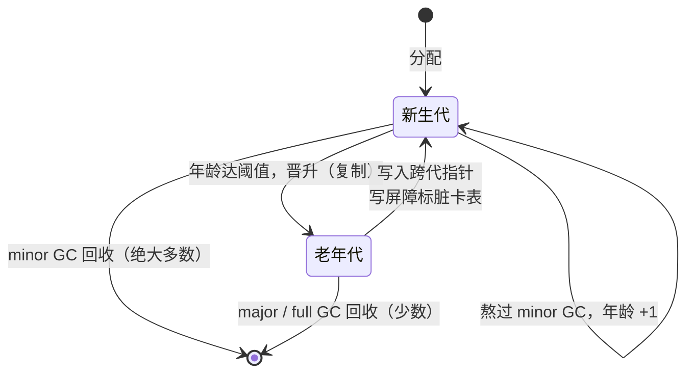

# 13.8 分代假设与代际回收

学过 JVM 或 .NET 的人常会问一个尖锐的问题：Go 为什么**不做分代 GC**？分代是 Java、.NET 等
主流托管运行时 GC 的标配，被视为高效回收的关键，几乎成了「现代 GC 应当如此」的常识。Go 偏偏
没采用。这一节讲清分代的思想、它的威力，以及 Go 不走这条路的理由。这里的答案值得讲究：它不是
「Go 团队没想到」，而是 Go 团队**真的实现过一版非移动的分代 GC，量过性能，最后放弃了**。这是
一处极能体现「没有放之四海皆准的设计」的取舍。

## 13.8.1 分代假设与代际回收的机制

分代 GC 建立在一条反复被经验证实的观察上，称作**分代假设**（generational hypothesis）：
**绝大多数对象都「英年早逝」**，刚分配不久就不再被引用。它有强弱两个版本，工程上倚重的是弱版本，
即「年轻对象的死亡率远高于年老对象」。Lieberman 与 Hewitt（1983）、Ungar（1984）正是抓住这条
规律设计了最早的代际回收器。

既然新对象大多速朽，就按「年龄」给对象分代：**新生代**（young generation）装新分配的对象，
**老年代**（old generation）装活过若干轮回收、被认为「站稳脚跟」的对象。回收分两档：

- **minor GC**：只扫新生代。因为垃圾几乎都在这里，且新生代通常很小，扫一遍极快。多数回收都是
  minor GC。
- **major GC / full GC**：偶尔才全堆扫一次，处理那些熬进老年代后才死去的对象。

把回收工作集中在「小而垃圾密集」的新生代上，是分代 GC 威力的来源。用一点记号来量化：设新生代
存活率为 $s_y$、老年代存活率为 $s_o$，分代假设说 $s_y \ll s_o$。一次 minor GC 的扫描成本正比于
新生代的**存活**对象数（标记-复制类回收器只触碰活对象），约为 $s_y \cdot N_y$；而它回收掉的垃圾
约为 $(1 - s_y) \cdot N_y$。$s_y$ 越小，单位扫描成本换来的回收收益越高，这正是「频繁、廉价的
minor GC」之所以划算的全部道理。

天下没有白拿的便宜。只扫新生代有一个漏洞：**老年代对象可能持有指向新生代对象的指针**。如果
minor GC 只把根（栈、全局变量）当作扫描起点，就会漏掉「仅被某个老年代对象引用」的新生代对象，
把活对象误判为垃圾。补救办法是把这类**跨代指针**也当作根。但全扫老年代去找跨代指针，就回到了
full GC，得不偿失。于是分代回收器必须**随时记下「哪些老年代对象写入了指向新生代的指针」**，这
要靠一道**写屏障**（write barrier，见 [13.2](./barrier.md)）配一个**记忆集**（remembered set）。
最常见的记忆集实现是**卡表**（card table）：把堆按固定大小（如 512 字节）切成「卡」，写屏障在
老年代对象被改写时，只把所在卡标记为「脏」；minor GC 扫描时，只需复查脏卡里的对象去寻找跨代指针。

```text
// 代际写屏障的核心逻辑（伪代码）：记下「老 -> 新」的跨代指针
func writeBarrier(slot *Pointer, ptr Pointer) {
    *slot = ptr
    if inOldGen(slot) && inYoungGen(ptr) {   // 仅跨代写入才需记录
        card := cardOf(slot)
        cardTable[card] = DIRTY              // 标脏所在的「卡」，O(1)
    }
}

// minor GC 的扫描根 = 真正的根 + 脏卡里的跨代指针
func minorGC() {
    roots := stackAndGlobalRoots()
    for card := range cardTable {
        if card == DIRTY {
            roots = append(roots, scanCardForYoungPtrs(card)...)
        }
    }
    collectYoungGen(roots)   // 只动新生代，复制幸存者、晋升老对象
}
```

把对象的一生画出来，分代结构的流转便一目了然：



代际回收的几个关键设计就此浮现：分代、minor/major 两档、写屏障加记忆集、以及把幸存者从新生代
**复制并晋升**到老年代。最后这一点尤其要记住：高效的分代回收器几乎都是**移动式**的，新生代用
复制式回收（copying collection），既顺手压实了碎片，又用「幸存即晋升」自然实现了年龄推进。这一点
在下文会成为 Go 不分代的关键症结。

## 13.8.2 别家怎么做：JVM 与 .NET

把分代放到工业现场看，它的形态相当统一。**HotSpot JVM** 把堆分成 Eden、两块 Survivor（S0/S1）
与 Old 三层：新对象生在 Eden，minor GC（HotSpot 称 young GC）把 Eden 与一块 Survivor 中的幸存者
复制到另一块 Survivor，熬过若干轮（由 `MaxTenuringThreshold` 控制）再晋升到 Old；跨代指针由卡表
记录。**.NET CLR** 分 gen0、gen1、gen2 三代，gen0 回收最频繁，gen0/gen1 的回收（ephemeral
collection）廉价，gen2 才是 full GC；同样用卡表加写屏障维护「老指新」。两者细节有别，骨架却一致：
小而频繁的年轻代回收 + 写屏障维护的记忆集 + 幸存者晋升。

这些运行时之所以倚重分代，与它们的语言模型有关。Java 里几乎一切非基本类型都是堆上对象，
`new` 出来的临时对象铺天盖地，分代假设在它们的堆上成立得非常充分，把年轻代收割做廉价的收益巨大。
这一点恰是理解「为什么 Go 不一样」的钥匙。

## 13.8.3 Go 为何不分代

Go 至今用的是**非分代**的并发标记清扫（[13.1](./basic.md)）。这不是疏忽：Rick Hudson 在
「Getting to Go」中讲过，团队**实现过一版非移动的分代 GC**，思路是既不放弃延迟、也不放弃非移动，
便只能做一个非移动的分代回收器，最终量下来不划算而作罢。原因是三重取舍的合力。

**其一，逃逸分析已经替分代假设把活干了。** Go 编译器的逃逸分析
（[15.5](../../part5toolchain/ch15compile/escape.md)）把大量「短命」对象直接分配在**栈**上，它们
随函数返回自动消失，根本不进堆、不劳 GC。Hudson 的原话是：「并不是分代假设对 Go 不成立，而是
年轻对象就在栈上生、在栈上死。」于是分代假设里那批「速朽的年轻对象」，很多在 Go 里已被栈分配
消化掉了。留给堆 GC 的对象，「英年早逝」的特征已没那么强，年轻代收割能榨出的收益因此大打折扣。
看一个具体例子：

```go
package main

func sum(n int) int {
	p := new(int) // 看似在堆上 new，逃逸分析判定它不逃逸
	for i := 0; i < n; i++ {
		*p += i
	}
	return *p
}

func main() { println(sum(10)) }
```

```text
$ go build -gcflags='-m' escape.go
./escape.go:3:6: can inline sum
./escape.go:11:6: can inline main
./escape.go:11:26: inlining call to sum
./escape.go:4:10: new(int) does not escape
```

`new(int)` 这个本该是「典型年轻代对象」的家伙，编译期就被判定 `does not escape`，落在栈上，
GC 一辈子见不到它。在别的语言里，正是这种对象撑起了分代回收的收益。

**其二，非移动式回收让分代变得别扭。** 上一节说过，高效的分代几乎都靠**复制/移动**新生代，
用「幸存即晋升」自然推进年龄。Go 的回收器是**非移动**的标记清扫（[13.5](./sweep.md)），这是为
指针稳定、内部指针（interior pointer）与 cgo 友好而做的根本选择。在不移动对象的前提下，要么放弃
复制式年轻代的全部好处，要么强行引入移动，前者收益所剩无几，后者动摇了整套设计的地基。团队那版
原型正是「非移动的分代」，结论是其中的**写屏障虽快，却仍不够快，也难以优化**。

**其三，已有方案已经达成 Go 的目标。** Go 的并发标记清扫加混合写屏障（[13.2](./barrier.md)）
已经把停顿压到亚毫秒级。这里有个常被忽略的要点：分代 GC 最大的好处，是把写屏障的成本「抹」在
mutator 的日常运行里，从而**削掉 full GC 那段漫长的 STW**。可 Go 的并发回收**本就没有这段长
STW**。换句话说，分代主要优化的是**吞吐**（减少标记总量），而非 Go 最在意的延迟，Go 早已用
并发把延迟问题单独解决了。

Hudson 为这个判断算过一笔账，值得把它写成一个小成本模型。设活对象总量为 $L$、堆触发阈值（即
活对象与堆大小之比的倒数控制的扩张倍数）使每个 GC 周期分配 $H$ 字节后触发回收。把一段时间内的
总分配量记为 $A$，则 GC 周期数约为 $A / H$，每个周期的标记成本正比于活对象量 $L$，于是单位
分配的**累计标记成本**为

$$
C_{\text{mark}} \;\propto\; \frac{(A / H)\cdot L}{A} \;=\; \frac{L}{H}.
$$

它随堆 $H$ 增大而**反比下降**：堆翻倍，GC 周期减半，累计标记成本随之减半。写屏障的成本则不同，
它摊在每一次指针写入上，是一个与堆大小无关的**常数** $C_{\text{wb}}$。两者一比便清楚：只要愿意
多给一点内存把 $H$ 撑大，标记成本就能压到写屏障成本之下，而分代为削减 full GC 而常驻开启的那道
写屏障，成本却抹不掉。于是 Go 选择「赌 RAM 比 CPU 更便宜」这条路，宁可多花点 CPU 并发去标记，
靠调大堆（[13.3 调步](./pacing.md)）摊薄标记开销，也不愿背上一道始终开启的代际写屏障。

## 13.8.4 取舍的启示，与未竟之事

Go 不分代，不是因为不懂分代，而是因为**在它的整体设计下，分代的性价比不够高**：逃逸分析吃掉了
收益的一头，非移动回收抬高了成本的一头，而它最在意的低延迟早已由并发回收从另一头解决。这是一个
绝佳的例子：**一项在别处（JVM/.NET）被奉为圭臬的技术，换一套上下文（栈分配 + 非移动 + 延迟优先）
就未必划算。** 它提醒我们，评估任何「最佳实践」都要先看它赖以成立的前提还在不在。

这并非定论。Go 团队多年来一直在「改善回收局部性」的方向上探索，这与分代有共同的底层关切：让
回收器更多地触碰「该触碰的那部分对象」，少做无用功。go1.25/1.26 的 Green Tea GC
（[13.11](./history.md)）就是这一方向上的新尝试，它优化的是标记阶段的内存访问局部性，而非引入
代际结构，可以看作 Go 对「分代想解决的问题」给出的另一种回答。下一节看 Go 曾认真试过、却同样
最终放弃的另一条路，基于「请求假设」的事务制导回收（[13.9](./roc.md)）。两条路放在一起，能看清
Go 团队评估激进 GC 设计时一以贯之的标尺：先问它和延迟优先、非移动这两条铁律是否相容。

## 延伸阅读的文献

1. Henry Lieberman, Carl Hewitt. "A real-time garbage collector based on the lifetimes of
   objects." *Communications of the ACM* 26(6), 1983. https://doi.org/10.1145/358141.358147
   （代际回收思想的最早源头之一）.
2. David Ungar. "Generation Scavenging: A non-disruptive high performance storage
   reclamation algorithm." *SDE 1984*. https://doi.org/10.1145/800020.808261
   （「分代清道」，分代 GC 的奠基工作）.
3. Rick Hudson. *Getting to Go: The Journey of Go's GC.* ISMM 2018 keynote.
   https://go.dev/blog/ismmkeynote （Go 实现并放弃非移动分代 GC 的第一手交代）.
4. The Go Authors. *Issue #20373: why not generational and compacting GC.*
   https://github.com/golang/go/issues/20373 （逃逸分析、并发与延迟独立于代大小的官方讨论）.
5. The Go Authors. *A Guide to the Go Garbage Collector.* https://go.dev/doc/gc-guide
   （当前非移动并发标记清扫回收器的设计说明）.
6. Richard Jones, Antony Hosking, Eliot Moss. *The Garbage Collection Handbook: The Art of
   Automatic Memory Management.* 2nd ed., CRC Press, 2023.
   https://doi.org/10.1201/9781003276142 （记忆集、卡表与分代回收机制的系统性论述）.
7. 本书 [13.9 请求假设与事务制导回收](./roc.md)、[13.11 过去、现在与未来](./history.md)、
   [15.5 逃逸分析](../../part5toolchain/ch15compile/escape.md).
