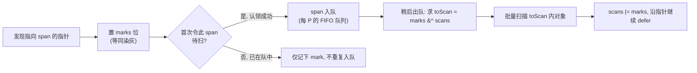
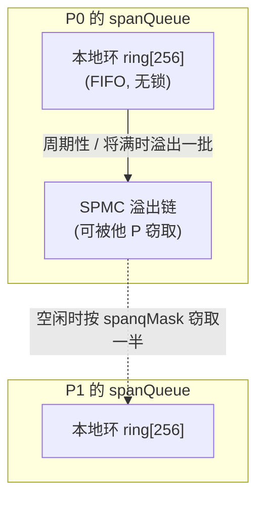

# 13.11 Green Tea：面向局部性的标记

前面几节把标记讲成一件「正确且及时」的事：写屏障（[13.2](./barrier.md)）保证不漏标，标记辅助
（[13.4](./mark.md)）保证标记追得上分配。可这两件事都没碰标记的另一笔账：**标记跑得快不快**。
到了多核、大堆的今天，标记的瓶颈往往既不在算法的正确性，也不在 CPU 的算力，而在**内存墙**：
处理器大半时间不是在算，而是在等一笔笔缓存未命中的内存读取返回。Green Tea 正是冲着这笔账去的。

Green Tea 是 go1.25 引入的新标记算法，go1.26 起**默认开启**（基线实验特性，用
`GOEXPERIMENT=nogreenteagc` 可以关掉回退到旧标记器），实现集中在 `runtime/mgcmark_greenteagc.go`。
它不改变三色抽象，也不引入任何新的屏障，只重排了标记器**遍历对象的顺序**，让访存从随机变回顺序。
这一节把它拆开来讲：它要解决的局部性问题、推迟扫描的核心想法、内联在 span 上的两套位图、span 的
认领与窃取，以及最终落到稠密 / 稀疏两条扫描路径上的实现。

## 13.11.1 问题：标记是一场缓存灾难

回到经典的三色标记（[13.1](./basic.md)）：从灰色队列取一个对象，扫描它内部的每个指针，把指向的
白色对象染灰入队，反复直到队空。这是一次以对象为单位的**图遍历**，而图的边由程序的引用关系决定，
与对象在堆上的物理位置毫不相干。于是标记器的内存访问近乎随机：扫完手上这个对象，下一个要碰的对象
可能落在几兆字节之外的另一个 span 上，它的指针位图元数据又在第三处。

这种「追着指针满内存乱跑」的访问模式，对现代 CPU 几乎是最坏情况：

- **缓存命中率低**。相邻两次访问落在同一条缓存行的概率很小，绝大多数指针解引用都要等一次主存读取，
  延迟以上百个时钟周期计。
- **预取器失效**。硬件预取依赖可预测的访问步长，而指针追逐没有步长可言，预取器根本猜不中下一个地址。
- **元数据访问被摊不开**。每扫一个对象都要单独取一次它的指针位图、size class 等元数据，这些零散的
  小读取本身又是一串缓存未命中。

后果是标记吞吐**难以随核数线性扩展**：加核只是让更多核一起空等内存。这正是 go1.5 把停顿压到亚毫秒
（[13.4](./mark.md)）之后，标记阶段剩下的最大一块成本，也是 Green Tea 要啃的骨头。值得注意的是，
它瞄准的维度和被放弃的分代、ROC（[13.8](./generational.md)、[13.9](./roc.md)）不同：那两条路想靠
对象的**时间**结构（年龄、请求生命周期）少扫一些对象，代价是长期开启的写屏障；Green Tea 想靠对象的
**空间**结构（同一 span 上的对象物理相邻）把同样多的对象扫得更快，而不必动屏障。

## 13.11.2 核心想法：推迟扫描，按 span 成批

Green Tea 的核心想法一句话能说清：**推迟扫描，把指向同一个 span 的对象攒起来一次扫完**。

经典标记是「发现一个、立刻扫一个」。Green Tea 把这一步拆成两段：发现指向某个 span 的指针时，先只
在那个 span 上**记一笔**（置标记位），并把这个 span 整体排进一个队列；真正的扫描推迟到稍后，等轮到
这个 span，再把它上面这段时间里攒下的、所有待扫对象**一次性扫完**。

为什么这样就快了？因为分配器早已按 span、按 size class 把同类对象聚到了一起（[12.2](../ch12alloc/component.md)）：
同一个 span 上的对象在内存里本就**首尾相邻**。把它们攒成一批顺序扫描，等于把先前的随机访问改回了
顺序访问，缓存行被充分利用，预取器重新猜得中，那份 span 级的元数据（指针位图、size class）也由一
整批对象**共同摊销**，只取一次。攒得越久，一个 span 上累积的待扫对象越多，这笔摊销就越划算。

要做到「成批」而又不失**精确**（不重扫、不漏扫），Green Tea 在每个 span 上维护**两套位图**：

- `marks`：标记位。一个指向该对象的指针**第一次**被发现时置位，语义等同于经典标记里的「染灰」。
- `scans`：已扫位。记录哪些对象**已经被扫描**过了，语义等同于「染黑」。

轮到一个 span 时，取两套位图做一次合并与求差：

$$
\textit{toScan} = \textit{marks} \setminus \textit{scans}, \qquad \textit{scans}' = \textit{marks} \cup \textit{scans}
$$

差集 `marks &^ scans`（已标记但未扫描）就是这一轮真正要扫的对象集合；扫完把并集写回 `scans`。这样
即便多个 worker 并发地把同一个 span 反复入队，每个对象也只会被扫恰好一次：第二次轮到时它的标记位
早已落进 `scans`，差集里不再出现。三色不变式（[13.1](./basic.md)）由此完整保住，精确性不打折扣。



## 13.11.3 把位图内联进 span

两套位图存在哪里，本身就是一处用心的设计。Green Tea 把它们直接**内联在 span 自身的末尾**，连同
扫描一个对象所需的全部状态打包成一个 128 字节的结构 `spanInlineMarkBits`：

```go
// runtime/mgcmark_greenteagc.go（速写）
// 内联在 span（一个 8 KiB 页）末尾的标记位，整体 128 字节、128 字节对齐
type spanInlineMarkBits struct {
    scans [63]uint8         // 已扫位：每字节覆盖 8 个对象，共可覆盖约 504 个
    owned spanScanOwnership // 扫描所有权：用于并发认领该 span（见下节）
    marks [63]uint8         // 标记位：指针首次被发现时置位
    class spanClass         // 该 span 的 size class，扫描时直接取用
}

// 位图就放在 span 基址 + 一页 - 128 字节处，由基址即可算出，无需回查 mspan
func spanInlineMarkBitsFromBase(base uintptr) *spanInlineMarkBits {
    return (*spanInlineMarkBits)(unsafe.Pointer(base + gc.PageSize - unsafe.Sizeof(spanInlineMarkBits{})))
}
```

「内联」二字是关键。经典标记里，`scanObject` 要先由对象地址查出它所属的 `mspan`，再从 `mspan` 上
取 size class、取 `gcmarkBits`，这几步本身就是几次指向别处的缓存未命中。Green Tea 把扫描一个 span
所需的一切（两套位图、size class、所有权字段）都搬到 span 末尾这 128 字节里，扫描时由 span 基址
一次定位即可，省下了对 `mspan` 的间接寻址。这块结构是 2 的幂、按 128 字节对齐，也方便后面用
宽 SIMD 指令成批清零与读写。

队列里流转的不是裸指针，而是一个把 **span 基址**与**对象下标**塞进同一个机器字的 `objptr`。span 是
单页、页对齐的，基址低 13 位（`PageShift = 13`）恒为零，正好用来存下标；对象下标最多约 504，稳稳
落在 13 位之内：

```go
type objptr uintptr // 高位是 span 基址（页对齐），低 13 位是对象在 span 内的下标

func makeObjPtr(spanBase uintptr, objIndex uint16) objptr {
    return objptr(spanBase | uintptr(objIndex)) // 基址低位恒为 0，直接按位或塞入下标
}
```

## 13.11.4 认领与入队：所有权握手 + 每 P 可窃取的 span 队列

把 span 排进队列，有两个并发问题要解决：同一个 span 可能被多个 worker 几乎同时发现，**谁负责把它
入队**？以及入队之后，**多个 worker 怎样均衡地分担**这些 span？

第一个问题靠一次轻量的**所有权握手**。`spanInlineMarkBits.owned` 是一个三态字段，记录该 span 当前
有没有被某个 worker「认领」去扫描，以及自上次入队以来大约设了多少个标记位：

```go
const (
    spanScanUnowned  spanScanOwnership = 0 // 无人认领
    spanScanOneMark                    = 1 // 自入队以来只设了一个标记位
    spanScanManyMark                   = 2 // 可能设了多个标记位
)
```

发现指向某 span 的指针时，`tryDeferToSpanScan` 先用一次原子操作把对象的标记位置上；若是它令这个
span **第一次**变为待扫，便尝试 `tryAcquire` 认领并把 span 入队。这里 `OneMark` / `ManyMark` 的区分是
一处**快路径**优化：如果一个 span 出队时其所有权仍是 `OneMark`，说明从入队到现在只有当初那一个标记
位被设过，扫描时根本不必做上一节那套「合并 + 求差」，直接扫那一个对象即可；只有当多个标记位累积
（`ManyMark`）时才走完整的 `spanSetScans` 合并流程。稀疏命中的 span 因此几乎零开销。

```go
// 发现一个指针时，推迟到其所在 span 批量扫描（裁剪到主干）
func tryDeferToSpanScan(p uintptr, gcw *gcWork) bool {
    // ... 由 p 定位 span 与对象下标 q, objIndex ...
    if atomic.Load8(&q.marks[idx])&mask != 0 {
        return true // 已标记，无事可做
    }
    atomic.Or8(&q.marks[idx], mask) // 置标记位（染灰）

    if q.class.noscan() {           // noscan 对象无指针，置位计账即可，永不入队
        gcw.bytesMarked += ...
        return true
    }
    if q.tryAcquire() {             // 认领成功：由我负责把这个 span 排进队列
        gcw.spanq.put(makeObjPtr(base, objIndex))
    }
    return true
}
```

第二个问题靠一套你在本书里见过多次的结构：**每 P 一条可窃取的队列**。调度器的运行队列
（[9.2](../../part3concurrency/ch09sched/steal.md)）、分配器的 mcache（[12.2](../ch12alloc/component.md)）、
经典标记的 `gcWork`（[13.4](./mark.md)）都是这个套路，Green Tea 的 `spanQueue` 也不例外。它由一个
P 私有的定长环形缓冲（`ring [256]objptr`）加一条溢出链（SPMC，single-producer multi-consumer）组成：
本 P 入队、出队走无锁的本地环，环将满或周期性地把一批 span **溢出**到共享链上，好让别的 P 能窃取；
空闲的 worker 则通过 `tryStealSpan`，照一张 `spanqMask` 位图找到尚有 span 的 P，从它链上偷走一半。



这里有一处和经典标记**刻意相反**的选择：经典 `gcWork` 的对象缓冲用 **LIFO**（后进先出，近似深度优先，
利于沿一条引用链保持缓存热度），而 span 队列用 **FIFO**（先进先出）。原因正是 Green Tea 的立身之本：
让一个 span 在队列里**多待一会儿**，它出队前就能攒下更多待扫对象，批量扫描才更划算。经验表明 FIFO
在这件事上明显优于 LIFO。同一套「每 P 缓冲 + 窃取」的骨架，因为目标从「保持引用链局部性」换成了
「最大化每 span 的累积量」，进出策略就反了过来。

## 13.11.5 扫描一个 span：稠密 SIMD 与稀疏逐对象

span 出队后，真正的扫描在 `scanSpan` 里完成。除去上一节说的 `OneMark` 快路径，一般情形先做合并求差，
得到本轮待扫集合 `toScan` 与待扫对象数 `objsMarked`，然后**按密度二选一**：

```go
// scanSpan 的密度分流（裁剪到主干）
objsMarked := spanSetScans(spanBase, nelems, imb, &toScan) // 合并 marks/scans，算出 toScan
if objsMarked == 0 {
    return
}
if !scan.HasFastScanSpanPacked() || objsMarked < int(nelems/8) {
    // 稀疏：待扫对象不足 1/8，或无 SIMD 支持，只逐个访问被标记的对象
    scanObjectsSmall(spanBase, elemsize, nelems, gcw, &toScan)
    return
}
// 稠密：待扫对象足够密集且有 SIMD，用一条向量化路径横扫整个 span
nptrs := scan.ScanSpanPacked(unsafe.Pointer(spanBase), &gcw.ptrBuf[0],
    &toScan, uintptr(spanclass.sizeclass()), spanPtrMaskUnsafe(spanBase))
```

两条路径对应两种密度下的最优解：

- **稠密路径** `ScanSpanPacked`。当一个 span 上被标记的对象足够密（达到 `nelems/8` 以上）且平台支持
  SIMD 时，逐个对象地跳着访问反而不如**把整个 span 当一片连续内存横扫一遍**划算。它借助 `toScan`
  位图与 span 的指针掩码 `spanPtrMask`，用向量指令并行地从一批字里筛出指针，直接把已解引用的指针
  灌进 `gcw.ptrBuf`。在 amd64 上这条路径有一份 AVX-512 实现（`ScanSpanPackedAVX512`），名副其实地
  「成批撕过堆内存」。
- **稀疏路径** `scanObjectsSmall`。当被标记的对象寥寥无几时，横扫整页是浪费，于是退回到只**遍历
  `toScan` 中置位的那些对象**，逐个取出其指针位 `extractHeapBitsSmall` 再解引用。它仍然局限在单个
  span 之内，并在用到地址前主动 `Prefetch`，因此即便是稀疏路径，局部性也远好于经典的满堆指针追逐。

无论哪条路径，扫出来的新指针都不会立刻递归去扫，而是再次经过 `tryDeferToSpanScan` 推迟回各自的
span（[13.11.2](#13112-核心想法推迟扫描按-span-成批)），让整张对象图始终以「按 span 成批」的节奏被
碾过去。`nelems/8` 这个阈值是工程折中：它在「稠密时享受 SIMD 横扫的吞吐」与「稀疏时避免横扫的浪费」
之间划了一条线。

## 13.11.6 谁走 Green Tea，谁不走

Green Tea 并不接管所有对象，它专攻**最吃局部性的那一类**：小对象。一个 span 是否使用内联标记位、
从而走 span 队列这条路，由 `gcUsesSpanInlineMarkBits` 判定：

```go
//go:nosplit
func gcUsesSpanInlineMarkBits(size uintptr) bool {
    // 小到指针位图能内联进 span（≤ 512 字节，无独立分配头），且不小于 16 字节
    return heapBitsInSpan(size) && size >= 16
}
```

也就是说，单页 span 上 16 字节到 512 字节之间的小对象走 Green Tea。这恰是数量最多、最容易把标记器
拖进随机访问的一档。更大的对象（带独立分配头的、跨多页的）继续走经典的 `scanObject`，并按
`maxObletBytes`（128 KiB）切成 oblet 以利并行（[13.4](./mark.md)）；而 `noscan` 的小对象因为内部没有
指针，连扫都不必扫，`tryDeferToSpanScan` 给它置个标记位、记一笔字节数就直接返回，从不入队。

于是同一轮标记里，三类对象各走各的最优路径：

| 对象 | 路径 | 为什么 |
| --- | --- | --- |
| 小对象（16–512 B，含指针） | span 队列 + 批量扫描 | 数量最多、随机访问最严重，局部性收益最大 |
| `noscan` 小对象 | 仅置标记位，不扫不入队 | 无指针，扫描纯属浪费 |
| 大对象 / 多页 span | 经典 `scanObject` + oblet | 单个对象已足够大，本身就有顺序访问与并行切分 |

## 13.11.7 设计取舍、谱系与未来

把 Green Tea 放回回收器的演进谱系（[13.12](./history.md)）里看，它与被放弃的分代、ROC 出自**同一种
直觉**：利用对象的某种结构性规律来加速回收。区别全在于「利用哪种规律」以及「代价落在哪」。分代利用
对象年龄、ROC 利用请求边界，两者都属于**时间**结构，都得靠长期开启的写屏障来维持假设，代价是缓存
未命中（[13.9](./roc.md) 总结过这道「写屏障关卡」）。Green Tea 利用的是**空间**结构：同一 span 上的
对象物理相邻。它只改变标记器**遍历的顺序**，不引入任何新屏障，于是干净地绕开了那道让前两者折戟的
关卡。同一种直觉，这一次找对了不必付屏障代价的切入点。

Green Tea 与分配器是一对**共生**演进。批量扫描之所以划算，前提正是分配器按 span、按 size class 把
同类对象聚到一起（[12.1](../ch12alloc/basic.md) 那条「分配器与 GC 共生」的主线）；它对小对象密集场景
的优化，也与分配器自身的持续演进相互呼应（[12.9](../ch12alloc/history.md)）。源码注释更点出了仍在
路上的方向：一旦扫描完全按 size class 组织，稠密路径的 SIMD 还能进一步特化，把标记吞吐再推一个台阶。

更要紧的是，Green Tea 服务的仍是那条从 go1.5 贯穿至今的主线：让回收尽可能地不打扰用户代码。早年
这条主线表现为「把停顿压短」（[13.4](./mark.md)、[13.6](./termination.md)），停顿进入亚毫秒后，剩下的
成本转移到「标记阶段那 25% 后台 CPU 用得值不值」。Green Tea 不再去削停顿，而是去削**这 25% 背后
真正被浪费在等内存上的时钟**，让标记吞吐随核数与堆规模更好地扩展。尺子没变，只是又量到了一个新的
维度。它如何一步步从 go1.25 的实验走到 go1.26 的默认，放在下一节的时间轴（[13.12](./history.md)）里
一并看，脉络会更清楚。

## 延伸阅读的文献

1. The Go Authors. *runtime: green tea garbage collector, issue #73581.*
   https://github.com/golang/go/issues/73581 （Green Tea 的设计动机、基准与默认开启的讨论）
2. The Go Authors. *runtime/mgcmark_greenteagc.go.*
   https://github.com/golang/go/blob/master/src/runtime/mgcmark_greenteagc.go
   （`spanInlineMarkBits`、`spanQueue`、`scanSpan` 的实现）
3. The Go Authors. *internal/runtime/gc/scan.* `ScanSpanPacked` 与其 AVX-512 特化.
   https://github.com/golang/go/tree/master/src/internal/runtime/gc/scan
4. Richard L. Hudson. *Getting to Go: The Journey of Go's Garbage Collector.* ISMM 2018 keynote / The Go Blog, 2018.
   https://go.dev/blog/ismmkeynote （并发标记的设计立场，Green Tea 接续的主线）
5. 本书 [13.1 基本思想](./basic.md)、[13.4 扫描标记与标记辅助](./mark.md)、
   [13.8 分代假设与代际回收](./generational.md)、[13.9 请求假设与事务制导回收](./roc.md)、
   [13.12 过去、现在与未来](./history.md)、[12.2 组件](../ch12alloc/component.md).
