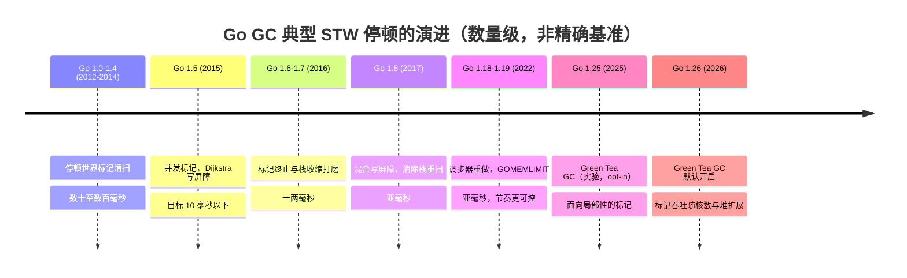

# 13.12 过去、现在与未来

读完前面十节，读者手里已经握有 Go 垃圾回收器各个零件的现状：三色标记（[13.1](./basic.md)）、
混合写屏障（[13.2](./barrier.md)）、调步器（[13.3](./pacing.md)）、清扫与回收（[13.5](./sweep.md)）。
这一节换一个角度，把这些零件放回时间轴上，看它们是怎样一步步长成今天这副模样的。

回收器的演进史，读起来像一条始终朝同一个方向收敛的曲线。从 Go 1.0 到今天，停顿时间下降了约两个
数量级，而这一路上有一条不变的主线：每一步改动，都服务于「在不打扰用户代码的前提下完成回收」。
理解了这条主线，下面被采纳与被抛弃的诸多方案，就都能放到同一把尺子上衡量。

## 13.12.1 被采纳的方案：从数百毫秒到亚毫秒

### Go 1.0–1.4：朴素的停顿世界标记清扫

最早的回收器是教科书式的标记清扫（mark-sweep），且整个过程停顿世界（stop-the-world，STW）：
一旦回收开始，所有用户 Goroutine 停下，回收器在单个或少数线程上走完「标记存活、清扫死亡」，
再放用户代码继续。Go 1.3 把清扫阶段改为与标记并行（parallel，多个回收线程同时干活），
缩短了总时长，但用户代码仍然是被整段挂起的。

这套设计的代价直白地写在停顿时间上：堆越大，需要扫描的对象越多，STW 越长。实测停顿落在数十到
数百毫秒的量级。对一个正在处理请求的 Web 服务，这意味着尾延迟（tail latency）随时可能被一次回收
拖出一道百毫秒级的尖峰。这一痛点，定下了此后十年的主题。

### Go 1.5（2015）：并发标记，低延迟的转向

Go 1.5 是分水岭。Richard Hudson 主导的这次重写，把标记阶段做成与用户代码**并发**（concurrent）
执行：回收器一边标记，用户 Goroutine 一边运行、一边分配、一边改写指针。为了在指针被并发改写时
仍不漏标存活对象，引入了 Dijkstra 风格的写屏障（[13.2](./barrier.md)）。这次重写公开喊出的目标，
是把 STW 压到 10 毫秒以下，并在博客与 ISMM 2018 的报告里反复强调一句立场：宁可牺牲一点吞吐与
峰值内存，也要换来可预测的低延迟。这是一次明确的价值排序，而非单纯的性能优化。

### Go 1.6、1.7：把毫秒继续往下压

并发标记落地后，剩下的 STW 集中在回收循环的起止两端。1.6 把回收器状态化、改进了标记终止
（mark termination）阶段的实现，1.7 让栈收缩（stack shrinking）独立于 STW 进行，停顿从 1.5 的
个位数毫秒进一步降到一两毫秒以内。这两个版本没有惊人的算法变动，做的是把 1.5 打下的并发框架
逐处打磨干净。

### Go 1.8（2017）：混合写屏障，跨过亚毫秒

1.5 之后停顿的最后一座大山，是**栈重扫**（stack re-scan）。Dijkstra 写屏障只拦截堆上的指针写入，
不拦截栈上的写入，于是回收器无法保证一个已扫黑的栈不会在之后又指向白色对象。它只能在标记终止时
把所有栈重新扫一遍，而这一步必须在 STW 下完成。实测重扫吃掉 10 至 100 毫秒，恰好成了亚毫秒目标
跨不过去的门槛。

Go 1.8 引入 **混合写屏障**（hybrid write barrier，[13.2](./barrier.md)），把 Dijkstra 屏障与
Yuasa 删除屏障合二为一，使栈一旦扫描为黑便不必再扫。这一改动直接消除了 STW 栈重扫，把典型停顿
带进**亚毫秒**（sub-millisecond）区间。从此「GC 停顿」在大多数应用的延迟预算里，不再是需要单独
列项的开销。

### Go 1.18 与 1.19：调步器重做与软内存上限

亚毫秒之后，重心从「停顿多长」转向「回收触发得是否聪明」。Go 1.18 重做了调步器
（pacer，[13.3](./pacing.md)），用更清晰的比例积分模型替换了原先打补丁式累积的逻辑，让回收节奏
在堆增长不规则时也更稳。Go 1.19 引入 `GOMEMLIMIT`，给运行时一个**软内存上限**（soft memory limit）：
在它之下，回收器可以放慢节奏多攒一点垃圾以省 CPU；逼近它时，回收器自动加紧，避免无谓的 OOM。
这件事与页分配器、清道夫（scavenger，[12.7](../ch12alloc/pagealloc.md)）的归还策略协同，把「延迟、
吞吐、内存」三者的权衡，从写死的常数变成了用户可声明的目标。

### 一条下降约百倍的停顿曲线

把上面的版本连起来看，停顿时间走出了一条清晰的下降曲线，而它对用户代码始终是**透明**的：除了
设环境变量，应用源码一行不必改，停顿就一代代变短。

这条曲线背后的设计立场，可以浓缩成一句话：性能的提升从不白来。Go 用写屏障带来的少量吞吐开销，
换来了停顿的可预测；用 `GOMEMLIMIT` 暴露的旋钮，把三者的取舍交回给最清楚业务需求的人。

## 13.12.2 被抛弃的方案：两条没有走通的路

并非每一次尝试都进了正式版本。两个曾被认真探索、最终放弃的方案，恰恰从反面印证了上面那条主线。

第一个是**并发栈重扫**。1.8 之前，团队也考虑过不引入新屏障，而是把 STW 下的栈重扫改为并发执行。
这条路在工程上比混合写屏障复杂得多，且即便做成，重扫本身依旧存在。混合写屏障一举把重扫这个阶段
连根去掉，顺带简化了回收的状态机，于是并发重扫方案被弃。

第二个是**请求制导回收**（ROC，request-oriented collector，[13.9](./roc.md)）与**传统分代回收**
（[13.8](./generational.md)）。ROC 假设「请求私有的对象在请求结束时即可整批回收」，分代回收假设
「多数对象年纪轻轻就死」。两个假设都符合直觉，但落到 Go 上都败在同一处：为了维持假设的正确性，
写屏障必须长期开启，带来昂贵的缓存未命中。而 Go 的栈式分配让许多「年轻对象」根本没进堆、在栈上
就已死亡，分代假设能榨出的收益又被削去一截。代价高于收益，两者都未进入正式版本。

这两次放弃留下的教训很具体：在 Go 里，任何想靠「利用对象的某种结构性规律」来加速回收的方案，都得
先过「写屏障开销」这一关。这恰好为下一节的主角埋下伏笔。

## 13.12.3 现在与未来：Green Tea GC

亚毫秒之后，停顿不再是主战场，剩下的成本转移到了标记阶段那 25% 后台 CPU 究竟用得值不值。Go 1.25
带来的新标记算法 **Green Tea**，瞄准的正是前面所有版本都没正面解决的另一个维度：标记阶段的**缓存
局部性**（cache locality）。它在 1.25 以 `GOEXPERIMENT=greenteagc` 的实验形式提供（opt-in），1.26 起
**默认开启**（可用 `GOEXPERIMENT=nogreenteagc` 关掉）。

它的核心想法一句话能说清：**推迟扫描，按 span 把对象攒起来一起扫**，把经典三色标记那种「追着指针
满内存乱跑」的随机访问，改回同一个 span 内的顺序访问，让缓存与预取重新发挥作用。

把它放回本节的脉络里看，Green Tea 与上一小节被放弃的 ROC、分代同出一脉：都想**利用对象的结构性
规律**加速回收。区别只在利用哪种规律、代价落在何处。ROC 利用请求边界、分代利用对象年龄，都属
**时间**结构，都得靠长期开启的写屏障维持假设，代价是缓存未命中；Green Tea 利用的是**空间**局部性
（同一 span 上的对象物理相邻），它只改变标记器**遍历的顺序**，不引入任何新屏障，于是干净地绕开了
那道让前两者折戟的关卡。这一次，同一种「利用结构」的直觉终于找对了不必付屏障代价的切入点。

它的两套内联位图、span 所有权握手、每 P 可窃取的 FIFO span 队列，以及稠密 SIMD 与稀疏逐对象两条
扫描路径，已在本章 [13.11 Green Tea：面向局部性的标记](./greentea.md) 里完整展开，这里不再重复。
要点是：无论它最终演进成什么形态，服务的仍是那条从 Go 1.5 贯穿至今的主线，让回收尽可能不打扰用户
代码。早年这条主线表现为「把停顿压短」，如今它表现为「让标记吞吐随核数与堆规模扩展，同时不把延迟
还回去」。尺子没变，只是又量到了一个新的维度。

## 延伸阅读的文献

1. Richard L. Hudson. *Getting to Go: The Journey of Go's Garbage Collector.* ISMM 2018 keynote / The Go Blog, 2018.
   https://go.dev/blog/ismmkeynote （1.5 并发回收转向与低延迟立场的一手叙述）
2. The Go Authors. *A Guide to the Go Garbage Collector.*
   https://tip.golang.org/doc/gc-guide （调步器、`GOMEMLIMIT` 与延迟/吞吐/内存权衡的官方指南）
3. Austin Clements. *Proposal: Concurrent Garbage Collector Pacing (Go 1.5).* design doc.
   https://golang.org/s/go15gcpacing
4. Austin Clements, Rick Hudson. *Eliminate STW stack re-scanning (hybrid write barrier, Go 1.8), issue #17503.*
   https://github.com/golang/go/issues/17503
5. The Go Authors. *Soft memory limit (`GOMEMLIMIT`), Go 1.19 release notes.*
   https://go.dev/doc/go1.19#runtime
6. The Go Authors. *runtime: green tea garbage collector, issue #73581.*
   https://github.com/golang/go/issues/73581 （Green Tea 的设计动机与基准）
7. The Go Authors. *runtime/mgcmark_greenteagc.go.*
   https://github.com/golang/go/blob/master/src/runtime/mgcmark_greenteagc.go （`GOEXPERIMENT=greenteagc` 的实现）
