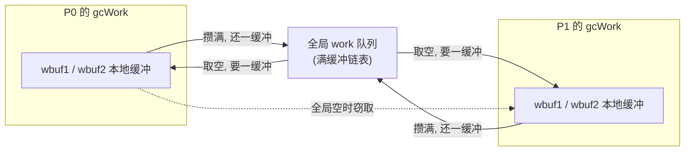

# 13.4 扫描标记与标记辅助

标记是 GC 的主体工作：从根（全局变量、各 goroutine 的栈、寄存器）出发，沿指针把所有可达对象
置黑（[13.1](./basic.md) 的三色抽象）。一个朴素的实现会停下整个世界、单线程地走完对象图，这正是
早年 Go 不堪的停顿来源。go1.5 之后，标记被改造成两件事同时成立的形态：它**与用户程序并发**地推进，
又能在用户分配过快时**把代价分摊**到分配者头上。这一节回答三个问题：标记如何并行展开而不互相踩踏；
扫描一个对象时怎么知道它的哪些字是指针；以及当用户一边分配、标记一边追赶时，凭什么保证标记不会
被永远甩在后面。

## 13.4.1 谁来标记：后台 worker 与 25% 的预算

标记的主力是一组后台 goroutine，`gcBgMarkWorker`。运行时为每个 P 准备一个，但并不让它们全速
空转抢占 CPU，而是把整个标记阶段的 CPU 预算固定在 **GOMAXPROCS 的 25%**：

```go
// runtime/mgcpacer.go（速写）
const gcBackgroundUtilization = 0.25 // 标记阶段后台 GC 的固定 CPU 占用目标
```

为什么是一个固定比例，而不是「有多少干多少」？这是调步器（[13.3](./pacing.md)）的核心约定：把 GC
对吞吐的侵蚀钉在一个可预测的水平上，剩下的 75% 留给用户程序。25% 这个数字本身是工程折中，高了伤
吞吐，低了标记追不上分配（追不上的缺口再由下文的标记辅助补齐）。

固定预算落到具体 worker 上，会按 `GOMAXPROCS × 0.25` 算出需要几个「专职」worker，余数用一个「零工」
worker 凑齐，于是有了三种工作模式：

```go
// 三种后台标记 worker 模式（runtime）
gcMarkWorkerDedicatedMode  // 专职：整个标记阶段独占一个 P，不被抢占
gcMarkWorkerFractionalMode // 零工：补齐 25% 预算的小数部分，到点即让出
gcMarkWorkerIdleMode       // 闲时：P 没有用户 goroutine 可跑时顺手标记
```

举例：`GOMAXPROCS = 8` 时 $8 \times 0.25 = 2$，于是有 2 个专职 worker 各占一个 P；若是
$5 \times 0.25 = 1.25$，则 1 个专职 worker 加一个补齐 $0.25$ 的零工 worker。专职 worker 在标记期间不被调度
器抢占，零工 worker 跑到 `fractionalUtilizationGoal` 这个比例就主动让出，闲时 worker 则只在某个 P
找不到用户活儿干时被 `findRunnable`（[9.5](../../part3concurrency/ch09sched/exec.md)）顺手唤起。三者
合起来既稳住了 25% 的均值，又不浪费空闲算力。

## 13.4.2 灰色队列：gcWork 的分层与窃取

标记天然适合并行：不同 worker 扫描对象图的不同区域，彼此独立。难点不在并行本身，而在如何让多个
worker 高效地**共享一份待办的灰色对象**，又不为此天天抢同一把锁。Go 的答案是一套你在本书里已经见过
两次的结构：每 P 本地缓冲 + 全局队列 + 窃取。调度器的运行队列（[9.2](../../part3concurrency/ch09sched/steal.md)）
如此，分配器的 mcache 与 mcentral（[12.2](../ch12alloc/component.md)）如此，标记的 `gcWork` 也如此。

```go
// gcWork：每 P 一份的灰色对象本地缓冲（速写）
type gcWork struct {
    // 两个工作缓冲，构成一个有「迟滞」的双缓冲栈。
    // wbuf1 是当前压入 / 弹出的缓冲；wbuf2 是下一个被丢弃的。
    // 留一整个缓冲的余量，可把「向全局队列要 / 还缓冲」的开销
    // 摊薄到至少一缓冲的工作量上，减少对全局队列的争用。
    wbuf1, wbuf2 *workbuf

    bytesMarked  uint64 // 本 gcWork 已置黑的字节数，汇总进 work.bytesMarked
    heapScanWork int64  // 本 gcWork 已完成的堆扫描工作量，喂给调步器与辅助信用
}
```

worker 的主循环就是「取一个灰色对象、扫描它、把新发现的白色对象置灰入队、把自己转黑」，反复至队列
为空。取灰色对象时，先掏本地缓冲（无锁），本地空了再去全局队列，全局也空了才去**偷**别的 P 的缓冲。
这套循环就是 `gcDrain`：

```go
// gcDrain：把灰色对象队列「抽干」（裁剪到主干）
func gcDrain(gcw *gcWork, flags gcDrainFlags) {
    // ... 先处理根标记任务（markroot）：扫全局变量、各 goroutine 栈 ...

    // 然后是堆标记的主循环
    for !(gp.preempt && (preemptible || ...)) {
        if work.full == 0 {
            gcw.balance() // 本地缓冲攒太满，匀一些回全局，免得别人没活干
        }
        // 取一个待扫对象：本地快取 -> 本地慢取 -> 偷取
        b := gcw.tryGetObjFast()
        if b == 0 {
            b = gcw.tryGetObj() // 必要时向全局队列要一个缓冲
        }
        if b == 0 {
            break // 实在没活，退出
        }
        scanObject(b, gcw) // 扫描，沿指针把白色置灰入队

        // 攒够一批，就把扫描信用刷给调步器，供标记辅助支取（见 13.4.4）
        if gcw.heapScanWork >= gcCreditSlack {
            gcController.heapScanWork.Add(gcw.heapScanWork)
            ...
            gcw.heapScanWork = 0
        }
    }
}
```

双缓冲（`wbuf1` / `wbuf2`）的「迟滞」是这里的关键笔法：若每弹空一个缓冲就立刻去全局队列换、每填满
一个就立刻还，全局队列会被高频读写。留出一整缓冲的余量，意味着只有在连续弹空两个缓冲时才去全局
要新的、连续填满两个时才还回去，把全局队列的访问频率压低了一个量级。这与 mcache 对 mcentral 的
「批量补货」是同一种思路：把昂贵的共享访问摊薄到一批本地操作之上。



到 go1.25/1.26，标记又长出一层「按 span 扫描」的优化（Green Tea GC，实验特性默认开启）：除了逐个
对象的灰色队列，`gcWork` 还维护一个待处理 **span 队列**（`spanq`），把同一个 span 内多个待扫对象
聚成一次批量扫描，改善了小对象密集场景下的访存局部性。它在数据结构上是对上面这套队列的扩充，灰色
对象的语义不变，本节按经典的「逐对象灰色队列」叙述，足以理解标记的骨架；span 扫描是其上的性能演进。

## 13.4.3 扫描一个对象：怎么知道哪里是指针

`scanObject` 要沿指针前进，前提是知道**对象里哪些字是指针**。否则它既无从前进，又可能把一个恰好
长得像堆地址的整数误当指针，错误地「标记」一片本不存在的对象图。Go 是**精确**（precise）GC，它对每
一个字的指针性都有确切的元数据，不靠保守猜测。

这份元数据正是 [12.1](../ch12alloc/basic.md) 所说「分配器与 GC 共生」的兑现：分配一个对象时，运行时
就按其类型记下了指针布局，标记时直接取来用。go1.22 起，这份布局的存放方式做过一次重构。早先每个
heap arena 配一张覆盖全堆的指针位图（每字一位）；go1.22 改为把指针信息更贴近对象本身：

```go
// runtime/mbitmap.go（速写）：判断指针位图存在哪
// 小对象：ptr/scalar 位图直接存在 span 末尾，按字寻址即可
func heapBitsInSpan(userSize uintptr) bool { ... }

// 大对象：在对象的第一个字放一个「分配头」(allocation header)，
// 指向类型描述符，扫描时从这里取出完整的指针布局。
```

于是扫描分两种情形：尺寸足够小的对象，位图就在它所属 span 的尾部，按字偏移取位即可；较大的对象，
首字是一个指向类型描述符（[4.1](../../part2lang/ch04type/type.md)）的「分配头」，扫描器顺着它拿到该
类型完整的指针位图。无论哪种，`scanObject` 拿到位图后做的事都一样：

```text
// scanObject 的主干逻辑（伪代码）
for 对象的每一个字 w:
    if 位图标记 w 是指针:
        p := *w
        if p 指向某个白色堆对象 obj:
            置灰 obj 并入队 gcw   // 即下一轮要扫描的对象
            gcw.bytesMarked += obj 的大小
```

栈的扫描走的是另一套元数据。堆对象的布局由运行时按类型推出，栈帧的布局却随函数、随程序计数器位置
变化，所以指针信息由**编译器**生成：每个函数在其安全点（[13.7](./safe.md)）处都有一张**栈帧指针图**
（stack map），标明该处栈上哪些槽位是活指针。worker 扫描一个 goroutine 的栈，就是按它当前停在哪个
安全点，查出对应的 stack map，照图把活指针指向的对象置灰。把这两套（堆的类型位图、栈的 stack map）
合起来，标记才能从根开始精确地遍历整张对象图。

精确性是有代价的：编译器要为每个函数生成并存储 stack map，运行时要为每种类型维护指针位图，这些都
是空间与编译期开销。换来的是 GC 既不会漏标活对象、也不会因把整数误判为指针而把大片垃圾「钉」在堆上，
后者正是保守式 GC（如早期某些 C/C++ 收集器）难以根治的痛点。

## 13.4.4 标记辅助：谁分配谁帮忙

并发标记有一个绕不开的隐患（[13.3](./pacing.md) 已点到）：标记在跑，用户也在分配。worker 以 25% 的
预算稳步置黑，可若用户 goroutine 分配得足够凶，新生的白色对象会比 worker 置黑的还快，堆在标记完成
前就涨满了。固定 25% 预算管不住一个分配特别激进的程序。

**标记辅助**（mark assist）是为此设的兜底：在标记阶段，每个 goroutine 分配内存时都要先**还清自己欠下
的标记债**。运行时给每个 goroutine 记一个「辅助信用」`gcAssistBytes`，分配时扣减；一旦为负（欠债），
这个 goroutine 就得在继续分配前，亲自做一段与欠债成正比的标记工作：

```go
// gcAssistAlloc：分配时检查并偿还标记债（裁剪到主干）
func gcAssistAlloc(gp *g) {
    // 把「欠的字节」按调步器给的兑换率折算成「应做的扫描工作量」
    assistWorkPerByte := gcController.assistWorkPerByte.Load()
    debtBytes  := -gp.gcAssistBytes
    scanWork   := int64(assistWorkPerByte * float64(debtBytes))

    // 先从后台 worker 攒下的扫描信用里「借」一些，能借到就不必亲自动手
    if bgScanCredit := gcController.bgScanCredit.Load(); bgScanCredit > 0 {
        stolen := min(bgScanCredit, scanWork)
        gcController.bgScanCredit.Add(-stolen)
        scanWork -= stolen
    }
    if scanWork == 0 {
        return // 债被信用抵清，继续分配
    }
    // 信用不够：亲自下场做 scanWork 单位的标记，做完才放行分配
    gcDrainN(&getg().m.p.ptr().gcw, scanWork)
}
```

这里有两层设计。其一是那个**兑换率** `assistWorkPerByte`，它由调步器实时算出（[13.3](./pacing.md)），
本质是「为使标记按时收尾，每分配一字节需偿还多少扫描工作」。分配越多、距标记目标越近，单位字节的
债越重。其二是 `bgScanCredit`：后台 worker 每扫一批就把超额完成的工作量记成「信用」存进全局账户
（见 13.4.2 `gcDrain` 末尾的刷信用），分配者优先支取这份信用，只有信用见底才被真正征去标记。于是
轻度分配的 goroutine 几乎从不亲自标记（债被 worker 的信用替还了），唯有分配得比标记还快的 goroutine
才会被罚下场干活。

效果是把「分配速率」与「标记速率」强行绑死：你分配得越凶，被罚去标记得越多，分配的速度因此被自己
制造的标记债拖住，标记永远不会被甩开。这也解释了一个常被观测到的现象，GC 标记期间，分配密集的业务
goroutine 会看到延迟尖刺，它们正被征去替 GC 还债。

把它放回全局来看，标记辅助与写屏障（[13.2](./barrier.md)）恰是一对互补的机制：

| 机制 | 保证什么 | 怎么保证 |
| --- | --- | --- |
| 写屏障 | **正确性**：并发标记不漏标活对象 | 用户改指针时记录，维持三色不变式 |
| 标记辅助 | **及时性**：标记赶在堆涨满前完成 | 分配者按债偿还标记工作，绑死分配与标记速率 |

写屏障管「标对」，标记辅助管「标完」，两者缺一，「几乎不停顿的并发标记」就立不住。理解了这一对，也
就理解了 Go GC 为何能把停顿压到亚毫秒、却仍要付出约 25% 的后台 CPU 外加偶发的分配延迟。性能的提升
从不白来，低延迟的代价就摊在这两处地方。标记跑到再无灰色对象时，进入标记终止与随后的清扫
（[13.5](./sweep.md)），把这一轮的死对象槽位归还给分配器。

## 13.4.5 设计取舍、演进与谱系

- **固定 25% 后台预算 + 标记辅助兜底**：把 GC 对吞吐的侵蚀钉成可预测的常量，是 go1.5 并发 GC
  相对早期 STW 标记最根本的转变。代价是分配激进的程序会被辅助拖慢，吞吐被进一步蚕食，这正是调步器
  （[13.3](./pacing.md)）要小心拿捏 `GOGC` 与触发时机的原因。
- **gcWork 的每 P 缓冲 + 双缓冲迟滞 + 窃取**：与调度器运行队列（[9.2](../../part3concurrency/ch09sched/steal.md)）、
  分配器 mcache（[12.2](../ch12alloc/component.md)）同构的「分层减争」。这套招式在 Go 运行时里反复
  出现，是高并发数据结构的通用解法。
- **精确扫描的元数据演进**：从早期每 arena 一张全堆指针位图，到 go1.22 把指针布局收进 span 末尾
  与对象首字的「分配头」，目的是改善访存局部性、缩减元数据占用；go1.25/1.26 的 Green Tea GC 再加
  一层按 span 的批量扫描，进一步优化小对象密集场景。

放进谱系看，「并发三色标记 + 写屏障 + 标记辅助」并非 Go 独创：并发标记可追到 Dijkstra 等人 1978 年
的奠基工作，分代以外的低延迟并发收集器（如 Java 的 G1、ZGC、Shenandoah）走的是相近的并发标记路线。
Go 的取舍鲜明：不做分代、以非搬移（non-moving）换实现简洁与可预测的低停顿，把工程力气压在调步与
辅助这套「让标记永远追得上分配」的反馈控制上。这条主线，与 [12 内存分配](../ch12alloc) 中为精确 GC
而生的那层元数据，在标记这一步正式合流。

## 延伸阅读的文献

1. Rick Hudson. *Getting to Go: The Journey of Go's Garbage Collector.* ISMM 2018 keynote.
   https://go.dev/blog/ismmkeynote （并发标记、写屏障、标记辅助的设计自述）
2. The Go Authors. *runtime/mgcmark.go.* `gcDrain`、`scanObject`、`gcAssistAlloc`、`gcDrainN`.
   https://github.com/golang/go/blob/master/src/runtime/mgcmark.go
3. The Go Authors. *runtime/mgcwork.go.* `gcWork`、`workbuf` 与双缓冲窃取队列.
   https://github.com/golang/go/blob/master/src/runtime/mgcwork.go
4. The Go Authors. *runtime/mgcpacer.go.* `gcBackgroundUtilization`、辅助信用与兑换率.
   https://github.com/golang/go/blob/master/src/runtime/mgcpacer.go
5. The Go Authors. *A Guide to the Go Garbage Collector.* https://go.dev/doc/gc-guide
6. E. W. Dijkstra, L. Lamport, A. J. Martin, et al. *On-the-Fly Garbage Collection: An Exercise in
   Cooperation.* CACM, 1978. （并发三色标记的理论奠基）
7. 本书 [13.2 写屏障](./barrier.md)、[13.3 调步算法](./pacing.md)、[13.7 安全点分析](./safe.md)、
   [12.1 分配器设计原则](../ch12alloc/basic.md).

## 许可

&copy; 2018-2026 The [golang.design](https://golang.design) Initiative Authors. Licensed under [CC-BY-NC-ND 4.0](https://creativecommons.org/licenses/by-nc-nd/4.0/).
