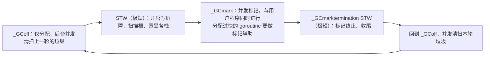

# 13.3 触发频率及其调步算法

GC 该多久跑一次？跑得太勤，CPU 都耗在回收上;跑得太懒，堆涨得过大、甚至撑爆内存。在这两难
之间找平衡的，是 GC 的**调步器**（pacer）。它要保证：在堆涨到目标大小**之前**，并发标记能恰好
完成,既不提前太多浪费 CPU，也不拖到撑爆。这一节讲清 GC 的周期、触发与调步。

## 13.3.1 一次 GC 周期

Go 的 GC 是并发的，一轮周期在几个阶段间流转，两次 stop-the-world 都极短：

绝大部分工作（标记、清扫）都与用户程序**并发**进行，只有两小段 STW（开启屏障/扫根、标记终止），
得益于混合写屏障（[13.2](./barrier.md)）各自只需亚毫秒。

## 13.3.2 GOGC：目标由你设定

触发的目标由环境变量 **`GOGC`**（默认 **100**）控制。`GOGC=100` 意为：当堆增长到"上一轮 GC
后存活堆大小的 **2 倍**"时，触发下一轮。调大 `GOGC`（如 200）让堆涨更多才回收,GC 更少、
吞吐更高，但内存占用更大;调小则反之。这是一个直白的**内存换 CPU**的旋钮。Go 1.19 还加了
**`GOMEMLIMIT`** 软内存上限（[12.7](../ch12alloc/pagealloc.md)）：给一个内存硬目标，GC 会在逼近
它时更激进地回收，即便还没到 `GOGC` 的点,这解决了"容器有固定内存配额、不想被 OOM"的实际
痛点。二者配合，覆盖了从"纯按比例"到"有硬上限"的调节需求。

## 13.3.3 调步：让标记赶在堆涨满前完成

难点在于：标记是并发的，期间用户程序还在**继续分配**。若分配太快、标记太慢，堆可能在标记完成
前就涨过了目标。调步器的工作，就是动态估算"还要标记多少、用户分配有多快"，据此决定**何时启动**
下一轮 GC（要留出足够提前量），以及在标记落后时让分配的 goroutine 做**标记辅助**
（mark assist，[13.4](./mark.md)）,谁分配得多，谁就得帮忙标记，从而把"分配"与"标记"的速度
绑在一起，防止分配甩开标记。调步器的算法几经迭代（Go 1.5 初版、Go 1.18 重写为更简洁鲁棒的
比例式控制器），核心目标始终是：在维持 `GOGC` 目标的同时，让 GC 的 CPU 占用稳定在约 25%
左右、并让标记可靠地赶在堆涨满前收尾。

调步器是 GC 里最精微的部分,它是一个反馈控制系统，输入是堆大小与分配速率（[12.8](../ch12alloc/mstats.md)
的统计），输出是触发时机与辅助力度。理解它，就理解了为什么 Go 程序的内存曲线呈锯齿状、
为什么"分配密集"会拖慢业务 goroutine（它们在做标记辅助）,以及 `GOGC`/`GOMEMLIMIT` 这两个
旋钮到底在调节这个反馈环的什么。

## 延伸阅读的文献

1. Austin Clements. *Go 1.5 concurrent garbage collector pacing.*
   https://golang.org/s/go15gcpacing
2. Michael Knyszek. *Proposal: Smarter scavenging / GC pacer redesign (Go 1.18).*
   https://go.googlesource.com/proposal/+/master/design/44167-gc-pacer-redesign.md
3. The Go Authors. *A Guide to the Go Garbage Collector.* https://go.dev/doc/gc-guide
4. The Go Authors. *runtime/mgcpacer.go.*
   https://github.com/golang/go/blob/master/src/runtime/mgcpacer.go

## 许可

&copy; 2018-2026 The [golang.design](https://golang.design) Initiative Authors. Licensed under [CC-BY-NC-ND 4.0](https://creativecommons.org/licenses/by-nc-nd/4.0/).
