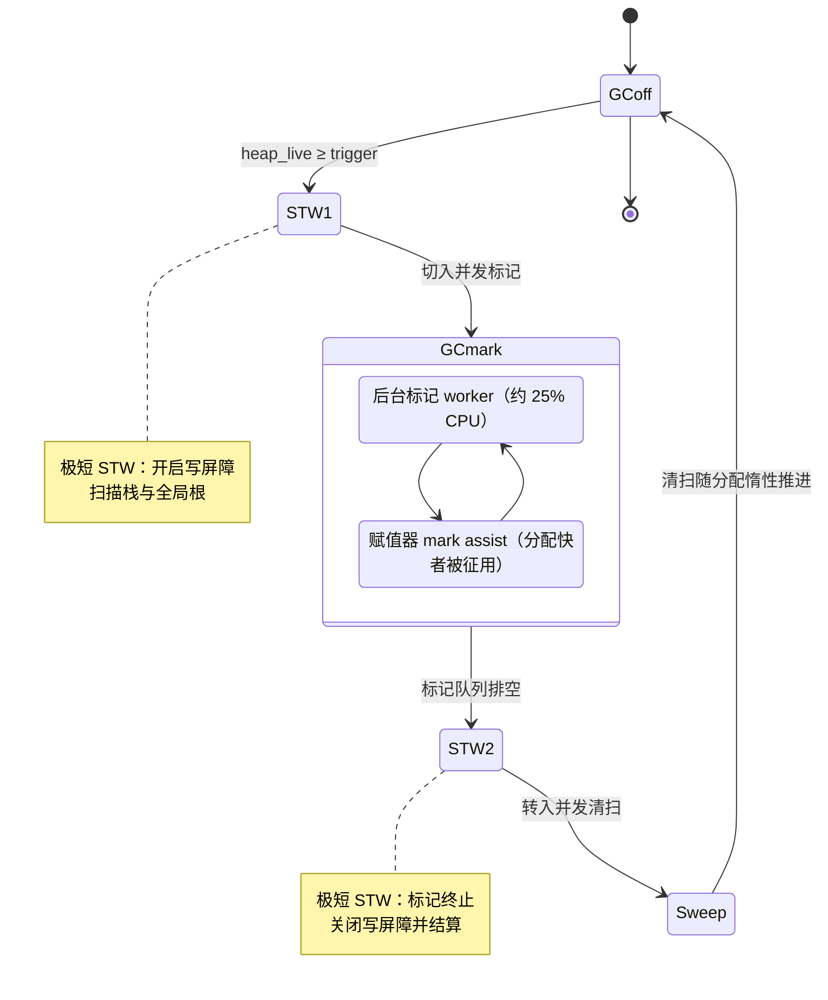

# 13.3 触发频率及其调步算法

[13.2](./barrier.md) 交代了写屏障如何让并发标记与赋值器（mutator）共处，保证「正在回收的同时
还能继续分配」。这就留下了一个时间问题：什么时候该启动下一轮 GC？太晚，堆已经涨到不可接受的
体积；太早，回收频繁地白白烧掉 CPU。回答这个问题的，是 Go 从 1.5 起引入、1.18 重新设计的
**调步器**（pacer）。本节先把一轮 GC 的完整时序摆出来，再讲清调步器是一个什么样的反馈控制器：
它要在赋值器持续分配的过程中，赶在堆触到目标之前完成标记。

## 13.3.1 一轮 GC 的时序

把一轮 GC 拆开看，它在 `_GCoff`、`_GCmark`、`_GCmarktermination` 三个阶段间流转，其间夹着
两段极短的 STW（stop-the-world）：



整轮的脉络是这样：堆上的存活字节 `heap_live` 涨到调步器算出的触发线 `trigger`，第一段 STW
开启写屏障并扫描根（goroutine 栈与全局变量），随即放开世界进入并发标记。标记阶段，后台
worker 占用约 25% 的 `GOMAXPROCS` 持续标记，分配过快的 goroutine 还会被征去做 mark assist
（[13.3.5](#1335-赋值器协助-mark-assist)）。标记队列排空后进入第二段 STW 做标记终止，关闭
写屏障并结算本轮统计量，之后转入并发清扫，清扫工作随后续分配惰性摊销（[13.5](./sweep.md)）。
两段 STW 都被压到亚毫秒量级，绝大部分回收工作与赋值器并发进行，这正是 Go 低延迟 GC 的形态。

调步器要做的决策只有一个，但牵一发而动全身：**触发线 `trigger` 设在哪里**。设得低，标记从容
完成，但堆还没怎么涨就开工，GC 太频繁；设得高，逼近目标才启动，赶不及标记完，堆就会冲过
目标。下面几节依次讲清目标怎么定（GOGC、GOMEMLIMIT）、触发线怎么算（反馈控制器）、以及万一
算偏了如何兜底（mark assist）。

## 13.3.2 GOGC：拿内存换 CPU 的旋钮

调步器的目标堆大小由环境变量 `GOGC`（或 `runtime/debug.SetGCPercent`）给定，其语义是一个
增长率：设上一轮标记结束时存活的堆为 $H_m$，`GOGC` 为 $p$，则本轮的目标堆大小为

$$
H_{goal} = H_m \left( 1 + \frac{p}{100} \right)
$$

默认 `GOGC=100`，即目标是上轮存活量的两倍，堆增长一倍就回收一轮。`GOGC=200` 允许涨到三倍，
GC 更少但常驻内存更大；`GOGC=50` 把堆压在 1.5 倍，更省内存但 GC 更勤。它本质是**拿内存换
CPU 的旋钮**：调大省 CPU 费内存，调小省内存费 CPU，没有免费的方向。`GOGC=off` 则彻底关掉
基于堆增长的触发。

更精确地说，自 1.18 起目标不只算堆，还把根的规模计入，与存活堆一同按 $p/100$ 放大：

$$
H_{goal} = H_m + (H_m + S_{stack} + S_{globals}) \cdot \frac{p}{100}
$$

其中 $S_{stack}$、$S_{globals}$ 是上轮扫描到的栈与全局变量字节数。把根算进来，是因为标记的
总工作量正比于「存活堆 + 根」，旧版只按堆算会在根很大时把节奏带偏，这是 1.18 重设计修正的
一处偏差（见 [13.3.7](#1337-演进从-15-的初版到-18-的重新设计)）。

## 13.3.3 GOMEMLIMIT：面向容器配额的软上限

`GOGC` 只管增长率，不设绝对上限。一个常驻存活量本就很大的服务，`GOGC=100` 会让峰值堆翻倍，
在内存受限的容器里足以触发 OOM。Go 1.19 为此引入 `GOMEMLIMIT`（`debug.SetMemoryLimit`），
一个**软内存上限**：调步器在算出基于 `GOGC` 的目标之后，再算一个基于上限的目标，取二者较小者。

软上限的算法不是「堆达到 limit 就 GC」那么直白，因为 limit 约束的是运行时映射的全部内存，
而堆目标只针对堆。运行时要从 limit 里扣掉非堆开销（栈、元数据、空闲但未归还的页等），剩下
的才是堆可用的额度，并留一截缓冲（至少 1 MiB 或额度的 3%）防止贴边：

$$
H_{goal}^{limit} = \text{memoryLimit} - \text{nonHeapOverhead} - \text{headroom}
$$

`GOMEMLIMIT` 的典型用法是把它设为容器配额的某个比例（如 90%），同时保留 `GOGC=100`：常态下
按 `GOGC` 节奏走，逼近上限时调步器自动收紧、加密 GC 把堆压住，相当于给内存上了一道保险。
但它是「软」上限，这是有意为之：真到了存活量本身超过 limit 的地步，运行时不会无止境地榨
CPU 去维持一个不可能的目标（那只会陷入 GC 抖动），而是允许越界，把 OOM 的决定权交还给运维。
若把 `GOGC=off` 与 `GOMEMLIMIT` 同设，便得到「只在逼近上限时才回收」的纯上限驱动模式。

## 13.3.4 调步器：一个反馈控制器

定下目标 $H_{goal}$，难点在于触发线。GC 不是瞬时的：从触发到标记完成需要一段时间，这段时间
里赋值器还在不停分配，堆继续往上涨。若等到 `heap_live` 触到 $H_{goal}$ 才开工，标记结束时堆
早已冲过目标。所以触发线必须**提前**，留出标记所需的「提前量」：

```
       trigger          H_goal
heap     │                 │
 live ───┼──── 标记进行中 ───┼──→
         ↑ 启动标记       ↑ 期望此刻刚好标记完
```

提前多少，取决于两件事的赛跑：标记还要扫多少（剩余扫描工作）、赋值器涨得多快（分配速率）。
调步器把它建成一个反馈控制器：它估计「以 25% CPU 做后台标记的吞吐」与「赋值器以 CPU 时间计
的分配速率」之比，由此反推出一个触发堆大小，使得标记恰好在堆触到目标的那一刻完成、且全程
无需任何 mark assist。换言之，**控制器的理想状态是 GC CPU 占用稳定在 25%、assist 为零**。

1.18 重设计前，这是一个带历史项的软控制器，逐周期用「上轮目标与实际堆的偏差」修正下一轮的
触发率，公式里夹着 0.95、0.6 等经验上下界与多个状态量，行为难以分析。1.18 后，它被换成一个
直接的**比例控制器**：每轮根据当下的扫描吞吐与分配速率重新算出触发线，不再背负长长的历史
状态。下面是裁剪后的速写，只留与控制相关的字段：

```go
// gcControllerState：调步器的状态（速写，保留与控制相关的字段）
type gcControllerState struct {
    gcPercent   atomic.Int32 // GOGC：目标增长率
    memoryLimit atomic.Int64 // GOMEMLIMIT：软内存上限

    heapMarked uint64        // 上轮标记结束时的存活堆 H_m
    heapLive   atomic.Uint64 // GC 视角的当前存活字节；达到触发线即启动标记

    gcPercentHeapGoal atomic.Uint64 // 由 GOGC 算出的本轮目标堆 H_goal
    triggered         uint64        // 本轮实际触发时的堆大小（仅标记期间有效）

    // 反馈核心：cons/mark 比率，即「赋值器分配速率 / GC 扫描吞吐」，
    // 二者均按 CPU 时间计。每轮标记终止时由 endCycle 更新，用于回算下一轮触发线
    consMark float64

    heapScanWork atomic.Int64 // 本轮已完成的堆扫描工作（字节）
    bgScanCredit atomic.Int64 // 后台标记多做的扫描信用，供 assist 支取
}
```

控制器在每轮标记终止时算出 `consMark` 并 `commit`，据此重定下一轮的目标与触发线；标记进行中
则不断调用 `revise`，根据实时进度调整 assist 比率。触发线被夹在合理区间内：下界要给并发清扫
留出增长空间（清扫发生在 `heapLive` 到触发线这段堆增长里），上界不超过目标，免得 assist 比率
冲到无穷。这里的 `consMark`（consumption/mark）正是 [13.3.4](#1334-调步器一个反馈控制器) 那个
「分配速率与扫描吞吐之比」的落地：它一旦估准，触发线就能算对。

为什么这样一个比例控制器会收敛？给一个直觉性的论证。设上一轮观察到的 cons/mark 之比为 $r$
（分配速率比扫描吞吐，$r$ 越大说明赋值器相对越凶），控制器据此把触发线设在距目标
$\Delta = (H_{goal} - \text{trigger})$ 的位置，使得在赋值器分配满 $\Delta$ 字节的时间里，后台
标记恰好扫完全部存活对象。若赋值器这轮跑得比上轮快，实际堆会略冲过触发线对应的预期、assist
被触发，控制器在下一轮的 `commit` 里观察到偏差并据此抬高 $r$ 的估计、把触发线前移留出更多
提前量；反之若跑得慢，则后移。只要赋值器的行为不是每轮都剧烈突变，这个负反馈就把系统拉向
「assist 趋零、CPU 占用趋于 25%」的不动点。1.18 之所以能用如此简单的形式，正是因为它把目标
和输入都定义得足够干净（堆 + 根、CPU 时间计的速率），偏差有明确含义。

放到别家运行时看，调步的思路各有取舍。JVM 的 G1 收集器走的是「暂停时间目标」路线，用户给定
期望的停顿上限，回收器据此挑选每次回收的 region 数量（增量式回收）；Go 则反过来，固定一个堆
增长目标，让停顿自然落在亚毫秒，把吞吐与延迟的权衡交给 `GOGC`。这两条路径反映了不同侧重：
G1 优先可预测的停顿，Go 优先简单可控的内存上界与极低的停顿。

## 13.3.5 赋值器协助（mark assist）

控制器再准，也只是估计。赋值器的分配速率可能突然飙升，标记吞吐可能因为根太大而不及预期，
触发线一旦算偏，标记就有赶不上分配、堆冲过目标的风险。Go 用一个反馈机制兜底：**谁分配得快，
谁就被征去标记**，这就是 mark assist。这里只从调步的视角讲它如何闭合反馈，债务与扫描配合的
具体实现细节留待 [13.4](./mark.md)。

机制是一笔扫描信用的账。每个 goroutine 分配内存时，会按 assist 比率背上一笔「扫描债」：分配
越多，欠的扫描工作越多。它必须用「亲手做的标记工作」来偿还这笔债，债没还清就不让继续分配
（被 park 住，转去做标记）。assist 比率由控制器维持，正比于「目标与触发的距离 / 剩余扫描
工作」，堆离目标越近、剩余工作越多，比率越高，赋值器被征用得越狠。后台 worker 多做的标记会
存成一笔公共信用，赋值器可优先支取，避免人人都被罚做工。

这一机制的精妙在于它**把分配速率与标记速率硬绑在一起**：赋值器分配越快，被拉去标记得越多，
分配因此被自然限速，标记则获得额外人手。它构成调步器的负反馈闭环，触发线估准了，assist 几乎
不发生，GC 维持在 25% CPU 的理想点；估偏了，assist 自动加码把堆拽回目标之内。代价是分配快的
goroutine 要替 GC 打工，付出额外延迟。这是一个有意的取舍：与其让堆失控、最终被迫 STW 或 OOM，
不如让制造垃圾最多的那部分代码承担回收成本，把压力按来源分摊回去。

## 13.3.6 把调步看在眼里：gctrace

调步器的工作不必停留在公式上，运行时通过 `GODEBUG=gctrace=1` 把每一轮的节奏直接打印出来。
跑一段持续分配的程序，会看到形如下面的行：

```
gc 1 @0.001s 3%: 0.016+0.23+0.019 ms clock, ... 4->5->1 MB, 5 MB goal, 12 P
```

逐项对照本节的概念：`gc 1` 是第一轮；`@0.001s` 是程序启动到此刻的时间；`3%` 是 GC 累计占用
的 CPU，可与 25% 的标记目标对照（远低于它，说明这轮负载下后台 worker 足够、几乎没触发
assist）。三段 `clock` 时间分别对应标记开始的 STW、并发标记、标记终止的 STW，两端的 STW 都在
微秒到亚毫秒量级。最关键的是 `4->5->1 MB, 5 MB goal`：标记**开始**时堆为 4 MB（即触发线），
标记**结束**时涨到 5 MB（这 1 MB 就是并发期间赋值器分配出来的、控制器要预留的提前量），本轮
存活量为 1 MB；而 `5 MB goal` 是这一轮的目标堆 $H_{goal}$。可见实际峰值 5 MB 恰好落在目标上,
触发线提前量算得准，赋值器没冲过目标。若想进一步看控制器内部的输入输出（$H_m$、$h_t$、各 CPU
使用率等），再叠加 `GODEBUG=gcpacertrace=1` 即可。这组输出是验证调步直觉最直接的窗口。

## 13.3.7 演进：从 1.5 的初版到 1.18 的重新设计

调步器的形态随版本几经调整：

- **Go 1.5**：与并发 GC 一同引入首版调步器（Clements 的 go15gcpacing 设计文档）。它是一个带
  历史项的软控制器，包含扫描工作估计器、assist 调度、触发率控制器等几部分，靠逐周期反馈逼近
  25% 的 CPU 目标。
- **Go 1.10 / 1.14**：给触发率加了经验上下界（上界 $0.95\rho$、下界 $0.6$），缓解极端分配速率
  下的失稳，但也使行为更难解释。
- **Go 1.18**：Knyszek 主导重新设计（proposal 44167）。换成更简单、可分析的比例控制器；把根
  （栈、全局变量）的扫描量正式计入目标与节奏，修正旧版在大根场景下的偏差；并为后续 1.19 的
  `GOMEMLIMIT` 铺平了道路。
- **Go 1.19**：引入 `GOMEMLIMIT` 软内存上限，调步器在 `GOGC` 目标之外再算一个上限目标取较小
  者，使 GC 节奏能响应容器内存配额。

一条主线贯穿其中：从难以分析的多状态软控制器，走向「目标清晰、可解释、能响应外部约束」的
比例控制器。这也呼应了运行时演进的一贯取向，先让它跑得对，再让它可被推理。

## 延伸阅读的文献

1. Austin Clements. *Go 1.5 concurrent garbage collector pacing.* 2015.
   https://golang.org/s/go15gcpacing （初版调步器的设计文档，定义目标增长率与 assist 模型）
2. Michael Knyszek. *GC Pacer Redesign.* Go proposal 44167, 2021.
   https://github.com/golang/proposal/blob/master/design/44167-gc-pacer-redesign.md
   （1.18 比例控制器重设计，含把根计入节奏的推导）
3. Michael Knyszek. *Soft memory limit.* Go proposal 48409, 2022.
   https://github.com/golang/proposal/blob/master/design/48409-soft-memory-limit.md
   （`GOMEMLIMIT` 的设计与软上限语义）
4. The Go Authors. *A Guide to the Go Garbage Collector.*
   https://go.dev/doc/gc-guide （GOGC、GOMEMLIMIT 与调步直觉的官方指南）
5. The Go Authors. *runtime/mgcpacer.go.*
   https://github.com/golang/go/blob/master/src/runtime/mgcpacer.go
   （`gcControllerState`、`commit`、`revise`、`trigger`、`heapGoalInternal` 的实现）
6. The Go Authors. *Package runtime/debug: SetGCPercent, SetMemoryLimit.*
   https://pkg.go.dev/runtime/debug
7. David Detlefs, Christine Flood, Steve Heller, Tony Printezis. *Garbage-First Garbage
   Collection.* ISMM 2004. https://dl.acm.org/doi/10.1145/1029873.1029879
   （JVM G1 的暂停时间目标式调步，与 Go 的堆增长目标式调步对照）
8. 本书 [13.2 写屏障技术](./barrier.md)、[13.4 扫描标记与标记辅助](./mark.md)、
   [13.5 清扫与位图](./sweep.md)。
