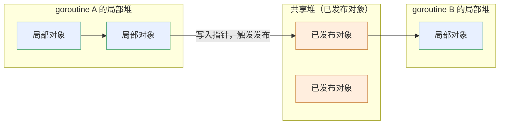

# 13.9 请求假设与事务制导回收

[13.8](./generational.md) 讲过 Go 没有采用分代假设。读者或许会接着问：Go 有没有试过别的
「对象寿命假设」？有。这一节讲的是 Go 团队认真做过、最终放弃的一个实验，**事务制导回收**
（Request-Oriented Collector, ROC）。讲它，不是因为它进了 Go，而是因为一个被放弃的设计，
往往比成功的设计更能照出约束所在。ROC 像一道做错了的证明题：错处恰好标出了 Go GC 设计空间
里那条不能逾越的边界。

## 13.9.1 请求假设

服务端程序有一条很强的结构特征：工作以**请求**为单位。一个请求进来，分配一批对象处理它，
请求一结束，这批对象绝大多数就该死了。Rick Hudson 与 Austin Clements 在 2016 年把这条观察
写成了**请求假设**（request hypothesis）：

> 由一个请求创建的对象，倾向于在该请求被处理完成时一同死亡。

它与分代假设（[13.8](./generational.md)）说的不是一回事。分代假设讲的是「年轻对象易死」，
是一条关于**年龄**的统计规律；请求假设讲的是「同一请求的对象同生共死」，是一条关于**归属**
的结构规律。对服务端来说，后者更贴合现实，也更有力：它不只说某批对象会死，还指明了它们
**何时**死、**成批**死。云上的典型 goroutine 正是这种形状，收一条消息、反序列化、算一遍、
序列化、把结果丢回 channel 或 socket，然后退出：

```go
// 每请求一个 goroutine：分配的对象多数随 goroutine 退出而死
func handle(conn net.Conn) {
	req := decode(conn)        // 这些中间对象
	result := compute(req)     // 几乎都只在本 goroutine 内活动
	conn.Write(encode(result)) // 函数返回后即成垃圾
}
```

若能利用这条规律，回收就能从「全局扫描找垃圾」退化成「请求一结束，把它的那批对象整批还
回去」,既快，又不必停下整个程序做全局 GC。问题只剩一个：怎么知道哪些对象「只属于这个
请求」？

## 13.9.2 ROC 的设计：局部对象与已发布对象

ROC 的核心是把堆里的对象分成两类。一个对象自分配起是**局部的**（local），只有创建它的
goroutine 能够触及；一旦它被写进某个能被别的 goroutine 看到的位置（全局变量、共享堆上的
对象、发往 channel 的消息），它就变成**已发布的**（published）。这条「局部 / 已发布」的
划分是 ROC 的全部支点：

- 一个 goroutine 走到生命尽头时，它创建的、**始终未被发布**的对象，此刻必然不可达,没有
  别的 goroutine 能引用它们。于是不必扫描、不必等待下一轮全局 GC，**直接整批回收**即可。
  ROC 在实现上把它做成一个极轻的动作：goroutine 退出时，把清扫指针（sweep pointer）拨回到
  它开始时的位置，那段区间里没有置上标记位的对象就地释放。
- 已发布的对象则交还给常规的全局并发标记清扫（[13.3](./mark.md)–[13.5](./sweep.md)）打理,
  它们可能被任意 goroutine 引用，只能用全局可达性来判定生死。



这套设计很美。请求结束，它的内存就干净利落地还回去，多数回收工作根本不进全局 GC 的视野，
吞吐与可扩展性都该随之改善。它与 Erlang/BEAM 的**每进程堆**（per-process heap）是同一种
直觉：以「工作单元」为粒度回收，单元一结束就整体释放。差别在于 Erlang 语言本身禁止共享
可变堆,进程间只能传递**拷贝**的消息，因此「这个对象只属于这个进程」是语言层面免费成立的
前提。Go 允许 goroutine 之间共享可变对象，这条前提就不再免费，必须由运行时在执行期去
**验证**。ROC 的全部代价，正出在这道验证上。

把视野再放宽一点，ROC 属于一个更大的家族,**局部回收**（local / thread-local collection）。
这条思路在文献里由来已久：早期的「ML 区域推断」、Doligez-Leroy 为 Concurrent Caml Light 设计的
**每线程小堆 + 共享主堆**、以及后来 JVM 上的线程局部分配缓冲（TLAB）与各类逃逸优化，
都是同一种企图,给每个执行单元一块只属于它的内存，单元结束就便宜地整体回收，把全局回收的
负担压到「真正被共享的那一小撮对象」上。它们成败的分水岭，几乎总落在同一个问题上：**判定
「某对象有没有被共享」这件事，要在什么时机、以多大代价完成。** Erlang 把代价前移到语言语义
（禁止共享、消息拷贝），ML 系把它交给类型与区域的静态推断，而 ROC 选择了执行期动态判定。
三条路里，动态判定最精确，却也最贵,因为它必须为精确性在每一次写入上持续缴费。

## 13.9.3 验证「未发布」的代价：写屏障税

要维持「局部 / 已发布」的划分，ROC 必须在对象被共享出去的那一刻把它标记为已发布。而对象
被共享，发生在一次**指针写入**里：把一个局部对象的指针，写进了一个已发布对象（或全局变量）。
于是 ROC 需要一个**写屏障**（[13.2](./barrier.md)），在每次指针写入时做检查。这道屏障的代价
分两层：

```go
// ROC 写屏障的逻辑（示意）：每次指针写入都要过这一关
func rocWriteBarrier(slot *unsafe.Pointer, ptr unsafe.Pointer) {
	if isPublished(slot) && isLocal(ptr) {
		// 把一个局部对象写进了已发布的位置：它即将「被发布」
		publish(ptr) // 不止标记 ptr 自己……
	}
	*slot = ptr
}

// publish 必须递归：从 ptr 可达的所有局部对象都要一并发布
func publish(p unsafe.Pointer) {
	for _, q := range pointersFrom(p) {
		if isLocal(q) {
			markPublished(q)
			publish(q) // 传递闭包，可能踏遍一大片对象图
		}
	}
}
```

第一层是**常数开销**：这道检查**始终开启**，压在程序里最高频的操作,指针写,之上。无论一次
写入是否真的导致发布，每一次写都得先过这道判断。第二层是**发布时的传递闭包**：一旦判定某个
局部对象要被发布，从它可达的所有局部对象都得**跟着发布**，这是一次沿指针图的传递遍历，按
Hudson 的说法，「会引起大量缓存未命中」（many cache misses）。

要看清这笔税为何重，不妨做一次粗略的量纲估算。设程序在一次回收周期内执行 $W$ 次指针写、
回收掉 $R$ 字节内存；ROC 的净收益约为

$$
\text{gain} \;\approx\; \underbrace{c_{\text{free}}\cdot R}_{\text{省下的回收工作}} \;-\; \underbrace{c_{\text{wb}}\cdot W}_{\text{写屏障常数税}} \;-\; \underbrace{c_{\text{pub}}\cdot P}_{\text{发布时的传递遍历}}
$$

其中 $c_{\text{wb}}$ 是每次写多出的那几条判断指令的成本，$P$ 是被传递发布的对象数。问题在于
$W$ 几乎总是巨大的：指针写是程序里最稠密的操作之一，于是 $c_{\text{wb}}\cdot W$ 这一项即便
单价极低，乘起来也是一笔常驻支出，与回收收益 $c_{\text{free}}\cdot R$ 无关地白白扣掉。只有当
程序「写得少、死得多」时收益才转正,而真实程序，尤其是指针密集的程序，远不满足这个条件。

把这两层叠加，写屏障就成了一笔重税。Go 团队的实测结论与这道估算一致：在偏向共享少的
端到端 RPC 基准上，ROC 确实**扩展得不错**（$R$ 大而 $W/R$ 小，收益项占优）；但一旦换到指针
写密集的程序（$W$ 暴涨），开销就盖过了收益。最刺眼的是编译器自身这个基准，慢了**百分之
三四十乃至五十以上**。Go 以编译速度快自豪，这样的退化无法
接受。Hudson 在 ISMM 主题演讲里给出的总评是：这些数字「一律地糟」（uniformly bad），
而且当时的测试机只有 4 至 12 个硬件线程，再好的扩展性也填不平这笔「写屏障税」(the write
barrier tax)。结论是一句盖棺定论的话：**ROC 是一桩赔本买卖**（ROC was a losing proposition）。

这里要把一条容易混淆的界线划清楚。ROC 在执行期判定「这个对象有没有被发布」，与编译器的
**逃逸分析**（[13.8](./generational.md)、[15 编译器](../../part5toolchain/ch15compile)）在编译期
判定「这个对象会不会逃逸」，是在回答相似的问题，却是两个不同时机、不同手段的机制。逃逸分析
是**静态**的，一次编译定生死，运行期零成本，但只能保守地处理它能证明的情形；ROC 的发布判定
是**动态**的，能精确捕捉运行期真实的共享，代价是把成本摊到每一次指针写上。ROC 失败的根因，
正是这份动态精确性的运行期标价太高。

## 13.9.4 失败划出的硬约束

ROC 没进 Go，但这次失败很有价值,它确认了一条 Go GC 设计的**硬约束**：

> 任何想靠「加重写屏障」来换取回收效率的方案，都必须先过「写屏障开销」这一关,而这一关
> 极其严苛，因为写屏障压在最高频的操作（指针写）上，它的常数成本会被乘以海量的写入次数。

这条约束反过来印证了 Go 现行**混合写屏障**（[13.2](./barrier.md)）为何要那么斤斤计较地压低
自身开销,Dijkstra 与 Yuasa 两种屏障的混合、删除栈重扫的取舍，都是在同一条成本线上反复
权衡的结果。混合写屏障之所以被接受，恰恰因为它把写路径上的额外动作压到了「一两条无分支
指令」的量级；ROC 想往写屏障里再塞进「发布判定 + 传递发布」，等于在这条已经绷紧的成本线上
继续加码，自然崩断。换个角度看，这也解释了为什么前一节（[13.8](./generational.md)）里分代
回收所需的「跨代指针记忆集」在 Go 里同样不讨好：它和 ROC 一样，要靠写屏障在执行期记录一类
指针写，而这正是 Go 最不愿付费的地方。两次「此路不通」，撞的是同一堵墙。一个被放弃的实验，就这样划定了设计空间的边界：它告诉后来者，「靠对象
寿命的结构性假设来抄近路」这条路，在 Go 里会被写屏障成本卡住,除非你能找到一种**不需要在
写路径上付费**的办法去利用同一种结构。

ROC 的精神,利用请求与局部性结构来改善回收,并没有随它一起消失。go1.25/1.26 的
**Green Tea GC**（[13.11](./history.md)）从一个相关却不同的角度再次出发：它不再去验证「谁
属于谁」，而是改善标记与清扫时的**内存局部性**，把扫描组织得更顺着缓存与大页的纹理走，
从而在不动写屏障的前提下拿回一部分本属于「局部性」的红利。这正是工程演化的常态：一条路
被成本卡死，就换一个不必在那个收费站缴费的角度，重新逼近同一个目标。

## 延伸阅读的文献

1. Rick Hudson, Austin Clements. *Request Oriented Collector (ROC) Algorithm.* 2016.
   设计文档（短链 `golang.org/s/gctoc`）：
   https://docs.google.com/document/d/1gCsFxXamW8RRvOe5hECz98Ftk-tcRRJcDFANj2VwCB0/view
   （局部 / 已发布对象、发布写屏障与按 goroutine 退出整批回收的原始设计）.
2. Rick Hudson. *Getting to Go: The Journey of Go's GC.* ISMM 2018 主题演讲.
   https://go.dev/blog/ismmkeynote （ROC 的实验结果、写屏障税与放弃缘由的一手记述）.
3. Joe Armstrong. *Making reliable distributed systems in the presence of software errors.*
   PhD thesis, KTH, 2003. （Erlang/BEAM 每进程堆与拷贝消息语义，请求假设的语言层对照）.
4. Damien Doligez, Xavier Leroy. *A concurrent, generational garbage collector for a
   multithreaded implementation of ML.* POPL 1993. https://doi.org/10.1145/158511.158611
   （每线程小堆 + 共享主堆的局部回收先例，与 ROC 同源的设计直觉）.
5. David Chase 等. *runtime: ROC write barrier 相关实现与讨论.*
   https://github.com/golang/go/issues （ROC 实验分支的代码与基准讨论）.
6. 本书 [13.2 写屏障技术](./barrier.md)、[13.8 分代假设与代际回收](./generational.md)、
   [13.11 过去、现在与未来](./history.md).
