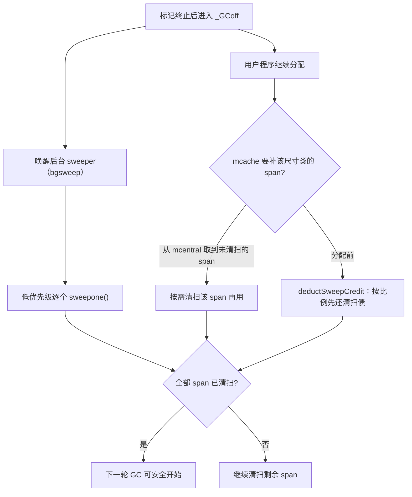

# 13.5 清扫与位图

标记（[13.4](./mark.md)）一旦结束，仍为白色的对象就是不可达的垃圾。把它们占据的内存收回、
重新交给分配器，是回收的最后一步：**清扫**（sweep）。如果照搬教科书里「遍历堆、逐个释放死对象」
的写法，清扫的开销会与死对象的数量成正比，在一个动辄数百万对象的堆上，这是一笔不小的账。Go 的
清扫绕开了这笔账，它有三处值得讲清楚的设计：清扫靠**位图翻转**而非逐对象处理完成；它与用户程序
**并发**进行，且**惰性**地把开销摊到分配路径上；以及它**不移动对象**，因而接受碎片、放弃整理。
这三点都不是偶然，它们各自对应一处明确的工程取舍，本节逐一拆开。

## 13.5.1 清扫即位图翻转

回收的高效，根子在分配器的数据结构上。第 [12.2](../ch12alloc/component.md) 节讲过，每个 span
被切成同一尺寸类的等大槽位，并配两份位图：

- `allocBits`：哪些槽**已分配**，分配路径据此找空槽。
- `gcmarkBits`：本轮标记中哪些槽被置位，即**存活**，由标记阶段写入。

清扫一个 span，核心动作出奇地短，把标记位图**直接当作**新的分配位图：

```go
// mspan.sweep 的核心（src/runtime/mgcsweep.go，速写）
func (s *mspan) sweep(preserve bool) bool {
    // ……此前已处理 finalizer / weak / profile 等 special 记录……

    nalloc := uint16(s.countAlloc()) // gcmarkBits 中置位的槽数 = 存活数
    s.allocCount = nalloc
    s.freeindex = 0                  // 分配游标归零，下次从头扫空槽

    // 关键三行：标记位图翻身成为分配位图
    s.allocBits = s.gcmarkBits           // 存活的继续「在用」，未标记的就此「空闲」
    s.gcmarkBits = newMarkBits(s.nelems) // 备一份清零的标记位图，留给下一轮 GC
    s.refillAllocCache(0)                // 重建 allocCache 位扫描缓存（见 12.2）

    // ……根据存活数决定 span 的去向，见 13.5.3……
}
```

翻转之后，被标记的槽在新 `allocBits` 里仍是 1，继续算「在用」；没被标记的槽在新位图里是 0，
就此变成「空闲」，下次分配直接覆写。死对象既不需要被找出来，也不需要被逐个清掉。源码注释把
这种状态说得很准：一个未标记又未被重新分配的槽，处境「就像挂在自由表上一样」（analogous to
being on a freelist）。这正是本节标题里「免清扫」（sweep-free）的含义,死对象无需任何显式
「清理」动作，它们的槽只是在位图翻转的一瞬间被重新解释为可分配。

把账算一下就能看出便宜在哪。逐对象释放是 $O(n_{\text{dead}})$;位图翻转把一个 span 的清扫压成
常数次指针赋值加一次 `countAlloc`，与死对象多少无关,清扫一个 span 的代价是 $O(1)$ 的指针操作
加 $O(n_{\text{slots}}/64)$ 的位计数（`countAlloc` 按 64 位字统计 1 的个数）。又一次，尺寸类的
规整把回收退化成了位操作,这与分配路径用 `allocCache` 做位扫描找空槽（[12.2](../ch12alloc/component.md)）
是同一套手法的两面。分配器与回收器共用这对位图，正是 [12.1](../ch12alloc/basic.md) 所说
「分配与 GC 共生」最具体的落点。

这里有一个容易被忽略的细节，值得点一句。新分配位图来自标记位图，那已分配但本轮**未被标记**
的槽呢？源码注释解释得很清楚：一个槽若其 `allocBits` 索引大于等于 `freeindex` 且未被标记，说明
它「自上一轮 GC 起就一直没被分配出去」,本来就是空的，翻转后自然仍是空的，无需特别处理。换言之，
位图翻转同时正确处理了「这一轮死掉的对象」与「上一轮就空着的槽」，二者在新位图里都归于「空闲」，
一视同仁。

清扫并非只翻位图。在翻转之前，`sweep` 要先处理挂在死对象上的 **special 记录**:终结器
（`runtime.SetFinalizer`）、弱引用句柄、堆 profile 采样。若一个待释放对象登记了终结器，清扫会
把它**重新标记为存活**（`setMarkedNonAtomic`）并将终结器排入执行队列,这就是「设了终结器的
对象，回收要晚一轮」的由来：终结器要在对象「即将死去」时运行，运行它的前提是对象本身得多活一轮，
等下一次清扫才真正释放。弱引用句柄则在终结之前被清零，与 `weak` 包的语义对齐。这些是位图翻转
之外，清扫必须照管的语义细节，但它们不改变主干：清扫的主体仍是一次 $O(1)$ 的位图易主。

## 13.5.2 并发且惰性

清扫与用户程序**并发**进行。标记终止后，GC 进入 `_GCoff` 阶段，写屏障关闭，一个后台
sweeper（`bgsweep`）被唤醒，在普通 Goroutine 优先级下慢慢推进，不占任何 STW 时间
（节奏见 [13.3](./pacing.md)）。但若只靠后台 sweeper，清扫与下一轮分配之间会赛跑：万一分配跑
得太快、把还没清扫的 span 都要走了怎么办？

Go 的答案是让清扫**惰性**且**按需**。它不在标记一结束就把所有 span 扫一遍，而是把清扫拆开，
摊到分配路径上：当某个 P 的 mcache 要为某尺寸类补一个 span 时，从 mcentral 取到的若是尚未清扫
的 span（按 `sweepgen` 清扫代区分，见 [12.2](../ch12alloc/component.md)），就**顺手把它清扫了
再用**。「分配即清扫一点」,谁要用到，谁就先扫干净。后台 sweeper 只是兜底，推进那些没有被分配
路径顺带扫掉的剩余 span，保证它们在下一轮 GC 开始前扫完。

光「按需」还不够，还要保证「按时」。设想堆里有大量 span 待扫，而程序只零星分配，后台 sweeper
又跑得慢,那么下一轮 GC 触发时清扫还没完，两轮 GC 就会重叠。为此运行时引入**比例清扫**
（proportional sweeping）：根据上一轮存活堆的大小，预估「每分配多少字节，就应当清扫多少页」，
存进 `sweepPagesPerByte`;分配大对象或补 span 之前，`deductSweepCredit` 会按这个比例先「还债」,
若清扫进度落后于分配进度，就地多扫几个 span 补上。

```go
// 分配前先还清扫债，确保清扫进度跟得上分配进度（速写）
func deductSweepCredit(spanBytes uintptr, callerSweepPages uintptr) {
    if mheap_.sweepPagesPerByte == 0 {
        return // 比例清扫已完成或被禁用
    }
    // 目标：已分配的字节，应当对应这么多已清扫的页
    pagesTarget := int64(mheap_.sweepPagesPerByte*float64(newHeapLive)) - int64(callerSweepPages)
    // 若清扫落后于分配，就地多扫几个 span 把债还上
    for pagesTarget > int64(mheap_.pagesSwept.Load()-sweptBasis) {
        if sweepone() == ^uintptr(0) {
            mheap_.sweepPagesPerByte = 0 // 全部扫完，比例清扫结束
            break
        }
        // ……
    }
}
```

这套机制把清扫的总开销，按比例摊到了「制造垃圾的速度」上：分配得越凶、要扫的越多，分配路径
就替后台多担一点清扫。它体现了 Go 运行时一贯的「把集中的开销摊薄到日常路径」的思路,与标记
辅助（mutator assist，让分配快的 Goroutine 帮忙标记，[13.4](./mark.md)）、写屏障把可达性维护
摊到每次指针写（[13.2](./barrier.md)）异曲同工。三者面对的都是同一个问题：如何不靠长时间停顿，
就让回收的进度始终追得上用户程序制造工作的速度。



并发清扫的正确性，靠 `sweepgen`（清扫代）这一全局计数器维系。它把「这个 span 现在处于什么清扫
状态」编码成 span 的 `sweepgen` 与堆的 `mheap_.sweepgen` 之间的差值。每轮 GC 把堆的清扫代
加 2，于是：

```text
设 sg = mheap_.sweepgen（每轮 GC +2）
  s.sweepgen == sg       本轮已清扫，可直接用
  s.sweepgen == sg-2     本轮尚待清扫
  s.sweepgen == sg-1     正被某个 sweeper 占用（认领后、扫完前的中间态）
```

后台 sweeper 与某个 P 的分配路径可能同时盯上同一个待扫 span，二者都想清扫它。运行时用一次
原子的 CAS 把 `sg-2` 改成 `sg-1` 来**认领**这个 span（`sweepLocker.tryAcquire`）：谁 CAS 成功
谁负责扫，另一方看到 `sg-1` 就知道有人在扫、跳过即可；扫完再原子地把它置为 `sg`。这保证一个
span 在一轮里只被清扫一次，且分配路径取到的 span 一定是「已扫」状态。把一个三态的小状态机编码
进一个计数器的奇偶与差值,这是并发运行时里反复出现的笔法，和 mcentral 用 `[2]spanSet` 按清扫
代分桶（[12.2](../ch12alloc/component.md)）正是配套的：分桶用清扫代决定 span 放进哪个集合，认领
用清扫代决定谁来扫。

## 13.5.3 span 的去向与「为何不整理碎片」

一个 span 扫完，去向取决于它还剩几个存活对象，这正是上一节 `mspan.sweep` 末尾省略掉的部分：

```go
// mspan.sweep 末尾：按存活数决定 span 去向（速写）
switch {
case nalloc == 0:
    // 整段 span 一个活对象都没有：把页整体还给堆
    mheap_.freeSpan(s)            // 归还页分配器，计入 reclaimCredit
case nalloc == s.nelems:
    // 全满，无空槽：挂回 mcentral 的「已扫·满」集合
    mheap_.central[spc].mcentral.fullSwept(sweepgen).push(s)
default:
    // 部分空：挂回 mcentral 的「已扫·有空槽」集合，等同尺寸类新对象来填
    mheap_.central[spc].mcentral.partialSwept(sweepgen).push(s)
}
```

`countAlloc` 数出来若**为零**,整段 span 一个活对象都没有,就把它整体还给上层：页归还 mheap 的
页分配器（[12.7](../ch12alloc/pagealloc.md)），计入 `reclaimCredit`，那些页随后可被重新切成
**任意**尺寸类的 span，甚至被清道夫（scavenger）归还操作系统。这是 span 唯一一次能跨出原尺寸类
的机会,空 span 退回堆，尺寸类的归属随之解除。若还剩存活对象，span 就只能留在原尺寸类，按是否
还有空槽挂回 mcentral 的已扫集合（注意是「已扫」那一个 `spanSet`，与 13.5.2 的清扫代分桶呼应），
等同尺寸类的新对象来填那些空出来的槽。

这里就触到了标记清扫式 GC 绕不开的代价：**碎片**。Go 的 GC **不移动对象**（[13.1](./basic.md)），
一个 span 内死对象腾出的空槽，只能由**同尺寸类**的新对象来填;若整个 span 没全空，它就还不能
整体归还，那些空槽是「占着 span 的死重」。理论上，把存活对象搬到一起、腾出连续空间的**整理**
（compaction）能消除这种碎片，但 Go 明确选择不做。原因有二：

其一，整理要**移动对象**，移动就得找出并更新所有指向被移动对象的指针。在一门有 `unsafe` 与
**cgo** 的语言里，这一条几乎是死结,外部 C 代码可能持有指向 Go 堆的裸指针，运行时无从枚举更无从
改写它们，移动会让这些指针失效。非移动式回收换来的，正是**指针地址在对象生命周期内恒定**这一
保证,cgo、`unsafe.Pointer`、以及把 Go 指针作为 map key 的代码，都依赖它。

其二，整理的收益被尺寸类分配先天地压住了。tcmalloc 式的尺寸类分配把碎片限制在「同尺寸类内的
空槽」这一可控范围（最坏内部碎片约 12.5%，[12.2](../ch12alloc/component.md)），不像通用 malloc
那样会产生任意大小的空洞。碎片本就有界，整理的边际收益就不足以抵其复杂度与对指针稳定的破坏。

于是这是一处清清楚楚的取舍：**放弃整理，换取指针稳定与实现简单，并用尺寸类把碎片代价压到可
接受的范围**。性能从不白来,Go 用「容忍有界碎片」买下了「与 cgo 共存」和「无需移动对象的并发
回收」。把两条路并排看，取舍的轮廓就清楚了：

| 维度 | 非移动（标记清扫，Go） | 移动（标记整理／复制，多数 JVM 收集器） |
| --- | --- | --- |
| 分配速度 | 取空槽（位扫描），较快 | 指针碰撞（bump pointer），最快 |
| 碎片 | 有，但被尺寸类限制在「同类空槽」内 | 几乎无（整理后连续） |
| 指针稳定 | 地址恒定，cgo／`unsafe` 安全 | 地址会变，须精确更新所有指针 |
| 实现复杂度 | 较低，无需移动与转发 | 较高，需对象转发、读屏障或 STW 搬移 |
| 与 cgo 裸指针 | 天然相容 | 天然冲突 |

别家给出过不同答案：分代复制式 GC（如 JVM 的多数收集器）以移动和整理换取分配指针碰撞的极速
分配和近乎无碎片，代价是必须精确枚举并更新所有指针，且与 cgo 式裸指针天然不合。Go 站在「系统
编程语言、要与 C 互操作」的位置上，指针稳定是几乎不能让的约束，于是非移动几乎是被需求逼出的
选择，而非性能上的疏忽。两条路没有高下，只是把复杂度安放在了不同的地方。

碎片这件事并未就此盖棺。go1.25 引入、go1.26 默认开启的 **Green Tea GC**（[13.11](./greentea.md)）正是朝
「以 span／页为粒度组织扫描与回收、改善内存局部性」的方向探索,它不是要引入对象移动，而是重新
安排扫描与回收的粒度，让缓存与 TLB 行为更友好。清扫与回收的设计仍在演进，本节描述的是 go1.26
的稳定形态，而非终点。

## 延伸阅读的文献

1. The Go Authors. *runtime/mgcsweep.go（`mspan.sweep` 的 `gcmarkBits`→`allocBits` 翻转、
   `sweepone`、`bgsweep`、`deductSweepCredit` 比例清扫）.*
   https://github.com/golang/go/blob/master/src/runtime/mgcsweep.go
   位图分配与免清扫的原始设计见 Austin Clements. *Proposal: Dense mark bits and sweep-free
   allocation.* Go issue #12800, 2015（go1.6 以直接位图分配取代空闲链表）.
   https://github.com/golang/go/issues/12800
2. The Go Authors. *runtime/mcentral.go（按 `sweepgen` 分桶的 `[2]spanSet` 与按需清扫）.*
   https://github.com/golang/go/blob/master/src/runtime/mcentral.go
3. Rick Hudson. *Getting to Go: The Journey of Go's Garbage Collector.* ISMM 2018 Keynote.
   https://go.dev/blog/ismmkeynote
4. Austin Clements, Rick Hudson. *Proposal: Concurrent garbage collection（并发清扫与
   sweepgen 的设计）.* https://go.googlesource.com/proposal/+/master/design/17503-eliminate-rescan.md
5. Richard Jones, Antony Hosking, Eliot Moss. *The Garbage Collection Handbook: The Art of
   Automatic Memory Management.* 2nd ed., CRC Press, 2023（第 2 章「标记清扫」与第 3 章
   「标记整理／移动 vs 非移动」的取舍）.
6. Sanjay Ghemawat, Paul Menage. *TCMalloc: Thread-Caching Malloc.*
   https://google.github.io/tcmalloc/design.html（尺寸类如何把碎片限制在可控范围）.
7. 本书 [12.1 设计原则](../ch12alloc/basic.md)、[12.2 组件](../ch12alloc/component.md)、
   [13.1 基本思想](./basic.md)、[13.4 标记](./mark.md)、[13.12 过去现在未来](./history.md).
