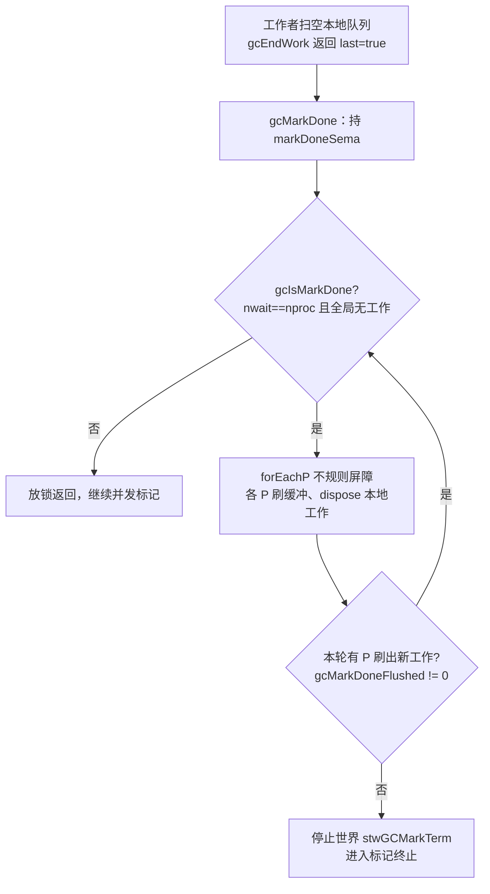
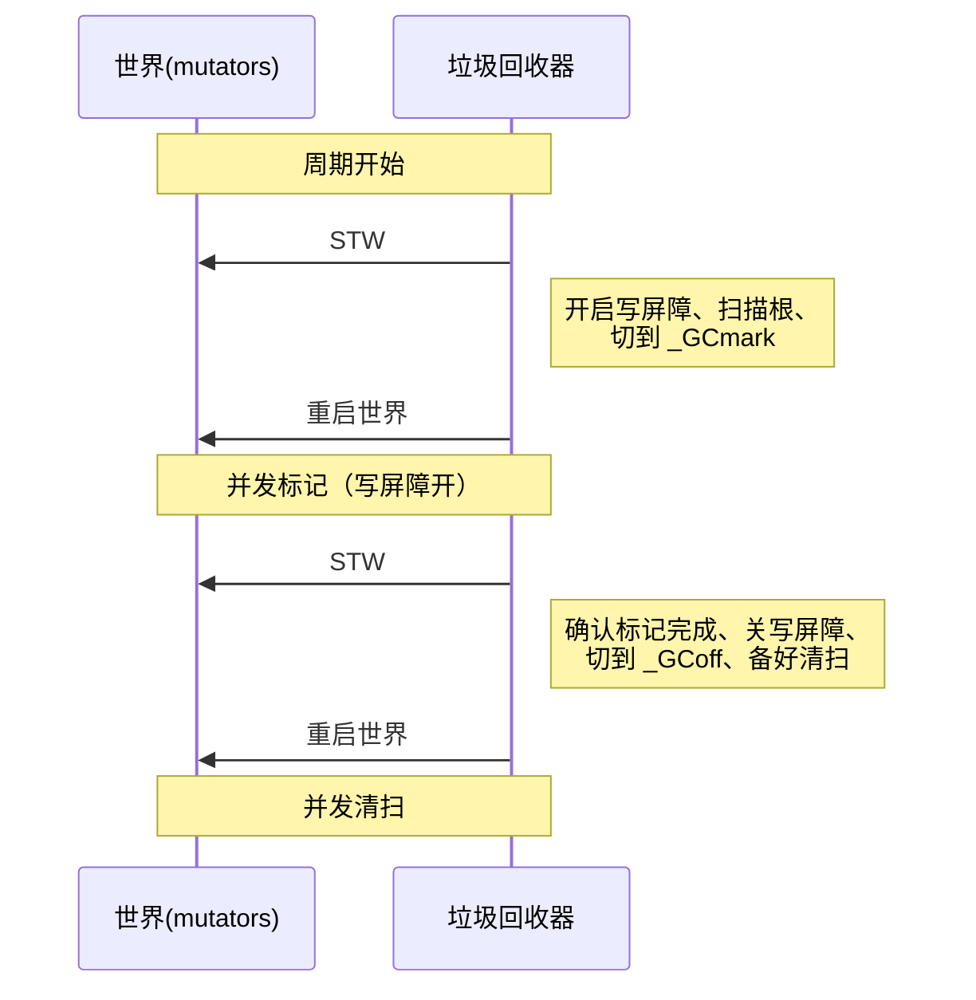

# 13.6 标记终止阶段

并发标记（[13.4](./mark.md)）有一个不平凡的收尾问题：如何**判定标记已经完成**。在单线程的
停顿式回收里，这个问题是平凡的，标记线程把灰色队列扫空，标记就结束了。可在并发世界里，
「我的本地队列空了」从来不等于「全局没有灰色对象了」。当一个工作协程刚把自己的队列扫空，
另一个 P 上的 mutator 可能正巧执行了一次指针写入，写屏障（[13.2](./barrier.md)）随之染灰了
一个新对象，把它塞进了那个 P 的本地缓存。判定终止，本质上是要在一个没有全局锁、工作分散
在各 P 本地缓存里的系统中，确认一个**全局性质**：灰色集合为空，且未来不会再产生灰色对象。

本节回答三件事：终止检测算法如何在无全局协调的前提下断定标记完成（`gcMarkDone`）；为此
仍需的那一次短暂 STW（`_GCmarktermination`）做了什么、为何能做到很短；以及为什么一个周期
里始终保留着首尾两次短 STW，运行时为何选择把每次 STW 的**工作量**压到与堆栈规模无关，
而不去追逐字面意义上的零停顿。

## 13.6.1 并发下「标记完成」为何难判定

把标记工作想象成一池灰色对象，分散存放在每个 P 的本地 `gcWork` 缓存与若干全局工作缓冲里。
工作协程不断从池中取出灰色对象、扫描、把新发现的指针染灰投回池中，直到池空。难点在于
「池空」这个判断本身是分布式的：没有哪个线程能在不停下整个世界的前提下，瞬间窥见所有 P
的本地缓存都为空。

更棘手的是写屏障的存在。只要 mutator 还在运行、写屏障还开着，一次 `*p = q` 的指针写入就
可能凭空产生一个新的灰色对象。于是终止条件不是静态的「此刻池空」，而是动态的「池空，
且没有任何在途的、尚未被观测到的工作能再次填满它」。运行时用两个计数刻画前半句：

```go
// 标记是否已完成的快速判据（速写，runtime/mgc.go）
func gcIsMarkDone() bool {
    // nproc 个标记工作者全部处于等待态，且全局已无可取的标记工作
    return work.nwait == work.nproc && !gcMarkWorkAvailable()
}
```

`gcIsMarkDone` 只是必要条件，不是充分条件。它看到的是「此刻」的快照，无法排除某个 P 的
本地缓存里还压着尚未刷新到全局、因而对其他人不可见的工作。要把必要条件升级为充分条件，
需要一道**全局屏障**，强制每个 P 把本地缓存抖落出来、让所有人看见，再复查。

## 13.6.2 分布式终止检测：`gcMarkDone` 与不规则屏障

历史上 Go 1.5 用 Mark1/Mark2 两个子阶段来逼近终止：Mark2 期间禁用所有 P 的本地标记缓存，
强制「即时标黑」，以此减少过早进入标记终止的机会。代价是本地缓存（它们的存在本就是为了
减少争用）被关掉，性能受损，而且因为只检测工作瓶颈，算法仍可能在周期早期误入 Mark2。
Austin Clements 与 Rick Hudson 在 issue #11970 中用一个无竞争的分布式终止算法替换了 Mark2，
这就是今天的 `gcMarkDone`。

它的核心是一道**不规则屏障**（ragged barrier）：`forEachP` 让每个 P 在各自的 GC 安全点上
执行一段回调，而非把所有 P 同时停在一条线上。回调让每个 P 刷新写屏障缓冲、把本地工作
缓存 `dispose` 到全局队列，并报告自己是否「刷出过新工作」。`forEachP` 在语义上充当一道
全局内存屏障：当它返回时，每个 P 都已至少经过一次安全点，本地状态已对全局可见。

```go
// 分布式终止检测的骨架（速写，runtime/mgc.go）
func gcMarkDone() {
    semacquire(&work.markDoneSema) // 同一时刻只允许一个线程跑屏障
top:
    // 在事务锁下复查：必须确认全局队列已空，再做不规则屏障，
    // 否则屏障之后仍可能有 P 取走全局工作
    if !(gcphase == _GCmark && gcIsMarkDone()) {
        semrelease(&work.markDoneSema)
        return
    }
    semacquire(&worldsema)

    // 不规则屏障：令每个 P 在安全点刷新本地缓存，并收集「是否刷出过新工作」
    gcMarkDoneFlushed = 0
    forEachP(waitReasonGCMarkTermination, func(pp *p) {
        wbBufFlush1(pp)   // 刷写屏障缓冲，可能向 gcWork 添加工作
        pp.gcw.dispose()  // 把本地工作缓存交回全局，可能置位 flushedWork
        if pp.gcw.flushedWork {
            atomic.Xadd(&gcMarkDoneFlushed, 1)
            pp.gcw.flushedWork = false
        }
    })

    if gcMarkDoneFlushed != 0 {
        // 屏障期间又抖出了新的灰色对象，可能还有活儿。放回 worldsema，重来一轮
        semrelease(&worldsema)
        goto top
    }
    // 至此：无全局工作、无本地工作，且这一轮屏障没有任何 P 刷出新工作
    // 因此灰色集合为空，且不会再有对象被染灰。可以进入标记终止
    // ... 停止世界，调用 gcMarkTermination ...
}
```

算法的正确性可以这样勾勒。**命题：若在持有 `markDoneSema` 的某一轮 `forEachP` 中所有 P
都报告 `flushedWork == false`，则灰色集合为空且此后不会再被填充。** 论证分两步。其一，
进入屏障前已在事务锁下确认全局队列为空（`gcIsMarkDone`），屏障又令每个 P 刷净本地缓存，
故屏障结束时一切已知工作均已耗尽；若仍有工作被刷出，必有某 P 报告 `flushedWork`，与前提
矛盾。其二，染灰只可能源于写屏障；本轮屏障已把每个 P 的写屏障缓冲刷净并使其可见，若此后
再无新灰色，说明已抵达不动点。`goto top` 的重试正是为不动点而设：只要还有 P 抖出工作，
就再扫一轮，直到某一轮彻底安静。这里没有用全局锁串行化所有工作者，故称「无竞争」。



进入 STW 后还有一道补漏。屏障到停世界之间的窗口里，GC 自身的写入（写屏障在此刻仍开着）
可能又留下零星工作。`gcMarkDone` 因此在停世界后再逐个 `wbBufFlush1`，若发现某 P 的 `gcw`
非空，就重启并发标记（这正是 issue #27993 记录的情形）。这类残留在工程上「不优雅」，
但它说明：终止判定与写屏障关闭之间，必须有一个全局一致的瞬间来收口。

## 13.6.3 第二次短 STW：`_GCmarktermination` 做了什么

终止检测通过后，运行时进入本周期的第二次、也是最后一次短 STW，调用 `gcMarkTermination`。
它在停世界状态下，按固定顺序完成几件无法在并发中安全完成的收尾：

```go
// 标记终止的收尾（速写，runtime/mgc.go）
func gcMarkTermination(stw worldStop) {
    setGCPhase(_GCmarktermination)   // 写屏障此刻仍开着
    gcMark(startTime)                // 确认标记完成、处理 checkmark 等残留
    setGCPhase(_GCoff)               // 标记结束，关闭写屏障
    gcSweep(work.mode)               // 切换到清扫阶段，置所有 span 为「待清扫」
    // ... 重启世界 ...
    gcControllerCommit()             // 用本周期数据更新 pacer，为下一周期定阈值
}
```

`setGCPhase` 是这里的关键开关，写屏障的开启与否由 `gcphase` 决定：

```go
// 相位切换同时决定写屏障开关（速写，runtime/mgc.go）
func setGCPhase(x uint32) {
    atomic.Store(&gcphase, x)
    // 仅在并发标记与标记终止两个相位开启写屏障
    writeBarrier.enabled = gcphase == _GCmark || gcphase == _GCmarktermination
}
```

把这几步连起来看，这次 STW 的职责是：**确认标记确已完成**（`gcMark` 在 `_GCmarktermination`
下复核，写屏障仍开以兜住 GC 自身的指针写入）；随后**把相位翻到 `_GCoff` 并关闭写屏障**；
**搭好并发清扫的舞台**（`gcSweep` 把所有 span 标记为待清扫，[13.5](./sweep.md) 的「免清扫」
位图互换由此启动）；最后**结算 pacer 统计**（`gcControllerCommit` 用本周期实际标记量更新触发
阈值，[13.3](./pacing.md)）。世界一旦重启，新分配的对象即为白色，清扫便在后台与用户代码
并发推进。

这次 STW 之所以短，根子在 [13.2](./barrier.md) 的混合写屏障。Go 1.8 之前用 Dijkstra
插入屏障，并发标记结束时必须**重新扫描所有协程栈**,因为栈上的写入不经写屏障，可能漏掉
存活对象，而栈的总规模随程序而涨，这次重扫的代价也随之膨胀，停顿时间与栈规模挂钩。
混合写屏障（Yuasa 删除屏障加 Dijkstra 插入屏障）保证了「一旦栈被扫描染黑，便不必再扫」,
标记终止时再无需重扫栈。于是这次 STW 退化为几件常数量级的收尾：翻相位、关屏障、置位
span、结算统计。停顿时间因此与堆和栈的规模基本无关,这是把 STW 从 $O(\text{heap}+\text{stack})$
压到近乎 $O(1)$ 的关键一跳。

## 13.6.4 为何始终保留首尾两次短 STW

读者或许会问：既然标记和清扫都已并发，为何一个周期里还留着两次 STW？它们分处周期首尾：



第一次 STW（`stwGCSweepTerm`，[13.4](./mark.md)）在周期开始时**布防**：开启写屏障、把
gcphase 切到 `_GCmark`、扫描根集合。第二次（`stwGCMarkTerm`）在周期结束时**收口**：确认
标记完成、关闭写屏障、切到 `_GCoff`。两者各需一个对所有 P **全局一致的瞬间**:写屏障的
开与关必须让所有 mutator 在同一逻辑时刻看到，否则会出现一部分 P 已开屏障、一部分尚未的
窗口，从而漏标或错标。这种「全局一致瞬间」无法用每 P 本地操作廉价地拼出，停世界是当前
体系下最直接的实现。

这背后是一个明确的工程取舍。Go 团队选择的目标不是字面上的零停顿，而是**把每次 STW 的
工作量压到与堆栈规模无关的常数级**,Hudson 在「Getting to Go」中把目标定为 STW 不超过约
$500\,\mu s$，实践中常远低于此。代价是周期里仍有两个不可省的同步点；收益是停顿时间不再
随程序的堆与栈增长而恶化，这对延迟敏感的服务远比「停顿更少但不可控」要可贵。「性能的
提升从不白来」,这里付出的是两次常数级 STW 与混合写屏障的额外开销，换来的是与规模解耦的
可预测延迟。

继续缩小乃至消除这两次 STW，是垃圾回收前沿的同一个方向。HotSpot 的 ZGC（JEP 376）已实现
**并发栈处理**，把根扫描也移出 STW（[9.7](../../part3concurrency/ch09sched/preemption.md)）;
Go 的演进轨迹同样朝此推进，混合写屏障消去栈重扫只是其中一步，后续把根扫描与相位切换进一步
并发化的设想，可参见 [13.11](./history.md) 对过去、现在与未来的梳理。两次短 STW 不是终点，
而是当前工程权衡下的稳态。

## 延伸阅读的文献

1. Austin Clements, Rick Hudson. *Proposal: Eliminate STW stack re-scanning (Hybrid Write Barrier).*
   Go issue #17503, 2016. https://github.com/golang/go/issues/17503
   （混合写屏障消去栈重扫，标记终止得以变短的根因）
2. Austin Clements, Rick Hudson. *Concurrent mark termination (replace Mark2 with a race-free
   distributed termination algorithm).* Go issue #11970, 2016.
   https://github.com/golang/go/issues/11970 （`gcMarkDone` 的设计来源）
3. The Go Authors. *runtime/mgc.go: `gcMarkDone`、`gcMarkTermination`、`gcIsMarkDone`、`setGCPhase`.*
   https://github.com/golang/go/blob/master/src/runtime/mgc.go （go1.26 实现）
4. The Go Authors. *runtime/proc.go: `forEachP`（ragged barrier）.*
   https://github.com/golang/go/blob/master/src/runtime/proc.go
5. Rick Hudson. *Getting to Go: The Journey of Go's Garbage Collector.* ISMM 2018 keynote.
   https://go.dev/blog/ismmkeynote （STW 目标与并发 GC 演进的第一手叙述）
6. Go issue #27993: *runtime: mark termination sometimes leaves work behind.*
   https://github.com/golang/go/issues/27993 （进入标记终止后残留工作需重启标记的情形）
7. 本书 [13.2 写屏障技术](./barrier.md)、[13.3 GC 的步调](./pacing.md)、
   [13.4 扫描标记与标记辅助](./mark.md)、[13.5 清扫与位图](./sweep.md)、
   [13.11 过去、现在与未来](./history.md)。
