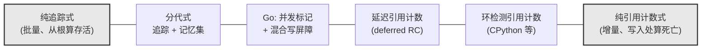
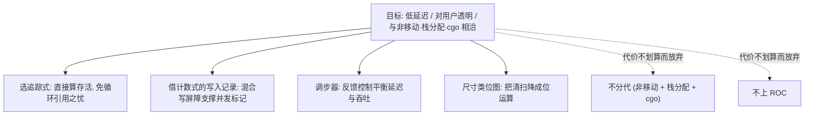

# 13.13 垃圾回收统一理论

本章一路看下来，Go 的并发标记清扫、混合写屏障、调步器，又对比了分代假设、请求制导回收等
别家的路子。算法五花八门，读者读到此处，心里或许积下一个疑问：这些机制之间，除了「都在做
垃圾回收」之外，有没有一条共同的脉络，把它们安放进同一个框架？

有。Bacon、Cheng、Rajan 三人在 2004 年的论文《A Unified Theory of Garbage Collection》
里给出了一个出人意料的答案：人们习惯当作两大门派的**追踪式**（tracing）与**引用计数式**
（reference counting），在数学上是同一件事的两种写法，是**对偶**的；而所有现实中的回收器，
都是这两端之间的某种混合。用这个理论收束全章，能让人从「记住了若干算法」上升到「看清了算法
空间的结构」,这正是一章理论收尾应当做的事。

## 13.13.1 两个门派与它们各自的缺口

先把两端摆清楚。

**追踪式**从根集合（栈、寄存器、全局变量）出发，沿指针逐步走遍对象图，凡能到达的都标记为
存活，走完后未被标记的即是垃圾。Go 用的就是这一类（[13.1](./basic.md)）。它的好处是天然处理
循环引用：一个互相指向却无人从外部引用的对象环，从根出发根本到不了，自然被判死。它的代价是
回收要成批进行：得等一轮遍历走完，才知道谁是垃圾，于是有「停顿」这件事，也才有本章前面那一
整套为削减停顿而生的并发标记与写屏障机制。

**引用计数式**给每个对象配一个计数器，记录有多少指针指向它。每次指针赋值，给新指向的对象
加一、给旧指向的对象减一；计数归零，对象立即回收。它的好处是回收**及时且分摊**：内存在最后
一个引用消失的瞬间就还回去，停顿被打散进每一次指针写入里。它的代价正好与追踪式相反：**处理
不了循环引用**,环内对象彼此把对方的计数顶在一以上，谁也归不了零，于是泄漏。

两个门派各有一个缺口，而且缺口的位置恰好互补。这种「恰好互补」不是巧合，它是下一节那条对偶
关系在工程表象上的投影。

## 13.13.2 追踪与计数是对偶

统一理论的核心，是用同一个不动点（fixed point）方程刻画两种算法，二者只是求同一个解的两个
方向。

把内存里的对象看成一张有向图。设对象集合为 $V$，指针构成的有向边的多重集为 $E$（多重，
因为一个对象可以有多个字段指向同一目标）。我们保守地假定：凡从根可达的对象，将来都可能被用
到，因而不可回收。记根集合为 $R$。对每个对象 $v \in V$，定义它的引用计数 $\rho(v)$ 为：来自
根的引用数，加上来自其他**存活**对象的引用数。这是一个递归定义，写成不动点方程：

$$
\rho(v) = \bigl|[\, v : v \in R \,]\bigr| \;+\; \bigl|[\,(w, v) : (w, v) \in E \,\wedge\, \rho(w) > 0 \,]\bigr|
$$

方括号取多重集，竖线取其基数。读法是：$v$ 的计数，等于「根直接引用它的次数」，加上「所有
$\rho(w) > 0$ 的对象 $w$ 经由边 $(w, v)$ 引用它的次数」。注意右边又出现了 $\rho$，所以这是一个
递归方程，它的解是一个不动点。关键在于：**这个方程有多个不动点，追踪式与引用计数式分别求出
其中一个。**

- **追踪式求最小不动点。** 从 $\rho \equiv 0$ 出发，先令根可达的对象计数为正，再沿边把「正」
  一层层传播出去，直到不再变化。最后 $\rho(v) > 0$ 的恰是从根可达的对象，即存活集合。它**直接
  算存活，间接得死亡**（剩下的 $\rho(v) = 0$ 即垃圾）。整个过程是从根开始的一系列「加法」：
  不断把新发现的可达对象计入。

- **引用计数式求另一个不动点。** 它从程序初始状态那个满足方程的解出发，在每次指针写入时**增量
  地维护**这个解：加边就给目标加一，删边就给目标减一，减到零就回收，并递归地给它指向的对象
  继续减。它**直接算死亡**（归零即死），**间接维持存活**（计数为正就保留）。整个过程是分散在
  各次指针操作上的「加法与减法」。

把两个方向并排写成伪代码，对偶看得更清楚。两段程序求的是同一个 $\rho$，区别只在「何时算」
与「往哪个方向逼近」：

```
// 追踪式：批量求最小不动点。一轮 GC 跑一遍，从根做加法
func tracing():
    for v in V: ρ[v] = 0          // 从全零起步
    worklist = roots()            // 根直接贡献正计数
    for v in worklist: ρ[v] += 1
    while worklist not empty:      // 沿边把「正」传播出去
        w = worklist.pop()
        for (w, v) in edges(w):
            if ρ[v] == 0: worklist.push(v)
            ρ[v] += 1
    // 收敛后 ρ[v] > 0 即存活；ρ[v] == 0 即垃圾（间接得到）

// 引用计数式：增量维护同一个 ρ。分摊在每次指针写入处
func write(slot, newptr):          // *slot = newptr
    ρ[newptr] += 1                  // 新边：加法
    ρ[*slot]  -= 1                  // 旧边：减法
    if ρ[*slot] == 0:              // 归零即死（直接得到）
        for (old, v) in edges(*slot): write(&..., nil)  // 递归减
        free(*slot)
    *slot = newptr
```

两段代码的每一行，都在动同一个 $\rho$。追踪式批量地、从根出发、自底向上算它的最小解；
引用计数式增量地、在写入处、就地维护它。这就是对偶：**追踪累积存活，计数追踪死亡；一个做
加法，一个做加减；一个集中在回收时刻，一个分摊到引用时刻。**

而循环引用的缺口也在此得到解释。计数式增量维护的那个不动点，不是最小不动点。一个孤立的
对象环，环内每个对象都被环里另一个对象指着，计数自洽地停在正值上，构成方程的一个「虚高」
的解，计数式 `write` 永远等不到它们归零，于是泄漏。追踪式因为每轮都从根重算最小解，环里
没有根的支撑，`ρ` 落不到正值，自然被判死。两种算法处理环的能力之别，归根结底是它们求的
是方程的哪一个不动点。

这一节是全章理论密度最高的地方。读者若只取一句带走，便是：**追踪与计数不是对立的两派，
而是求解同一个引用计数方程的两个方向。**

## 13.13.3 一切回收器都是混合体

对偶不只是理论上的优雅，它给出了一张地图：现实中的回收器，几乎没有一个是纯粹的某一端，
它们都落在两端之间，按需取用两边的手法。论文把这一点讲得很透，以下几例都是本章见过的：

- **分代式 GC**（[13.8](./generational.md)）。它对新生代用追踪式复制收集，却对老年代到新生代的
  跨代引用维护一个**记忆集**（remembered set）。记忆集本质上是在指针写入处「记一笔」,这正是
  计数式那一侧的动作。所以分代式是「追踪为主，局部借用计数式的写入记录」的混合。

- **带环检测的引用计数**。纯计数式漏掉环，工业实现（如 CPython）于是补一个**追踪式的环检测器**
  定期跑一遍，专门收拾那些计数虚高的对象环。这是「计数为主，补一个追踪子程序去填它的缺口」
  的混合。

- **Go 的并发标记 + 混合写屏障**（[13.2](./barrier.md)）。骨架是追踪式（从根并发标记），但为了
  在赋值器与回收器并发时不漏标，它在**指针写入处插入写屏障**，把被覆盖或新写入的指针记进
  标记工作队列。这个「在引用变化处记一笔」的动作，与引用计数在赋值时的增减如出一辙。Go 因此
  也是一个混合体：追踪式的存活判定，叠加计数式的写入时机。

把这三例并排看，会发现一条规律：**纯算法在工程上几乎不可用，可用的都是混合。** 统一理论的价值
就在这里：它让这些「混合」不再是各自为政的工程补丁，而是同一个方程在不同权衡下调出的不同
配方。下图把算法空间画成一条谱：



谱的两端是纯算法，中间的全是混合。一个回收器落在谱的哪个位置，取决于它在四个维度上的取舍，
而两端在这四个维度上的表现恰好互为镜像：

| 维度 | 纯追踪式 | 纯引用计数式 |
| --- | --- | --- |
| 延迟 | 成批回收，天然有停顿；削减停顿要靠并发标记等额外机制 | 回收分摊到每次写入，停顿被打散，但递归释放仍可能瞬时尖峰 |
| 吞吐 | 回收时一次扫全堆，单位回收成本低 | 每次指针写入都付计数增减，常态开销持续摊在赋值器上 |
| 内存 | 存活信息可压进位图，对象本身无额外字段；但需堆冗余以推迟回收 | 每个对象一个计数字段；回收及时，堆冗余小 |
| 复杂度 | 需要根扫描、写屏障、并发安全 | 写屏障简单，但循环引用迫使补一个追踪式环检测器 |

这四个维度互相拉扯，没有一个点能同时占优。读这张表的方式不是「谁更好」，而是「为某个目标
该往谱的哪一端靠」:要把停顿打散到极致、且能容忍常态开销，就向计数端走；要把赋值器开销压到
最低、且能容忍成批停顿（再用并发把它削薄），就向追踪端走。Go 的取舍，正是下一节要回看的。

## 13.13.4 用统一视角回看 Go

带着这张地图再看 Go，本章前十一节就连成了一体，而不再是一串孤立的机制。

Go 站在**追踪式**这一端，这一步选择背后有一整套相互支撑的理由。它直接算存活、间接得垃圾，
于是**天然没有循环引用问题**,Go 程序里随手构造的对象环、双向链表、带父指针的树，回收器一概
不必特殊照顾。它放弃了计数式那种「及时回收」的好处，换来的是不必在每次指针写入时都做计数
增减的常态开销，也不必维护一个额外的环检测器。

但纯追踪式有停顿，而 Go 的设计目标是**低延迟、对用户透明**。于是它从计数式那一端借来「在引用
变化处记录」这个手法，做成**混合写屏障**（[13.2](./barrier.md)），让标记得以与赋值器并发进行
而不漏标。这恰是统一理论所说的混合：用追踪式的存活判定做骨架，嵌入计数式的写入时机做并发的
安全网。

接着是把这套并发机制调到「既不暴涨内存、又不抢光 CPU」的工作点。Go 用**调步器**
（[13.3](./pacing.md)）这个反馈控制器，根据上一轮的标记速率与分配速率，预测下一轮何时该启动
标记，把堆增长稳定在目标比例附近。最后是让回收的另一半（清扫）尽可能便宜：Go 把存活信息编码进
**尺寸类位图**（[13.5](./sweep.md)），清扫一个 span 退化成几次位运算，几乎不必逐对象处理。

至于它**没有**选的那些配方，也能用同一框架解释。它没上**分代式**（[13.8](./generational.md)）：
分代的红利来自移动式复制收集，而 Go 是非移动收集器，又支持栈上分配与逃逸分析、还要与 cgo
互操作（对象地址不能乱动），移动的代价在它的上下文里太高，分代假设带来的收益抵不过实现复杂度。
它也没上**请求制导回收**（[13.9](./roc.md)）那样更激进的实验性方案。每一个「没选」，都是同一组
约束下算出来的同一个结论。



垃圾回收没有银弹。统一理论给出的不是某个「最优算法」，而是一句更朴素也更有用的话：**所有 GC
都活在追踪与计数的张力、以及延迟/吞吐/内存/复杂度的多维权衡之中，每一个具体回收器都是为某组
特定目标调出的一杯特定比例的混合。** Go 的 GC，就是为「低延迟、对用户透明、与它的栈分配和
非移动设计相洽」这组目标调出的那一杯。

读到这里，本章所有具体机制都有了归属：写屏障、调步、位图清扫、并发标记，不是一堆各自精巧
却互不相干的技巧，而是同一组约束在不同层面的一致展开。这也正是本书自始想传达的一件事：
**读懂一个系统，是读懂它在约束之下做出的那一整套自洽的选择。**

## 延伸阅读的文献

1. David F. Bacon, Perry Cheng, V. T. Rajan. *A Unified Theory of Garbage Collection.*
   OOPSLA 2004, *ACM SIGPLAN Notices* 39(10): 50-68.
   https://doi.org/10.1145/1028976.1028982 （本节的源头：对偶与不动点表述）
2. Richard Jones, Antony Hosking, Eliot Moss. *The Garbage Collection Handbook: The Art of
   Automatic Memory Management.* 2nd ed., CRC Press, 2023.
   （追踪式、计数式及各类混合算法的权威综述）
3. George E. Collins. *A Method for Overlapping and Erasure of Lists.*
   *Communications of the ACM* 3(12): 655-657, 1960. https://doi.org/10.1145/367487.367501
   （引用计数式回收的最早提出）
4. John McCarthy. *Recursive Functions of Symbolic Expressions and Their Computation by
   Machine, Part I.* *Communications of the ACM* 3(4): 184-195, 1960.
   https://doi.org/10.1145/367177.367199 （标记清扫式追踪回收的最早提出）
5. Rick Hudson. *Getting to Go: The Journey of Go's GC.* ISMM 2018 主题演讲.
   https://go.dev/blog/ismmkeynote （Go 选择追踪式并发回收的设计自述）
6. L. Peter Deutsch, Daniel G. Bobrow. *An Efficient, Incremental, Automatic Garbage
   Collector.* *Communications of the ACM* 19(9): 522-526, 1976.
   https://doi.org/10.1145/360336.360345 （延迟引用计数：计数式向追踪式靠拢的经典混合）
7. 本书 [13.1 垃圾回收的基本想法](./basic.md)、[13.2 写屏障技术](./barrier.md)、
   [13.8 分代假设与代际回收](./generational.md)、[13.9 请求假设与事务制导回收](./roc.md).
