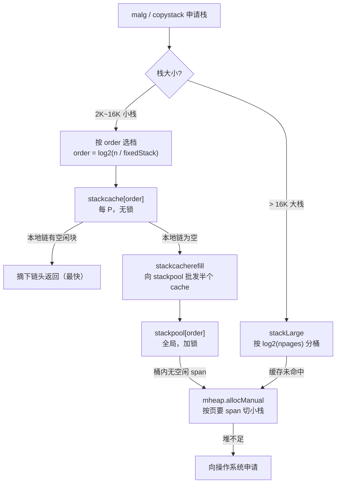

# 14.2 栈的分配与缓存

> 本节内容对标 Go 1.26。

[14.1](./design.md) 把执行栈定位为一段 `[lo, hi)` 的连续内存：它由运行时管理，本质上落在堆里，
所以每个 Goroutine 一启动就要先有人给它划出这段地址。问题随之而来：谁来划？划多大？划完之后
反复创建、销毁 Goroutine，这些两三 KB 的小块内存如果每次都直接找操作系统或全局堆去要，
锁与系统调用的代价会立刻压垮调度。

答案是栈有它自己的一套分配器。它与 [12 内存分配器](../ch12alloc) 不是同一套代码，却几乎是
同一张设计图：**每 P 无锁缓存在前，全局加锁仓库在后，堆与操作系统垫底**。读过 [12.2](../ch12alloc/component.md)
的读者会发现，这一层不过是把 mcache / mcentral / mheap 的招式照搬到了栈上。本节先讲清这套
并行结构长什么样，再说清它为何要与对象分配分开、又如何与垃圾回收衔接。

## 14.2.1 为什么栈要有自己的分配器

把栈交给通用对象分配器，初看是省事的，可栈有三条与普通对象不同的性质，逼着运行时另起一套。

其一，**尺寸高度规整**。Go 的栈最小 2KB（`stackMin = 2048`），每次伸缩都按 2 的幂翻倍
（[14.3](./grow.md)），于是绝大多数栈只会是 2K / 4K / 8K / 16K 这几种大小。规整的尺寸天然适合
用自由表（free list，[12.2.1](../ch12alloc/component.md)）按尺寸分桶管理，连尺寸类的查表都
省了，一次移位就能算出该去哪个桶。

其二，**生命周期与回收方式特殊**。栈不像普通对象那样被指针图引用、靠标记存活，它的存活与
对应的 Goroutine 绑定。栈内存被标成 `mSpanManual` 状态（手动管理），不参与 GC 的标记清扫，
而是在栈收缩或 Goroutine 死亡时由运行时显式归还（[14.5](./shrink.md)）。把这类「手动管理」的
内存与「自动回收」的对象内存分开放，回收逻辑才干净。

其三，**分配频率极高且在系统栈上**。`stackalloc` 必须跑在调度栈（g0）上，因为它自己绝不能再
触发栈增长，否则会死锁（runtime issue 1547）。这条约束要求分配路径短、不可重入，更不能在
热路径上动辄加锁。

这三条加起来，结论就是：给栈配一套尺寸固定、不走 GC、热路径无锁的专用分配器。它的形状，
和对象分配器是同构的。

## 14.2.2 三层结构：stackcache、stackpool、stackLarge

小栈（2K / 4K / 8K / 16K）走一条三层补货链，每层都能在下文的代码里指认出来。

**第一层是每 P 的 `stackcache`，无锁快路径**。它就挂在 mcache 上，与对象分配共用同一份每 P
缓存（[12.2.3](../ch12alloc/component.md)）：

```go
// mcache 上顺带挂着栈缓存，每个 P 一份（速写）
type mcache struct {
    // ... 对象分配相关字段（alloc、tiny 等）见 12.2.3
    stackcache [_NumStackOrders]stackfreelist // 每个 order 一条自由表
}

// 某个 order 的本地空闲栈链
type stackfreelist struct {
    list gclinkptr // 空闲栈串成的自由表（块头存下一块指针）
    size uintptr   // 链上空闲字节数
}
```

`_NumStackOrders` 在 64 位非 Windows 平台上是 4，对应 order 0~3，即 2K / 4K / 8K / 16K 四档。
每档一条自由表，块头复用为指向下一块的指针，摘取与归还都是 $O(1)$ 的指针操作。因为同一时刻
每个 P 只被一个 M 持有，访问 `stackcache` **无需加锁**，这正是绝大多数栈分配走完即止的地方。

**第二层是全局 `stackpool`，加锁的中心仓库**。当某档本地缓存空了，就向 `stackpool` 批发：

```go
// 全局空闲栈池，按 order 分桶；每桶一个锁、一条 mspan 链（速写）
var stackpool [_NumStackOrders]struct {
    item stackpoolItem
    _    [...]byte // 填充到缓存行，避免不同 order 之间的伪共享
}

type stackpoolItem struct {
    mu   mutex     // 本桶的锁
    span mSpanList // 仍有空闲栈块的 mspan 双向链表
}
```

它对应对象分配里的 mcentral：**全局共享、按桶加锁**。注意 `stackpool` 数组上的缓存行填充，
与 mheap 里 `central` 数组的填充是同一处考量,把不同 order 的锁对齐到不同缓存行，避免多核
分别操作不同档位时的伪共享（false sharing，[12.2.5](../ch12alloc/component.md)）。

**第三层是 `mheap` 与大栈池 `stackLarge`，垫底的堆**。`stackpool` 的某档空了，就向 mheap 按页
申请一整块 span 切成小栈；而大于 16K 的大栈则绕过前两层，直接走 `stackLarge`：

```go
// 大栈的全局缓存，按 log_2(npages) 分桶（速写）
var stackLarge struct {
    lock mutex
    free [heapAddrBits - gc.PageShift]mSpanList
}
```

把三层和它们在对象分配器里的对应物并排放，结构上的同构一目了然：

| 栈分配器 | 对象分配器（[12.2](../ch12alloc/component.md)） | 同步代价 | 命中频率 |
|---|---|---|---|
| `stackcache`（每 P，挂在 mcache 上） | `mcache`（每 P） | 无锁 | 最高 |
| `stackpool`（全局，按 order 分桶加锁） | `mcentral`（全局，按尺寸类分桶加锁） | 加锁 | 中 |
| `mheap` / `stackLarge` | `mheap` | 加锁 + 可能系统调用 | 最低 |



## 14.2.3 stackalloc：在三层之间权衡

把上面三层串起来的，是 `stackalloc`。它要回答的其实只有一件事：这次分配该从哪一层取。
裁剪后的速写如下，完整定义见 `runtime/stack.go`：

```go
//go:systemstack
func stackalloc(n uint32) stack {
    thisg := getg()
    // 必须在 g0（调度栈）上运行，否则分配过程自身可能触发栈增长而死锁
    if thisg != thisg.m.g0 {
        throw("stackalloc not on scheduler stack")
    }

    var v unsafe.Pointer
    if n < fixedStack<<_NumStackOrders && n < _StackCacheSize {
        // 小栈：走每 P 缓存 / 全局池
        order := uint8(0)
        for n2 := n; n2 > fixedStack; n2 >>= 1 { // 一次移位算出 order
            order++
        }
        var x gclinkptr
        if stackNoCache != 0 || thisg.m.p == 0 || thisg.m.preemptoff != "" {
            // 没有 P（exitsyscall/procresize 中）或正被抢占：跳过本地缓存，直取全局池
            lock(&stackpool[order].item.mu)
            x = stackpoolalloc(order)
            unlock(&stackpool[order].item.mu)
        } else {
            c := thisg.m.p.ptr().mcache // 每 P 的栈缓存，无锁
            x = c.stackcache[order].list
            if x.ptr() == nil {         // 本地空了，向全局池批发
                stackcacherefill(c, order)
                x = c.stackcache[order].list
            }
            c.stackcache[order].list = x.ptr().next
            c.stackcache[order].size -= uintptr(n)
        }
        v = unsafe.Pointer(x)
    } else {
        // 大栈：走 stackLarge / 直接向堆要 span
        npage := uintptr(n) >> gc.PageShift
        var s *mspan
        lock(&stackLarge.lock)
        if !stackLarge.free[stacklog2(npage)].isEmpty() {
            s = stackLarge.free[stacklog2(npage)].first
            stackLarge.free[stacklog2(npage)].remove(s)
        }
        unlock(&stackLarge.lock)
        if s == nil {
            s = mheap_.allocManual(npage, spanAllocStack) // 标成 mSpanManual
            s.elemsize = uintptr(n)
        }
        v = unsafe.Pointer(s.base())
    }
    return stack{uintptr(v), uintptr(v) + uintptr(n)}
}
```

有两处取舍值得点出。其一是 `thisg.m.p == 0 || thisg.m.preemptoff != ""` 这个分支：当 M 暂时
没有 P（正在退出系统调用或 `procresize` 调整 P 数量），或正处在抢占过程中时，本地缓存不可用
或不可触碰（GC 期间它会被并发清空），于是退而直接锁住全局池分配。无锁快路径只在「持有 P
且非抢占」的常态下成立,这与 mcache 的可用条件如出一辙。其二是 order 的计算只用一次循环移位，
而非像对象分配那样查尺寸类表,栈尺寸本就是 2 的幂，这一步可以更省。

## 14.2.4 补货：stackcacherefill 与 stackpoolalloc

本地缓存空了不会只补一块。`stackcacherefill` 一次性向全局池批发**半个 cache 容量**的栈块，
为的是避免在「刚好用尽、刚好归还」的边界上反复加锁、抖动（thrashing）:

```go
//go:systemstack
func stackcacherefill(c *mcache, order uint8) {
    var list gclinkptr
    var size uintptr
    lock(&stackpool[order].item.mu)
    for size < _StackCacheSize/2 {       // 批发到半满即止
        x := stackpoolalloc(order)
        x.ptr().next = list
        list = x
        size += fixedStack << order
    }
    unlock(&stackpool[order].item.mu)
    c.stackcache[order].list = list
    c.stackcache[order].size = size
}
```

`_StackCacheSize` 是 32KB，半满即 16KB。批量进货、留出半程余量，是缓存层减少与下层交互次数的
通用手法,对象分配的 `refill`、调度器从别的 P 本地队列窃取一半任务（[9.2](../../part3concurrency/ch09sched/steal.md)）
都是这个思路。对应地，归还时 `stackcacherelease` 在本地超过半满时才把多出的部分退回全局池，
两个阈值一上一下，把本地缓存的水位稳定在半满附近。

批发的终点是 `stackpoolalloc`。它从某 order 的 span 链表头取一块；链表空了，就向 mheap 要一整段
`_StackCacheSize` 大小的 span，按 `fixedStack << order` 切成等大的小栈，用自由表串起来再分发：

```go
// 从全局池取一个栈；持有 stackpool[order].item.mu（速写）
func stackpoolalloc(order uint8) gclinkptr {
    list := &stackpool[order].item.span
    s := list.first
    if s == nil { // 池空了，向 mheap 批发一整段 span，切成等大小栈
        s = mheap_.allocManual(_StackCacheSize>>gc.PageShift, spanAllocStack)
        s.elemsize = fixedStack << order
        for i := uintptr(0); i < _StackCacheSize; i += s.elemsize {
            x := gclinkptr(s.base() + i)
            x.ptr().next = s.manualFreeList // 用块头串成自由表
            s.manualFreeList = x
        }
        list.insert(s)
    }
    x := s.manualFreeList
    s.manualFreeList = x.ptr().next
    s.allocCount++
    if s.manualFreeList.ptr() == nil { // span 内已全部分出
        list.remove(s)
    }
    return x
}
```

注意 `allocManual(..., spanAllocStack)`：栈 span 一律用 `mheap.allocManual` 申请，状态置为
`mSpanManual`。这就是 [14.2.1](#1421-为什么栈要有自己的分配器) 说的「手动管理」,这类 span
不进入 GC 的对象扫描视野（`spanOfHeap` 对 `mSpanManual` 返回 nil），它们的回收由栈管理代码
自己负责，而非靠标记清扫。栈与对象共享同一座 mheap、同一套 span 机制，却在「谁来回收」这件事
上彻底分流。

## 14.2.5 一脉相承的「分层减争」

回头看，这一层没有发明任何新原理。它把 [12.2](../ch12alloc/component.md) 的补货链、
[9.2](../../part3concurrency/ch09sched/steal.md) 的每 P 本地队列、`sync.Pool`
（[11.6](../../part3concurrency/ch11sync/pool.md)）的每 P 分片，套用到了栈这种特定内存上。
同一招式在 Go 运行时里反复出现，其内核始终是一句话：**把最热的路径做成无锁操作，把加锁与
系统调用挡在越来越冷的后方**。

放进谱系看，这套结构的祖型仍是 tcmalloc 的 thread-cache / central-list / page-heap 三级
（[12.1](../ch12alloc/basic.md)）。栈分配器是它在「尺寸规整、手动回收、必须在系统栈上」这组
约束下的一次特化:去掉了尺寸类查表（栈尺寸是 2 的幂），去掉了 GC 标记（栈手动管理），换来
更短的热路径。它与对象分配器共用 mheap 这座地基，又各自在其上长出适应自身需求的缓存层。

代价也照例存在。每 P 一份 `stackcache` 意味着栈内存不能在 P 之间直接复用，必须经全局 `stackpool`
中转；`_StackCacheSize/2` 的水位线是一个经验阈值，定高了浪费内存、定低了加锁变频。性能的提升
从不白来，它总伴着内存占用与复杂度的重新安置。下一节（[14.3](./grow.md)）转向这段内存被用满
之后的事:连续栈如何检测溢出、如何翻倍扩张，再把整个栈搬到新地址（[14.4](./copy.md)）。

## 延伸阅读的文献

1. The Go Authors. *runtime/stack.go.* go1.26.4. （`stackalloc`、`stackpool`、`stackLarge`、
   `stackcacherefill`、`stackpoolalloc` 的权威定义）
   https://github.com/golang/go/blob/go1.26.4/src/runtime/stack.go
2. The Go Authors. *runtime/mcache.go.* go1.26.4. （`stackcache` 字段、`stackfreelist` 定义）
   https://github.com/golang/go/blob/go1.26.4/src/runtime/mcache.go
3. The Go Authors. *runtime/mheap.go.* go1.26.4. （`allocManual`、`mSpanManual`、`spanAllocStack`）
   https://github.com/golang/go/blob/go1.26.4/src/runtime/mheap.go
4. Sanjay Ghemawat, Paul Menage. *TCMalloc: Thread-Caching Malloc.*
   https://google.github.io/tcmalloc/design.html （thread-cache / central-list / page-heap 三级的思想原型）
5. 本书 [12.2 内存分配组件](../ch12alloc/component.md)、[12.1 内存分配设计原则](../ch12alloc/basic.md).
6. 本书 [9.2 工作窃取式调度](../../part3concurrency/ch09sched/steal.md)、
   [11.6 缓存池 sync.Pool](../../part3concurrency/ch11sync/pool.md).
7. 本书 [14.1 连续栈的设计](./design.md)、[14.3 栈的增长](./grow.md)、
   [14.4 栈的拷贝与指针调整](./copy.md)、[14.5 栈的收缩与演进](./shrink.md).

## 许可

&copy; 2018-2026 The [golang.design](https://golang.design) Initiative Authors. Licensed under [CC-BY-NC-ND 4.0](https://creativecommons.org/licenses/by-nc-nd/4.0/).
