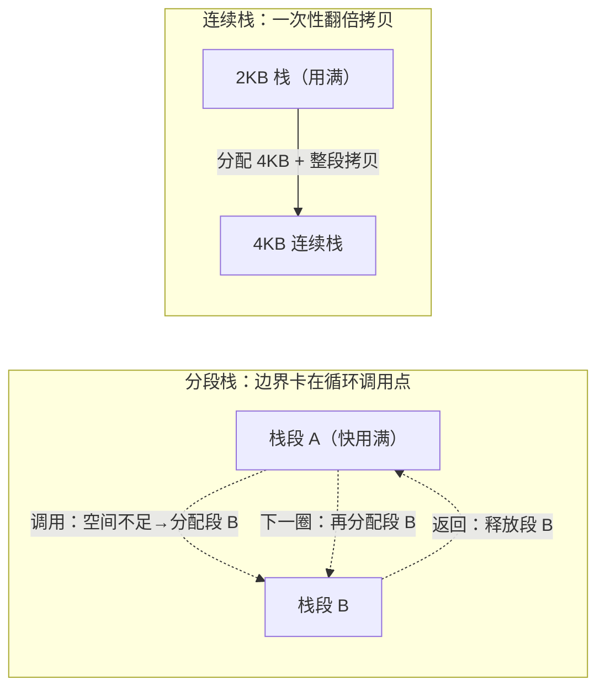

# 14.1 连续栈的设计

每个 goroutine 都带着一个执行栈。它存放着函数调用的局部变量、参数、返回地址，是程序
得以「正在执行」的物理载体。读者熟悉的 C 程序里，这个栈由操作系统线程提供，大小在线程
创建时一次确定（`ulimit -s` 默认常是 8MB），此后不再变化。Go 走了另一条路：goroutine 的栈
不是线程栈，而是运行时在堆上分配、自己管理、可以伸缩的一段内存，初始仅 2KB。

这条设计选择不是细节，它是 goroutine 能够「便宜到可以开成千上万个」的前提
（[9.3](../../part3concurrency/ch09sched/mpg.md)）。本节先把栈在运行时里的形态讲清楚：它由哪几个
字段描述、`stackguard0` 如何在每个函数序言里守住栈底，再回到历史，看 Go 为什么从早年的
分段栈（segmented stack）切换到今天的连续栈（contiguous stack），以及这次切换换来了什么、
付出了什么。栈的分配、拷贝与收缩等机制留给本章后续各节，这里只谈设计。

## 14.1.1 栈在运行时里的形态

一个 goroutine 由一个 `g` 对象描述，它的头几个字段就刻画了执行栈。栈的边界用一对地址
表示，区间是半开的 `[lo, hi)`，两端没有任何隐式的元数据：

```go
// stack 描述一段栈内存，边界恰为 [lo, hi)，两侧无隐式结构（速写）
type stack struct {
    lo uintptr // 栈的低地址端（栈向低地址生长，lo 是「栈底极限」）
    hi uintptr // 栈的高地址端（最初的栈顶）
}
```

栈向低地址方向生长：函数调用压栈时，栈指针 SP 从 `hi` 一侧朝 `lo` 移动。`lo` 因此是这段
栈所能用到的最低地址，越过它就是栈溢出。

`g` 中与栈直接相关的，是下面这三个字段：

```go
type g struct {
    // stack 描述实际的栈内存：[stack.lo, stack.hi)
    stack       stack
    // stackguard0 是 Go 栈生长序言里用来比较的栈指针。
    // 正常时等于 stack.lo + stackGuard；被抢占时会被改写为 stackPreempt。
    stackguard0 uintptr
    // stackguard1 是 //go:systemstack 序言里比较的栈指针。
    // 在 g0 与 gsignal 栈上等于 stack.lo + stackGuard；
    // 在普通 goroutine 栈上为 ~0，以触发 morestackc（并 crash）。
    stackguard1 uintptr
    // ...
    sched       gobuf // 执行现场：被调度切走时保存的寄存器快照
    // ...
}
```

`stackguard0` 是这套机制的枢纽，下一小节专门讲它。`stackguard1` 是它在系统栈、信号栈上的
对应物，用途收窄到运行时自身的 C 调用边界，普通 goroutine 用不到。

当一个 goroutine 被调度器切下 CPU，它「执行到哪了」必须被完整记下来，以便日后原样恢复。
这份现场快照就是 `gobuf`：

```go
// gobuf 保存 goroutine 被切走时的寄存器现场（速写）
type gobuf struct {
    sp   uintptr        // 栈指针：恢复后从这里继续用栈
    pc   uintptr        // 程序计数器：恢复后从这条指令继续执行
    g    guintptr       // 指回所属的 g
    ctxt unsafe.Pointer // 闭包上下文，GC 扫描栈时作为根对待（见注释）
    lr   uintptr        // 链接寄存器（ARM 等架构）
    bp   uintptr        // 帧指针（开启 framepointer 的架构）
}
```

`gobuf` 之所以值得单列，是因为它和栈的可移动性深度绑定。栈一旦被搬到新位置
（[14.5](./grow.md)），其中保存的 `sp` 必须随之调整，否则恢复执行时会落到一段已被释放的
旧内存上。换言之，`stack`、`gobuf`、栈拷贝三者是一组互相牵制的设计，理解了它们的关系，
后面栈伸缩为何要那样小心翼翼就有了由来。`ctxt` 字段的注释还点出一处微妙：它可能是堆上的
闭包，GC 必须追踪，但它又要在汇编里读写，那里不便插写屏障，于是运行时把它当作扫描根来处理。

## 14.1.2 stackguard0：序言里的一行守卫

栈是会用满的。一个递归很深、或局部变量很大的函数，可能在某次调用时就把剩下的栈空间耗尽。
运行时需要在「即将越界」的那一刻拦下来，去把栈换成更大的。问题是：这个检查必须发生在
每一次函数调用上，它的代价直接计入每个 Go 程序的每一次调用。

Go 的做法是把检查压缩成函数序言（prologue）里的几条指令，由编译器自动插入到所有未标记
`//go:nosplit` 的函数开头（[2.2](../../part1overview/ch02asm/callconv.md)）。最常见的小帧
情形，序言只是一次比较加一次条件跳转，伪汇编如下：

```
// 函数序言中的栈检查（小帧情形，伪汇编）
CMP   SP, stackguard0        // 当前栈指针是否已逼近栈底守卫线？
JLS   morestack              // 若 SP <= stackguard0，跳去扩栈（少见路径）
// ... 正常进入函数体 ...
```

`stackguard0` 正常被设成 `stack.lo + stackGuard`，比真正的栈底 `lo` 高出一个 `stackGuard`
的余量。这段余量不是浪费：它要容下一条 `//go:nosplit` 函数的调用链（这些函数不做栈检查，
必须保证它们的总帧能放进守卫区）、一个 `stackSmall` 帧，外加各平台留给信号处理的
`stackSystem` 字节。在 go1.26 中，这几个量由 `stackGuard = stackNosplit + stackSystem +
abi.StackSmall` 定义，`stackMin = 2048` 给出 2KB 的最小栈。

这行守卫的精巧之处，在于它被复用成了抢占的开关。调度器要抢占一个正在运行的 goroutine 时
（[9.7](../../part3concurrency/ch09sched/preemption.md)），并不需要另立一套检查，它只把目标的
`stackguard0` 改写成一个特殊的大值 `stackPreempt`（`0xfffffade`）。这个值大过任何真实的 SP，
于是下一次函数序言里的那条比较必定「失败」，控制流照常落入 `morestack`，而 `morestack`
在那里发现这其实是一次抢占请求，便顺势让出。一个字段，两种语义：平时它是栈底的物理边界，
被抢占时它是调度器塞进来的逻辑信号。把抢占搭在既有的栈检查上，省去了在热路径上再加一道
判断的代价，这是 Go 运行时反复出现的笔法,让一处已经必须付的开销承担第二份职责。

## 14.1.3 从分段栈到连续栈

栈既然初始只有 2KB，用满是常态，关键就在「用满之后怎么长大」。Go 在 1.3 版本之前与之后，
给出过两个不同的答案。

早年的 Go 用的是分段栈。栈不够用时，运行时另外分配一段新的栈空间，用一个链接结构把它
接在旧栈之后，逻辑上是一根栈，物理上是彼此不连续的若干段。函数返回、退回到上一段时，
这段新栈又被释放。这套机制借鉴自 gccgo 和更早的 split-stack 实现，好处是扩栈只动新增的
一段，不必触碰旧数据。

它有一个致命的退化情形，称作热分裂（hot split）。设想一个紧凑的循环，循环体里恰好有一次
函数调用，而当前栈段剩余的空间，刚好只够容下这次调用的栈帧多一点点。于是每进一次循环：
调用时发现空间不够，分配一段新栈段；函数返回时空间又「够了」，释放掉这段新栈段;下一圈
再分配、再释放。栈边界正好卡在循环的调用点上，alloc/free 便随循环高频抖动。本该是热路径
的循环，被栈段的反复申请与归还拖垮，且这种抖动持续存在，只要循环还在跑就不会消失。性能
因此变得难以预测：同一段代码，栈帧布局稍有不同，是否踩中边界就决定了它快还是慢。

Go 1.3 由 Keith Randall 主导，改用了连续栈。思路朴素得近乎笨拙：栈不够用时，不再去接一段
新栈，而是分配一整块两倍大的新栈，把旧栈的全部内容拷贝过去，然后释放旧栈。栈因此永远是
一整段连续内存。



连续栈把代价的形态彻底换掉了。它需要一次性把整个栈拷过去，这次拷贝并不便宜，尤其栈很深
时；拷贝本身还有难点,栈上的局部变量可能持有指向同一个栈的指针，搬动之后这些指针必须逐个
修正，`gobuf` 里保存的 `sp` 同样要更新，这些是 [14.5](./grow.md) 的主题。但它换来的是:扩栈
只在「确实需要更大栈」时发生一次，此后栈稳定下来就不再有任何抖动；那个让分段栈失速的热
分裂情形，被根除了。连续的内存还顺带改善了缓存局部性。Go 1.3 的发布说明给出的权衡是:用
一次可良好摊销的拷贝开销，换掉分段栈那种持续、且不可预测的边界抖动。

```
                              高地址
        +-------------------+  <-- stack.hi（最初的栈顶）
        |   已用栈帧         |
        +-------------------+  <-- SP（当前栈指针，向下生长）
        |   尚未使用         |
        |        ...        |
        +-------------------+  <-- stackguard0 = stack.lo + stackGuard
        |   守卫余量         |      （序言在此处拦截，越过即扩栈）
        +-------------------+  <-- stack.lo（栈底极限）
                              低地址
```

值得点出的是，分段与连续之争里没有「免费的胜利」。分段栈在扩栈那一刻更便宜（只动新段），
连续栈在稳态下更便宜（不再抖动）。Go 赌的是后者:真实程序里栈大小往往很快收敛到一个稳定
值，扩栈是少数几次的一次性事件，而把每一次穿越边界都做成廉价操作，远不如把边界本身消除。
这个判断被实践印证，连续栈沿用至今。

## 14.1.4 小而可长的栈，何以撑起轻量并发

回到开头的问题:为什么 goroutine 的栈要这样设计。把三件事放在一起看,堆上分配、初始 2KB、
可按需翻倍,答案就清楚了。

操作系统线程栈动辄数 MB 且固定，开一万个线程意味着预留几十 GB 的栈地址空间，绝大部分还
用不上。goroutine 反其道而行:每个只起 2KB，开十万个也不过几百 MB 的初始占用；真正用到深
递归或大帧的少数 goroutine，才通过连续栈逐步长大，按需付费。栈在堆上由运行时管理，而非
绑定到某个线程，这又使得一个 goroutine 可以在不同的 M 上被调度执行
（[9.3](../../part3concurrency/ch09sched/mpg.md)），栈跟着 `g` 走，不随线程绑死。

这正是 Go 选择有栈协程（stackful coroutine）而非无栈方案的底气所在。goroutine 拥有真实的、
可增长的栈，因此能在任意调用深度处挂起与恢复，写并发代码时无需把函数染色成 async、也无需
手工管理续体,普通的同步风格代码就能并发执行。支撑这种编程模型的，正是本节这套「小、可长、
运行时托管」的连续栈设计。它把昂贵的、固定的 OS 栈，换成了廉价的、弹性的运行时栈，使
「成千上万个 goroutine」从一句口号变成了可承受的工程现实。

## 延伸阅读的文献

1. Keith Randall. *Contiguous stacks.* Go design document, 2013.
   https://go.dev/s/contigstacks （连续栈设计的一手文档,热分裂问题、拷贝与指针修正、性能数据）
2. The Go Authors. *Go 1.3 Release Notes: Stack management.* 2014.
   https://go.dev/doc/go1.3#stacks （官方记述从分段栈切换到连续栈，及「hot spot」的消除）
3. The Go Authors. *runtime/stack.go.*（`stackMin`、`stackGuard`、`stackNosplit` 等常量定义）
   https://github.com/golang/go/blob/master/src/runtime/stack.go
4. The Go Authors. *runtime/runtime2.go.*（`stack`、`gobuf`、`g` 的栈相关字段）
   https://github.com/golang/go/blob/master/src/runtime/runtime2.go
5. Ian Lance Taylor. *Split Stacks in GCC.* gccgo 文档.
   https://gcc.gnu.org/wiki/SplitStacks （分段栈的实现来源与设计取舍）
6. 本书 [9.3 M/P/G 模型](../../part3concurrency/ch09sched/mpg.md)、
   [9.7 协作与抢占](../../part3concurrency/ch09sched/preemption.md)、
   [2.2 调用规范](../../part1overview/ch02asm/callconv.md).
7. 本章 [14.5 栈的伸缩](./grow.md)（栈拷贝、指针修正与 `gobuf` 更新的细节）.
