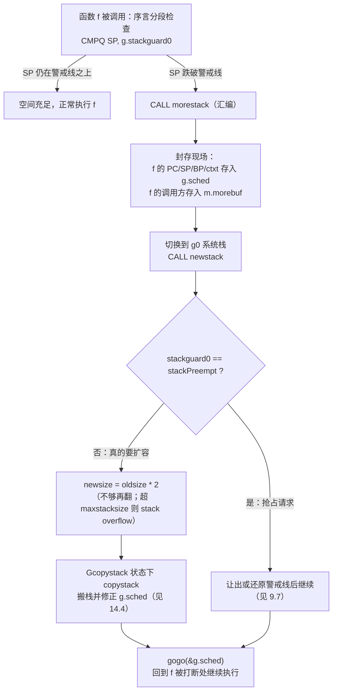

# 14.3 栈的增长

[14.1](./readme.md) 交代了 Go 选择连续栈的理由：栈起步只有 2KB，溢出时换一块两倍大的新栈，
把旧栈整个拷过去。这一节只回答其中一个问题：运行时是怎么在「正确的时刻」知道栈快满了，又是
怎么把控制权一路交到那段负责扩容的代码手里的。栈拷贝本身的细节留到 [14.4](./copy.md)。

困难在于，栈增长这件事必须在栈快要溢出、却还没真正溢出的瞬间发生，而触发它的又恰恰是普通的
函数调用。换言之，每一次进入函数都要先问一句「我这一帧放得下吗」，放不下才去扩容。这道检查不能
靠程序员手写，它由编译器在每个函数的开头自动埋下，这就是**函数序言**（prologue）里的分段检查。
整条链路是：序言检查 → `morestack`（汇编）→ `newstack`（Go）→ `copystack` → 返回原处继续执行。
我们顺着这条链走一遍。

## 14.3.1 函数序言：每次调用都先问一句

每个 Goroutine 的 `g` 结构里有一个字段 `stackguard0`，它是「栈还能用到哪里」的警戒线
（[2.2](../../part1basic/ch02life/init.md)）。正常情况下它等于 `stack.lo + stackGuard`，
即栈底再抬高一个保护区的位置。函数序言要做的，就是拿当前的栈指针 SP 和这条警戒线比较：栈向
低地址生长，一旦 SP 跌到 `stackguard0` 之下，就说明剩余空间不足以容纳即将压入的这一帧，必须
先扩容。

编译器并不会对所有函数都生成同样的检查。帧越大，越要把帧本身的大小算进去，于是检查分三档
（常量 `StackSmall = 128`、`StackBig = 4096` 见 `internal/abi/stack.go`）。下面是 amd64 上
序言的伪汇编，对应 `cmd/internal/obj/x86/obj6.go` 里的 `stacksplit`：

```asm
// 小帧 framesize <= StackSmall：直接比较 SP 与警戒线
    CMPQ    SP, stackguard0     // SP 是否已跌破警戒线？
    JHI     ok                  // SP 仍在警戒线之上，放得下，跳过
    CALL    runtime·morestack(SB)
ok:

// 中帧 StackSmall < framesize <= StackBig：把帧大小一并算进去
    LEAQ    -(framesize-StackSmall)(SP), AX
    CMPQ    AX, stackguard0
    JHI     ok
    CALL    runtime·morestack(SB)

// 大帧 framesize > StackBig：还要防 SP 接近 0 时的回绕（wraparound），
// 并显式检查警戒线是否被改成了 stackPreempt 这种「故意大于任何真实 SP」的值
```

警戒线被读成内存操作数 `stackguard0`，它在 `g` 中的偏移恰是第 3 个字（前两个字是
`stack.lo`、`stack.hi`），所以汇编里写作 `2*PtrSize` 处；C 函数则比对 `stackguard1`
（第 4 个字）。被 `//go:nosplit` 标记的函数不插入这段检查，代价是它们的帧必须挤进栈底那块
`stackGuard - StackSmall` 的保留区里，链接器会遍历所有不分段函数的调用链，确保这块预留够用。

这里有一处容易被忽略的设计：小帧只需一条 `CMPQ` 加一条跳转，绝大多数函数都落在这一档，因此
分段检查在快路径上几乎免费。把帧大小算进比较、防回绕这些麻烦，只加在少数大帧函数上。检查的
成本是「每次函数调用都付」的，所以它被压到了极致。

## 14.3.2 morestack：搬到 g0 上去扩容

序言判定空间不足，就 `CALL runtime·morestack`。这是一段汇编（`asm_amd64.s`），它要解决一个
绕不开的矛盾：扩容的本质是「把当前这条栈整个拷到别处」，可拷贝逻辑自己也得跑在某条栈上，它
绝不能跑在那条正要被搬走的用户栈上。`morestack` 的职责就是先把当前执行现场封存，再切换到
**g0 系统栈**（[9.3](../../part3concurrency/ch09sched/mpg.md)）去执行真正的扩容函数 `newstack`。

封存现场分两步。第一步，把触发增长的那个函数 f 的现场（PC、SP、BP、ctxt）写进 `g.sched`，
这样扩容完毕后能凭它精确地回到 f 的下一条指令继续执行。第二步，把 f 的**调用方**现场记进
`m.morebuf`，供 `newstack` 在需要时回溯栈。随后它确认当前不是在 g0 或信号栈上（这两条栈不
允许增长，否则直接崩溃），最后切到 g0，调用 `newstack`：

```asm
TEXT runtime·morestack(SB),NOSPLIT|NOFRAME,$0-0
    get_tls(CX)
    MOVQ    g(CX), DI              // DI = g（当前用户 g）
    MOVQ    g_m(DI), BX            // BX = m

    // 将 f 的执行现场存入 g.sched，扩容后据此恢复
    MOVQ    0(SP), AX
    MOVQ    AX, (g_sched+gobuf_pc)(DI)   // f 的 PC
    LEAQ    8(SP), AX
    MOVQ    AX, (g_sched+gobuf_sp)(DI)   // f 的 SP
    MOVQ    BP, (g_sched+gobuf_bp)(DI)
    MOVQ    DX, (g_sched+gobuf_ctxt)(DI) // f 的 ctxt（闭包上下文）

    // 不能增长 g0 / gsignal 栈，命中则崩溃
    MOVQ    m_g0(BX), SI
    CMPQ    DI, SI
    JNE     3(PC)
    CALL    runtime·badmorestackg0(SB)
    CALL    runtime·abort(SB)
    // ...（gsignal 同理省略）

    // 将 m.morebuf 设为 f 的调用方现场，供 newstack 回溯
    MOVQ    8(SP), AX
    MOVQ    AX, (m_morebuf+gobuf_pc)(BX)
    LEAQ    16(SP), AX
    MOVQ    AX, (m_morebuf+gobuf_sp)(BX)
    MOVQ    DI, (m_morebuf+gobuf_g)(BX)

    // 切换到 m.g0 栈，在其上调用 newstack
    MOVQ    m_g0(BX), BX
    MOVQ    BX, g(CX)
    MOVQ    (g_sched+gobuf_sp)(BX), SP   // SP 换到 g0 栈
    MOVQ    $0, BP
    CALL    runtime·newstack(SB)
    CALL    runtime·abort(SB)            // newstack 不应返回，返回即崩溃
```

那个 `DX`（ctxt）是哪来的？序言里若函数不需要闭包上下文，调用的并不是 `morestack` 而是它的
薄包装 `morestack_noctxt`：把 ctxt 清零再跳进来，省去保存一个无意义的寄存器。

```asm
TEXT runtime·morestack_noctxt(SB),NOSPLIT,$0
    MOVL    $0, DX
    JMP     runtime·morestack(SB)
```

到此，用户 g 的现场已完整封存在 `g.sched` 与 `m.morebuf` 里，执行已经站在 g0 栈上，可以放心
地去搬那条用户栈了。

## 14.3.3 newstack：先辨抢占，再谈扩容

`newstack`（`runtime/stack.go`）跑在 g0 上，但它处理的对象是被封存的用户 g（`thisg.m.curg`）。
它做的第一件要紧事不是扩容，而是**辨别这次进来到底是不是真的要扩容**。

原因在于 `stackguard0` 被复用成了一条抢占信道。运行时想抢占某个 Goroutine 时
（[9.7](../../part3concurrency/ch09sched/preemption.md)），会把它的 `stackguard0` 改写成
`stackPreempt`,一个故意大于任何真实 SP 的哨兵值（`0xfffffade`）。这样一来，该 Goroutine
的下一次序言检查必然「失败」，被导进 `morestack`，再到 `newstack`。也就是说，序言检查这条
本为栈增长铺设的路，被借用成了协作式抢占的同步安全点：

```go
func newstack() {
    thisg := getg()
    gp := thisg.m.curg          // 被封存的用户 g

    // stackguard0 可能被另一线程并发改写，只读一次，下面统一用这个值
    stackguard0 := atomic.Loaduintptr(&gp.stackguard0)
    preempt := stackguard0 == stackPreempt

    if preempt {
        // 这是一次抢占请求，不是真的要扩容。
        // 但若此刻持锁 / 正在分配 / 禁止抢占，则不宜让出，
        // 放它继续跑，下次再说。
        if !canPreemptM(thisg.m) {
            gp.stackguard0 = gp.stack.lo + stackGuard  // 还原警戒线
            gogo(&gp.sched)                            // 直接回去继续执行
        }
        // ...（条件满足则在此让出：gopreempt_m / preemptPark，见 9.7）
    }

    // 走到这里，才是一次真正的栈增长。
    oldsize := gp.stack.hi - gp.stack.lo
    newsize := oldsize * 2                        // 默认翻倍

    // 若翻倍仍装不下即将进入的那一帧，继续翻，直到放得下
    if f := findfunc(gp.sched.pc); f.valid() {
        needed := uintptr(funcMaxSPDelta(f)) + stackGuard
        used := gp.stack.hi - gp.sched.sp
        for newsize-used < needed {
            newsize *= 2
        }
    }

    // 超过上限即视为失控（多半是无限递归），致命退出
    if newsize > maxstacksize || newsize > maxstackceiling {
        print("runtime: goroutine stack exceeds ", maxstacksize, "-byte limit\n")
        throw("stack overflow")
    }

    // 标记为 Gcopystack，使并发 GC 在拷贝期间不扫描这条栈
    casgstatus(gp, _Grunning, _Gcopystack)
    copystack(gp, newsize)                        // 真正的搬栈，见 14.4
    casgstatus(gp, _Gcopystack, _Grunning)
    gogo(&gp.sched)                               // 凭 g.sched 回到 f，继续执行
}
```

几处值得点出。栈大小**默认翻倍**而非线性增长，是为了把增长摊销成均摊 $O(1)$：一个会反复触
发增长的栈，总的拷贝代价与最终大小成正比，而不是与触发次数的平方成正比。翻倍之上还有一道
「若一帧本身就比翻倍后还大就继续翻」的兜底，保证至少装得下当前这一帧。

`maxstacksize` 是失控的护栏。它在 64 位上是 1GB，32 位上是 250MB（`runtime/proc.go` 中由
`runtime.main` 设定，启动早期临时值为 1MB），另有 `maxstackceiling = 2 * maxstacksize`
作硬顶。无限递归正是靠它被发现：递归不断触发增长，栈一路翻倍，撞上限后 `throw("stack overflow")`
让程序立刻崩溃，而不是悄悄吃光内存。这也解释了为何 Go 里的 stack overflow 是一条 fatal
而非可恢复的 panic,栈空间已无处可去，恢复无从谈起。

最后两行是这条链路闭合的关键。`copystack` 在把旧栈搬到新栈的同时，会更新 `g.sched` 里的 SP
等现场使其指向新栈（[14.4](./copy.md)），于是 `gogo(&gp.sched)` 就能跳回 f 当初被打断的地方,
对 f 而言，它对这一切毫不知情，只觉得那次普通的函数调用照常返回了。

## 14.3.4 整条链路

把四步连起来，一次因空间不足触发的栈增长是这样走完的：



这条链路里没有一处是程序员显式写下的：序言由编译器埋设，现场切换由汇编完成，扩容判定与抢占
辨识由运行时承担，而被增长的那个函数自始至终以为自己只是做了一次普通调用。连续栈的代价,每次
调用的那条 `CMPQ`、增长时的整栈拷贝,被精心地摊到了最不影响热路径的地方。这正是 Go「栈廉价、
Goroutine 可以成千上万」这一承诺背后的工程实现。下一节 [14.4](./copy.md) 进入 `copystack`，
看它如何在搬栈的同时修正栈上所有指向旧栈的指针,那才是连续栈真正棘手的地方。

## 延伸阅读的文献

1. The Go Authors. *runtime/stack.go: `newstack`, `maxstacksize`, stack growth comment block.*
   https://github.com/golang/go/blob/master/src/runtime/stack.go （扩容判定、抢占辨识、上限护栏）
2. The Go Authors. *runtime/asm_amd64.s: `morestack`, `morestack_noctxt`.*
   https://github.com/golang/go/blob/master/src/runtime/asm_amd64.s （现场封存与切换 g0）
3. The Go Authors. *cmd/internal/obj/x86/obj6.go: `stacksplit`.*
   https://github.com/golang/go/blob/master/src/cmd/internal/obj/x86/obj6.go （编译器插入的序言分段检查）
4. The Go Authors. *internal/abi/stack.go: `StackSmall`, `StackBig`.*
   https://github.com/golang/go/blob/master/src/internal/abi/stack.go （三档检查的阈值常量）
5. Brad Fitzpatrick et al. *Contiguous stacks design document.*
   https://docs.google.com/document/d/1wAaf1rYoM4S4gtnPh0zOlGzWtrZFQ5suE8qr2sD8uWQ （连续栈替换分段栈的设计依据）
6. 本书 [2.2 初始化概览](../../part1basic/ch02life/init.md)（stackguard0 的设立）、
   [9.7 协作与抢占](../../part3concurrency/ch09sched/preemption.md)（stackPreempt 借道序言检查）、
   [14.4 栈的拷贝](./copy.md)（copystack 与指针修正）。

## 许可

&copy; 2018-2026 The [golang.design](https://golang.design) Initiative Authors. Licensed under [CC-BY-NC-ND 4.0](https://creativecommons.org/licenses/by-nc-nd/4.0/).
