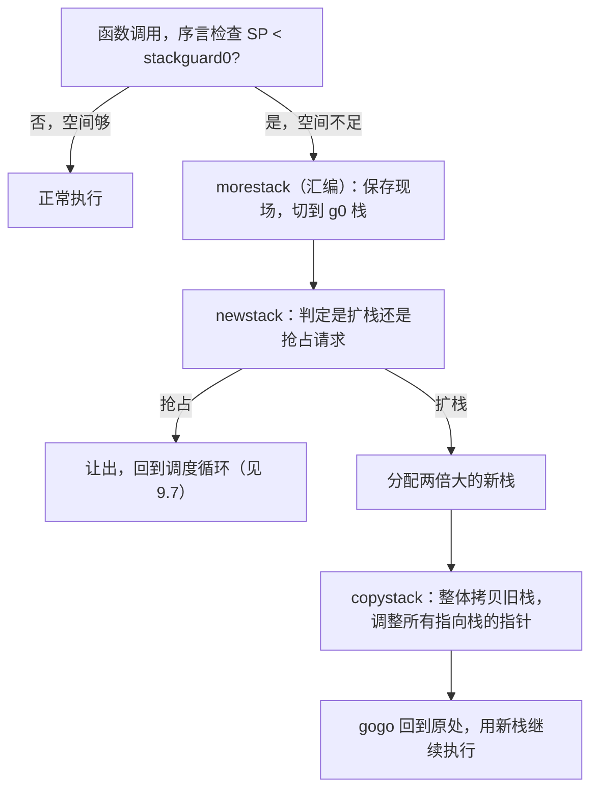

# 第 14 章 执行栈管理

goroutine 廉价到可以同时存在百万个（[9.3](../../part3concurrency/ch09sched/mpg.md)），一个关键
原因藏在它的**栈**里。操作系统线程的栈通常一上来就预留以兆字节计的固定空间,百万个就是 TB 级，
根本不可行。Go 的 goroutine 栈起步只有 **2KB**，且**按需增长**。这套"小而可增长"的栈，是
goroutine 廉价的物理基础。本章讲清它如何分配、如何增长收缩、以及这背后从分段栈到连续栈的
设计演进。

## 14.1 goroutine 栈：堆上的、可增长的

goroutine 的栈不是操作系统给的线程栈，而是由**运行时自己管理、本质分配在堆上**的一段内存。
`g` 结构的前几个字段就描述它：

```go
type stack struct { lo, hi uintptr } // 栈区间 [lo, hi)
type g struct {
    stack       stack    // 实际栈内存 [lo, hi)
    stackguard0 uintptr  // 序言里用来比较的栈界（被抢占时改成 stackPreempt）
    sched       gobuf    // 被切下 CPU 时的现场（SP、PC 等）
    // ...
}
```

`stackguard0` 是关键：编译器在几乎每个函数序言插入一句检查,比较当前 SP 与 `stackguard0`，
若栈快用完（SP 越过了界）就触发扩栈。这句检查同时被协作式抢占搭了便车（把 `stackguard0` 改成
哨兵 `stackPreempt` 即可让函数让出，[9.7](../../part3concurrency/ch09sched/preemption.md)、
[2.2](../../part1overview/ch02asm/callconv.md)）。一个序言检查，服务了栈增长与抢占两件事。

## 14.2 连续栈：从分段栈说起

Go 的栈不是一开始就长这样。早期（到 Go 1.2）用的是**分段栈**（segmented stacks）：栈不够用时，
另外分配一段栈、用链表与原栈相连，函数在新段上继续跑。它能增长，却有一个致命缺陷,
**热分裂问题**（hot split）：若一个频繁调用的函数恰好处在段的边界上，那么每次调用都要跨段
（分配新段）、返回又释放，分配/释放在热路径上反复发生，性能急剧抖动且不可预测。

Go 1.3（Keith Randall）改用**连续栈**（contiguous stacks）：栈不够时，不再接一段，而是**分配
一块两倍大的新栈，把整个旧栈拷贝过去**,栈永远是一整段连续内存。这彻底消除了热分裂,扩栈
虽然要拷贝（一次性成本），但不会在边界反复抖动。连续栈也对缓存局部性更友好。代价是拷贝栈
这件事本身不简单（见 14.4）,但这笔一次性成本远比分段栈那种持续的、不可预测的抖动划算。
这是一处经典的"把分散的、不可预测的小开销，换成集中的、可控的大开销"的取舍。

## 14.3 栈的增长



序言检查失败时，进入汇编例程 `morestack`,它先确认这不是发生在 g0 或信号栈上（那两个栈不能
增长），保存现场，切到 g0 栈调用 `newstack`。`newstack` 先看这究竟是真要扩栈、还是一个被
伪装成栈检查失败的**抢占请求**（[9.7](../../part3concurrency/ch09sched/preemption.md)）,是抢占
就让出，是扩栈就把栈大小**翻倍**、调用 `copystack` 拷贝，然后 `gogo` 回到原处继续。栈大小有
上限（`maxstacksize`），超过即"stack overflow"崩溃,这是无限递归的兜底。

## 14.4 栈的拷贝：难在指针

拷贝栈不是简单 `memmove` 一段内存就完事,难点在**指针**。栈上的变量可能持有**指向栈自身的
指针**（一个局部变量的地址被另一个局部变量引用）。栈被搬到新地址后，这些指针仍指向**旧栈**，
就成了悬垂指针。所以 `copystack` 拷完内存后，必须**遍历新栈、把每一个指向旧栈区间的指针，
按新旧栈的地址差 `delta` 逐一修正**。它借助编译器生成的栈帧指针图（stack map，
[13.7](../ch13gc/safe.md)）找出栈上所有指针。不止栈上的：goroutine 的执行现场 `gobuf`、它挂在
channel 上的 `sudog`（[10.2](../../part3concurrency/ch10chan)）、`defer`/`panic` 记录里指向栈的
指针，全都要一并调整。正因为要精确找出并修正所有栈指针，连续栈才**强依赖精确的栈信息**,这又是
[3.2](../../part1overview/ch03life/compile.md) 说的编译器与运行时深度协同的一例。

这也解释了一个语言事实：为什么只有**栈上分配**的指针才可能指向栈,若一个对象的地址被外部
长期持有，逃逸分析（[15.escape](../../part5toolchain/ch15compile)）会把它分配到**堆**上，因为
栈会移动、栈上的地址不能被外部安全持有。栈拷贝的需求，反过来约束了逃逸分析的规则。

## 14.5 栈的收缩

栈能涨也能缩。收缩发生在 **GC 扫描栈**时（[13.4](../ch13gc/mark.md)）：若发现一个 goroutine 当前
实际只用了不到其栈的**四分之一**，就把栈**减半**(同样通过 `copystack` 拷到一个更小的新栈)。
收缩让那些一度深递归、之后回到浅层的 goroutine 把多占的栈还回去，避免百万 goroutine 各自
攥着一大块用不上的栈。增长靠序言检查触发、收缩靠 GC 触发，一涨一缩，让每个 goroutine 的栈
大小**自适应**其真实需要,这正是"百万 goroutine 仍省内存"的关键。

## 14.6 栈分配的缓存层级

栈本身也是要分配的内存，Go 为它建了一套与对象分配器（[12 内存分配器](../ch12alloc)）**平行**的
缓存层级。小栈（2K/4K/8K/16K）按大小分成若干 order，从**每 P 的 `stackcache`**（无锁快路径）
分配;本地不够则向**全局 `stackpool`**（加锁）补货;更大的栈走 `stackLarge`;再不够才向 mheap
按页要。这套"每 P 缓存 ← 全局池 ← 堆"的结构，与对象分配器（[12.2](../ch12alloc/component.md)）、
调度器（[9.2](../../part3concurrency/ch09sched/steal.md)）的分层减争**一模一样**,你会发现，
Go 运行时反复在用同一套"分层缓存、快路径无锁"的招式来对付不同的资源。栈作为可被 GC 统一回收
的内存被单独管理，也利于回收。

## 14.7 跨系统对照

把 Go 的栈放进谱系：**C/C++ 与原生线程**用操作系统的固定大栈（默认常 1~8MB，`ulimit -s`），
简单但昂贵,这正是"一线程一兆栈、开不了几万个"的根源。**早期 Rust** 也试过分段栈，同样因热
分裂等问题在 1.0 前**放弃**，转而用固定的大线程栈（把轻量并发交给 async/await 这种无栈方案，
[9.3](../../part3concurrency/ch09sched/mpg.md) 的函数染色）。**Java 的虚拟线程（Loom）** 则与 Go
殊途同归,也用可增长/可伸缩的栈来支撑海量轻量线程。可以看到，"小而可增长的栈"是支撑**有栈
轻量并发**（[9.3](../../part3concurrency/ch09sched/mpg.md)）的关键使能技术,Go 选了有栈协程，
就必须把栈做得又小又能伸缩，连续栈正是这个选择的必然产物。从 2KB 起步、按需翻倍、闲时减半、
拷贝时精确调整每一个指针,这套精巧的栈管理，是 goroutine"既廉价又能在任意深度阻塞挂起"这一
承诺背后，运行时默默付出的代价。

## 延伸阅读的文献

1. Keith Randall. *Contiguous stacks design document*（分段栈→连续栈，Go 1.3）.
   https://go.googlesource.com/proposal/+/master/design/contigstacks.md
2. The Go Authors. *Go 1.3 Release Notes（连续栈）.* https://go.dev/doc/go1.3
3. The Go Authors. *runtime/stack.go（morestack/newstack/copystack/shrinkstack）.*
   https://github.com/golang/go/blob/master/src/runtime/stack.go
4. 本书 [9.3 MPG 模型](../../part3concurrency/ch09sched/mpg.md)、
   [9.7 协作与抢占](../../part3concurrency/ch09sched/preemption.md)、
   [13.7 安全点分析](../ch13gc/safe.md)、[12 内存分配器](../ch12alloc).

## 许可

&copy; 2018-2026 The [golang.design](https://golang.design) Initiative Authors. Licensed under [CC-BY-NC-ND 4.0](https://creativecommons.org/licenses/by-nc-nd/4.0/).
