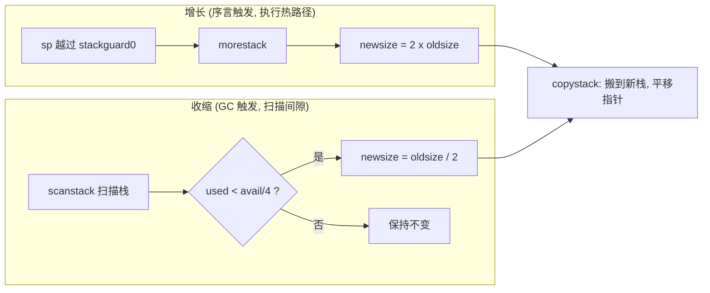

# 14.5 栈的收缩与演进

[14.4](./copy.md) 讲的是栈的「长大」：当函数序言（prologue）发现栈快要用尽，运行时把整段栈
拷贝到一块更大的内存上，栈指针随之平移。这是一条由执行本身驱动的单向力，它只会让栈越来越大。
可是一个 goroutine 的栈深并不单调。一段递归走到很深，再层层返回到浅处，它真正需要的栈早已
缩回，但那块为深递归而扩出的大栈仍挂在它名下。若只有增长没有归还，每个 goroutine 的栈最终都
会停在它历史上的最深点。对一个动辄持有百万 goroutine 的程序，这笔账无法承受。

所以栈也会「缩小」。增长由序言触发，发生在执行的热路径上；收缩则交给垃圾回收，在扫描栈的间隙
顺手完成。两股力一推一收，让每个 goroutine 的栈始终贴着它当下的真实需要。这一节先看收缩的
时机与判据，再说清这套「自我调节」为何是轻量并发的地基，最后把它放回语言演进与跨系统的坐标里。

## 14.5.1 收缩的时机与判据

收缩不是随时能做的。拷贝栈要改写栈上所有指向栈内的指针（[14.4](./copy.md)），这要求运行时
此刻对该 goroutine 的栈拥有精确的指针信息，并且没有别的执行流正踩在这段栈上。能同时满足这两点
的最自然的窗口，正是垃圾回收扫描栈的时候：GC 为了标记存活对象，本就要停住每个 goroutine、
逐帧扫描它的栈（[13.4](../ch13gc/mark.md)、[13.7](../ch13gc/mark.md)）。栈既然已经停稳、
指针图也已备齐，扫描完顺手判断要不要收缩，几乎是零额外成本。

于是 `shrinkstack` 由 `scanstack` 调用。扫描在确认栈安全可缩后才动手；若当下不安全，就把意图
记在 `gp.preemptShrink` 上，留到下一个同步安全点再补做：

```go
// scanstack：GC 扫描某个 goroutine 的栈（节选自 runtime/mgcmark.go）
func scanstack(gp *g, gcw *gcWork) int64 {
    // ... 统计本次要扫描的栈大小，用于初始栈尺寸的自适应估计 ...
    if isShrinkStackSafe(gp) {
        shrinkstack(gp)         // 不安全的窗口之外，顺手收缩
    } else {
        gp.preemptShrink = true // 否则推迟到下一个同步安全点
    }
    // ... 继续扫描栈帧，标记其中的指针 ...
}
```

什么叫「安全」？`isShrinkStackSafe` 把几类不能动栈的处境一一排除：goroutine 正陷在系统调用里
（`syscallsp != 0`，系统调用可能持有指向栈的裸指针，且最内层栈帧没有精确指针图）；停在异步
抢占的安全点上（同样缺精确指针图）；正处在「已调用 `gopark` 准备挂到 channel、但 `activeStackChans`
尚未置位」的窗口；以及为了配合 `suspendG` 而停在 `_Gwaiting` 的 goroutine。任何一条命中，本轮
就不缩。

「推迟」这件事落在 `g` 的两三个字段上。回顾 [14.1](./grow.md) 给出的 `g` 速写，与收缩相关的
只有这么几样：

```go
// g：与栈收缩相关的字段（速写）
type g struct {
    stack       stack   // 实际栈内存区间 [stack.lo, stack.hi)
    stackguard0 uintptr // 序言比对的警戒线，跨过即触发增长（见 14.2）
    sched       gobuf   // 执行现场，其中 sched.sp 是栈指针，量出实际占用
    preemptShrink bool  // 本轮收缩被推迟，待下一个同步安全点补做
    // ...
}
```

`scanstack` 在不安全的窗口里把 `preemptShrink` 置为 `true`，并不丢弃这次收缩的意图。等到该
goroutine 因抢占或栈增长进入 `newstack`,那是一个同步安全点，指针图已精确,运行时便检查这个
标志，若为真就当场补做一次 `shrinkstack` 再清零。换句话说，收缩从不强行插队到危险的时刻去做，
它只是被排到下一个天然安全的路口。

真正决定缩不缩、缩多少的，是 `shrinkstack` 里一段极短的算术：

```go
// shrinkstack：必要时把 gp 的栈减半（节选自 runtime/stack.go）
func shrinkstack(gp *g) {
    // ... 前置断言：gp 已停稳、本轮持有其栈、当前窗口安全 ...

    oldsize := gp.stack.hi - gp.stack.lo
    newsize := oldsize / 2
    // 已经到最小栈，不再往下缩
    if newsize < fixedStack {
        return
    }
    // 只在「实际使用不到当前栈的 1/4」时才收缩
    avail := gp.stack.hi - gp.stack.lo
    if used := gp.stack.hi - gp.sched.sp + stackNosplit; used >= avail/4 {
        return
    }

    copystack(gp, newsize)      // 复用 14.4 的拷贝机制，搬到更小的栈上
}
```

判据可以读成两句话。其一，目标尺寸是当前的一半（`newsize = oldsize / 2`），且不低于最小栈
`fixedStack`（多数平台上是 $2\text{KB}$，由 `stackMin = 2048` 向上取到 $2$ 的幂得来）；已经在
最小栈上的 goroutine 永远不缩。其二，只有当此刻的实际占用 `used` 不足整段栈 `avail` 的 $1/4$
时才动手。这里的 `used` 从栈顶 `hi` 量到栈指针 `sp`，再加上一段 `stackNosplit` 余量，以保证缩
完之后那串不可分裂（nosplit）的函数仍有地方落脚；`avail` 则是整段分配的大小 `hi - lo`。

为什么阈值取 $1/4$ 而非 $1/2$？因为缩到一半之后，原先「不足 $1/4$」的占用会变成「不足 $1/2$」，
正好落在新栈的安全区间内，不至于一缩就又逼近警戒线、下一次序言立刻触发增长。$1/4$ 这道余量
把收缩与增长隔开，避免在某个临界深度上反复拷贝来回抖动。判断本身只是几次减法和一次比较，挂在
GC 扫描的尾巴上，开销可以忽略。真正花钱的 `copystack` 只在判据通过、确实值得搬家时才发生。

## 14.5.2 自我调节：百万 goroutine 何以轻

把增长与收缩并排看，会发现它们是一对几何对称的力：



增长把栈翻倍，收缩把栈减半，两边都是几何级数，且共用 [14.4](./copy.md) 的同一套 `copystack`。
其后果是：每个 goroutine 的栈会向它「当下真实所需」收敛。栈深上升时翻倍扩容，让扩容次数对深度
取对数；栈深回落后，GC 一轮轮把闲置的大栈减半,直到贴近 $2\text{KB}$ 的最小栈。没有哪个 goroutine
能长期占着一块它早已不用的大栈。

这正是「百万 goroutine 仍然轻」的关键所在。一个新 goroutine 起步只要 $2\text{KB}$ 栈
（[14.2](./grow.md)），$10^6$ 个 goroutine 的起始栈总量约 $2\text{GB}$,但绝大多数 goroutine
浅尝辄止，真实占用远小于此。少数一度递归很深的 goroutine 会暂时撑大栈，可只要它返回到浅处，
随后的 GC 周期就会把多出来的部分逐步收回。栈的总内存因此不锚定在「所有 goroutine 历史最深点
之和」这个灾难性的上界，而是浮动在「此刻各 goroutine 真实所需之和」附近。增长保证够用，收缩
保证不浪费，二者合起来让栈成为一种自我调节的资源。

几何伸缩还顺带带来一个均摊上的好处。设某段执行里栈深的峰值为 $S$，最小栈为 $S_0$。增长每次
翻倍，从 $S_0$ 涨到 $S$ 至多发生 $\lceil \log_2 (S/S_0) \rceil$ 次拷贝；收缩每次减半，从 $S$
回落到 $S_0$ 也至多 $\lceil \log_2 (S/S_0) \rceil$ 次。两端都对栈深取对数，单次拷贝的代价又与
当时的栈大小成正比，于是整段生命周期里花在拷贝上的字节数被 $S$ 的常数倍所界定，而非随调用
次数线性累积。$1/4$ 阈值留出的余量进一步保证：栈深若只在某个点附近小幅起伏，不会触发「一增
一缩」的反复拷贝。这正是当年连续栈替换分段栈要解决的 hot split 问题（[14.5.3](#1453-演进与跨系统可增长栈作为使能技术)）在收缩侧的回响。

代价并非没有。收缩要拷贝、要改指针，是有成本的工作,Go 把它藏进了 GC 本就要做的栈扫描里，
让两件事共享一次「停住并遍历栈」的开销。这是一种典型的取舍：用 GC 时已付的那份停顿，换来栈
内存的及时归还。运行时也留了 `GODEBUG=gcshrinkstackoff=1` 这道开关，可在排查时整体关掉收缩。

## 14.5.3 演进与跨系统：可增长栈作为使能技术

把视野放宽，可增长、可收缩的栈不是 Go 的装饰，而是「栈式轻量并发」能够成立的前提。沿着各家
的不同选择看一圈，这一点会格外清楚。

C/C++ 与操作系统线程走的是另一条路：每个线程一块**固定的大栈**。线程创建时就向虚拟地址空间
预留一大段（Linux 上由 `ulimit -s` 决定，默认常是 $8\text{MB}$），运行期间既不增长也不收缩。
这套方案简单、零运行时开销，但栈的尺寸成了并发度的硬上界,即便每块大栈靠惰性缺页只占用真正
触及的物理页，地址空间的预留与线程本身的内核开销，也让可同时存活的线程数停在几千的量级。要
开百万级并发，固定大栈这条路走不通。

Rust 早期其实尝试过 Go 式的可增长栈。它的绿色线程一度采用**分段栈**（segmented stacks）：
栈由一截截小段用链表串起，不够就再挂一段。但分段栈有个著名的「hot split」毛病,当调用恰好
发生在某一段将满时，进入子调用要新分配一段、返回时又立刻释放，若这样的调用落在紧凑循环里，
分配与释放就会反复抖动，把性能拖垮。2013 年 11 月，Rust 在 1.0 之前正式放弃了分段栈，转向
依赖操作系统惰性映射的大固定线程栈，并最终把绿色线程整体移出标准库，走上了**无栈协程**
（stackless `async`/`.await`）的道路。代价是「函数染色」问题（[9.3](../../part3concurrency/ch09sched/mpg.md)）:
`async` 函数与普通函数从此分属两个世界，调用要跨越 `.await`，颜色会沿调用链传染。这是一次清醒
的取舍,Rust 用染色的麻烦，换掉了运行时管理栈的全部复杂度与不确定开销。

Java 的方向则与 Go 趋同。2023 年随 Java 21 定稿的虚拟线程（JEP 444，Project Loom）也采用
可增长、可调整大小的栈式协程:虚拟线程挂起时把栈帧存到堆上，恢复时再装回载体线程，本质上
和 Go 一样让每个轻量执行体的栈按需伸缩，从而把并发度从线程数的几千级推到百万级，且不引入函数
染色。Go 与 Loom 殊途同归，印证了同一个判断:要做**栈式**（stackful）的轻量并发，可增长的栈
几乎是绕不开的使能技术。

| 系统 | 栈模型 | 是否增长 / 收缩 | 并发上限量级 | 染色 |
|------|--------|----------------|-------------|------|
| C/C++、OS 线程 | 固定大栈（`ulimit -s`，1~8MB） | 否 / 否 | $10^3$~$10^4$ | 无（无协程） |
| Rust 早期绿色线程 | 分段栈 | 增长（hot split） | 高，但抖动 | 无 |
| Rust（1.0 后） | 大固定线程栈 + 无栈 `async` | 否 / 否 | $10^6$（无栈） | 有（async/await） |
| Java 虚拟线程（Loom） | 可伸缩栈式协程 | 增长 / 可调整 | $10^6$ | 无 |
| Go goroutine | 连续可增长栈（2KB 起步） | 增长（翻倍）/ 收缩（减半） | $10^6$ | 无 |

Go 自己也走过分段栈这一段弯路。Go 1.2 及更早用的正是分段栈，同样受 hot split 之苦；Go 1.3
由 Keith Randall 主导，改为**连续栈**（contiguous stacks）：栈不再分段，增长时整段拷贝到更大
的连续内存上。支撑这次切换的关键不变量来自编译器的逃逸分析,指向栈上数据的指针只会沿调用树
向下传递，因此拷贝栈时能够安全地找到并改写所有栈内指针。本节讲的收缩，正是这套连续栈机制顺
理成章的另一半：既然增长靠拷贝，收缩也不过是朝相反方向再拷一次。

## 延伸阅读的文献

1. Keith Randall. *Contiguous stacks*. Go design document, 2013-2014. https://docs.google.com/document/d/1wAaf1rYoM4S4gtnPh0zOlGzWtrZFQ5suE8qr2sD8uWQ/edit
2. The Go Authors. *Go 1.3 Release Notes: Stack management*. 2014. https://go.dev/doc/go1.3#stacks
3. The Go Authors. `runtime/stack.go`: `shrinkstack`, `isShrinkStackSafe`, `copystack`（go1.26.4）. https://github.com/golang/go/blob/go1.26.4/src/runtime/stack.go
4. The Go Authors. `runtime/mgcmark.go`: `scanstack`（go1.26.4）. https://github.com/golang/go/blob/go1.26.4/src/runtime/mgcmark.go
5. Brian Anderson. *Abandoning segmented stacks in Rust*. rust-dev mailing list, 2013-11-04. https://mail.mozilla.org/pipermail/rust-dev/2013-November/006314.html
6. Ron Pressler, Alan Bateman. *JEP 444: Virtual Threads*. OpenJDK, 2023（Java 21）. https://openjdk.org/jeps/444
7. Boats. *Futures and Segmented Stacks*. 2024. https://without.boats/blog/futures-and-segmented-stacks/

## 许可

&copy; 2018-2026 [Changkun Ou](https://changkun.de). All rights reserved.
