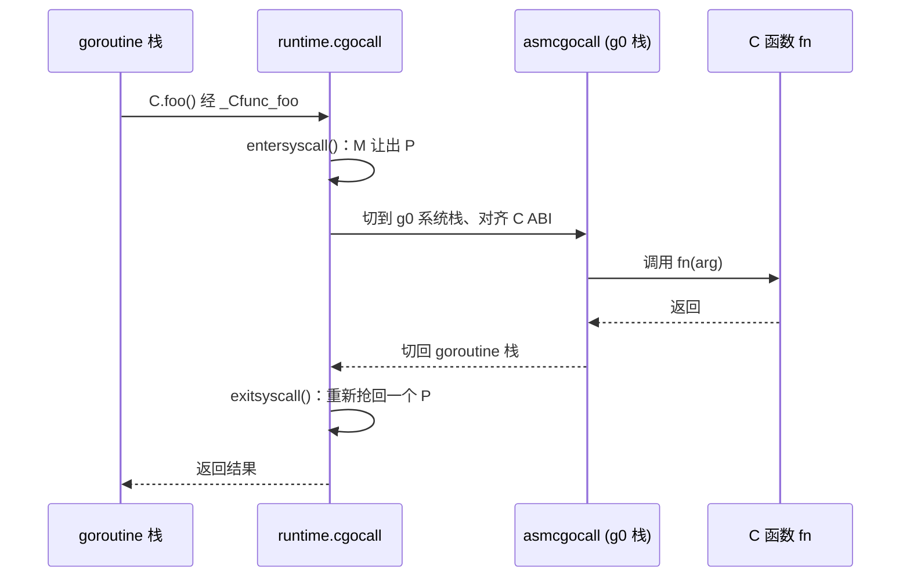

# 15.6 cgo

「cgo is not Go.」这是 Rob Pike 在一篇博客里给 cgo 下的判词。它道破了一件容易被忽略的事：
当你在 Go 源文件里 `import "C"`，写下一行 `C.foo()` 时，你已经踏出了 Go 这门语言为你
划定的世界，进入了另一个由 C 的 ABI、C 的栈、C 的内存模型构成的世界。cgo 是这两个世界之间的
桥，桥很有用，但过桥要付通行费，而且费用不低。

这一节不逐行翻译 `runtime/cgocall.go`，而是回答三个问题：为什么从 Go 调一个 C 函数会比调一个
Go 函数昂贵一两个数量级；运行时为这一次跨界究竟做了哪些事；以及由此衍生出的那条「Go 指针不可
被 C 长期持有」的规则从何而来。读完它，「cgo is not Go」这句话的分量就具体了。

## 15.6.1 两个世界的落差

要理解 cgo 的代价，先要看清桥的两端有多么不同。Go 与 C 在四件根本的事情上各行其是。

**调用约定不同。** Go 有自己的寄存器调用约定（[2.2](../../part1overview/ch02asm/callconv.md)），
参数与返回值的传递、栈帧的布局、哪些寄存器由调用方保存，都与 C 在该平台上的 ABI 不一致。
跨界调用必须先把参数按 C 的 ABI 重新摆放，把栈指针对齐到 C 要求的边界。

**栈不同。** Go 的 goroutine 栈是**可增长**的（[14](../../part4memory/ch14stack)），初始只有
几 KB，靠编译器在函数入口插入的栈检查在需要时拷贝、搬迁整条栈。C 函数对此一无所知，它假定自己
跑在一条固定的、足够大的系统栈上，绝不会被搬走。让 C 代码跑在一条随时可能被移动的 goroutine
小栈上是灾难性的，因此跨界前必须切换到 M 的系统栈 `g0`，那是一条由操作系统分配、不会增长也
不会搬迁的栈。

**内存管理不同。** Go 有精确的垃圾回收器，它会**移动**对象、**回收**不再可达的对象，并依赖
类型信息扫描每一个指针。C 的内存是手动管理的 `malloc`/`free`，对 GC 完全不透明。GC 无法扫描
C 持有的内存，也无法知道一块 Go 对象正被某段 C 代码引用着。

**调度器不可见。** Go 的调度器（[9](../../part3concurrency/ch09sched)）在 M、P、G 三者上编排
并发，它能抢占一个 goroutine、能把阻塞的 M 与 P 解绑让别的 M 接管 P。可一旦控制权交给 C，
调度器就「看不见」这段执行了：它不能抢占一个正在 C 里跑的线程，也无法让这个线程上的 Go 栈
被扫描。

这四条落差合起来意味着：一次 cgo 调用不是简单的「跳转到另一个函数地址」，而是一次需要**完整
状态转换**的跨界。

## 15.6.2 一次 cgo 调用做了什么

编译器替你铺好了桥头。当你写下 `C.foo()`，cgo 工具会生成一个 Go 包装函数 `_Cfunc_foo`，
它通过 `//go:linkname` 把调用接到运行时的 `runtime.cgocall` 上，并把真正的 C 函数入口地址
与参数帧一并传进去。剩下的跨界由运行时完成，核心是 `cgocall` 与汇编写就的 `asmcgocall`
这一对：

```go
// runtime/cgocall.go：从 Go 调用 C（裁剪后的速写）
//go:nosplit
func cgocall(fn, arg unsafe.Pointer) int32 {
    mp := getg().m
    mp.ncgocall++ // 记账：这台 M 上的累计 cgo 调用次数

    // 宣告进入「系统调用」：把当前 M 与 P 在记账上解绑，
    // 这样调度器可以另起一个 M 去运行别的 goroutine，
    // 也让这次调用落在 $GOMAXPROCS 的计数之外（见 9.5）
    entersyscall()

    mp.incgo = true
    mp.ncgo++ // 标记：此刻这条调用栈上有 C 帧

    // 切到 g0 系统栈、对齐 C 的 ABI、真正调用 fn(arg)
    errno := asmcgocall(fn, arg)

    mp.incgo = false
    mp.ncgo--

    // 回到 Go 世界：阻塞直到能在不违反 $GOMAXPROCS 的前提下继续跑 Go
    exitsyscall()

    // 防止 GC 在「时间倒流」的窗口里把仍要用的参数误判为已死
    KeepAlive(fn)
    KeepAlive(arg)
    return errno
}
```

`asmcgocall`（在 `asm_$GOARCH.s` 里）做的是那件 Go 无法用 Go 表达的事：保存当前 goroutine 的
栈指针，把执行栈切到 `m.g0`，按 C 的 ABI 对齐栈，调用 `fn`，C 返回后再把栈切回原来的
goroutine（`m.curg`）并恢复现场。它被刻意写成不增长栈、不分配内存，因为此刻 M 在记账上正处于
「系统调用中」，做这两件事都不安全。整条链路串起来是这样：



反方向（C 回调 Go）走的是 `crosscall2` → `_cgoexp_GoF` → `cgocallback` → `cgocallbackg`
这条对偶的路径：从 `g0` 栈切回真正的 goroutine 栈，`exitsyscall` 抢回 P，跑完 Go 回调再
`entersyscall` 切回去。它把上面的每一步都反着做了一遍，因而更贵，这里不展开，要点是：**桥可以
双向走，但每个方向都要付一次完整的转换费**。

## 15.6.3 为什么贵

把上面的步骤摊开，代价就一目了然了。一次普通的 Go 函数调用，快时只是一条 `CALL` 指令加几次
压栈。而一次 cgo 调用至少要：`entersyscall` 把 M 与 P 解绑并改写调度状态、保存与切换栈指针、
按 C 的 ABI 重新对齐与摆放参数、调用、返回后 `exitsyscall` 重新竞争一个 P（拿不到就要阻塞或
自旋）、再恢复 goroutine 栈。这一整套下来，开销通常是一次 Go 调用的**一两个数量级**。具体数字
随平台与负载浮动，但量级上的差距是结构性的，省不掉。

代价还不止于单次调用的固定开销，更深的两处来自前面那四条落差：

- **一个阻塞的 C 调用会占住一整个线程。** Go 调度器看不进 C，无法抢占一个卡在 C 里的线程。
  若这次 C 调用阻塞（比如做了同步 I/O 或等锁），承载它的 M 就被钉死，调度器只能再创建一个 M
  来顶替它在 P 上的工作。大量并发的阻塞型 cgo 调用，会让线程数膨胀。
- **C 内存对 GC 不可见。** GC 扫不进 C 那一侧分配的内存，也无法移动正被 C 引用的 Go 对象。
  这把约束直接长成了下一节的指针规则。

由此得出 cgo 的适用边界：它适合**少量、粗粒度**的调用，把一段完整的工作整体交给 C 那侧
（一次调用做很多事），而**极不适合**放进热点的、细粒度的循环里反复跨界。如果你发现自己在一个
紧循环里每次迭代都 `C.something()`，那几乎一定是设计错了位置：要么把循环搬到 C 那侧整体调一次，
要么干脆别用 cgo。

## 15.6.4 工程上的代价：这才是「is not Go」的全部

性能只是账单的一半。引入 cgo 还会折损 Go 工具链里最让人省心的那几样东西，这部分代价不出现在
火焰图上，却天天伴着你。

纯 Go 程序的构建只需要 Go 工具链本身，cgo 则要求目标平台有一个可用的 **C 编译器**。这一条
连锁地破坏了 Go 的几项招牌特性：默认的**静态链接**变得不再理所当然（链接 C 库常常引入动态
依赖）；**交叉编译**从「设个环境变量」退化成「准备一整套目标平台的 C 交叉工具链」；构建**变慢**，
因为要额外调用 gcc/clang 编译 C 那侧；**部署变复杂**，二进制可能依赖目标机器上特定版本的
共享库。Go 当初用静态、快速、可交叉的构建换来的部署省心，cgo 会把它们一并交还回去。

所以「cgo is not Go」不只是一句关于性能的提醒。它是说：一旦 `import "C"`，你的项目就不再
完全享有 Go 这门语言连同其工具链承诺的那套性质，运行期慢一两个数量级，构建期失去静态与
交叉，这才是这句话的全部分量。

## 15.6.5 指针传递规则

四条落差里，「GC 会移动和回收对象」这一条，催生了 cgo 最容易被踩坑、也最该记牢的一组规则。
它们全都源自同一个事实：**Go 的对象不归 C 管，GC 随时可能搬走或回收它**。`cmd/cgo` 的官方
文档把规则定得很细，核心是两句话：

1. **C 不得在调用返回后还持有一个 Go 指针**，除非那块内存被 `runtime.Pinner` 固定住。调用
   期间传入的 Go 指针是「隐式钉住」的，可以安全使用；可一旦 C 函数返回，GC 又获得了移动或回收
   它的自由，C 那侧存下的那份指针就成了悬垂引用。
2. **传给 C 的那块 Go 内存，自身不得再包含指向未钉住 Go 内存的指针**。比如可以把一个
   `*C.int` 或一段不含指针的 Go 内存交给 C，但不能把一个内部还嵌着 Go 指针的结构体整体递过去。

为什么是这两条而不是别的？因为 GC 的精确扫描依赖类型信息，它只在 Go 这一侧成立。C 拿到指针后
任何「把它存进一个 C 结构体、过一会儿再解引用」的操作，GC 都无从知晓，也就无法在移动对象时
同步更新它。第二条则是第一条的递归版本：哪怕你递过去的外层指针守规矩，只要它指向的内存里**藏着**
别的 Go 指针，那个内层指针同样会被 C 间接持有，同样不可控。

这组规则由运行时的 **cgocheck** 在调用边界上动态强制。cgo 生成的包装代码会插入
`cgoCheckPointer`，在把参数递给 C 之前递归扫描它，一旦发现「Go 指针指向了未钉住的 Go 指针」
就当场 `panic`，把一个隐蔽的 GC 损坏问题变成一个当场可见的崩溃。检查的力度可由
`GODEBUG=cgocheck=...` 调节。

当你确实需要一块**生命周期跨越调用、长期被 C 持有**的内存时，正确的做法不是和检查器对抗，
而是把内存放到 GC 管不着的地方：

```go
// 反例：C 在返回后持有了 Go 指针，GC 可能搬走 buf 的底层数组，
//       C 那份指针就此悬垂
buf := make([]byte, 1024)
C.register_callback_buffer(unsafe.Pointer(&buf[0])) // 危险

// 正解一：用 C.malloc 分配，这块内存不在 GC 视野内，
//         可由 C 长期持有，用完显式 C.free
p := C.malloc(1024)
defer C.free(p)
C.register_callback_buffer(p)

// 正解二：要把一个 Go 对象长期交给 C 引用，传「句柄」而非裸指针，
//         用 cgo.Handle 把对象换成一个整数 token，C 存 token，
//         回调时再用 token 取回对象
h := cgo.NewHandle(myGoObject)
C.register_with_token(C.uintptr_t(h)) // C 侧只存这个整数
// ... 回调里：v := h.Value()；用完 h.Delete()
```

`C.malloc` 把内存搬出 GC 的管辖，代价是你要自己负责 `free`，Go 的内存安全在这块内存上不再
成立。`cgo.Handle`（Go 1.17 引入）则更优雅：它不把指针暴露给 C，而是给 C 一个不透明的整数
token，Go 侧维护 token 到对象的映射，既让 C 能「长期引用」一个 Go 对象，又不违反任何指针规则。
若只是要在一次调用期间把一块 Go 内存钉住、防止 GC 移动它，`runtime.Pinner`（Go 1.21 引入）
是更轻的选择。

## 15.6.6 何时用，何时绕开

把前面几节的取舍收成一张决策表：

| 场景 | 倾向 | 理由 |
|---|---|---|
| 复用一个成熟的大型 C 库（如 SQLite、libgit2、视频编解码） | 用 cgo | 重写代价远大于跨界开销，且调用粗粒度 |
| 偶尔调一次系统级 C API | 用 cgo | 调用稀疏，固定开销可摊薄 |
| 性能热点的细粒度循环 | 绕开 | 跨界开销淹没收益，考虑纯 Go 重写或把循环整体下沉到 C |
| 追求静态链接、跨平台交叉编译、快构建 | 绕开 | cgo 会折损这三项工具链特性（见 [15.6.4](#1564-工程上的代价这才是-is-not-go-的全部)） |
| 高并发且 C 调用可能阻塞 | 谨慎 | 每个阻塞调用占住一个线程，线程数易膨胀 |

一条朴素的经验：**先问能不能不用 cgo**。Go 生态里许多过去靠 C 库实现的能力，如今已有成熟的
纯 Go 替代（数据库驱动、压缩、加密、图像处理多有纯 Go 实现），用它们能保住整条工具链的性质。
只有当 C 库的价值确实无可替代、且调用模式天然粗粒度时，过桥的通行费才付得值。

cgo 与逃逸分析（[15.5](./escape.md)）、指针检查器（[15.4](./unsafe.md)）一样，是编译器与运行时
协作在 Go 的安全边界上开的一道受控的口子。它把 Go 的世界与 C 的世界缝在一起，缝合处的每一针
都是成本，性能的、内存安全的、工程的。理解这些成本从何而来，才能判断这道口子值不值得开，以及
开多大。

## 延伸阅读的文献

1. The Go Authors. *Command cgo.* https://pkg.go.dev/cmd/cgo
   （cgo 用法与「Passing pointers」指针传递规则的权威定义）
2. Andrew Gerrand. *C? Go? Cgo!* The Go Blog, 2011.
   https://go.dev/blog/cgo （cgo 入门与设计意图）
3. Rob Pike. *cgo is not Go.* https://dave.cheney.net/2016/01/18/cgo-is-not-go
   （对 cgo 工程代价的经典论述与转述）
4. The Go Authors. *runtime/cgocall.go.*
   https://github.com/golang/go/blob/master/src/runtime/cgocall.go
   （`cgocall`/`asmcgocall`/`cgocallbackg` 与 cgocheck 的实现）
5. The Go Authors. *runtime.Pinner.* https://pkg.go.dev/runtime#Pinner
   与 *runtime/cgo.Handle.* https://pkg.go.dev/runtime/cgo#Handle
   （长期持有 Go 对象的两种受支持手法）
6. 本书 [2.2 调用规范](../../part1overview/ch02asm/callconv.md)、
   [9.5 线程管理](../../part3concurrency/ch09sched/thread.md)、
   [15.4 指针检查器](./unsafe.md)、[15.5 逃逸分析](./escape.md)。
