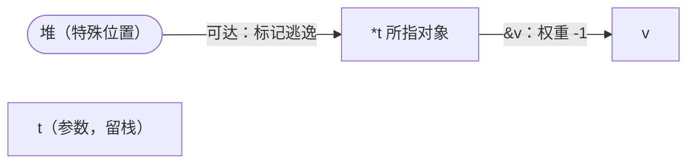

# 15.5 逃逸分析

Go 程序员从不手动决定一个变量放栈还是放堆，这件事由编译器的**逃逸分析**（escape analysis）
自动完成。它是 Go 性能的隐形功臣：把尽可能多的对象留在栈上，能大幅减轻垃圾回收
（[13 垃圾回收](../../part4memory/ch13gc)）的负担。这一节讲清它怎么判断、怎么实现、为何重要。

## 15.5.1 逃逸：决定栈还是堆

核心问题：一个变量该分配在**栈**上（随函数返回自动消失，零 GC 成本），还是**堆**上
（生命周期不定，由 GC 管理）？判据是**生命周期**：若一个变量的引用在函数返回后仍可能被用到，
它就不能放栈上（栈帧已随返回销毁），必须**逃逸**到堆。逃逸分析就是静态地回答这个问题，
判断「这个变量的地址会不会跑出它所在函数的作用域」。

`go/cmd/compile/internal/escape` 把这件事说成两条必须维持的不变量：（1）指向栈对象的指针
**不能被存入堆**；（2）指向栈对象的指针**不能活过该对象本身**，比如声明它的函数已经返回、
栈帧被销毁，或同一段栈空间在循环的不同迭代中被复用给了逻辑上不同的变量。只要一个变量的地址
有可能违反这两条，它就被判定逃逸，改为堆分配。

最直接的观察手段是 `go build -gcflags=-m`，它让编译器把每一处逃逸判断打印出来。把下面这段
喂给它（加 `-l` 关掉内联，让输出聚焦在逃逸本身）：

```go
func ret() *int { x := 42; return &x } // 返回局部变量的地址
```

```
$ go build -gcflags='-m -l' demo.go
./demo.go:1:18: moved to heap: x
```

`x` 本是个普通局部变量，但它的地址被 `return` 带出了函数，调用方拿到的指针必须在 `ret` 返回
后依然有效，于是 `x` 被「搬到堆上」（moved to heap）。这就是最典型的一类逃逸：`return &x`。

## 15.5.2 典型的逃逸场景

逃逸的根源只有一个：地址外泄到了一个活得比本函数久的地方。但它在代码里有几副不同的面孔，
值得逐一认清。

第一类，**地址被存进一个更长命的结构**。把局部变量的地址赋给一个生命周期更长的对象的字段，
该地址就随那个对象活了下去：

```go
type T struct{ p *int }

func store(t *T, v int) { t.p = &v } // v 的地址被写进 t 指向的对象
```

```
$ go build -gcflags='-m -l' demo.go
./demo.go:3:12: t does not escape
./demo.go:3:18: moved to heap: v
```

`t` 本身只是被读写、没有外泄，故「does not escape」，可以留栈；但 `v` 的地址被写进了 `*t`，
而 `*t` 可能比 `store` 活得久，于是 `v` 逃逸。

第二类，**传给 `interface{}` 参数**（[4.2](../../part2lang/ch04type/interface.md)）。把一个值
装进接口，编译器往往无法静态确定接口背后的方法会把这个指针流向何处，按保守原则只能让它逃逸。
最常见的就是 `fmt.Print` 一族：

```go
fmt.Fprint(w, devnull{}, "hi")
```

```
./demo.go:10:20: devnull{} escapes to heap
./demo.go:10:24: "hi" escapes to heap
```

被装箱的实参「escapes to heap」。这也解释了一个让初学者困惑的现象：一行看似无害的 `fmt`
打印，会让本可留栈的值悄悄进堆。指针流经接口这条无法分析的链路，正对应 [4.2](../../part2lang/ch04type/interface.md)
讲的接口动态派发。

第三类，**被闭包捕获、且闭包本身外传**（[6.1](../../part2lang/ch06func/func.md)）。闭包按引用
捕获外层变量，若闭包逃出了声明它的函数，被捕获的变量自然也得跟着逃：

```go
func counter() func() int {
	n := 0
	return func() int { n++; return n } // 闭包被返回，n 被它持有
}
```

```
./demo.go:3:2: moved to heap: n
./demo.go:3:9: func literal escapes to heap
```

闭包 `func literal escapes to heap`，被它捕获的 `n` 随之 `moved to heap`。若闭包只在本函数内
就地调用、不外传，`n` 仍可留栈。

还有一类与编译期信息有关：**大小在编译期未知或过大**的分配也会逃逸，因为栈帧大小要在编译期
定下来，无法容纳一个运行时才知道大小的对象：

```go
buf := make([]byte, 64) // 大小已知且不外泄：留栈
s := make([]byte, n)    // n 运行时才知道：逃逸
```

```
./demo.go:1:13: make([]byte, 64) does not escape
./demo.go:2:11: make([]byte, n) escapes to heap
```

反过来，只在函数内使用、地址不外泄的局部变量，编译器会放心地留在栈上。判断的全部依据，
就是地址有没有一条通向「活得更久之处」的流向。

## 15.5.3 它怎么工作

逃逸分析本质是一种对 AST 做的**静态数据流分析**。编译器为每个函数构建一张有向带权图：
顶点称为**位置**（location），代表由语句或表达式分配出的变量（包括 `new`、`make`、复合字面量
这些隐式分配）；边代表赋值，把一个位置的值流向另一个位置。

边的**权重**记录这次赋值经过了几层「取址 / 解引用」，用解引用次数减取址次数表示。源码里的
例子很直白：

```
p = &q    // 权重 -1（取一次址）
p = q     // 权重  0
p = *q    // 权重 +1（解一次引用）
p = **q   // 权重 +2
```

取址只能作用于可寻址表达式，而 `&x` 本身不可寻址，所以权重不会低于 $-1$。建好图后，编译器
从「堆」这个特殊位置出发，沿边遍历，寻找可能违反 §15.5.1 那两条不变量的赋值路径：若某个变量
的地址沿图最终流到了会活过本函数的地方（返回值、全局变量、被存入堆的对象、逃逸的参数等），
它就被标记为需要堆分配。

以 §15.5.2 的 `func store(t *T, v int) { t.p = &v }` 为例，图里有三个相关位置：参数 `t`、
参数 `v`，以及那个特殊的「堆」位置。`t.p = &v` 这条赋值在「`t` 所指对象」与 `v` 之间连一条
取址边（权重 $-1$）；而 `t` 作为可能指向堆对象的参数，自身与「堆」相连。从「堆」出发沿边遍历，
能经由 `t` 到达 `v`，于是 `v` 的地址被判定会流向一个活得更久之处，`v` 被标记逃逸；`t` 本身只是
被读写、未把自己的地址外泄，因而留栈。是否从「堆」可达，正是逃逸与否的判据：



为了跨函数也能分析，编译器为每个函数的参数总结一份**参数标签**（parameter tag），记录这个参数
会流向何处。源码里用一个紧凑的 `leaks` 表达这件事，对每个参数记下它到几类目的地的最短解引用
层数：

```go
// leaks：参数到「堆 / 被改写对象 / 被调用方 / 第 i 个返回值」的流向摘要（速写）
type leaks [8]uint8

func (l leaks) Heap() int      // 到堆的最短解引用层数，无则 -1
func (l leaks) Result(i int) int // 到第 i 个返回值的层数
```

于是一个透传指针的函数会被打上「参数流向返回值」的标签：

```go
func passthrough(p *int) *int { return p }
```

```
./demo.go:1:18: leaking param: p to result ~r0 level=0
```

`leaking param: p to result` 就是这份标签的人类可读版。调用点拿到被调函数的标签后，不必重新
钻进函数体，就能判断实参是否会因这次调用而逃逸,这让逃逸分析在保持单遍、线性代价的同时，
具备了跨函数的精度。

这套分析的灵魂是**保守**。当编译器**无法确定**一个指针会不会逃逸时（典型如指针流经接口、流经
无标签的间接调用），它一律选择「宁可逃逸」，把对象放堆。原因不对称：放堆永远是安全的（有 GC
兜底），而错误地放栈会留下**悬垂指针**,栈帧一销毁，那个地址就指向了垃圾。安全的方向只有一个，
分析就往那个方向兜底。代价是精度：分析越粗，越多本可留栈的对象被冤枉进堆；分析越精，越多
短命对象能安全地留在栈上。逃逸分析这些年的演进，多数是在不破坏保守性的前提下把精度一点点磨高。

## 15.5.4 与连续栈是同一个约束的两面

逃逸分析为什么必须如此严格？答案藏在栈的实现里。Go 的栈是**连续栈**（[14.4](../../part4memory/ch14stack)）：
栈会增长、会被整体搬到新的地址，搬动时运行时遍历并改写栈上所有指向栈内的指针。这个机制能成立，
前提是**栈上对象的地址只在栈内部被引用**,运行时知道去哪里找它们、改它们。一旦某个栈地址被
外部（堆对象、全局变量、别的 goroutine）长期持有，栈一搬动，那个外部引用就指向了错误的位置，
而运行时无从知晓、无法修正。

所以连续栈给逃逸分析定下了一条铁律：**任何会被外部长期持有的地址，都必须逃逸到堆**。堆地址
是稳定的，不随栈搬动。逃逸分析与栈管理因此是同一个约束的两面，前者在编译期把「会被外部持有」
的对象筛出去赶进堆，后者才能在运行时放心地搬动剩下的栈。§15.5.1 那两条不变量，本质上就是
「让连续栈得以成立」的充分条件。

## 15.5.5 为何如此重要

逃逸分析是 Go「既享 GC 的便利、又不至于被 GC 拖垮」的关键。它在编译期就**消化掉大量短命对象**，
让它们根本不进堆、不劳 GC。栈上对象随函数返回成批消失，分配与回收的成本都接近于零；
而进了堆的对象，每一个都要 GC 去标记、清扫。把短命对象拦在栈上，等于直接削减了 GC 的工作量。

这也正是 [13.8](../../part4memory/ch13gc/generational.md) 说「逃逸分析削弱了分代假设收益」的原因。
分代 GC 的红利来自「绝大多数对象年轻就死」,可在 Go 里，这批「年轻就死」的对象很多已被逃逸
分析在编译期留在栈上消化了，根本没进堆。等到 Go 真正落地分代式回收时，能再榨取的红利已被
逃逸分析提前吃掉一大块，这是两项机制相互影响的一个具体例子。

对程序员，逃逸分析意味着一门实在的手艺：**写出「不让指针逃逸」的代码，能显著降低 GC 压力**。
常见手段包括避免不必要地返回指针、复用缓冲而非反复分配（[11.6](../../part3concurrency/ch11sync/pool.md)
的 `sync.Pool`）、小心 `interface{}` 装箱带来的隐式逃逸。判断对不对，就用 `-gcflags=-m`
逐处核对，它是这门手艺唯一可靠的尺子，胜过任何凭直觉的猜测。

但也不必过度操心。逃逸分析多数时候做得很好，把代码扭曲成「绝不逃逸」往往得不偿失，牺牲了
可读性换来的可能只是一次根本不在热路径上的分配。正确的次序是先测后调：只在 profiler
（[16 工具与可观测性](../ch16tools)）指出分配确实是瓶颈时，才值得拿 `-gcflags=-m` 去逐处
优化（[16.5](../ch16tools)）。一个让程序员「几乎不用想栈还是堆、却又能在需要时介入」的编译器
分析，正是 Go「默认省心、需要时可控」哲学的又一次体现。

## 延伸阅读的文献

1. The Go Authors. *cmd/compile/internal/escape（逃逸分析实现：数据流图、参数标签、求解）.*
   https://github.com/golang/go/tree/master/src/cmd/compile/internal/escape
2. The Go Authors. *Frequently Asked Questions：变量分配在栈还是堆？*
   https://go.dev/doc/faq#stack_or_heap
3. The Go Authors. *cmd/compile/internal/escape/leaks.go（参数流向标签 `leaks` 的定义）.*
   https://github.com/golang/go/blob/master/src/cmd/compile/internal/escape/leaks.go
4. 本书 [13 垃圾回收](../../part4memory/ch13gc) 与
   [13.8 分代假设](../../part4memory/ch13gc/generational.md)（逃逸分析为何削弱分代红利）.
5. 本书 [14.4 连续栈](../../part4memory/ch14stack)（栈会移动，故外部持有的地址必须逃逸）.
6. 本书 [15.3 优化器](./optimize.md)（逃逸分析在编译流水线中的位置）、
   [16.5 性能剖析](../ch16tools)（先测后调）.
