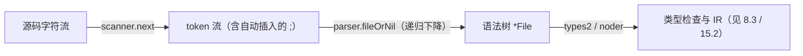

# 15.1 词法与文法

编译的第一站，是把源码文本变成结构化的**抽象语法树**（AST）。这要经过**词法分析**（把字符流
切成 token）与**语法分析**（按文法把 token 组织成树）。[3.2](../../part1overview/ch03life/compile.md)
鸟瞰过整条流水线，这一节专看它的前端，以及 Go 的文法为何被设计得如此「好解析」。

承担这两步的，是编译器里一个自成一体的包 `cmd/compile/internal/syntax`。它由两件器物构成：
**scanner**（词法器）按字符读入、吐出 token 流；**parser**（语法器）以**递归下降**的方式消费
token、建出语法树。这个包的注释甚至自豪地写明，它的几个文件 `scanner.go`、`source.go`、
`tokens.go` 不依赖编译器其余部分，可单独编译成一个独立的库。词法与文法之所以能如此干净地切出来，
根子在 Go 文法本身的简单。

## 15.1.1 为快速解析而设计的文法

Go 的文法是**刻意为快速解析而设计**的（[1.1](../../part1overview/ch01intro/history.md) 的编译速度
执念）。关键的一点是：它**正则到足以被 LALR(1) 解析**，因而无需复杂的回溯。早年的 gc 编译器正是
用 yacc 喂一份 LALR(1) 文法（`go.y`）来解析 Go 的，这份文法的存在本身，就是「Go 文法可被
单遍、确定地解析」的证据。换言之，解析一段 Go 代码，编译器读一遍 token 流、只看眼前一个 token
就能决定怎么走，不必回头重试，也不必在解析途中查询符号表。

这与 C/C++ 形成鲜明对比。C 的文法里，`a * b;` 究竟是「`a` 乘 `b`」还是「声明一个指向 `a`
类型的指针 `b`」，取决于 `a` 此刻是不是一个类型名，而这要查符号表才知道。解析与语义于是纠缠在
一起，C++ 更因此背上了著名的 *most vexing parse*：`Widget w(Thing());` 会被解析成函数声明而非
对象构造。Go 的文法刻意回避了这类歧义，任何一段 token 的结构都由文法唯一确定，与名字的含义无关。
解析器因此又快又简单，也不必把类型信息回灌给词法器。

值得一提的是，今天的 gc 并不真的跑 yacc。2015 年前后（Go 1.6 / 1.7 开发周期），编译器把 yacc
生成的解析器换成了**手写的递归下降解析器**，也就是现在的 `syntax` 包。动机有二：手写解析器更快，
且能给出**远胜于 yacc 的错误信息**（yacc 的 `syntax error` 几乎无从定位）。yacc 的文法证明了
Go 是 LALR(1) 的，而 gc 出于工程考量，选择用递归下降去兑现这份可解析性。两者并不矛盾：文法的
**性质**是 LALR(1)，落地的**手法**是递归下降。这一段演进，见 [15.1.4](#1514-从-yacc-到手写递归下降)。

## 15.1.2 分号自动插入

Go 最有名的词法细节，是**分号自动插入**。Go 的文法和 C 一样以分号终结语句，但读者几乎从不手写
分号，因为 scanner 会按规则替你补上。规则出奇地简单，只有两条（见语言规范 *Semicolons*）：

1. 当一行的**最后一个 token** 是下列之一时，词法器在该 token 之后、换行之前插入一个分号：
   标识符；整数、浮点、虚数、字符或字符串字面量；关键字 `break`、`continue`、`fallthrough`、
   `return`；运算符 `++`、`--`；以及闭合括号 `)`、`]`、`}`。
2. 为允许把复杂语句写在一行，词法器会在闭合的 `)` 或 `}` 之前省略分号。

这套规则在 scanner 里的实现，干净得只用一个布尔标志 `nlsemi`：

```go
// scanner：词法器（裁剪后的速写）
type scanner struct {
    source
    nlsemi bool // 置位时，'\n' 与 EOF 会被翻译成 ';'
    tok    token
    lit    string
    // ...
}

func (s *scanner) next() {
    nlsemi := s.nlsemi
    s.nlsemi = false
    // 跳过空白；但若上一个 token 触发了 nlsemi，'\n' 不再当空白跳过
    for s.ch == ' ' || s.ch == '\t' || s.ch == '\n' && !nlsemi || s.ch == '\r' {
        s.nextch()
    }
    switch s.ch {
    case '\n':       // 此时必有 nlsemi（否则上面已跳过），翻译成分号
        s.nextch()
        s.lit = "newline"
        s.tok = _Semi
    // ...
    }
}
```

每识别出一个 token，scanner 就顺手设置 `nlsemi`：识别字面量的 `setLit` 直接置 `s.nlsemi = true`；
读到 `)` `]` `}` 等闭合符同样置真；读到关键字时则用一个位集合判定 token 是否属于
`{break, continue, fallthrough, return}`。下一次 `next()` 一旦遇到换行，便把它翻译成一个分号 token
而非空白。规则一与规则二，全都落在「`nlsemi` 何时为真」这一个开关上，没有独立的「分号插入器」，
它就是词法主循环里的一个布尔位。一个多行块注释若出现在该插分号之处，也会被当作换行处理而触发插入，
这类边角同样由这一个标志统一覆盖。

把它具体化。源码两行：

```go
x := f(a, b)
y := x + 1
```

词法器吐出的 token 流是（`⨟` 标出自动插入的分号）：

```
x  :=  f  (  a  ,  b  )  ⨟    // ) 触发规则一，换行处插入 ;
y  :=  x  +  1  ⨟             // 字面量 1 触发规则一
```

注意第一行内部那个换行（`f(a,`后若折行）不会插分号，因为 `(` 与 `,` 都不在规则一的集合里，
`nlsemi` 仍为假，换行被当作普通空白跳过。这正是「函数实参可以跨行」却「语句末尾自动收尾」的由来。

## 15.1.3 为什么 `{` 不能另起一行

分号自动插入，解释了 Go 一条看似武断的格式强制：左花括号 `{` 必须跟在上一行末尾，不能独占一行。
考虑：

```go
func f()
{          // 错误
    // ...
}
```

按规则一，`func f()` 这行以 `)` 结尾，词法器在 `)` 后插入一个分号。于是 parser 看到的是
`func f() ;` 后面才跟 `{`，函数声明在分号处就被截断了。解析器随即报出那句精确的错误：

```
unexpected semicolon or newline before {
```

这句错误信息直接出自 `syntax` 包的 parser：当它在顶层声明的位置遇到一个孤立的 `{`、而上一个
声明恰是个「空函数声明」时，便知道用户把 `{` 放到了下一行。一条格式规定，根子不在风格洁癖，
而在词法器的设计：`{` 留在行尾，是为了不让规则一在它前面插入分号。Go 用一条词法规则，换来了
全语言**唯一**的花括号风格，连带省去了关于「花括号该不该换行」的所有争论。

JavaScript 的自动分号插入（ASI）是一面值得对照的镜子。它同样由词法层驱动，规则却繁复且偏「事后
补救」，于是留下 `return` 单独成行、真正的返回值落到下一行被悄悄丢弃这类著名陷阱。Go 反其道而行：
规则少到两条，且把约束**前置**为「`{` 必须在行尾」，宁可强制一种格式，也不留模糊地带。同样是词法
驱动的分号，设计取向截然不同。

## 15.1.4 从 token 到 AST

scanner 吐出 token 流后，parser 以递归下降的方式把它们组织成 AST。递归下降的骨架，是「文法的每条
产生式对应一个解析函数」。Go 源文件的顶层文法是「包子句，随后是若干 import 与顶层声明」，落到
代码就是解析入口 `fileOrNil` 的一个分发循环：

```go
// 解析一个源文件（裁剪后的速写）
func (p *parser) fileOrNil() *File {
    f := new(File)
    if !p.got(_Package) {        // 必须以 package 子句开头
        p.syntaxError("package statement must be first")
        return nil
    }
    f.PkgName = p.name()
    p.want(_Semi)                // 包子句后的（自动插入的）分号

    for p.tok != _EOF {          // 单 token 前瞻分发，无回溯
        switch p.tok {
        case _Import: p.next(); f.DeclList = p.appendGroup(f.DeclList, p.importDecl)
        case _Const:  p.next(); f.DeclList = p.appendGroup(f.DeclList, p.constDecl)
        case _Type:   p.next(); f.DeclList = p.appendGroup(f.DeclList, p.typeDecl)
        case _Var:    p.next(); f.DeclList = p.appendGroup(f.DeclList, p.varDecl)
        case _Func:   p.next(); /* funcDeclOrNil ... */
        default:      p.syntaxError("non-declaration statement outside function body")
        }
    }
    return f
}
```

`p.tok` 是当前 token，`p.next()` 前进一个。整段解析只看 `p.tok` 这一个 token 就能决定走哪条分支，
这正是「单 token 前瞻、无回溯」的递归下降。`importDecl`、`constDecl`、`funcDeclOrNil` 各自再往下
递归，直到表达式与字面量这些叶子。整条前端流水线的形状因此很短：



建出的 AST 是源码结构的**忠实映射**：每个节点对应源码里一处声明、语句或表达式，并带有**位置信息**，
供后续报错与生成调试信息之用。这一步只做最基本的语法正确性检查（括号是否匹配、语句结构是否合法），
**不做类型检查**，`a * b` 是乘法还是声明，留给后面定夺。

解析器还要在出错后**尽量不放弃**。遇到一处语法错误，parser 并不立刻退出，而是调用 `advance`
跳到下一个「同步点」（如下一个 `_Import`、`_Const`、`_Func` 这样的声明起始 token）再续上解析。
这让编译器能在一遍里报出多个语法错误，而非「修一个、编一次、再撞下一个」。错误恢复的质量，正是
当年从 yacc 切到手写解析器的主要动机之一。

AST 是后续所有阶段的输入。类型检查（[8.3](../../part2lang/ch08generics/checker.md) 的 types2）在它
上面标注类型、解析名字、报类型错误；之后经由 noder 转换为编译器中端自己的 IR，再降到 SSA
（[15.2](./ssa.md)）。值得一提的是，标准库的 `go/parser`、`go/ast` 是另一套**平行**的实现：它们
最初是为 `gofmt`、`vet` 这类工具而写，与编译器内部的 `syntax` 包同源而不同株，这也是为什么改 Go
语法常常要「两处都改」。

## 15.1.5 简单文法的回报

Go 把「文法的简单」放在很高的优先级，回报是多方面的。**编译快**：解析是编译的第一步，它快，整条
流水线才有快的指望，单 token 前瞻、无回溯、无符号表查询，把这一步压到了近乎线性的开销。
**工具好写**：`gofmt`、`goimports`、`gopls`（[16.7](../ch16tools/gopls.md)）都要解析 Go 代码，
简单无歧义的文法让它们既快又可靠地建出 AST，这是 Go 工具生态繁荣的隐形地基；一门需要符号表才能
解析的语言，其工具链会困难得多。**可读性**：无歧义的文法也意味着人读代码时不会困惑于「这究竟怎么
解析」。

这再次印证 Go 的价值观（[1.2](../../part1overview/ch01intro/go.md)）：在「语言的表达力」与「简单、
快速、可工具化」之间，它坚定地选后者。分号自动插入、`{` 不换行、文法的 LALR(1) 正则性，看似是最
底层的技术细节，实则同出一源，都是「让机器和人都能毫不含糊地读懂一行 Go」这一信念的产物，并由此
深刻塑造了 Go 的编译速度、工具生态乃至日常书写体验。

## 延伸阅读的文献

1. The Go Programming Language Specification：*Lexical elements / Semicolons.*
   https://go.dev/ref/spec#Semicolons
2. The Go Authors. *cmd/compile/internal/syntax（scanner 与 parser）.*
   https://github.com/golang/go/tree/master/src/cmd/compile/internal/syntax
3. The Go Authors. *cmd/compile/README（编译器前端总览：parsing 阶段）.*
   https://github.com/golang/go/blob/master/src/cmd/compile/README.md
4. The Go Authors. *cmd/compile: remove yacc-based parser（2015，yacc 文法到手写递归下降的迁移）.*
   https://github.com/golang/go/commit/b5fe07710f
5. Scott Meyers. *Effective STL / the "most vexing parse".*（C++ 解析歧义的经典论述，对照 Go 的无歧义文法）
6. 本书 [3.2 编译流程](../../part1overview/ch03life/compile.md)、
   [8.3 类型检查技术](../../part2lang/ch08generics/checker.md)、
   [16.7 gopls](../ch16tools/gopls.md).
