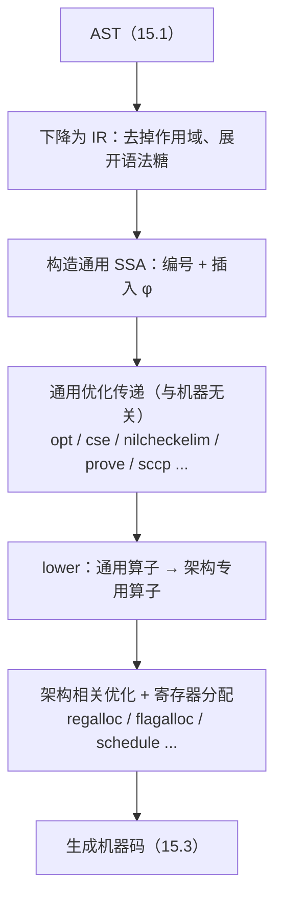

# 15.2 中间表示

> 本节内容对标 Go 1.26。

[15.1](./parse.md) 把源码变成了语法树（AST）。AST 忠实记录了程序员写下的结构：变量、作用域、
表达式的嵌套。可一旦要做优化，这套结构就显得太「高」了。考虑一句最不起眼的 `x = x + 1`：
在 AST 里，左边的 `x` 与右边的 `x` 是同一个名字，编译器若想知道「这次用到的 `x` 究竟是哪一次
赋值产生的值」，就得反复做作用域查找与数据流分析。名字会被覆盖，作用域会嵌套，赋值会把旧值
冲掉，这些都让「一个值从哪来、到哪去」这件本该最基本的事变得晦暗。优化器最想要的，恰恰是把
数据流摊在明面上。

于是 Go 编译器在 AST 与机器码之间，插入了一层专门为优化而生的**中间表示**（intermediate
representation, IR）。它先把 AST 下降（lower）为一种更接近指令、却仍与具体机器无关的形式，
再转换成本节的主角：**静态单赋值形式**（static single assignment, SSA）。SSA 是当代优化编译器
近乎统一的中段表示，LLVM、HotSpot 的 C2、GCC 的 GIMPLE-SSA 都建在它之上。本节回答三个问题：
SSA 是什么，为什么它让优化变得直接，以及 Go 的 SSA 流水线如何把一个函数从「与机器无关」一路
打磨到「为某个架构生成的机器码」。

## 15.2.1 静态单赋值：每个变量只赋值一次

SSA 的定义只有一句话：**程序中每个变量恰好被赋值一次**。一旦某个名字被多次赋值，就给它编号，
拆成多个互不相同的版本。回到 `x = 1; x = x + 1`，在 SSA 里它变成：

```
x_1 = 1
x_2 = x_1 + 1
```

两次对 `x` 的赋值成了 `x_1` 与 `x_2` 两个独立的、各自只被赋值一次的值。这一步看似只是机械改名，
带来的好处却是结构性的：当后面某处用到 `x_2`，它的来源是**唯一且显式**的，就是上面那条
`x_1 + 1`，无需任何作用域查找或数据流推断。「定义」与「使用」之间于是连成一张明确的图（
use-def chain），值从哪来、被谁用，一望可知。常量传播、公共子表达式消除、死代码删除这些优化，
本质上都是在这张图上做的局部改写，SSA 把它们从「需要全局分析」降格成了「照着图改」。

真正的难点出现在控制流汇合处。考虑一段带分支的代码：

```go
func abs(x int) int {
	var y int
	if x < 0 {
		y = -x
	} else {
		y = x
	}
	return y // 这里的 y 是哪一个？
}
```

`return y` 用到的 `y`，在 `if` 为真时是 `-x`，为假时是 `x`。SSA 要求每个值只定义一次，可这里
偏偏有两个来源在同一点汇合。解决办法是引入一个特殊的算子，**φ 函数**（phi function）：它放在
汇合块的开头，依据控制流究竟从哪条前驱边到达本块，**选出**对应的那个版本。

```
b_then:  y_1 = -x       // 从这条边来，取 y_1
b_else:  y_2 =  x       // 从这条边来，取 y_2
b_merge: y_3 = φ(y_1, y_2)   // 汇合：按来路选 y_1 或 y_2
         return y_3
```

φ 函数是 SSA 表达控制流相关数据流的唯一手段，也是它的灵魂。它不对应任何真实机器指令，纯粹是
一个记号，告诉优化器「这个值的来源取决于走了哪条路」。把一段普通代码转换成 SSA，核心工作就是
两件：给每次赋值编号，以及在恰当的汇合块插入 φ 函数。「恰当」二字背后有一套基于**支配边界**
（dominance frontier）的经典算法，Cytron 等人在 1991 年的论文里给出了高效构造它的方法，让 φ
只插在真正需要的地方，这也是 SSA 得以实用的奠基性工作（见[延伸阅读](#延伸阅读的文献)）。

值得提醒读者的是，Go 的 SSA 在内部并不真的保留「变量名」这一概念。如 `cmd/compile/internal/ssa`
的 README 所言，SSA 里没有变量，也没有作用域；上文的 `x_1`、`y_3` 只是为讲解而写的助记名。

## 15.2.2 Go 的 SSA：值、块与内存

落到 Go 编译器的实现，SSA 程序由两级结构搭成：**值**（value）与**块**（block）。

**值**是 SSA 的基本组成单位。按 SSA 的定义，一个值只定义一次，却可被任意多次使用。一个值主要由
唯一标识符、一个算子（`Op`）、一个类型，以及若干参数构成。算子描述「这个值是怎么算出来的」，
比如 `Add8` 取两个 8 位整数参数、得到它们的和。两个 `uint8` 相加在 SSA 里大致长这样：

```
// var c uint8 = a + b
v4 = Add8 <uint8> v2 v3
```

尖括号里是值的类型，多数时候就是 Go 类型。注意值是以唯一的顺序 ID（`v2`、`v4`）命名的，它们
很少对应源码里的具名实体，这让编译器免去维护一张「名字到值」的映射，又能借助调试与位置信息把
任一值回溯到对应的 Go 代码。

有一类类型不来自 Go，而是 SSA 特有，其中最常见的是 `memory`。它代表**全局内存状态**。凡是读写
内存的算子，都把一个 `memory` 值作为参数（依赖此刻的内存状态），并产出一个新的 `memory` 值（
表示它改变了内存状态）。这条 `memory` 值串成的链，正是 SSA 用来固定内存操作先后次序的手段：

```
// *a = 3
// *b = *a
v10 = Store <mem> {int} v6 v8 v1
v14 = Store <mem> {int} v7 v8 v10
```

第二条 `Store` 以第一条产出的 `v10` 为内存参数，于是两条存储被这条依赖锁死了顺序，优化器不会
把它们重排。SSA 把控制依赖交给块与 φ，把内存依赖交给这条 memory 链，二者合起来，数据流的全部
约束就都显式地写在了图里。

**块**对应控制流图里的基本块，本质是一串值的列表，外加一个种类（kind）和一组后继。最简单的是
`plain` 块，只把控制流交给唯一的后继；`exit` 块以一个内存状态作为控制值，对应函数的返回点；
最关键的是 `if` 块，它带一个布尔控制值与两个后继，布尔为真走第一个，为假走第二个。把
[15.2.1](#1521-静态单赋值每个变量只赋值一次) 的 `if` 例子翻成 Go 的 SSA，骨架是这样：

```
// func(b bool) int { if b { return 2 }; return 3 }
b1:
    v1 = InitMem <mem>
    v6 = Arg <bool> {b}
    v8 = Const64 <int> [2]
    v12 = Const64 <int> [3]
    If v6 -> b2 b3
b2: <- b1
    v11 = Store <mem> {int} v5 v8 ...
    Ret v11
b3: <- b1
    v15 = Store <mem> {int} v5 v12 ...
    Ret v15
```

一个**函数**则由名字、签名、组成函数体的块列表，以及其中唯一的入口块构成。函数可以有零或多个
出口块（对应 Go 函数任意多个 `return` 点），但入口块必有且仅有一个。

## 15.2.3 流水线：从通用 SSA 到机器码

有了 SSA 形式的程序还不够，它的价值在于「改写它很容易」。Go 编译器把所有优化组织成一条**传递**
（pass）的流水线，每个传递接过一个 SSA 函数，按某种方式把它变得更好，默认顺序执行、各跑一次。
整条流水线可粗分为四段：



`cmd/compile/internal/ssa/compile.go` 里的 `passes` 列表把这条流水线写得明明白白，go1.26 下有
五十余个传递，挑几个有代表性的：

- `opt`：套用通用重写规则（下一节详述），是强度削减、常量折叠等局部优化的主力，且在流水线里
  跑了不止一次（early/middle/late opt）。
- `cse`：公共子表达式消除，把算出同一个值的多处合并成一个。SSA 的单赋值特性让「两个值是否相等」
  退化成「算子与参数是否相同」，CSE 因而格外好写。
- `nilcheckelim` / `prove`：删除可证明多余的空指针检查与边界检查。`prove` 维护值的取值范围，
  能证明 `i` 落在 `[0, len)` 时，对应的边界检查就被消去。
- `sccp`：稀疏条件常量传播，沿 use-def 图传播常量并顺手剪掉走不到的分支。
- `lower`：流水线的分水岭，把与机器无关的通用算子替换成某个架构的专用算子，自此 SSA 从
  「machine-independent」转为「machine-dependent」。
- `regalloc`：寄存器分配，给值指派物理寄存器或栈槽，是后端最重的传递之一。

把优化放在 SSA 这一层，是经过权衡的选择。比 AST 低，数据流已被 SSA 摊开，优化可以直接照图改；
比机器码高，`lower` 之前的传递与具体指令集无关，同一套通用优化能服务于所有架构，只在 `lower`
之后才分流到各架构的专用规则。这正是「选对中间层」的红利：machine-independent 让优化复用，
data-flow-explicit 让优化简单，SSA 把二者同时给齐了。

## 15.2.4 .rules：声明式的重写规则

流水线里多数传递是手写的 Go 代码，但有一类（以 `opt` 和各架构的 `lower` 为代表）是**代码生成**
出来的。生成它们的，是一种自带语法的**重写规则**，集中维护在 `cmd/compile/internal/ssa/_gen/*.rules`
里。一条规则的形状是「左边的 SSA 模式 => 右边的 SSA 模式」，可附带 `&&` 守卫条件。

最经典的例子是**强度削减**：乘以 2 的幂可以换成移位，移位比乘法快。go1.26 的
`_gen/generic.rules` 里，这条优化就是四行（按位宽 8/16/32/64 各一条）声明：

```
// x * c，当 c 是 2 的幂时，改写成 x << log2(c)
(Mul64 <t> x (Const64 [c])) && isPowerOfTwo(c) && v.Block.Func.pass.name != "opt" =>
    (Lsh64x64 <t> x (Const64 <typ.UInt64> [log64(c)]))
```

读法是：匹配一个「`x` 乘以常量 `c`」的 `Mul64`，当守卫 `isPowerOfTwo(c)` 成立（且不在名为
`opt` 的传递里，留待后续阶段处理）时，把它整个替换成一个左移 `log64(c)` 位的 `Lsh64x64`。
**边界检查消除**也是同样的声明式写法，比如「下标本身就是对某常量取模」时，越界必然为假：

```
// i % y 的结果必落在 [0, y)，故 IsInBounds 恒为 true
(IsInBounds (Mod64u _ y) y) => (ConstBool [true])
(IsInBounds x x) => (ConstBool [false])
```

这些规则不是被解释执行的。构建编译器时，`_gen/rulegen.go` 把每条规则**编译成 Go 代码**：左边
的模式生成一串嵌套的 `if`（逐层比对算子、参数、守卫），右边生成构造新值、改写旧值的语句。
最终落进 `rewritegeneric.go`、`rewriteAMD64.go` 这些自动生成的大文件，在 `opt` / `lower` 传递里
被调用。算子表本身也同理，由 `_gen/*Ops.go` 生成。改完规则或算子，跑一次
`go generate cmd/compile/internal/ssa` 重新生成即可。

这套「声明式重写」的取舍很清楚。它的好处是简单优化写起来又快又直观，一条规则就是一行「样子像
什么、换成什么」，无需手写遍历与替换的样板代码，几百条规则集中可读、易于审阅。它的边界同样清楚：
重写规则只适合**局部的、模式可枚举的**优化，像 `prove` 那种需要维护全局取值范围的分析，仍得
手写成 Go 传递。把「能声明的就声明、声明不了的才动手写」分开，本身又是一次「选对表示」的胜利，
与 SSA 选对中间层、与[运行时反复出现的](../../part4memory/ch12alloc/component.md)「用对数据结构」
是同一种工程直觉：把问题挪到一个让它变简单的表示上去。

## 15.2.5 GOSSAFUNC：把流水线看个明白

要直观感受上述每一步对程序做了什么，最有效的工具是 `GOSSAFUNC`。指定要观察的函数名，编译器会
把它在**每个传递后**的 SSA 形式连同最终汇编一并导出：

```bash
GOSSAFUNC=abs go build
```

它生成一个 `ssa.html`，每一列对应一个编译阶段，从最初的通用 SSA 一路排到 `lower` 之后的架构
SSA，直至生成的汇编。点击某个值或块会高亮它的关联，便于顺着 use-def 链与控制流追踪。想验证
[15.2.4](#1524-rules声明式的重写规则) 里 `x*8 => x<<3` 是否真的发生，对照 `opt` 前后两列即可
看到 `Mul64` 变成了 `Lsh64x64`。GOSSAFUNC 也支持包限定名（`GOSSAFUNC=pkg.Foo`）、只看若干传递
的控制流图（`GOSSAFUNC="Foo:sccp,deadcode"`），以及追加 `+` 把非 HTML 文本转储到标准输出。把它
当成阅读本章后几节的实验台：[15.3 优化器](./optimize.md) 讲的每一类优化，都能在这张表里找到它
作用前后的那一列。

## 延伸阅读的文献

1. Ron Cytron, Jeanne Ferrante, Barry K. Rosen, Mark N. Wegman, F. Kenneth Zadeck.
   *Efficiently Computing Static Single Assignment Form and the Control Dependence Graph.*
   ACM TOPLAS 13(4), 1991. DOI: [10.1145/115372.115320](https://doi.org/10.1145/115372.115320)
   （SSA 构造与支配边界的奠基论文）
2. The Go Authors. *Introduction to the Go compiler's SSA backend (README).*
   `cmd/compile/internal/ssa/README.md`.
   https://github.com/golang/go/blob/master/src/cmd/compile/internal/ssa/README.md
3. The Go Authors. *重写规则与代码生成：`_gen/generic.rules`、`_gen/rulegen.go`、`compile.go` 的
   `passes` 列表.* https://github.com/golang/go/tree/master/src/cmd/compile/internal/ssa/_gen
4. Keith Randall. *Generating Better Machine Code with SSA.* GopherCon 2015.
   （Go 引入 SSA 后端的设计动机与历程）
5. Steven S. Muchnick. *Advanced Compiler Design and Implementation.* Morgan Kaufmann, 1997.
   （SSA、数据流分析与各类优化传递的系统性教材）
6. 本书 [15.1 词法与文法](./parse.md)、[15.3 优化器](./optimize.md)。
