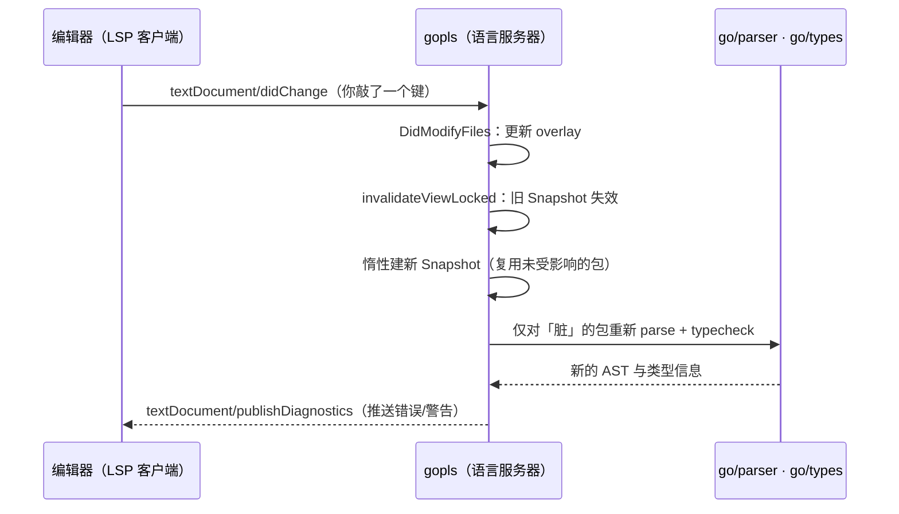

# 16.7 语言服务协议

自动补全、跳转定义、实时报错、重构,现代编辑器里这些功能，在 Go 这边由 **`gopls`**（Go language
server，读作「go please」）提供。它背后是**语言服务器协议**（Language Server Protocol，LSP）。
本节讲清三件事：LSP 解开的那个组合爆炸结、gopls 如何建立在编译器前端的可复用库之上、以及它
为何称得上 Go 工具链思想的集大成者。

## 16.7.1 LSP：解开 M×N 的结

设想没有 LSP 的世界。要让 **M 个编辑器**都支持 **N 种语言**的智能功能，朴素的做法是为每一对
「编辑器 × 语言」单独写一套集成：VS Code 要懂 Go、懂 Rust、懂 Python，Vim 也要各懂一遍,补全、
跳转、报错的逻辑在每一对里都重写。代价是 **M×N** 套实现，且任何一门语言的语义更新，都要在
M 个编辑器里各自跟进。这条增长曲线注定走不远。

LSP 把它解成 **M+N**。微软在 2016 年 6 月为 Visual Studio Code 提出这套协议(后与 Red Hat、
Codenvy 合作开放，现已成行业标准)。它的关键是定义**一套与语言、与编辑器都无关的标准协议**：
每门语言只需写**一个**语言服务器（实现协议），每个编辑器只需写**一个** LSP 客户端,此后任意
编辑器配任意语言，自动打通。语言服务器是一个独立进程，编辑器通过标准输入输出或套接字与它通信。

协议本身建立在 **JSON-RPC** 之上,只有三类消息：客户端发**请求**（request）等服务器回**响应**
（response），以及单向的**通知**（notification）。位置用「文档 URI + 行列号」表示，刻意避开任何
语言特有的抽象（如某语言的 AST 节点），这正是它能跨语言通用的前提。一次「跳转到定义」的往返
是这样：

```json
// 客户端 → 服务器：光标停在某标识符上，问它定义在哪
{ "jsonrpc": "2.0", "id": 1, "method": "textDocument/definition",
  "params": {
    "textDocument": { "uri": "file:///app/main.go" },
    "position":     { "line": 41, "character": 7 } } }

// 服务器 → 客户端：定义在另一个文件的某行某列
{ "jsonrpc": "2.0", "id": 1,
  "result": {
    "uri":   "file:///app/user/user.go",
    "range": { "start": { "line": 12, "character": 5 },
               "end":   { "line": 12, "character": 9 } } } }
```

补全是 `textDocument/completion`，重命名是 `textDocument/rename`，格式化是
`textDocument/formatting`。报错则走相反方向,不是客户端来问，而是服务器在分析完成后**主动推送**
一条 `textDocument/publishDiagnostics` 通知，编辑器据此画出那些红色波浪线。编辑器把每次按键、
每次保存通过 `textDocument/didChange`、`textDocument/didSave` 告知服务器，服务器据此维护它对工程
的理解。智能从此与编辑器解耦：写好一个语言服务器，所有 LSP 编辑器一并受益。

连接之初还有一次 `initialize` 握手,双方交换各自支持的能力（capabilities）：服务器声明它能做补全、
能做重命名、能做哪些代码操作，客户端声明它能渲染什么。能力协商让协议得以平滑演进,一端支持新
特性而另一端尚未跟上时，双方据握手结果各自降级，不会硬崩。正因协议把「能力」也标准化了，LSP 才
能从最初的几个方法，长成今天覆盖语义高亮、内联提示（inlay hints）、调用层级等几十类交互的 3.x
规范，而生态里的客户端与服务器无需统一升级即可共存。

## 16.7.2 gopls：建立在 go/types 之上

`gopls` 是 Go 团队开发并维护的**官方语言服务器**,它向任何兼容 LSP 的编辑器提供这套 IDE 能力。
它的能力，本质上**建立在编译器前端的可复用组件之上**:用 `go/parser` 把源码解析成 AST
（[15.1](../ch15compile/parse.md)）、用 `go/types`（[8.3](../../part2lang/ch08generics/checker.md)
的姊妹库）做类型分析、用模块机制理解依赖与构建边界（[17 模块](../ch17modules)）。这三步，正是
编译器前端要做的事,而 Go 把它们做成了**独立、稳定、公开的标准库**，而非锁死在 `cmd/compile`
内部。于是同一段「parse + typecheck」的逻辑，gopls 能调，`go vet`、各类 linter、代码生成器、
`gofmt` 也都能调:

```go
// 在编译器之外，把一段 Go 源码解析并类型检查,这正是 gopls 每次分析的内核
fset := token.NewFileSet()
f, _ := parser.ParseFile(fset, "main.go", src, parser.AllErrors) // go/parser → AST
info := &types.Info{
    Defs: map[*ast.Ident]types.Object{}, // 每个标识符「定义」了什么
    Uses: map[*ast.Ident]types.Object{}, // 每个标识符「引用」了哪个定义
}
conf := types.Config{Importer: importer.Default()}
pkg, _ := conf.Check("app", fset, []*ast.File{f}, info)            // go/types → 类型信息
```

`info.Defs` 与 `info.Uses` 这两张表就是「跳转定义」「查找引用」「重命名」的全部素材：标识符到
符号、符号到所有引用点的双向映射，类型检查器顺手就建好了。换言之，gopls 没有自己的一套语义分析，
它复用编译器前端算出的结果，只是把同一份信息按编辑器的提问重新组织。

这一点值得停下来说透,它解释了**为什么 Go 的工具生态格外繁荣**。把前端做成可复用的标准库，是一个
有意为之的设计决定，而非所有语言都这么走,后文 [16.7.4](#1674-谱系与对照为何前端即库是关键) 会拿
clangd 与 rust-analyzer 来对照。眼下只需记住一句：gopls 的智能并非另起炉灶，它把编译器本就要算的
东西，换一个用途呈现给编辑器,而这之所以可能，全因 `go/parser`、`go/types` 早早被**库化**了
（[15.1](../ch15compile/parse.md) 说的「简单文法 + 可复用前端」，在这里结出了果实）。

## 16.7.3 增量分析：每一次按键都要快

把前端当库来调，只解决了「能不能算对」。gopls 真正的工程难题在「能不能算得**又快又省**」。编译器
是一次性的：读全部源码，算一遍，产出二进制，然后退出。语言服务器恰恰相反，它**常驻**，面对一个
**不断被编辑**的工程,你每敲一个键，它就要在几十毫秒内重新回答「这里现在有什么错」「这里能补全
什么」。在一个几十万行的仓库上，每次按键都重头全量解析加类型检查，是绝无可能的。

gopls 的答案是一套以**不可变快照**（immutable snapshot）为核心的增量架构。它把进程状态分了层
（裁剪后的速写，完整定义见 `gopls/internal/cache`)：

```go
// gopls 的状态分层（速写）：Cache 跨会话共享，Session 持有多个 View，View 持有当前 Snapshot
type Session struct {
    cache *Cache          // 跨 Session 共享：解析缓存、记忆化的计算结果
    views []*View         // 一个工作区（通常一个 go.mod 模块）对应一个 View
}

type Snapshot struct {       // 工作区某一刻状态的「不可变」视图
    view     *View
    files    map[URI]file.Handle // 此刻每个文件的内容句柄
    packages map[PackageID]*Package // 已解析、已类型检查的包（按需、记忆化）
    refcount int                  // 引用计数：还有分析在用它就不能回收
}
```

关键在「不可变」三字。当编辑器送来一次 `didChange`，gopls 不去**修改**当前快照，而是
`DidModifyFiles` 先更新内容覆盖层（overlay），再调 `invalidateViewLocked` 把受影响的快照标记失效,
下一次查询到来时，**惰性地**生成一个新快照。新快照与旧快照共享所有**未受改动波及**的部分：你只
改了一个文件，依赖图上够不到它的那些包，其解析与类型检查结果原样复用，不必重算。不可变加结构
共享，让「增量」既正确（绝不会读到改了一半的中间态）又高效（只重算真正脏掉的那一小片）。引用
计数则负责回收：没有分析再持有的旧快照，其内存得以释放，这是在大仓库上**框住内存**的关键一环。

一次按键到一条波浪线的往返，串起来是这样：



难处不止于此。模块边界与构建约束（`//go:build` 标签、[17](../ch17modules)）决定了「哪些文件属于
当前这次编译、用哪套依赖」,gopls 必须像 `go list` 那样准确理解它，否则跳转与补全就会指向错误的
包。低延迟、可控内存、随仓库规模平稳伸缩，这几条彼此拉扯的约束，构成了 gopls 工程上最硬的部分。

这里藏着一处典型的工程取舍。最朴素的做法是把整个工程的全部包都解析、类型检查并常驻内存，查询
自然飞快,但内存随仓库规模线性膨胀，大单体仓库（monorepo）下很快撑不住。另一极是什么都不缓存、
每次查询现算，内存极省但延迟难看。gopls 走的是中间路线：包的解析与类型检查结果**按需、记忆化**
地算出来并缓存，由快照的引用计数决定何时回收;它还把部分中间产物（如导出信息）序列化到磁盘，
跨进程、跨会话复用，用 I/O 换内存。延迟与内存这对矛盾从未被「彻底解决」，只是被安置在了一个对
真实工程更划算的折中点上,这与分配器、调度器里反复出现的权衡，是同一种工程智慧。

## 16.7.4 谱系与对照：为何「前端即库」是关键

把 gopls 放进语言服务器这个更大的谱系里看，它的设计抉择会更清楚。所有语言服务器面对的是同一道
题：从哪里得到一份对源码的准确、增量、可查询的理解。不同语言给出的答案，恰好暴露了各自前端
架构的差异。

- **走「前端即库」这条路的**,gopls 与 clangd 是一类。clangd「基于 clang 编译器，内核是把 clang
  parser 跑在一个循环里」,它复用 Clang 的前端，正如 gopls 复用 `go/parser` 与 `go/types`。共同点是
  语言服务器与编译器**共享同一套对源码的理解**，因而精确：编译器认的，语言服务器也认，不会出现
  「编译过了但 IDE 报错」的撕裂。
- **没走这条路的**则要付出额外代价。Rust 的 `rustc` 长期只暴露不稳定的内部 API、不以稳定库自居,
  rust-analyzer 因此曾作为一套**与 `rustc` 不共享代码的独立前端实现**长期存在，相当于把同一门语言
  的解析与名称解析、类型推导**写了第二遍**。这条路并非走不通，但它把「让前端可复用」的成本，从
  语言设计期推迟到了工具开发期，由社区重复承担。

对照之下，Go 的选择是一个**在语言设计早期就付清的预付款**：`go/parser`、`go/types` 是带向后兼容
承诺的标准库，任何工具都能稳定依赖。这笔预付，换来的是 `gopls`、`go vet`、`gofmt`、staticcheck
等一整条工具链**站在同一套前端之上**,它们对「这段 Go 代码是什么意思」的理解天然一致。工具生态
的繁荣，从来不是附赠的运气，而是「简单文法 + 前端库化」（[15.1](../ch15compile/parse.md)）这条
设计主线，在开发体验这一端长出的果实。

## 16.7.5 工具生态的集大成

gopls 可以看作 Go 工具链思想的**集大成者**,它把原本分散在多个小工具里的能力（解析、类型、模块、
格式化、诊断、重构）整合成一个统一的、编辑器无关的智能后端。这一步也有它的演进:在 gopls 之前，
Go 的编辑器智能由一堆各自为政的命令行工具拼凑而成,补全靠 gocode、跳转靠 godef、重命名靠
gorename、查询靠 guru，每个工具各自把工程**重新解析一遍**，彼此不共享状态，慢且不一致。gopls
用一个常驻进程、一份共享的工程理解，取代了这一摊,这正是「集大成」的实指。整合带来的不只是省去
重复解析的开销，更是语义的统一：补全看到的类型、跳转落到的定义、重构改动的范围，全部出自同一份
快照，因而彼此自洽，不会出现 A 工具认为某符号在这里、B 工具却认为在那里的撕裂。

它体现了贯穿本书的几条 Go 价值观：**简单文法**让解析快而可靠（[15.1](../ch15compile/parse.md)）;
**前端库化**让 `go/parser`、`go/types` 的能力可被无数工具复用;**统一工具链**
（[3.1](../../part1overview/ch03life/cmd.md)）让这一切开箱即用、风格一致。一个 Go 开发者，无论用
VS Code、Vim、Emacs 还是别的编辑器，得到的都是由同一个 gopls 驱动的、一致的智能体验,这种一致性，
正是 Go「工程友好」哲学在开发体验层面的延伸。

至此，工具与可观测性这一章看遍了 Go 从**正确性**（死锁检测 [16.1](./deadlock.md)、竞态检测
[16.2](./race.md)）、**性能**（追踪 [16.3](./trace.md)、基准与画像 [16.5](./perf.md)）、**质量**
（测试 [16.4](./testing.md)）、**运维**（指标 [16.6](./metric.md)）到**开发体验**（本节）的整套
工具。它们共同诠释了 Go 的一个核心承诺：**一门语言的价值，不只在于它本身，更在于它周围那套
让人把软件写对、跑快、看清、维护好的工具。** Go 把这套工具当作语言的一部分来对待,这正是它
在工业界立足的底气。

## 延伸阅读的文献

1. Microsoft. *Language Server Protocol Specification (3.18).*
   https://microsoft.github.io/language-server-protocol/
2. Microsoft, Red Hat, Codenvy. *Language Server Protocol 公布（2016-06-27）.*
   https://en.wikipedia.org/wiki/Language_Server_Protocol
3. The Go Authors. *gopls 文档与源码.* https://pkg.go.dev/golang.org/x/tools/gopls ；
   https://github.com/golang/tools/tree/master/gopls （`internal/cache` 的 Session/View/Snapshot）
4. The Go Authors. *go/types、go/parser、go/ast（可复用的前端库）.*
   https://pkg.go.dev/go/types ；https://pkg.go.dev/go/parser
5. The Clang Team. *clangd Design.* https://clangd.llvm.org/design/
   （「基于 clang 编译器，内核是把 clang parser 跑在循环里」,同构的「前端即库」思路）
6. 本书 [15.1 词法与文法](../ch15compile/parse.md)、
   [8.3 类型检查技术](../../part2lang/ch08generics/checker.md)、
   [17 模块](../ch17modules)、[3.1 命令源码分析](../../part1overview/ch03life/cmd.md).
