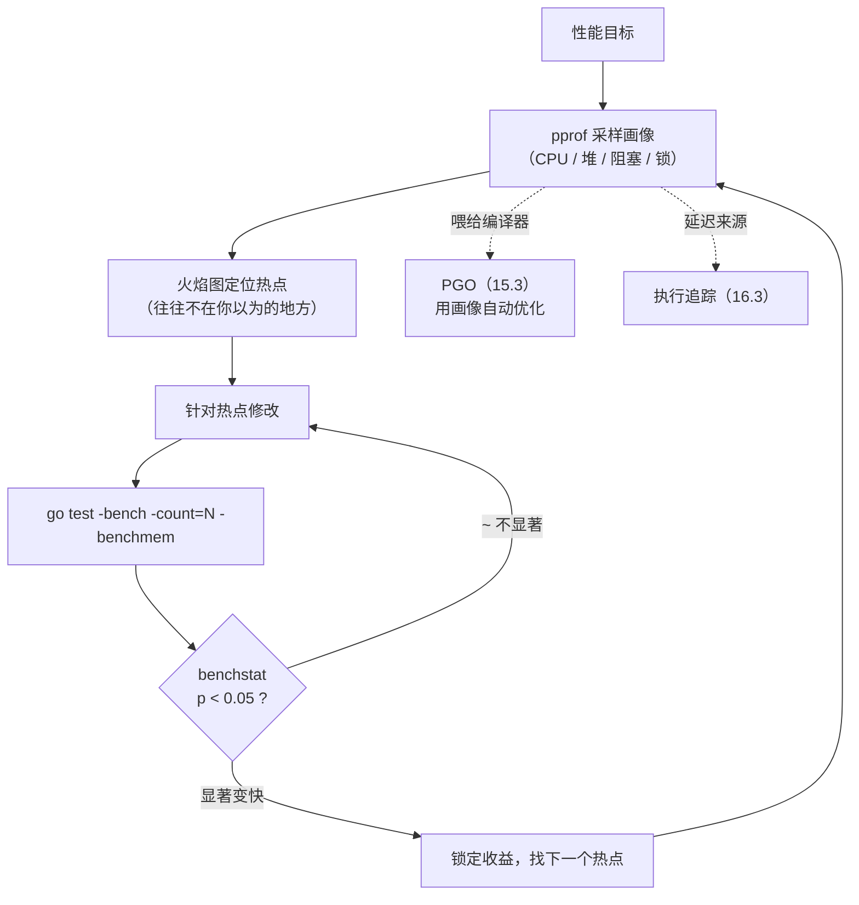

# 16.5 基准测试与性能画像

优化的第一原则是先测量，再动手。凭直觉猜瓶颈往往猜错，真正的热点常常不在你以为的地方。Go 把
这套纪律所需的工具全部做进了工具链：基准测试（benchmark）回答「多快」，性能画像（profiling）
回答「慢在哪、内存花在哪」，而 `benchstat` 用统计方法回答「这次改动到底是真的快了，还是只是
噪声」。这一节把这三件工具讲透，并把它们串成一条「画像找热点 → 改 → 基准验证」的测量驱动闭环,
这条闭环再往上，便与 PGO（[15.3](../ch15compile/optimize.md)）和执行追踪
（[16.3](./trace.md)）合流，构成 Go 完整的性能工程方法论。

## 16.5.1 基准测试：让「多快」可复现

基准测试用 `func BenchmarkXxx(b *testing.B)` 写，`go test -bench` 运行。它要解决的核心难题是
**测量精度**：单次调用一个纳秒级函数，时钟分辨率与调用开销会把信号淹没。Go 的办法是把待测代码
放进循环跑很多次，再除以次数得到「每次操作的耗时」（ns/op）。但循环要跑多少次？跑少了不稳定，
跑多了浪费时间。早期写法是手写一个从 `0` 到 `b.N` 的循环，框架**自动反复调整 `b.N`、多跑几轮**，
直到测量窗口足够长、结果足够稳定为止：

```go
func BenchmarkFib(b *testing.B) {
    for i := 0; i < b.N; i++ { // 框架反复加大 b.N 直到耗时稳定
        fib(30)
    }
}
```

这套 `b.N` 机制朴素可靠，却有两处长期为人诟病的坑。其一是**计时边界**：若基准函数里有昂贵的
准备工作，它会被算进每次测量，得手动 `b.ResetTimer()`/`b.StopTimer()` 把它摘出去（见
[16.5.3](#1653-基准测试的两个经典陷阱)）。其二是**死代码消除**：编译器看到 `fib(30)` 的返回值
没人用，可能直接把整个调用优化掉，于是你测了个寂寞。

Go 1.24 引入的 `b.Loop` 一并修掉了这两处。它的写法是把循环条件写成 `for b.Loop()`：

```go
func BenchmarkFib(b *testing.B) {
    x := setupExpensiveInput() // 准备工作，自动不计入测量
    for b.Loop() {             // 首次调用时重置计时器，返回 false 时停表
        sink = fib(x)
    }
}
```

`b.Loop` 在**首次调用时重置计时器**，于是循环前的准备工作天然不计入测量；返回 `false` 时停表，
于是循环后的清理也不计入。更关键的是，编译器对 `for b.Loop() { ... }` 做了一个**特殊变换**：
把循环体内的实参、返回值与赋值变量统统用 `runtime.KeepAlive` 内建包住，**阻止编译器把循环体
优化掉**。这要求循环条件必须**逐字写成** `b.Loop()`,因为这是一个语法层面识别的编译器变换，
不是普通函数调用。另一个好处是 `b.Loop` 保证基准函数**每轮测量只整体跑一次**，而 `b.N` 写法
会把基准函数连同它的 setup/cleanup 重复跑好几遍。

把视野放到别家，「微基准必须对抗死代码消除」是个**普遍问题**，各语言的解法同构而手法不同。
Java 的 JMH 提供 `Blackhole.consume()` 让你显式「消费」掉结果，骗过 JIT；Rust 的 Criterion
提供 `black_box()` 做同样的事。Go 的独特之处在于把这件事下沉到了**编译器**：你不必手动 sink，
`b.Loop` 的语法变换替你保活。代价是它绑死了写法（必须是 `for b.Loop()`），这是「少写样板」与
「语法受限」之间的一处取舍。

## 16.5.2 -benchmem：把分配与 GC 压力摊开

加上 `-benchmem`，基准额外报告每次操作的内存分配,字节数（B/op）与对象数（allocs/op）：

```
BenchmarkConcat-8     2000000    742 ns/op    248 B/op    5 allocs/op
```

`allocs/op` 这一列价值极高，它直接告诉你「这段代码每跑一次在堆上分配了几个对象」。每一次堆分配
都是给垃圾回收器（[13 GC](../../part4memory/ch13gc)）添的一份活；分配越多，GC 触发越频繁、扫描
负担越重。所以 `allocs/op` 从 0 变成 5，往往意味着某个值**逃逸**到了堆上
（[15.5](../ch15compile/escape.md)）。把它与 `go build -gcflags=-m` 的逃逸分析输出对读，常能精确
定位「哪一行让对象上了堆」,这是把 GC 压力与逃逸这两个抽象概念，落成一个可量化、可回归的具体
数字的最直接手段。

## 16.5.3 基准测试的两个经典陷阱

第一个陷阱是**把准备工作写进计时区间**。下面这个基准看似在测 `process`，实则把每轮的输入构造
也计了进去，读数被严重污染：

```go
func BenchmarkProcess(b *testing.B) {
    for i := 0; i < b.N; i++ {
        data := makeLargeInput() // 错：构造输入被计入每次测量
        process(data)
    }
}
```

`b.N` 写法的修法是把准备挪到循环外，并 `b.ResetTimer()`；若准备无法外提，则用
`b.StopTimer()`/`b.StartTimer()` 把它从计时窗口里挖掉。`b.Loop` 写法则天然规避了第一类情形,
循环外的准备本就不计入。理解了这个陷阱，也就理解了 `b.Loop` 为何要把「首次调用即重置计时器」
设计成默认行为。

第二个陷阱是**噪声**。同一台机器上，CPU 频率调节（DVFS / turbo boost）、温度墙、后台进程、超线程
邻居都会让基准读数在百分之几到百分之几十的幅度上抖动。对此社区的标准做法是 Austin Clements 的
`perflock`,它是 Go 主仓库**之外**的一个外部工具，作用是把多次基准**串行化**执行并把 CPU 频率
**钉死**在一个固定值，从源头压住抖动。但即便控制了噪声，单次对比也不可信：你需要统计。

## 16.5.4 benchstat：用统计学区分「真的变快」与「噪声」

`benchstat`（`golang.org/x/perf/cmd/benchstat`）是 Go 性能工作的标准件，它接收**多次重复**
（`go test -bench=. -count=10`）采集的前后两组基准结果，告诉你差异是否**统计显著**：

```
$ go test -bench=Concat -count=10 > old.txt
# ... 改代码 ...
$ go test -bench=Concat -count=10 > new.txt
$ benchstat old.txt new.txt
                │  old.txt    │              new.txt               │
                │   sec/op    │   sec/op     vs base               │
Concat-8          742.0n ± 2%   310.0n ± 1%  -58.22% (p=0.000 n=10)
ConcatSmall-8      31.5n ± 3%    31.8n ± 4%        ~ (p=0.481 n=10)
geomean            153.0n        99.3n       -35.10%
```

新版 `benchstat`（2022 年后重写）以一张带框线的表呈现：`sec/op` 列是各组中位数加离散度
（`± 2%`），`vs base` 列给出相对变化与 $p$ 值。`Concat` 这行 $p=0.000$、降了 58%，是显著
收益；`ConcatSmall` 这行变化被标成 `~`，$p=0.481$ 远大于 $0.05$，表示「和噪声无法区分」。
末尾的 `geomean` 行是所有基准的几何平均，作为整体变化的单一汇总。`-benchmem` 采到的 `B/op`、
`allocs/op` 同样能被它统计比较。

为什么是 `-count=10` 而不是跑一次？因为 `benchstat` 用的是 **Mann-Whitney U 检验**（也叫
Wilcoxon 秩和检验），这是一个**非参数**的统计检验。选它而非更常见的 t 检验，原因很实在：基准
样本几乎从不服从正态分布,调度抖动、缓存冷热、温度墙会制造离群点甚至多峰分布，而 t 检验的正态性
假设在这里站不住。Mann-Whitney 不假设分布形状，只比较两组样本的**秩**（rank），稳健得多。它检验
的原假设 $H_0$ 是「两组样本来自同一分布」，输出一个 $p$ 值；当 $p$ 小于显著性水平 $\alpha$
（默认 $0.05$）时，拒绝原假设，认定差异为真。否则就如上面 `ConcatSmall` 那行，把 delta 标成
`~`，明确告诉你「这点变化和噪声无法区分，别当真」。

「先 `-count=N` 多采几组，再用 `benchstat` 比前后」,这套做法把性能结论从「我觉得快了」提升到了
「在 $\alpha=0.05$ 下显著快了 58%」，是 Go 社区不成文却近乎强制的规范。

## 16.5.5 pprof：采样式性能画像

基准告诉你「多快」，但当你想知道「这点时间花在了哪些函数上」，就要用 `pprof`。它采集几类
**画像**（profile），go1.26 中 `runtime/pprof` 维护的预定义画像有这些：

- **CPU 画像**：按固定频率（默认约 100 Hz）周期性中断、记录当前调用栈，统计时间花在哪些函数上,
  找 CPU 热点。它通过 `StartCPUProfile`/`StopCPUProfile` 流式输出，是唯一不走 `Profile` 类型的。
- **堆画像**（`heap` / `allocs`）：按 `MemProfileRate`（默认每分配 512KB 采一次）采样分配点，
  看内存被哪些代码分配、当前被什么占用,找内存大户与泄漏。
- **阻塞画像**（`block`）：记录 goroutine 阻塞在 channel、`sync.Mutex` 等同步原语上的时间,找同步
  瓶颈。它**默认关闭**，需 `runtime.SetBlockProfileRate` 开启。
- **互斥画像**（`mutex`）：记录竞争锁的持有栈,定位锁争用热点。它同样**默认关闭**，需
  `runtime.SetMutexProfileFraction` 开启。
- **goroutine 画像**：转储当前所有 goroutine 的栈，是 [16.1](./deadlock.md) 排查局部死锁的利器。
- **`threadcreate` 画像**：记录创建新 OS 线程的栈。
- **`goroutineleak` 画像**（go1.26 新增）：在采集前先跑一轮 GC 做 goroutine 泄漏检测，转储那些
  **永久阻塞、再也不会被唤醒**的 goroutine 的栈。它把过去只能靠 goroutine 总数缓慢爬升来旁敲侧击
  的泄漏，变成了可直接定位的画像。

这几类画像（CPU 例外，它本就是定时采样）多数是**采样**而非全量。采样是一笔精心权衡的交易：用
统计的方差，换来低到可以在生产环境常开的开销。CPU 100 Hz、堆每 512KB 一采，单看一个样本毫无意义，
汇聚成千上万个样本后，热点的相对占比却高度可信。正因为开销低，线上服务才敢一直开着画像。阻塞与
互斥画像之所以**默认关闭**，正是这笔交易的另一面：它们要在每个同步原语上插桩计时，开销高于 CPU
与堆的轻量采样，于是把「是否值得这份开销」的决定权交还给你，用 `SetBlockProfileRate` 与
`SetMutexProfileFraction` 按需打开。

## 16.5.6 火焰图与生产画像

采到画像后，`go tool pprof` 能以多种形式可视化，其中最有力的是**火焰图**（flame graph）。火焰图
把采样栈按调用关系堆叠，横轴是某函数在全部样本中的占比（越宽越热），纵轴是栈深，一眼就能看出
「钱花在哪条调用链上」。这套表示法由 Brendan Gregg 提出，如今已是性能诊断的业界通用语言,它不止
服务于 Go，Linux `perf`、DTrace、eBPF 采到的栈同样用火焰图呈现，Go 的 `pprof` 站在这条系统性能
可观测性的谱系里。

要在生产环境拉画像，标准做法是匿名导入 `net/http/pprof`，它会把各类画像注册到 `/debug/pprof/`
路由上：

```go
import _ "net/http/pprof" // 注册 /debug/pprof/ 端点

func main() {
    go func() { log.Println(http.ListenAndServe("localhost:6060", nil)) }()
    // ... 业务代码 ...
}
```

随后任意时刻都能从线上服务直接拉画像分析，例如采 30 秒 CPU 画像并进入交互式火焰图：

```
go tool pprof -http=:8080 http://localhost:6060/debug/pprof/profile?seconds=30
```

更进一步是**持续画像**（continuous profiling）：让画像采集常驻、汇聚到中心存储，随时回看任意时刻的
性能构成。Google 的 Google-Wide Profiling 是这一思路的奠基，Parca、Pyroscope 等开源系统把它带给了
更广的工程实践。Go 的低开销采样画像，正是持续画像得以成立的前提。

## 16.5.7 测量驱动的优化文化

把上面三件工具串起来，就是 Go 的**测量驱动优化**闭环：



这条闭环的纪律是：**不要凭感觉优化**。先用画像定位真正的瓶颈，改完再用 `benchstat` 用数据确认,
而不是看着代码「觉得」这里慢。这套闭环还有两条向外的延伸。一是 **PGO**（[15.3](../ch15compile/optimize.md)，
Go 1.21 GA）：把生产环境采到的 CPU 画像直接喂给编译器，让它据此做更激进的内联与去虚拟化,画像
在这里从「给人看的诊断」升级成「给编译器看的输入」。二是**执行追踪**（[16.3](./trace.md)）：当问题
不是「平均慢」而是「偶发的长尾延迟」，画像的统计平均会失灵，这时需要追踪去看单次请求的时间都耗在
了哪个调度、GC 或系统调用事件上。

谱系上看，Go 的贡献不在发明了哪一件工具,基准测试、采样画像、火焰图、统计显著性检验在它之前都
已存在。Go 的贡献在于把这一整套**测量驱动**的纪律所需的工具，全部内建、零配置地交到每个程序员
手里：`go test -bench` 自带、`pprof` 在标准库、`benchstat` 一行 `go install`。当测量的门槛低到
随手可用，「性能靠测不靠猜」才可能从少数专家的修养，变成整个社区的默认习惯。性能不是猜出来的，
是测出来、改出来、再测出来的。

## 延伸阅读的文献

1. The Go Authors. *Profiling Go Programs.* https://go.dev/blog/pprof ；
   *runtime/pprof、net/http/pprof.* https://pkg.go.dev/runtime/pprof
2. The Go Authors. *testing.B.Loop（Go 1.24 引入）.* https://pkg.go.dev/testing#B.Loop ；
   `goroutineleak` 画像见 `src/runtime/pprof/pprof.go`（Go 1.26）。
3. The Go Authors. *benchstat.* https://pkg.go.dev/golang.org/x/perf/cmd/benchstat ；
   实现见 `golang.org/x/perf/benchmath`（Mann-Whitney U 检验）。
4. Brendan Gregg. *Flame Graphs.* https://www.brendangregg.com/flamegraphs.html ；
   *Systems Performance.* 2nd ed. Pearson, 2020.
5. Aleksey Shipilëv. *JMH（Java Microbenchmark Harness）.* https://openjdk.org/projects/code-tools/jmh/
   （`Blackhole` 对抗死代码消除，与 `b.Loop` 同构）。
6. Gang Ren, Eric Tune, et al. *Google-Wide Profiling: A Continuous Profiling Infrastructure
   for Data Centers.* IEEE Micro, 2010.（持续画像的奠基工作）。
7. 本书 [15.3 优化器（PGO）](../ch15compile/optimize.md)、[16.3 性能追踪](./trace.md)、
   [16.1 死锁检测](./deadlock.md)、[13 垃圾回收](../../part4memory/ch13gc)、
   [15.5 逃逸分析](../ch15compile/escape.md).
