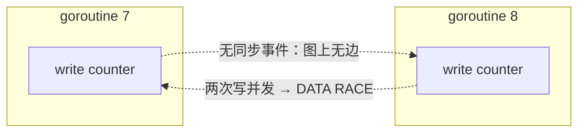

# 16.2 竞争检查

数据竞争（data race）是并发程序里最隐蔽、最难复现的一类 bug。它的定义很短：两个 goroutine
并发访问同一内存地址、其中至少一个是写、且二者之间没有任何同步把它们排序，那么程序的行为
就是未定义的（[11.9](../../part3concurrency/ch11sync/mem.md)）。「未定义」不是「读到旧值」
这么温和，它意味着编译器与处理器都被允许做出令人意外的重排，结果可能时对时错，可能只在压力
负载下、只在某种 CPU 上、只在某个版本里偶发一次。靠人眼复查这种 bug 是没有指望的。Go 的
**竞态检测器**（`-race`）正是把这件事从「靠运气复现」变成「跑一遍就告诉你」的工具。这一节
讲清它的原理、它背后的算法代价、以及它那两条必须记住的能力边界。

## 16.2.1 基于 happens-before 的动态检测

`go test -race`、`go run -race`、`go build -race`、`go install -race` 都能开启竞态检测。它的
内核是 Google 在 LLVM `compiler-rt` 里维护的 **ThreadSanitizer**（TSan）运行时，Go 以预编译的
`.syso` 形式把它链进程序（见 `runtime/race/`，因此 `-race` 依赖 cgo）。它的工作原理是
**动态的 happens-before 检测**：程序运行时，编译器在每一次内存访问前插入一个回调，运行时则
拦截每一个同步事件，二者合起来让 TSan 实时维护一张 happens-before 关系图（[11.9](../../part3concurrency/ch11sync/mem.md)
那条偏序）。当它发现两个 goroutine 访问了同一地址、至少一个是写、而二者之间**不存在**任何
happens-before 边，就报告一个数据竞争。

为什么「访问」与「同步」要分开拦截？因为这正是 happens-before 偏序的两个来源。访问告诉检测器
「谁在何时碰了哪块内存」，同步告诉它「哪两条时间线之间被建立了次序」。Go 在 `runtime/race.go`
里暴露的这组钩子，恰好把这两类事件一一对应了出来：

```go
//go:build race

// 访问事件：编译器在每次读/写内存前自动插桩调用
func RaceRead(addr unsafe.Pointer)
func RaceWrite(addr unsafe.Pointer)
func RaceReadRange(addr unsafe.Pointer, len int)  // 切片、memmove 等成片访问
func RaceWriteRange(addr unsafe.Pointer, len int)

// 同步事件：在 addr 上建立跨 goroutine 的 happens-before 关系
// 注释原文：establish happens-before relations between goroutines
func RaceAcquire(addr unsafe.Pointer)       // ≈ C11 atomic_load(acquire)
func RaceRelease(addr unsafe.Pointer)        // ≈ C11 atomic_store(release)
func RaceReleaseMerge(addr unsafe.Pointer)   // ≈ C11 atomic_exchange(release)
```

`RaceRead`/`RaceWrite` 是访问点，运行时里 channel 收发、`sync.Mutex` 的加解锁、`sync/atomic`
的每个原子操作、goroutine 的创建与退出，则在内部调用 `raceacquire`/`racerelease` 这对原语
把 happens-before 边「焊」上去。换句话说，[11.9](../../part3concurrency/ch11sync/mem.md) 里
规定的每一条建立次序的语义（channel 发送 happens-before 对应接收完成、解锁 happens-before
后续加锁、原子写以 release 顺序同步原子读的 acquire），在 TSan 这里都落成一条具体的图上的边。
内存模型那句抽象的「无 happens-before 即竞争」，于是变成了一个能实际抓现行的判定。

下面这段经典的「并发自增」就有竞争。两个 goroutine 都写 `counter`，中间只隔了一个
`WaitGroup`，而 `WaitGroup` 只保证 main 等到两者结束，并不在两个写之间建立任何次序：

```go
func main() {
	var counter int
	var wg sync.WaitGroup
	for range 2 {
		wg.Add(1)
		go func() {
			defer wg.Done()
			counter++ // 读-改-写，无同步：与另一个 goroutine 的 counter++ 构成竞争
		}()
	}
	wg.Wait()
	fmt.Println(counter)
}
```

`go run -race` 跑它，TSan 会打印两次冲突访问的栈、以及肇事 goroutine 的创建处：

```
==================
WARNING: DATA RACE
Read at 0x00c0000160a8 by goroutine 8:
  main.main.func1()
      /tmp/race.go:11 +0x...
Previous write at 0x00c0000160a8 by goroutine 7:
  main.main.func1()
      /tmp/race.go:11 +0x...
Goroutine 8 (running) created at:
  main.main()
      /tmp/race.go:8 +0x...
==================
Found 1 data race(s)
exit status 66
```

报告精确到了文件、行号与两个 goroutine 的身份，这正是动态检测的回报：它不猜「这里可能有竞争」，
它指着真正发生的那一次冲突说「就是这两行」。修复也顺理成章，给 `counter++` 套上同步即可。
用 channel 把自增串行化（[11.9](../../part3concurrency/ch11sync/mem.md) 的发送-接收次序），或更
直接地换成原子操作，竞争便消失：

```go
var counter atomic.Int64
// ...
go func() {
	defer wg.Done()
	counter.Add(1) // 原子读-改-写：TSan 看到 release/acquire 边，不再报竞争
}()
```

## 16.2.2 机制与它的内存代价

TSan 怎么在内部判定「两次访问之间有没有 happens-before 边」？核心数据结构是**向量时钟**
（vector clock）。每个 goroutine 持有一个逻辑时钟，向量时钟 $VC$ 把所有 goroutine 的时钟收成
一个数组；当 goroutine $t$ 在某地址上 release、另一 goroutine $u$ 在同一地址上 acquire 时，
$u$ 的向量时钟按分量取最大值并入 $t$ 的，$VC_u \leftarrow \max(VC_u, VC_t)$，这一步就把
「$t$ 此前的事件 happens-before $u$ 此后的事件」编码了进去。判定两次访问 $a$（在 $t$）与 $b$
（在 $u$）是否有序，只需比较时钟：若 $VC_t[t]$ 这一分量已被 $u$「看见」（即 $a$ 的时间戳
$\le VC_u[t]$），则 $a \to b$ 成立，无竞争；否则二者并发，且若有一个是写，便是竞争。

代价就藏在这里。朴素实现要为**每个被监视的内存位置**都挂一份完整的向量时钟，长度正比于
goroutine 数，开销是 $O(n)$ 每地址。TSan 用两个工程手法把它压下来。其一是**影子内存**
（shadow memory）：它为应用的每个内存字维护若干「影子单元」，记录最近几次访问的
（线程、时间戳、读/写）三元组，靠固定大小的滑动窗口而非无界历史来判定；正是这套与应用内存
等比例铺开的影子结构，决定了 `-race` 的内存占用会显著上涨。其二是 **FastTrack** 的洞察
（Flanagan & Freund, PLDI 2009）：绝大多数访问其实是被某个 happens-before 链完全保护的，
对这些访问，一个完整向量时钟可退化为一对标量「**纪元**」（epoch，即「线程 + 时间戳」），
$O(n)$ 的比较因此在常见情形里降为 $O(1)$，只有真正出现读并发共享时才升级回完整向量时钟。
向量时钟保证判定的精确，影子内存与纪元让它在工业规模上跑得动，二者合起来就是那条「换内存
换速度以换确定性」的取舍。

按官方文档给出的实测，这套机制使程序的**内存占用约增大 5~10 倍、运行时间约变慢 2~20 倍**；
此外每个 `defer`/`recover` 会多占约 8 字节，长期运行且周期性 `defer`/`recover` 的 goroutine
要留意这点。



## 16.2.3 它的能力边界

竞态检测器极其有用，但有两条必须记住的边界。其一，它是**动态**的，只能检测**实际发生了**的
竞争，那条触发竞争的代码路径必须在某次带 `-race` 的运行中真的被执行到。没被跑到的分支里藏着
的竞争，它一无所知。这意味着竞态检测的效果**取决于测试覆盖**：要在尽量真实、并发尽量充分的
负载下跑 `-race`，让那些只在高并发时才交错的访问真正交错，才能把竞争撞出来。与之相对的是静态
分析，后者无需运行就能扫全部路径，但代价是大量保守的可能误报。TSan 选了另一端。

其二，它**有成本**。前一节那组 5~10 倍内存、2~20 倍变慢的数字，是插桩与影子内存的必然开销。
所以 `-race` 的定位是**测试与预发布**：让它进 CI、进压测、进集成环境，而不是常开在生产。把
`-race` 当成一道并发关卡，而非一个长驻的运行时特性。

正因为它**只报实际发生过的、确实缺少 happens-before 边的访问**，竞态检测器的报告有一个宝贵
性质：**几乎没有误报**。它判定竞争用的是精确的向量时钟比较，不是启发式猜测，所以一旦
`-race` 报警，报出来的基本都是真实的数据竞争。这与「一堆待人工甄别的可能误报」的工具截然不同，
也给出了一条简单可靠的工程纪律：`-race` 报了，就当真，立刻修。

## 16.2.4 与内存模型的呼应

竞态检测器是 [11.9 内存一致模型](../../part3concurrency/ch11sync/mem.md) 那套理论的**实践落地**。
内存模型负责回答「什么是对的」：它用 happens-before 定义了数据竞争，并声明有数据竞争的程序行为
不可依赖。这是一份规范，本身不会替你检查任何程序。竞态检测器负责回答「你的程序错在哪」：它把
规范里那条偏序在运行时真实地建起来，于是「这段代码有没有违反内存模型」从一个需要人脑推演的
问题，变成了「跑一遍、看它报不报」的可执行判定。一个划定边界，一个巡逻边界。

Go 把竞态检测**内建进工具链**，一个 `-race` 标志即可，无需额外安装或改代码，这是它「让正确的
并发更容易写对」承诺的一部分。语言一边用 channel 与锁（[11](../../part3concurrency/ch11sync)）
给你正确同步的手段，一边用竞态检测器帮你抓出没同步好的地方。「并发代码必过 `-race` 测试」因此
是写可靠 Go 并发程序的基本功，内存模型定义对错，竞态检测器帮你发现错。

## 延伸阅读的文献

1. The Go Authors. *Data Race Detector.* https://go.dev/doc/articles/race_detector
2. Konstantin Serebryany, Timur Iskhodzhanov. "ThreadSanitizer: data race detection in
   practice." *WBIA 2009*. https://doi.org/10.1145/1791194.1791203 （ThreadSanitizer 的起源；
   Go 实际链入的是其后在 LLVM `compiler-rt` 中重写的 v2 运行时，见 `runtime/race/README`）
3. Cormac Flanagan, Stephen N. Freund. "FastTrack: Efficient and Precise Dynamic Race
   Detection." *PLDI 2009*. https://doi.org/10.1145/1542476.1542490 （向量时钟到纪元的优化）
4. The LLVM Project. *ThreadSanitizerAlgorithm.* https://github.com/google/sanitizers/wiki/ThreadSanitizerAlgorithm
5. The Go Authors. *The Go Memory Model.* https://go.dev/ref/mem
6. 本书 [11.9 内存一致模型](../../part3concurrency/ch11sync/mem.md)、
   [11 并发同步](../../part3concurrency/ch11sync).
