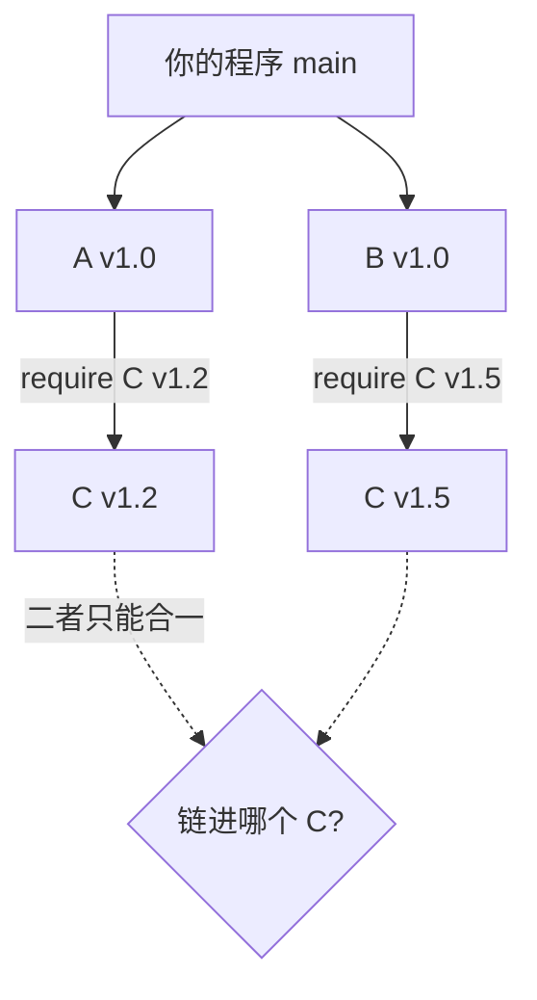
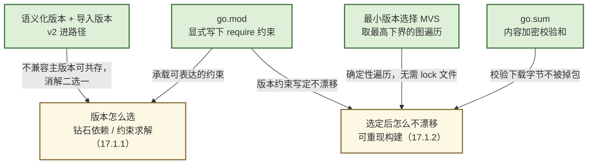

# 17.1 依赖管理的难点

现代软件几乎不再从零写起。一个寻常的服务端程序，`import` 列表往下走一层是日志库、HTTP
路由、序列化器，再往下是它们各自依赖的加密、压缩、网络原语,真正属于你自己的代码，可能不到
整张依赖图的百分之一。这带来了复用的红利，也带来了一个本不属于你、却必须由你回答的问题：
**这张图上每个包，到底该用哪个版本？** 这一节不急着给 Go 的答案，先把问题本身的难讲清楚。
难点有两条主线：一是**版本如何选**（钻石依赖与约束求解），二是**选定之后如何不漂移**
（可重现构建）。理解了这两条，才能看懂 [17.3](./minimum.md) 那套「最小版本选择」为什么值得
专门设计，以及 Go 为走到那一步付出过什么代价。

## 17.1.1 钻石依赖：一个约束求解问题

依赖管理的核心难题，集中体现在一种叫**钻石依赖**（diamond dependency）的拓扑上。你的程序同时
依赖 A 和 B，而 A 和 B 又都依赖同一个 C,依赖图从顶点出发分成两支，又在 C 处重新汇合，画出来
正是一颗钻石。问题出在两支对 C 提出了**不同的版本要求**：



为什么不能让 A 用 C v1.2、B 用 C v1.5，各取所需？多数语言做不到。C 的两个版本通常导出同一个
包路径、同一组类型名，把两份链进同一个程序，链接器会撞上重复符号；即便链接器允许，C v1.2 的
`Token` 和 C v1.5 的 `Token` 在类型系统里也是两个互不兼容的类型,一旦 A 把自己拿到的 `Token`
传给 B，就会在边界上炸开。这条裂缝用一段示意代码看得更清楚：

```go
// A 内部用 C v1.2，并把 C 的类型暴露在自己的 API 上
package a
import c "example.com/c" // 假定解析到 v1.2
func NewClient() *c.Token { ... }

// B 内部用 C v1.5，签名里同样是 c.Token
package b
import c "example.com/c" // 假定解析到 v1.5
func Use(t *c.Token) { ... }

// 你的程序想把 A 给的 Token 交给 B
b.Use(a.NewClient())
// 若 v1.2 与 v1.5 是「两个 c.Token 类型」，这一行编译不过：
// cannot use a.NewClient() (*c@v1.2.Token) as *c@v1.5.Token
```

Russ Cox 在「Go & Versioning」里用 OAuth2 的例子细描过这条裂缝：一个应用经由 Azure 库间接
依赖 OAuth2 v1，又经由 AWS 库间接依赖 OAuth2 v2，当中间库把底层依赖的类型暴露进自己的 API，
多版本共存就从「能不能链进去」变成了「会不会在接缝处对不上类型」。于是现实退化成一个硬约束：
**同一个 C，整个程序里只能存在一个版本**。

一旦接受「一个包一个版本」，钻石依赖就变成了一道选择题：在 v1.2 和 v1.5 里挑一个，挑出来的
那个必须同时让 A 和 B 都能正常工作。两个节点时这还简单。可真实的依赖图有成百上千个节点，每个
节点都对版本提出自己的区间约束（C 要 `>=1.2`、D 要 `<2.0`、E 又要 `!=1.4` ……），要找出一组
让**所有**约束同时成立的版本组合,这就是一个不折不扣的**约束求解**（constraint solving）问题。

它有多难，取决于允许表达什么样的约束。如果约束里出现了**条件依赖**,「若选了 X 的某版本，则
不能选 Y」这类带否定的蕴含，求解问题立刻滑进**布尔可满足性**（SAT）的范畴。Cox 的观察相当
扎心：「只需一点点条件约束，版本搜索就掉进了 SAT」,而 SAT 是 NP 完全问题，没有已知的通用
高效解法。形式化地说，给定变量集合 $V$（每个包选哪个版本）和约束集合 $\Phi$，要判定是否存在
一个赋值使 $\bigwedge_{\phi \in \Phi}\phi$ 为真,当 $\Phi$ 含任意布尔子句时，这等价于
3-SAT。这正是为什么 Cargo、npm、apt 这些包管理器内部往往背着一个 SAT 求解器：

```text
# 一个会触发 SAT 的约束系统（示意）
程序     依赖 A, B
A v1.0   依赖 C >= 1.2
B v1.0   依赖 C  < 1.5,  且 若 C >= 1.3 则需 D >= 2.0
D v2.0   依赖 C  < 1.3            ← 与上一条互相否定，制造组合爆炸
...      （上千个包，各带自己的区间与条件）
求解器需在指数级的版本组合空间里，找一组同时满足全部约束的赋值
```

把求解器请进来，代价有二。一是**慢**：最坏情况下搜索空间随包数指数膨胀，大型工程里一次依赖
解析耗时可观。二是**意外**：SAT 求解器返回的是「某个可行解」，未必是人直觉里「最该选的那个」。
求解器内部的搜索顺序、启发式策略稍有调整，同一份约束可能解出不同的版本组合,你只是升级了一个
八竿子打不着的包，却发现另一个包被「顺手」换了大版本。**慢与不可预测，是把版本选择当成通用
约束求解的内生代价。** 记住这一点，[17.3](./minimum.md) 里 Go 刻意把问题限制在多项式可解的
子类（MVS 对应的约束同时是 2-SAT、Horn-SAT 与 Dual-Horn-SAT），就不再是炫技，而是对这条
难点的正面回应。

## 17.1.2 可重现构建：今天的我，等于下个月的 CI

第二条主线，是选定版本之后如何让它**不漂移**。可重现构建（reproducible build）的要求可以
一句话说清：今天在我机器上构建出的二进制，与下个月在 CI 流水线上、在你的笔记本上、在三年后
某次安全回滚里构建出的，必须由**同一组依赖版本**编译而成。否则便落入那句工程师最熟悉的辩词:
「在我这儿是好的」(works on my machine)。

它之所以是难点，在于「构建」这个动作天然带着一个隐藏的时间维度。如果依赖解析的规则是
「取满足约束的**最新**版本」,这是许多生态的默认,那么解析结果就成了构建时刻的函数：

```text
# 同一份「取最新」规则，在不同时刻给出不同结果
一月：require C >= 1.2  →  当时 C 最新是 v1.4  →  链进 v1.4
三月：require C >= 1.2  →  C 已发布 v1.6        →  链进 v1.6  ← 没人改一行代码，构建却变了
```

没有人改动一行源码、一行依赖声明，只因为上游在两次构建之间发了新版，产物就变了。一旦新版引入
回归，线上 bug 在你本地却复现不出来,因为你和线上悄悄跑着不同的 C。可重现性因此要求版本选择
是**确定的**（同样的输入永远给同样的输出）、**可记录的**（能把这次选了哪些版本写下来）、并且
**可校验的**（能确认下载到的字节就是当初那批字节，没有被篡改或替换）。

主流生态对这道题有两种答法。一种是「**取最新 + 锁文件**」：解析时仍取最新可行版本，但把这次
解出的整组版本钉进一个 lock 文件（`package-lock.json`、`Cargo.lock`、`Gemfile.lock`），下次
构建照着锁文件复现。这能保住可重现，却如 Cox 所言，对**库**而言是「低保真」的:库作者实际开发
和测试时用的，多半不是某个使用者锁文件里那个恰好最新的版本，二者之间的偏差是平白引入的风险。
另一种答法，是让解析规则本身就具备确定性，使「锁文件」不再是必需品。Go 选了后者，这是
[17.3](./minimum.md) 的伏笔。

把这两种答法放进别家生态里对照，难点的轮廓会更立体。npm 允许同一个包的多个版本在
`node_modules` 树里并存（嵌套安装），等于用「放弃单一版本」来回避 17.1.1 的钻石冲突，代价是
依赖树膨胀、同一类型在不同子树里互不相认。Cargo 取「最新可行 + `Cargo.lock`」，对应用是好的，
对库则如前述偏向低保真。Maven 走「最近者优先」（nearest-wins）的就近覆盖，规则简单却常给出
让人意外的版本。各家选择不同，但都在回答同两个问题:冲突时选谁、选定后如何不漂移,这正说明
难点是生态无关的，而非某门语言的偶然。

## 17.1.3 Go 的弯路：GOPATH 时代

把上面两条难点摆出来，再回看 Go 早期的依赖管理，就能精确指出它差在哪。模块出现之前，Go 用的是
**GOPATH 模式**：所有第三方代码摊在一个全局的 `$GOPATH/src` 目录下，导入路径直接等于目录路径，
`import "github.com/foo/bar"` 就对应 `$GOPATH/src/github.com/foo/bar`。结构朴素，但它对前两节的
难点几乎是全面失守：

```text
$GOPATH/src/
  github.com/foo/bar/   ← 一个导入路径，磁盘上只有一份代码、一个版本
  golang.org/x/net/     ← 没有任何地方记录「这是哪个版本」
```

- **没有版本概念。** `go get` 拉的是依赖仓库的**最新主分支**。今天拉和下个月拉，可能是不同的
  提交,17.1.2 里那种「没改代码、构建却变了」的漂移，在 GOPATH 下是常态而非例外。
- **无法表达版本约束。** GOPATH 里根本没有地方写下「我要 C 的 v1.2」。约束都无从表达，
  17.1.1 的约束求解自然也无从谈起。
- **钻石依赖直接无解。** 一个导入路径在 `$GOPATH/src` 下只对应一个目录、一份代码。A 要 C v1.2、
  B 要 C v1.5，磁盘上却只放得下一个 C,冲突在文件系统层面就被强行抹平了，抹平的代价是某一方
  默默地跑在它没测试过的版本上。

社区不会坐等。GOPATH 的真空期里涌出一批第三方工具,`godep`、`glide`、`dep` 是其中最知名的几个
（这场工具竞逐与它如何收束于官方方案，是 [17.4](./fight.md) 的主题）。它们的招式大同小异：把
依赖的源码连同一个确定的版本**复制**进项目自带的 `vendor/` 目录，构建时优先用 `vendor/` 里这份
快照，从而绕开 GOPATH 的「永远最新」；再配一个 lock 文件（`Gopkg.lock` 之类）记下每个依赖钉在
哪个提交，换来一点可重现性。这些补丁确实缓解了痛处，却始终是补丁:格式各异、互不通用，且没有
一个被工具链原生承认的版本模型，钻石依赖这类需要全局求解的问题，依旧只能靠人工 `vendor` 时
手动裁决。

这段弯路本身就是依赖管理之难最有力的注脚。连以工程友好著称、连构建速度都要锱铢必较的 Go，
都在版本这件事上摸索了近十年才落定。值得一提的是，GOPATH 也不是一无可取:它逼着每个导入路径
全局唯一、可寻址，这个约束后来被模块继承了下来，成为「模块路径即导入前缀」的根基。弯路里
踩实的部分，往往会留在正解之中。

## 17.1.4 通向 Go 模块

2018 年起，**Go 模块**（Go Modules）成为官方答案，正面回应前三节的每一条难点。它的几块基石，
本章后续逐一拆解，这里先给读者一张全局地图：

- **`go.mod`** 把依赖与版本约束**显式写进**仓库,17.1.1 里「无从表达的约束」从此有了载体。每条
  `require` 是模块图（module graph）上的一条边，标注「至少需要某依赖的某版本」。
- **`go.sum`** 记录每个依赖内容的加密校验和,回应 17.1.2 的「可校验」：下载到的字节若与
  `go.sum` 对不上，构建即拒绝，依赖无法被悄悄掉包。
- **语义化版本**（[17.2](./semantics.md)）给「v1.2 与 v1.5 谁更新、是否兼容」一套各方都认的规则,
  尤其是「主版本进导入路径」（`.../v2`）这条，让 C 的不兼容大版本拥有**不同的导入路径**，把
  17.1.1 那种「同路径双版本撞车」从源头化解。
- **最小版本选择**（MVS，[17.3](./minimum.md)）是那套独特的求解算法。它对模块图做一次确定性的
  图遍历，对每个依赖取「所有要求里的**最高下界**」,既绕开了 SAT 的指数复杂度，又让结果天然
  确定，于是 17.1.2 的可重现**不再依赖 lock 文件**：同样的 `go.mod` 在任何时间、任何机器上，
  都解出同一组版本。

这四块基石如何各自对应到前两节那两条难点，可以一图收束：



把这四块拼起来，依赖管理那两条主线就都有了着落:版本怎么选，交给 MVS 的确定性遍历；选定后
怎么不漂移，交给写定的 `go.mod` 加校验的 `go.sum`。本章接下来便沿这条线铺开：先是语义化版本
（[17.2](./semantics.md)）立下版本号的契约，再是最小版本选择（[17.3](./minimum.md)）给出求解的
内核，最后回看那场决定 Go 走向的工具之争（[17.4](./fight.md)）,看清它为何最终选了这条路，
而不是别人走熟的那条。

依赖管理是少有的、答案看似简单而问题极难的工程领域。它没有「完美解」，每种方案都是在
**求解复杂度**、**对作者意图的保真**、**可重现强度**与**使用者心智负担**之间重新分配权重。
Go 模块也不例外，它的取舍，正是后续几节要逐一审视的。

## 延伸阅读的文献

1. Russ Cox. *Go & Versioning（"vgo" 系列，问题与方案的完整论述）.* 2018.
   https://research.swtch.com/vgo （尤见 "Semantic Import Versioning" 与
   "Minimal Version Selection" 两篇，分别对应钻石依赖与求解复杂度）
2. Russ Cox. *Minimal Version Selection.* 2018. https://research.swtch.com/vgo-mvs
   （论证 MVS 对应的约束同时是 2-SAT / Horn-SAT / Dual-Horn-SAT，故多项式可解；
   并对比「取最新 + lock」的低保真）
3. The Go Authors. *Go Modules Reference.* https://go.dev/ref/mod
   （`go.mod`、`go.sum`、module graph、build list 与 MVS 的权威定义）
4. Titus Winters, Tom Manshreck, Hyrum Wright. *Software Engineering at Google.*
   O'Reilly, 2020. 第 21 章 "Dependency Management"（大规模依赖管理的难点与权衡）
5. Sam Boyer. *So you want to write a package manager.* 2016.
   https://medium.com/@sdboyer/so-you-want-to-write-a-package-manager-4ae9c17d9527
   （`dep` 作者对版本求解与 SAT 复杂度的系统梳理）
6. 本书 [17.2 语义化版本控制](./semantics.md)、[17.3 最小版本选择算法](./minimum.md)、
   [17.4 vgo 与 dep 之争](./fight.md)。
