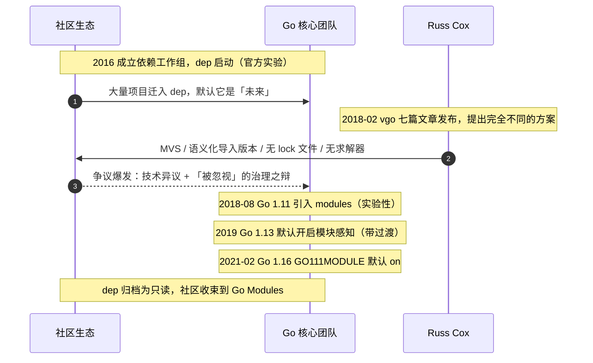

# 17.4 vgo 与 dep 之争

今天的 Go 模块（Go Modules）并非一开始就有。它从一场颇具戏剧性、也颇有争议的社区事件里
诞生：**vgo 与 dep 之争**。这段历史不只是八卦，它折射出开源项目治理、技术决策与社区情绪之间
的真实张力，是理解 Go 模块「为何是今天这样」的最后一块拼图，也是这本书一路谈下来的设计哲学
在工具链层面的一次集中演出。

前面两节已经把 Go 模块的技术内核摆出来了：语义化版本管理（[17.2](./semantics.md)）把主版本
写进导入路径，最小版本选择（[17.3](./minimum.md)）用一条确定性算法挑出每个依赖的版本，二者
合起来，让 Go 既不需要 lock 文件、也不需要约束求解器。这一节回答的是另一个问题：为什么是
**这套**方案，而不是当时社区已经投入两年、几乎被默认为「未来」的那一套。要讲清楚这个，得把
时间拨回到 2016 年。

## 17.4.1 dep：社区的「官方实验」

GOPATH 时代的依赖混乱（[17.1](./challenges.md)）催生过一大批第三方工具：`godep`、`glide`、
`govendor`，各自为政，互不兼容。2016 年，Go 团队决定收口，成立了一个依赖管理工作组，由
Sam Boyer 等社区成员牵头，做出一个被定位为**官方实验**（official experiment）的工具：
**`dep`**。它不是某个人的玩具，而是 Go 团队背书、社区深度参与、被广泛理解为「将来会并入
`go` 命令」的候选方案。许多公司和个人据此调整了工程实践，把项目迁到 dep 上。

技术上，dep 走的是当时**主流**的路子，与 Rust 的 Cargo、Ruby 的 Bundler、JavaScript 的 npm
一脉相承：一个清单文件声明你想要的版本范围，一个 **lock 文件**钉死本次解析出的精确版本，中间
夹着一个**约束求解器**。求解器要做的事，本质是布尔可满足性（SAT）：把「A 需要 B 的 `>=1.2`」
「C 需要 B 的 `<2.0`」这类约束翻译成逻辑公式，搜一组同时满足所有人的版本赋值出来。

```toml
# Gopkg.toml：dep 的清单，声明约束（示意）
[[constraint]]
  name = "github.com/pkg/errors"
  version = ">=0.8.0"

[[constraint]]
  name = "github.com/some/lib"
  branch = "master"
```

```toml
# Gopkg.lock：求解器算出的、本次锁定的精确版本（示意）
[[projects]]
  name = "github.com/pkg/errors"
  revision = "645ef00459ed84a119197bfb8d8205042c6df63d"
  version = "v0.8.0"
```

这套设计有它的道理：清单写「我能接受的范围」，求解器在范围内找一组解，lock 文件保证团队
里每个人、每次 CI 都装到同一份。问题在于求解本身。通用 SAT 是 NP 完全的，求解器为了在可接受
时间内出解，往往倾向于**选最新的可行版本**，于是同一份清单，今天解出的结果和下个月解出的
结果可能不同：只要依赖图里任何一个包发了新版本，求解空间就变了。lock 文件正是为了对冲这种
不确定性而存在的补丁。换句话说，主流方案是「用一个会漂移的求解器，再用一个 lock 文件把漂移
钉住」。

## 17.4.2 vgo：一个与主流背道而驰的提案

2018 年 2 月，Russ Cox 一口气发表了 **vgo**（versioned go）系列七篇文章，标题依次是
「Go += Package Versioning」「A Tour of Versioned Go」「Semantic Import Versioning」
「Minimal Version Selection」「Reproducible, Verifiable, Verified Builds」「Defining Go
Modules」「Versioned Go Commands」。它们摆出的不是对 dep 的改良，而是一套**完全不同**的
方案，也就是后来的 Go 模块。

vgo 在几乎每一个关键决策上都与 dep 相反：

| 维度 | dep（主流方案） | vgo（后来的 Go 模块） |
|------|----------------|----------------------|
| 版本选择 | 约束求解器，倾向取**最新**可行版本 | 最小版本选择（MVS），取**最小**可满足版本 |
| 求解复杂度 | 通用 SAT，NP 完全 | 限定在 Horn 公式子类，线性可解、解唯一 |
| lock 文件 | 必需，用来对冲求解漂移 | 不需要，`go.mod` 加 MVS 已是确定性的 |
| 不兼容版本共存 | 求解器报冲突，需人工取舍 | 语义化导入版本：v2 进路径，两版本可并存 |
| 设计取向 | 给用户最大灵活度 | 给构建最大可重现性 |

最违反直觉的是版本选择的方向。所有人都觉得包管理器该帮你装**最新**的兼容版本，vgo 偏偏反过来
取**最小**的。Cox 的论证落在一个数学事实上：把版本选择限制在 Schaefer 二分定理的可解子类里
（Horn 与 dual-Horn 公式），就能绕开 NP 完全，得到一个有**唯一最小解**的问题。而「取最小」
带来的，是一种他称为**高保真构建**（high-fidelity build）的性质：你拿到的版本，正是作者当初
测试时用的版本，「构建只在确有必要时才偏离作者自己的构建」。新版本的发布**不会**改变任何已有
构建的结果，因为没有人要求你升级，MVS 就不会替你升级。这恰好是 lock 文件想达到、却要靠一个
额外文件才勉强达到的目标，而 MVS 把它直接做进了算法。

```text
// MVS 的直觉（详见 17.3）：版本不是「解」出来的，是「读」出来的
build list = 把主模块及其全部依赖的 go.mod 里
             每个模块要求的版本，逐个取「各方要求中的最大者」
// 没有回溯，没有搜索，没有「最新版本」的概念进来搅局
// 同一组 go.mod 文件，任何时候、任何机器上，算出的 build list 都一样
```

把两种思路放在同一个依赖图上，差别会立刻显形。设主模块同时依赖 A 与 B，二者又都依赖
公共库 lib，A 要求 `lib >= 1.2`，B 要求 `lib >= 1.4`，而 lib 当前最新已发到 `1.7`：

```text
        主模块
        /     \
       A       B
   (lib≥1.2) (lib≥1.4)
       \     /
        lib  ──→ 现网最新 1.7

dep 求解器：在区间内挑「最新可行」→ 选 lib 1.7
            （A、B 都没测过 1.7；下周 lib 发 1.8，解又变了，靠 lock 文件钉住）

vgo 的 MVS：取各方要求中的最大者 = max(1.2, 1.4) = lib 1.4
            （正是 B 作者测过的版本；lib 发 1.8 也不影响，结果天然稳定）
```

差别不在于哪个版本「更高」，而在于**这个结果由什么决定**。dep 选 1.7，是因为 1.7 恰好是
求解那一刻的现网最新，依赖图之外的世界（别人何时发新版）渗进了你的构建，于是必须用 lock
文件把它挡回去。vgo 选 1.4，只用到了依赖图内部写死在各 `go.mod` 里的信息，外部世界的变动
进不来，构建因此**自带可重现性**，无需额外文件。这就是「取最小」反直觉、却更可信的根由。

语义化导入版本（[17.2](./semantics.md)）则从根上拆掉了求解器最头疼的另一个结：**菱形依赖**里
两个**不兼容**的主版本要共存。dep 的求解器遇到「A 要 lib v1，B 要 lib v2」只能报冲突，让人
去选；vgo 把 `v2` 写进导入路径（`github.com/x/lib/v2`），于是 v1 与 v2 在编译器眼里就是两个
不同的包，可以同时存在，冲突根本不成立。最难的那个问题，被定义掉了，而不是解出来。

## 17.4.3 争议：被忽视的投入与过程之辩

vgo 引发了 Go 社区历史上最激烈的争议之一，而且争议在两个层面同时展开，值得分开来看，也都
值得公允地呈现。

**技术层面**的质疑是真实的，不该被胜负结果抹平。MVS「取最小版本」违反几乎所有工程师的直觉，
很多人担心它会把人长期钉在带已知 bug 的旧版本上（vgo 的回应是 `go get -u` 显式升级，外加
后来的 `go.sum` 与校验机制）。语义化导入版本被批评太严格：它要求库作者在发 v2 时改导入路径、
甚至改目录结构，给既有生态加了一道不小的迁移成本，关于「主版本要不要进路径」的争论持续了
很久。这些都是 dep 阵营提出的、有分量的技术异议。

**治理层面**的情绪则更复杂。许多为 dep 投入了近两年心血的贡献者感到**被忽视**：他们参与的是一个
被冠以「官方实验」之名的项目，理应是 Go 依赖管理的方向，结果核心团队没有在 dep 上继续迭代，
而是另起炉灶，端出一套理念迥异、且基本不复用 dep 工作的方案。争论的焦点因此从「哪套设计更好」
滑向「这个决策过程是否尊重了社区的投入」。dep 的主要作者公开表达过受挫，社区里关于 Go 团队
决策模式的讨论一度相当激烈。这里没有简单的对错：一方是被邀请来做实验、却发现实验结果不被
采纳的社区；另一方是手握一套自认更优、且与语言整体设计更协调方案的核心团队。两种立场都站得
住，张力恰恰来自此。

## 17.4.4 结局：vgo 胜出，dep 退场



最终，**vgo 的方案胜出**。它演化为 Go Modules，于 **Go 1.11（2018 年 8 月）**作为「实验性的
初步支持」引入，官方措辞是「模块支持仍属实验，细节可能随用户反馈变化」；经 Go 1.13、1.14
的若干轮打磨，到 **Go 1.16（2021 年 2 月）**，`GO111MODULE` 默认变为 `on`，模块感知模式
不再需要 `go.mod` 在场就成为缺省行为，GOPATH 时代正式落幕。`dep` 仓库随后被归档为只读，
官方建议用户迁往 Go Modules。

回头看，vgo 当年那些被质疑的论点，大体站住了脚。MVS 带来的**可重现、可信、简单**
（[17.3](./minimum.md)）确实比求解器方案更耐用：没有求解漂移，就不需要 lock 文件来打补丁；
没有回溯搜索，依赖解析的行为就是可预测、可在脑中演算的。语义化导入版本虽严格，却从根上化解了
不兼容版本共存这个最棘手的菱形依赖问题，而这正是各家求解器至今仍要反复搏斗的地方。Go 模块
如今运转良好，`go.sum` 与 `GOPROXY`、`sum.golang.org` 在其上长出了一整套可验证的供应链，
已是 Go 生态不可或缺的基石。这并不意味着 dep 阵营的技术异议是错的：取最小版本的迟滞、v2
迁移的成本，都是真实存在、需要用配套工具去缓解的代价。胜出的方案同样有它付出的取舍，只是
这套取舍被时间证明放对了位置。

值得一提的是，「vgo 胜出」并不等于「dep 一无所获」。dep 三年的实践把许多问题先趟了一遍：
对语义化版本（SemVer）的依赖、把第三方代码 vendor 进仓库的需求、构建必须可复现这条底线，
都在 dep 时代被社区充分讨论、形成共识，Go 模块直接继承了这些结论，只是换了一套更简单的内核
去实现它们。从这个角度看，dep 不是被推倒的废稿，而是一次代价高昂、却把方向探明了的前哨。
争议之所以格外刺痛，恰恰因为投入是真实的、贡献是有价值的，而这正是把这段历史讲完整的理由。

## 17.4.5 启示：简单的算法，与逆主流的定力

这段历史的启示，超出了技术本身。

它照见了开源治理的**真实张力**。一个由少数核心设计者主导、高度重视设计一致性的项目（Go），
与一个期待被充分协商、且已经付出真金白银投入的社区之间，摩擦几乎是结构性的，无法靠善意完全
消除。Go 团队从这场争议里学到的东西，后来沉淀成了更透明的提案流程（proposal process）和更
克制的「官方实验」用词，这本身就是治理的演进。把 dep 的故事讲完整，不是为了评判谁对谁错，
而是因为：技术决策从来不只是技术问题，谁来决定、用什么程序决定，与决定本身同样重要。

它也提醒我们：**「主流做法」未必是最优解**。当几乎所有语言的包管理器都把约束求解器当作标准答案
时，Go 敢于退一步问「这个问题真的需要 SAT 吗」，并用一套限定在 Horn 公式子类、线性可解、解
唯一的简单算法另辟蹊径，最终被证明是对的。这既需要看穿「复杂是必要的」这一集体直觉的技术
洞见，也需要在两年社区投入与汹涌争议面前坚持到底的定力。两者缺一不可：只有洞见而无定力，
会在压力下妥协回主流；只有定力而无洞见，则只是固执。

至此，这本书从 Go 的设计哲学（[1](../../part1overview/ch01intro)）出发，走过语言、并发、内存、
编译与工具链，最终落在依赖管理这场关于「简单与可信」的抉择上。dep 想用一个灵活的求解器满足
所有人，把复杂度交给算法去承担；vgo 选择把复杂度从算法里抽走，安置到「语义化导入版本」这条
人人都能理解的约定里，让版本选择退化成一次确定性的读取。这正是贯穿全书的那条主线：
**把复杂度安置到正确的位置，让简单成为结果**。从分配器的分层缓存（[12](../../part4memory/ch12alloc)）
到调度器的工作窃取（[9](../../part3concurrency/ch09sched)），再到这里的最小版本选择，Go 一次又
一次地做着同一个选择，而 vgo 与 dep 之争，不过是这条主线最戏剧化、也最坦诚的一次自我证明。

## 延伸阅读的文献

1. Russ Cox. *Go & Versioning（vgo 系列，2018 年 2 月，共七篇）.*
   https://research.swtch.com/vgo 。其中 *Minimal Version Selection*
   （https://research.swtch.com/vgo-mvs）给出 MVS 限定在 Horn 公式子类、避开 NP 完全的论证，
   *Semantic Import Versioning*（https://research.swtch.com/vgo-import）阐述主版本进路径的设计。
2. The Go Authors. *Using Go Modules（官方博客系列）.* https://go.dev/blog/using-go-modules
3. Sam Boyer 等. *dep：Go 依赖管理工具（官方实验，现已归档）.* https://github.com/golang/dep
4. The Go Authors. *Go 1.11 Release Notes（模块的实验性初步支持）.* https://go.dev/doc/go1.11
5. The Go Authors. *Go 1.16 Release Notes（GO111MODULE 默认 on，模块成为缺省）.*
   https://go.dev/doc/go1.16
6. The Go Authors. *Go Modules Reference（cmd/go 模块机制的权威说明）.* https://go.dev/ref/mod
7. 本书 [17.2 语义化版本管理](./semantics.md)、[17.3 最小版本选择算法](./minimum.md)，
   与 [1 引言](../../part1overview/ch01intro) 的设计哲学。
