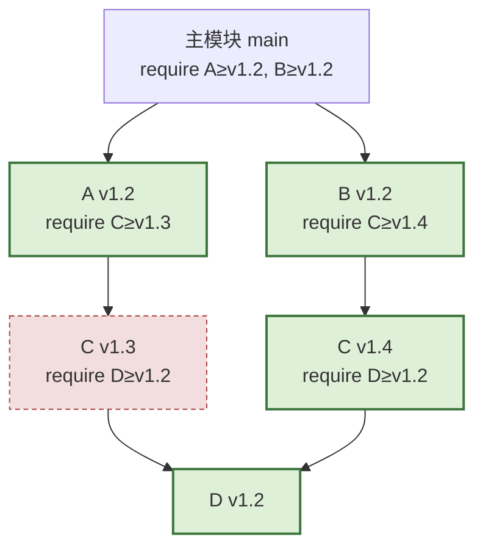

# 17.3 最小版本选择算法

确定了语义化版本（[17.2](./semantics.md)）后，还剩最后一问：当依赖图里各模块要求同一个依赖的
不同版本时，到底**选哪个版本**？Go 的答案是一个反直觉、却异常简洁的算法,**最小版本选择**
（Minimal Version Selection, MVS）。它是 Go 模块最具特色、也最值得玩味的设计：别家包管理器把
这件事做成了一个需要约束求解器的难题，Go 却把它压成了一遍图遍历。本节先把规则讲清，再看它为何
能这么简单，最后把它放回整个领域的谱系里，看清它究竟换走了什么、换来了什么。

## 17.3.1 选「满足要求的最低版本」

MVS 的规则简单到令人意外：对每个依赖，选**所有要求中最高的那个最低要求**,换句话说，选择
**能满足所有模块要求的最低版本**。先用本书一贯的小例子建立直觉。你的程序直接要求 C ≥ v1.2;
依赖 A 要求 C ≥ v1.3;依赖 B 要求 C ≥ v1.1。三个要求里最高的下限是 v1.3,MVS 就选 **C v1.3**。
注意这里的关键：哪怕此刻 C 已经发布了 v1.9，MVS **也不选 v1.9**,它只选「满足所有要求的最低
版本」，即 v1.3。

把这条规则放进一张真实的依赖图，就是 Go 官方文档采用的例子。主模块要求 A ≥ v1.2、B ≥ v1.2;
A v1.2 要求 C ≥ v1.3;B v1.2 要求 C ≥ v1.4;而 C v1.3 与 C v1.4 都要求 D ≥ v1.2。MVS 从主模块
出发，沿 `require` 边走遍整张图，为每个模块记下「见过的最高要求」：



图上每个方框，对应磁盘上一份 `go.mod`。主模块的那份只写明它直接依赖的下限，其余要求散落在
各依赖自己的 `go.mod` 里，MVS 沿边把它们逐一读出：

```go.mod
// 主模块 main 的 go.mod（只声明直接依赖的最低版本）
module example.com/main

go 1.26

require (
    example.com/A v1.2.0
    example.com/B v1.2.0
)

// example.com/A@v1.2.0 的 go.mod 里：require example.com/C v1.3.0
// example.com/B@v1.2.0 的 go.mod 里：require example.com/C v1.4.0
// example.com/C 的两个版本里都：    require example.com/D v1.2.0
```

对 C，图里出现了两个要求 v1.3 与 v1.4，取最大值得 v1.4;对 D，要求是 v1.2。最终构建列表
（build list）是 A v1.2、B v1.2、C v1.4、D v1.2。请注意：C 与 D 在仓库里可能早有更高的版本，
但「没有任何模块要求它们」，MVS 就**不会**去选,选出来的恰是「满足所有要求的、各模块版本号
最低的那一组」。这份列表可以用 `go list -m all` 当场看到：

```bash
$ go list -m all
example.com/main
example.com/A v1.2.0
example.com/B v1.2.0
example.com/C v1.4.0   # 取 v1.3 与 v1.4 的最大值
example.com/D v1.2.0
```

算法的全部，到此说尽：**遍历依赖图，对每个模块收集所有对它的版本要求，取其中的最大值（即最高
的下限）**。没有回溯、没有约束求解器、没有 SAT,就是一遍图遍历取最大。写成伪代码，核心不过
十几行：

```go
// MVS 构建列表（速写）：遍历依赖图，对每个模块取要求中的最高版本
func buildList(main module) map[path]version {
    selected := map[path]version{}        // 每个模块当前选中的版本
    queue := []module{main}               // 待访问的模块版本
    for len(queue) > 0 {
        m := queue[0]; queue = queue[1:]
        for _, req := range requires(m) { // 读 m 的 go.mod 里的 require
            if req.version > selected[req.path] { // 取最大下限
                selected[req.path] = req.version
                queue = append(queue, req)       // 该版本的子图也要并进来
            }
        }
    }
    return selected
}
```

它还有一个朴素的等价描述：把整张「粗构建列表」（图上一切可达的模块版本）算出来，再对每个模块
只保留出现过的**最高**版本。两种说法选出的是同一组版本。

## 17.3.2 一条规则，四种操作

人们常误以为 MVS 只是「算一次构建列表」。Cox 在原文里其实把日常的版本操作都统一在了同一条
规则之下，它们都是「改一下图，再跑一遍取最大」：

- **构建列表**（build list）：默认操作，如上，从主模块遍历取最高要求。耗时随模块数线性增长。
- **升级全部**（`go get -u`）：在跑 MVS 之前，给图里每条边都加上「指向各依赖最新版」的新边，
  再取最大。于是构建列表整体抬到最新。
- **升级单个**（`go get C@v1.4`）：只给主模块加一条指向目标版本的边，把该版本的子图并进来，再
  取最大。升一个模块，只会顺带升它**确实需要**的传递依赖，不会无端惊动别的。
- **降级单个**（`go get C@v1.2`）：反过来，从图里**删掉**所有高于目标的版本，并连带删掉那些
  「要求被删版本」的模块（它们可能与降后的依赖不兼容），再取最大。降级是升级的对偶。

四种操作共用一个内核：先按意图微调依赖图，再跑同一个「取最高下限」的遍历。这种「一条规则覆盖
全部场景」的统一感，本身就是 MVS 简洁性的一部分。

## 17.3.3 为何「最小」反而更好

「选最低版本」听起来很怪,别的包管理器都倾向选最新的。但 MVS 选最小，恰恰带来三个关键好处，
也正对应 [17.1](./challenges.md) 列出的三个难题：

- **可重现**（reproducible）：构建结果只取决于各模块 `go.mod` 里写明的要求,这些要求是固定的，
  所以选出的版本也是**确定的**。同一份 `go.mod`，今天和明年算出的构建列表完全一样，不会因为
  「今天 C 又发了个新版」而漂移。因此 Go **不需要 lock 文件**来锁版本：`go.mod` 自身就是版本的
  唯一真相来源。`go.sum` 只负责校验下载内容的完整性（存的是各版本的加密哈希），它在版本选定
  **之后**才参与，**不**决定选哪个版本。这一点常被混淆，值得记牢：选版本看 `go.mod`，验内容看
  `go.sum`。
- **高可信**（high-fidelity）：选的是各模块作者**明确测试过、明确要求过**的版本，而非一个可能
  没人测过的、刚发布的最新版。库被编译时所对的依赖版本，正是其作者当初构建时所用的那一组，
  只有在被别处的更高要求「逼着」时才上抬。升级因此是**显式**的（你改 `go.mod` 才会升），而非
  构建时悄悄发生。Cargo、npm 这类「默认取最新可行版」的系统，恰恰相反：一次 `update` 就可能把
  从未一起测过的代码组合进来。
- **简单**（simple）：一遍取最大，没有 NP-hard 的求解、没有求解器那种「换台机器、换个版本就给出
  不同解」的不可预测性。算法可预测，结果可解释,出了问题，你能用纸笔把它推回去。

Russ Cox 的洞见可以浓缩成一句：**别人用复杂求解器去找「最新的可行版本」，而 MVS 用最简单的
算法去找「最稳的可行版本」。** 它把「要不要用新版本」这个决定权，从「构建工具的自动行为」交还
给「开发者的显式选择」。这是一种深刻的价值观转向,**确定性与可信，优先于自动取新**。值得一提
的是「最小」并不意味着「陈旧」：当你想要新版本，`go get` 一句话就升，工具会把「使用新版本」
这个答案明明白白地还给你，由你决定何时接受。

## 17.3.4 一点理论：它为什么能这么快

愿意往下看的读者，这里给出 MVS 简单性的形式根据；不想深入的读者可以跳过本小节，主线不依赖它。
一般的依赖求解问题（要在大量「版本兼容性」约束下找一组可行赋值）等价于布尔可满足性
（boolean satisfiability, SAT），是 **NP 完全**的,这正是 npm、Cargo、pip、apt 背后那类求解器要
面对的复杂度，最坏情况下需要指数级搜索，且解可能不唯一。

MVS 之所以躲开了这堵墙，是因为它把问题约束成了 SAT 里几个**可在多项式时间内求解**的子类。
Cox 证明：构建列表问题本身是 **NL 完全**（非确定对数空间）的，可经图可达性在**线性时间**内
求解。升级操作对应的公式是 **Horn 公式**（每个子句至多一个正文字），其「令尽量少的模块为真」的
最小解唯一;降级对应 **对偶 Horn 公式**（dual-Horn），其「令尽量少的模块为假」的最小解也唯一。
线性时间、解唯一、可重现,三者同源于这个被刻意收窄的约束形态。

这也解释了 MVS 为何**拒绝**某些看似有用的扩展。比如「条件排除某版本」会在公式里引入析取
（disjunction），破坏 Horn / 对偶 Horn 的形态，把问题打回 NP 完全。Go 因此只允许主模块的
`go.mod` 使用 `exclude` 与 `replace`（依赖自己说了不算），正是为了不让任何一方把这份「可在多项式
时间内求解」的良好性质破坏掉。简单不是疏忽，是被严格守护的一项不变量。

## 17.3.5 极简背后的前提

MVS 能如此简单，归根到底是因为前面铺好的两块基石（[17.2](./semantics.md)）。

其一，**语义化版本**的兼容性约定。MVS 假设「同一主版本内，高版本兼容低版本」，所以「取满足要求
的最高下限」总是安全的,不会因为把某个依赖从 v1.3 抬到满足别处要求的 v1.4 而破坏兼容。若没有这条
约定，「取最高下限」就可能选出一个不兼容的版本，整个算法的安全性便不复存在。

其二，**语义化导入版本**（semantic import versioning）。不兼容的主版本拥有不同的导入路径、是不同
的包、能在同一次构建里共存，所以 MVS 永远不必在「两个不兼容版本里二选一」,那种最难、最容易引
发求解爆炸的情况，已被路径规则在更早的阶段消解掉了。MVS 面对的，永远只是「同一兼容族里挑一个
够高的」，而这正是取最大值能胜任的。

换言之，MVS 的极简，建立在「前面用强约束把难题提前解决了」之上,这正是 [17.2](./semantics.md)
所说「复杂度前移」的回报：把难核搬到设计约定里，留给运行期算法的就只剩一句取最大。

## 17.3.6 别家怎么做：谱系与演进

把 MVS 放回整个领域看，它的位置相当独特。主流包管理器几乎清一色选择了「求解器 + 锁文件」的
路线：npm、Yarn、Cargo、pip（新解析器）、Bundler、apt 都内置某种 SAT 或 PubGrub 式的求解器，
默认在满足约束的前提下**取最新可行版**，再把求解结果固化进一份 lock 文件（`package-lock.json`、
`Cargo.lock`、`Gemfile.lock`）以求可重现。代价是双重的：manifest 与 lock 的二元冗余需要同步，
以及求解器在边角情形下的不可预测与偶发的指数耗时。

Go 反其道而行：不取最新，而取「满足要求的最低」;不用求解器，而用一遍遍历;不要 lock 文件，因为
`go.mod` 加上确定性算法本身就够。可重现性从「把一次求解结果存下来」变成了「算法本身就确定」。
这是两种关于依赖管理的不同哲学，而非简单的好坏之分：求解器路线换取了「自动贴近最新」的便利，
MVS 路线换取了「可重现、可预测、可解释」的确定性。Cox 自己也承认，MVS 是用「牺牲一点自动取新」
换来「极大简化」的一次审慎赌注。

演进上，MVS 由 Russ Cox 于 2018 年初在 `vgo` 系列文章中提出，随 Go 1.11（2018）以实验形态进入
工具链，Go 1.16（2021）起默认开启模块模式。Go 1.17（2021）引入**模块图剪枝**（module graph
pruning）：自此 `go.mod` 为每个「提供了被传递导入的包」的模块都写上显式 `require`（常带 `// indirect`
注记），使 `go` 命令无需加载整张传递依赖图就能跑 MVS，把大型项目的图遍历成本进一步压低。剪枝
不改变 MVS 的选择语义，只让它在工程规模上更省。

至于前沿，依赖管理仍有未尽的张力。MVS 给出可重现与可预测，但它**不**主动告知「你依赖的某版本
存在已知漏洞」,安全升级要靠 `govulncheck` 与生态工具（如 Dependabot）在 MVS 之外推动，由开发者
显式改 `go.mod` 落地。如何在「确定性优先」与「及时获得安全修复」之间取得平衡，是这套体系仍在
演化的方向；而「选最低」与「催升级」两股力量如何协作，也正是 Go 模块生态当下实践的活跃议题。

## 17.3.7 小结

MVS 是观察 Go 设计哲学的绝佳样本：面对一个别人用复杂手段（SAT 求解）解决的问题，Go 先用强约束
（语义化导入版本）把问题的难核去掉，再用一个简单到极致的算法（取最大下限）收尾,既得到了可重现、
可信、可预测的结果，又把实现与心智负担压到最低。**简单不是能力的妥协，而是把复杂度安置到了正确
位置的结果**,这句贯穿全书的话，在 MVS 上得到了又一次印证。下一节（[17.4](./fight.md)）将回到
历史现场，看 MVS 所代表的 vgo 路线，是如何在与 dep 的方案之争中胜出并成为今天的 Go 模块的。

## 延伸阅读的文献

1. Russ Cox. *Minimal Version Selection.* 2018. https://research.swtch.com/vgo-mvs
   （MVS 的原始设计文档：算法、四种操作、复杂度证明，与「为何最小更好」的完整论证）
2. The Go Authors. *Go Modules Reference: Minimal version selection.*
   https://go.dev/ref/mod#minimal-version-selection （官方规范，含 A/B/C/D 构建列表示例）
3. Russ Cox. *Go & Versioning（vgo 系列总目）.* 2018. https://research.swtch.com/vgo
   （语义化导入版本、最小版本选择、模块协议的整体设计）
4. The Go Authors. *Module graph pruning（go.mod 与 Go 1.17 剪枝）.*
   https://go.dev/ref/mod#graph-pruning （MVS 在大型依赖图上的工程优化）
5. Natalie Weizenbaum. *PubGrub: Next-Generation Version Solving.* 2018.
   https://medium.com/@nex3/pubgrub-2fb6470504f （求解器路线的代表，对照 MVS 的另一条道路）
6. 本书 [17.1 依赖管理的难点](./challenges.md)、[17.2 语义化版本管理](./semantics.md)、
   [17.4 vgo 与 dep 之争](./fight.md).
