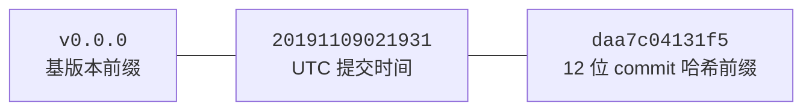
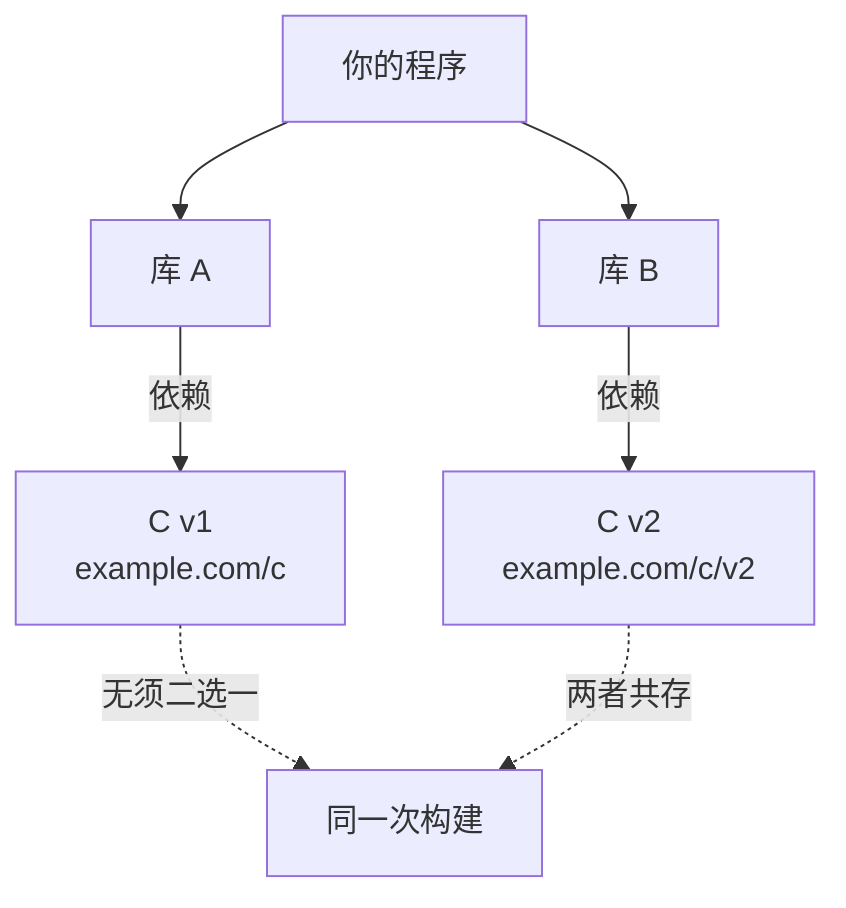

# 17.2 语义化版本管理

要管理版本，先得让版本号**有意义**。[17.1](./challenges.md) 把依赖管理的难处归到两点：钻石依赖
里的版本冲突，与跨机器、跨时间的可重现构建。这两点能不能解，取决于一个更底层的前提，**一个版本
号到底承诺了什么**。如果 `v1.5` 与 `v1.4` 之间的关系完全无从预料，那么任何选择算法都无从下手，
只能退回到「把所有版本两两试一遍」的求解。Go 模块的做法，是先把版本号变成一份**可被机器信任的
契约**，再在这份契约之上提出一条独特而强硬的规则,**语义化导入版本**。这一节讲清这两者，它们是
[17.3](./minimum.md) 那套版本选择算法能够成立、且能简单到「一遍图遍历」的前提。

## 17.2.1 语义化版本：把兼容性写进数字

语义化版本（Semantic Versioning，semver）由 Tom Preston-Werner 在 2013 年定形为 2.0.0
规范，Go 模块直接采用了它，并在版本号前统一冠以 `v`。版本号形如 **`vMAJOR.MINOR.PATCH`**
（如 `v1.4.2`），三段都是非负整数，且每一段的递增都**有规范约定的含义**：

- **PATCH**（补丁）递增：「只引入向后兼容的 bug 修复」。`v1.4.1 → v1.4.2`，行为不变，只是更正了
  错误。
- **MINOR**（次版本）递增：「以向后兼容的方式向公开 API 增加了功能」。`v1.4 → v1.5`，老代码
  原封不动仍能编译、仍能运行，只是多了可用的东西。
- **MAJOR**（主版本）递增：「引入了向后不兼容的 API 变更」。`v1.x → v2.0`，老代码可能编译不过，
  或行为悄然改变。

把这套约定落到一个具体改动上，递增哪一段是被改动的性质唯一决定的，并无自由裁量：

```text
现有版本 v1.4.2，下一次发布该打什么版本号？
  修了一个 panic，不动任何签名         → v1.4.3   （PATCH：兼容的修复）
  新增一个导出函数 Encode，旧 API 不变  → v1.5.0   （MINOR：兼容的新功能）
  删掉 Decode、或改了它的参数类型        → v2.0.0   （MAJOR：破坏兼容）
```

注意每升一段，更低的段都归零：`v1.4.2` 的次版本一升就是 `v1.5.0` 而非 `v1.5.2`，主版本一升就是
`v2.0.0`。这条归零规则保证了「同一主版本下，版本号越大、含的兼容功能越全」，[17.3](./minimum.md)
的「取最大」才有明确语义。

规范用的是 **MUST** 这种规范性措辞：补丁段「只在仅有向后兼容的修复时**必须**递增」，次版本段
「在引入向后兼容的新功能时**必须**递增」，主版本段「在引入任何不兼容变更时**必须**递增」。这套
约定的全部价值，在于它把一件原本只存在于作者脑中的事,「这次改动破不破坏兼容」,编码进了一个
机器能读的数字。看到从 `v1.4` 升到 `v1.5`，你（和 `go` 命令）都知道这是兼容的，放心升;看到升到
`v2.0`，你知道可能要改代码、要重新测试。**版本号本身就是一份兼容性承诺。**

semver 还规定了两段可选后缀，Go 沿用：连字符引出的**预发布**标识（`v1.5.0-rc.1`，优先级低于正式
版，`v1.0.0-alpha < v1.0.0`），与加号引出的**构建元数据**（`v1.0.0+20130313`，在比较优先级时被
忽略）。正式版之间则按三段数字逐级比较：$v1.0.0 < v2.0.0 < v2.1.0 < v2.1.1$。这套全序关系，正是
[17.3](./minimum.md) 的选择算法能「取最大」的数学基础。

这里要点出一个常被忽略的前提：semver 是一份**社会契约，而非编译器强制的事实**。没有任何工具能
百分百验证作者真的没在 PATCH 版里塞进破坏性变更（Go 1.21 起的 `gorelease`、`apidiff` 等工具能
辅助检查导出 API 的差异，但语义层面的兼容仍靠作者自律）。Go 模块**强依赖**这个约定,它的整个
版本选择逻辑（[17.3](./minimum.md)）都建立在「同一主版本内，高版本向后兼容低版本」这个假设上。
约定一旦被破坏，受伤的是下游;而下文的语义化导入版本，恰恰是为了在「破坏不可避免时」给它一个
规矩的出口。

还有一类版本号，semver 规范本身没有，却是 Go 让「取最大」这套机器决策能覆盖**未打标签的提交**
所必需的,**伪版本**（pseudo-version）。当你依赖某仓库一个尚无 semver 标签的 commit 时，`go`
命令会为它合成一个形如 `v0.0.0-20191109021931-daa7c04131f5` 的版本：



伪版本被精心设计成在 semver 全序里「排在它所基于的标签版本之后、下一个正式版之前」，于是它能
和真实标签一同参与 [17.3](./minimum.md) 的版本比较，毫无例外。这是 semver 全序关系在工程上被
贯彻到底的一个例子：哪怕一个 commit 从未被作者命名，Go 也要给它一个可比较、可排序、可记录的
版本号。

## 17.2.2 语义化导入版本：把主版本写进路径

Go 在 semver 之上加了一条与众不同的强硬规则,**语义化导入版本**（Semantic Import
Versioning，Russ Cox 提出）：**当一个模块升到 v2 或更高主版本时，它的模块路径必须带上主版本
后缀。** 比如 `example.com/mod` 的 v1，到了 v2 必须改成 `example.com/mod/v2`，到 v3 则是
`example.com/mod/v3`。导入时也随之带上后缀：

```go
import (
    "example.com/mod"      // 这是 v1（含 v0）
    "example.com/mod/v2"   // 这是 v2，与上面是「两个不同的包」
)
```

这条规则源自一个朴素而深刻的原则,Cox 称之为**导入兼容性规则**（Import Compatibility Rule），
原话是：

> If an old package and a new package have the same import path, the new package must be
> backwards compatible with the old package.
>
> 如果一个旧包和一个新包有相同的导入路径，那么新包必须向后兼容旧包。

把这条规则与 semver 摆在一起，结论就是被逼出来的：按 semver，主版本号递增**按定义**意味着不
向后兼容;按导入兼容性规则，不兼容就**不能**复用同一个导入路径。两者相乘，唯一的出路就是,
**不兼容的新主版本必须换一个新路径**。于是 `example.com/mod/v2` 不是一种风格选择，而是规则的
必然推论。Cox 用一个比喻收束：与其给新 API 起一个「可爱却不相干的新名字」（如把 OAuth 库改叫
Pocoauth），不如就叫它 `oauth2/v2`,版本号本身成了名字的一部分，既保留了 semver 的清晰，又
满足了导入兼容性规则。

规则在工程上有几处边角，值得一并交代清楚，否则读者一升级就会撞上：

- **v0 与 v1 不带后缀。** `v0` 是「不稳定、不承诺兼容」的开发期，`v1` 通常是对最后一个 `v0` 的
  兼容性「定调」而非一次破坏，两者都用裸路径 `example.com/mod`。后缀只从 `v2` 开始出现。
- **仓库如何安放多个主版本。** 一个仓库要同时提供 v1 和 v2，常见两种做法：在根目录用**主版本
  分支**（v2 代码打 `v2.x.x` 标签），或在仓库里开一个 **`/v2` 子目录**单独放 v2 代码并带自己的
  `go.mod`。两种都合法，`go` 命令都认。
- **历史包袱：`+incompatible`。** 模块机制是 2018 年才进入 `go` 命令的，此前已有大量仓库给
  `v2.0.0` 以上打了标签却没有 `go.mod`、也没改路径。为兼容它们，`go` 命令给这类版本挂一个
  `+incompatible` 后缀（如 `example.com/m v4.1.2+incompatible`），表示「它仍被当作低主版本的
  同一个模块」。这是一条迁移期的妥协通道，不是新模块该走的路,新模块迁移到 v2 时，规规矩矩
  改路径即可。
- **`gopkg.in` 的特例。** 这个早于 Go 模块的版本化导入服务从一开始就把主版本写进了路径，且
  从 `v0`、`v1` 起就带，分隔符用点而非斜杠（如 `gopkg.in/yaml.v2`）。它其实是语义化导入版本的
  一次「前传」实践，Go 模块把同样的思路标准化、并推广到了所有路径。

把它放进生态里看，这条规则的取向相当独特。多数语言把版本约束放在一份与源码分离的清单文件里
（npm 的 `package.json`、Cargo 的 `Cargo.toml`、Maven 的 `pom.xml`），导入语句里**不含版本**，
靠求解器在构建时挑出一组兼容版本。代价是，同一个包的两个不兼容主版本天然**互斥**,要么求解器
报冲突，要么得靠 npm 那种「把不同版本各塞进一层 `node_modules` 子树」的嵌套安装来回避，而那又
会让同一个类型在两个版本里被判为不同类型，埋下隐蔽的运行期错误。Go 把版本焊进导入路径，等于
把「哪个主版本」这件事从清单挪进了类型系统本身,`mod` 与 `mod/v2` 在编译期就是两个无关的包，
共存是语言层面的事实，而非安装器的小聪明。这正是它「更麻烦、却更干净」的根由。

## 17.2.3 一条规则解开一个死结

语义化导入版本带来一个强大到能改变问题性质的后果：因为 `example.com/mod`（v1）与
`example.com/mod/v2` 是**两个不同的导入路径**，在编译器看来它们就是**两个互不相干的包**,于是
它们可以**同时**存在于同一个程序里。这恰好化解了 [17.1](./challenges.md) 钻石依赖里最棘手的一类。

设想这样一张依赖图：你的程序同时用到库 A 和库 B，A 依赖 C 的 v1，B 依赖 C 的 v2，而 C 的 v1 与
v2 不兼容。



落到 `go.mod` 上，这种共存毫不特殊，就是平平无奇的两行 `require`，因为对 `go` 命令而言它们本就
是两个不同的模块：

```text
// go.mod
require (
    example.com/c     v1.7.0   // A 经由它间接依赖
    example.com/c/v2  v2.3.1   // B 经由它间接依赖
)
```

在没有这条规则的世界里（譬如 GOPATH 时代，或多数语言的求解式包管理器），最终只能把**一个**
版本的 C 链进程序,选 v1 则 B 崩，选 v2 则 A 崩，这正是「依赖地狱」最经典的死结。而在语义化
导入版本下，A 导入的是 `example.com/c`，B 导入的是 `example.com/c/v2`，两条路径、两个包、两份
代码，编译器各编各的，互不打架。Cox 的描述是：「所有包里的 import 恰好对应了需要构建的东西。」
那个需要求解器去协调的**外部约束**，被它**就地消解**在了导入路径里。

它顺带强制了一种好习惯：发布破坏性变更时，作者**必须显式地改路径**（升主版本号），这让下游
清清楚楚地看到「这是一个不兼容的新版本」，升级是一次睁眼的、主动的迁移，而非构建时悄悄发生的
意外。把破坏性变更的代价摆在台面上，本身就会促使作者更慎重地对待它,semver FAQ 与 Cox 都把
这种「让破坏变贵」视为规则的额外收益，而非负担。

## 17.2.4 设计取舍：复杂度前移

语义化导入版本是 Go 依赖管理里最聪明、也最有争议的设计之一，值得把它的代价摆明。

争议在于它的**严格**。升一次 v2 不只是改个数字：要改模块路径、要相应改掉所有内部互相 import 的
前缀、要在仓库里特殊安放（子目录或主版本分支）、下游每一处 import 也都要跟着改。对库作者，这是
一笔实打实的麻烦，社区一度怨言不少。别家的版本约束往往写在一个独立的清单文件里，改起来轻;Go
把它焊进了源码里的每一行 import。Cox 对此并不回避，他承认「为每次不兼容变更引入一个新名字，
确实有成本」，但他的判断是这成本用对了地方：它逼作者正视破坏性变更的影响，「不这么做的作者，
其实是在伤害他们的用户」。

它换来的，是整条版本选择算法（[17.3](./minimum.md)）能变得异常简单。在别的生态里，求解器之所以
要做 NP-hard 的回溯与 SAT 求解，很大一部分力气正花在「两个不兼容版本只能选一个，怎么选才能让
最多约束满足」上。语义化导入版本把这类情况**从根上抹掉了**,不兼容的版本是不同的包、能共存，
于是「二选一」这个最难的子问题根本不会出现，[17.3](./minimum.md) 的 MVS 才能简化成「一遍图
遍历取最大下限」，既无回溯、也无求解器。

这是一处典型的「**复杂度前移**」：把难题从「构建时的求解算法」搬到「发布时的一条路径约束」上。
难度没有消失，它被挪到了更早、更显式、也更可控的位置,作者在发布 v2 那一刻多付一点，整个生态
在每一次构建时就省下了求解的全部代价与不确定性。这与 Go 处处可见的「用约束换简单」一脉相承
（对照 [17.3](./minimum.md) 的 MVS、乃至全书反复出现的「把复杂度安置到正确位置」）。把这条路径
铺好，下一节就能看到，[17.3](./minimum.md) 的选择算法是如何在这块地基上，简单到几乎不像是在
解一个「依赖求解」问题的。

## 延伸阅读的文献

1. Tom Preston-Werner. *Semantic Versioning 2.0.0.* https://semver.org/
   （`vMAJOR.MINOR.PATCH` 与各段递增的规范定义、预发布与构建元数据语法、优先级规则）
2. Russ Cox. *Semantic Import Versioning.* https://research.swtch.com/vgo-import
   （导入兼容性规则原文、v2 路径后缀的由来、多主版本共存）
3. The Go Authors. *Go Modules Reference：Major version suffixes、+incompatible versions、
   Pseudo-versions.* https://go.dev/ref/mod
   （v0/v1 不带后缀、仓库安放方式、`+incompatible` 迁移通道、伪版本格式）
4. Russ Cox. *Go & Versioning（"vgo" 系列文章的整体论述）.* https://research.swtch.com/vgo
5. The Go Authors. *golang.org/x/exp/cmd/gorelease、golang.org/x/exp/apidiff*
   （辅助检查导出 API 兼容性、为 semver 自律提供工具支撑）。
6. 本书 [17.1 依赖管理的难点](./challenges.md)、[17.3 最小版本选择算法](./minimum.md)。
