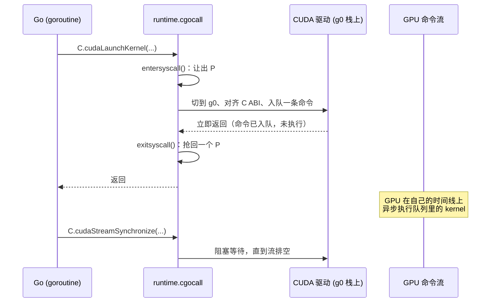
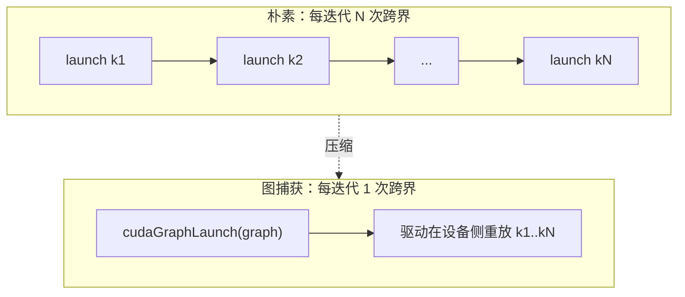

# 18.1 跨越 FFI 边界

[15.6](../../part5toolchain/ch15compile/cgo.md)已经把 cgo 这座桥拆开看过了：一次从 Go 到 C 的
调用要切到 `g0` 系统栈、按 C 的 ABI 重摆参数、`entersyscall` 让出 P、调用、再 `exitsyscall`
抢回一个 P，整套下来比一次 Go 调用贵上一两个数量级。那一节给出的结论很干脆：cgo 适合**少量、
粗粒度**的调用，最忌讳放进热点循环里反复跨界。

把这条结论摆到 GPU 面前，矛盾立刻就尖锐了。GPU 编程的本质，恰恰是**频繁地跨界**。一次最普通的
推理或渲染，CPU 这侧要做的事无非三类：把数据从主机内存拷到显存、启动一个又一个 kernel、再把
结果拷回来。每一类都是一次离开 Go、进入驱动的边界穿越。一个稍有规模的神经网络有成百上千个算子，
逐个朴素地启动，就是成百上千次 cgo 调用串在一条关键路径上。15.6 说「别在紧循环里跨界」，
而 GPU 的工作负载天生就长在这样一个紧循环里。这一节要回答的就是：当跨界无法避免、且必须高频时，
这道边界该怎么设计才不至于被通行费压垮。

## 18.1.1 边界的另一端：一个异步的命令世界

先看清桥的对岸站着谁。从 Go 调一个 C 库函数，对岸是一段同步执行的 C 代码，调用返回时活儿就干完了。
GPU 不是这样。CPU 这侧调用的并不是「计算本身」，而是**向设备下达一条命令**。

以 CUDA 为例，软件栈分了两层。底层是**驱动 API**（driver API，`libcuda`，前缀 `cu`），直接对应
内核态驱动暴露的能力；上层是**运行时 API**（runtime API，`libcudart`，前缀 `cuda`），把驱动
API 包装得更易用，自动管理上下文与模块。无论走哪一层，CPU 侧的一次 `cudaLaunchKernel` 或
`cudaMemcpyAsync` 都只是把一条命令塞进一个叫**流**（stream）的队列，然后**立即返回**。真正的
计算由 GPU 在自己的时间线上异步地完成。CPU 下令，GPU 干活，两者在不同的时钟上跑。



这个「入队即返回」的语义是后面一切优化的支点。它意味着边界穿越的成本（那一两个数量级的 cgo 税）
与 GPU 的实际计算**可以重叠**：CPU 付完通行费回到 Go 世界继续下令时，GPU 还在消化前面的命令。
只要命令下得够快、队列不空，GPU 就不会闲着，cgo 税就被藏进了计算的影子里。反过来，
若每下一条命令就同步等它执行完（`cudaStreamSynchronize`），异步的好处全丢，边界穿越的固定开销
就赤裸裸地串在关键路径上，一次都省不掉。

## 18.1.2 两种延迟，别把它们混为一谈

边界上其实叠着两笔不同的成本，初学者常把它们混在一起，分清楚才好对症。

第一笔是 **cgo 的边界穿越成本**，来自 Go 这一侧，就是 15.6 拆解过的那套状态转换：
切栈、`entersyscall`/`exitsyscall`、ABI 对齐。它是「从 Go 进入 C」这个动作的固定税，
与对面是不是 GPU 无关，调任何 C 函数都要付。

第二笔是 **kernel 启动延迟**（launch latency），来自 GPU 这一侧。一条 launch 命令从入队、
经驱动与硬件的命令处理器，到 GPU 上真正开始执行，本身就有微秒量级的固有延迟，这是设备的物理
特性，和 Go 没有半点关系，C++ 直接调 CUDA 也躲不掉。


为什么要把两笔分开？因为它们的应对手段不同。第一笔是 Go/cgo 特有的，理论上可以靠「绕开 cgo」
来削减，这正是 18.1.4 的话题；第二笔是设备固有的，任何语言都一样，只能靠**异步与批处理**把它
藏进重叠里，这是 18.1.3 的话题。把 GPU 慢简单归咎于「Go 的 cgo 太重」，往往是把第二笔的账
错算到了第一笔头上。对粗粒度的大 kernel，计算动辄毫秒级，两笔延迟加起来都微不足道；
真正受这两笔成本拖累的，是大量**细碎的小 kernel**，那里固定开销占了大头。

## 18.1.3 把通行费摊薄：异步、批处理与图捕获

既然边界穿越和启动延迟都是「每次一份」的固定成本，削减它们的总思路只有一个：**减少跨界的次数，
把更多的工作塞进一次跨界里**。这与 15.6 给 cgo 开的药方「粗粒度调用」是同一味药，只是在 GPU
上有了几种更锋利的剂型。

**其一，异步下令、延迟同步。** 别在每条命令后面跟一次同步。把一连串 kernel 与拷贝全部异步地压进
同一个流，只在真正需要结果的那一刻才同步一次。这样 N 条命令的边界穿越彼此重叠、又与 GPU 计算
重叠，关键路径上只剩最后那一次同步的等待。

```go
// 反例：每条命令都同步，N 个 kernel 付 N 次「边界穿越 + 启动延迟 + 全程等待」
for _, op := range ops {
    C.launch(op)              // 入队
    C.cudaStreamSynchronize(stream) // 立刻死等它跑完，异步全废了
}

// 正解：异步压满流，末尾只同步一次
for _, op := range ops {
    C.launchAsync(op, stream) // 只入队，立即返回
}
C.cudaStreamSynchronize(stream) // 整批跑完，只等这一次
```

**其二，批处理（batching）。** 把许多小 kernel 在算法层面合并成一个大 kernel，从源头上减少
launch 的条数。深度学习框架的「算子融合」（operator fusion）就是干这个：把 `矩阵乘 → 加偏置 →
激活`三步融成一个 kernel，三次启动并作一次。这一步通常发生在 Go 之外的计算图编译器里，
但它直接决定了 Go 侧要跨多少次界。

**其三，图捕获（CUDA Graphs）。** 这是对前两者的釜底抽薪。许多负载里，那一长串命令的**结构**
每次迭代都一样，变的只是数据。CUDA Graph 允许你把整条命令序列**捕获**成一张静态的图，之后每次
迭代只需一次 `cudaGraphLaunch`,由驱动在设备侧一口气重放整张图。原本 N 次边界穿越加 N 次启动
延迟，被压缩成**一次**。对那种由几百个小算子构成、结构固定的推理图，这能把 CPU 侧的下令开销
削掉一个数量级。



三种剂型共享同一条原理：**边界穿越的次数，才是 Go 侧真正能动的变量**。kernel 算得多快是 GPU 的事，
Go 这侧能做的，是让每一次昂贵的跨界都尽可能多带点货。

## 18.1.4 绕开 cgo：一条光谱

前面说第一笔成本（cgo 边界穿越）「理论上可以绕开」。这并非空话。把「绕开 cgo」的各种努力摆到
一处，会发现它们其实是一条**光谱**：从「还在函数粒度上跨界、只是换种跨法」，一直到「干脆不跨界」,
每一档削掉的成本不同，付出的代价也不同。开讲之前先分清 cgo 的两笔代价：一笔是**构建期**的
（需要 C 工具链，断送静态链接与交叉编译，见 [15.6.4](../../part5toolchain/ch15compile/cgo.md)),
一笔是**运行期**每次跨界那约几十纳秒的固定开销（18.1.2 的第一笔成本）。下面几档，各自针对其中
之一或两者。

**其一，`purego`：只削构建期成本。** 由 Ebitengine 项目维护。它在运行时用 `dlopen`/`dlsym`
动态加载共享库，再用一段手写汇编的跳板按平台 ABI 直接调用函数地址，从而**完全不经过 cgo 的
代码生成**。动机首先是工程性的：不依赖 C 编译器，于是保住了 15.6 里说 cgo 会折损的那几样东西,
静态构建、交叉编译、快构建。但要看清，`purego` 仍然要复用运行时的 `cgocall` 来完成栈切换与
`entersyscall`,`runtime/cgocall.go` 的注释里专门点了它的名。也就是说，它绕开的是 cgo 的
**构建期**代价，而非**运行期**那次边界穿越的状态转换,第一笔成本的核心部分依然要付。

**其二，WebAssembly 与 `wazero`：真正不经 cgo。** 一条更彻底的路，是把 C 库**编译成
WebAssembly**,再用一个**纯 Go 写就的 Wasm 运行时**去跑它。`wazero` 就是这样一个零依赖、
不含一行 cgo 的 Wasm 运行时：把 SQLite、某个编解码器、甚至一个 CPU 上的推理引擎编译成 `.wasm`,
Go 进程用 wazero 在沙箱里把它跑起来，全程不碰 C 编译器，静态构建与交叉编译分文不损
（`ncruces/go-sqlite3` 正是这样把 SQLite 跑进了纯 Go）。它绕开的不只是构建期，连 cgo 那次
运行期的状态转换也一并不要了，换来的是 Wasm 自身的执行开销（解释或即时编译，通常慢于原生)
以及主机与沙箱之间的调用边界。但对本章的 GPU 主题有一条硬限制要认清:**Wasm 沙箱够不着 GPU
驱动**。它能把 CPU 侧的 C 库（编解码、加密、CPU 推理）干净地搬进纯 Go，却无法替你向显卡下命令,
要驱动 GPU，仍得回到 cgo、purego 或进程外那几条路。

**其三，纯 Go 重写：连边界都没有。** 最彻底的一档，是干脆不要那个 C 库，用纯 Go 把它重新实现
一遍。这样 FFI 边界根本不存在，构建期与运行期两笔成本一起归零。[19.3](../ch19graphics/software.md)
的软件渲染正是这一档的活例:不调任何图形驱动，就地用 Go 算出每个像素。Go 生态里也有纯 Go 的
分词器、乃至纯 Go 的小模型推理实现。代价同样诚实:你要承担重写的工程量，而且失去 C 库背后多年
打磨的、贴着 SIMD 与硬件的优化，纯 Go 实现往往算得更慢。它适合那些「C 库的价值不在极致性能、
而在功能」的场景。

**其四，进程外：把边界挪出进程。** 当「C 库」其实是一个**远端服务**时，根本不必把它链进同一个
进程。把 GPU 推理放进一个独立的服务进程（往往是 C++/Python 写的，紧挨着 CUDA），Go 侧通过
gRPC 或共享内存与它通信。这样 Go 进程里一行 cgo 都没有，边界从「进程内的 FFI」变成了「进程间的
IPC」。代价是多了一次序列化与跨进程的拷贝，收益是 Go 侧彻底干净。这正是第 20 章会反复看到的
部署形态：Go 站在服务与编排这一层，把与设备贴身的脏活隔在另一个进程里。

把这四档连起来，结论就清楚了：FFI 边界不是非此即彼的铁律，而是一条可以滑动的光谱。从
**cgo/purego**(函数粒度、最贴身最快，但有跨界税或工具链代价），到 **Wasm/wazero**(沙箱里跑、
绕开 cgo 但换来 Wasm 开销、且够不着 GPU），到**纯 Go 重写**(无边界、零跨界成本，但要重写且常
更慢），到**进程外 IPC**(进程粒度、最干净，但有序列化成本）。选哪一档，取决于调用有多频繁、
数据有多大、是否非要触碰 GPU、以及你有多在乎那条纯 Go 的工具链。而即便最终仍选了 cgo 也不必
太悲观:[18.2](./sched.md) 会看到，Go 1.26 自己又把那笔运行期跨界开销磨薄了约三成。

## 小结

GPU 把 15.6 那条「少跨界」的告诫从一句经验提升成了一条设计主线。原因是 GPU 工作负载天然由大量
细粒度命令构成，而每条命令都是一次边界穿越。应对之道不在于把单次跨界做得更快（它的成本是结构性的），
而在于**减少跨界的次数**：用异步让边界穿越与 GPU 计算重叠，用批处理与算子融合从源头减少命令，
用图捕获把一整条命令序列压成一次跨界。再不济，还能沿着一条光谱绕开 cgo 本身：换用 purego、
编进 Wasm 用 wazero 跑、纯 Go 重写、或把整个边界挪到进程之外。

这一节只谈了「过桥要快、要少」。但桥上还运着两样东西没细说：一是当某次跨界**真的会长时间阻塞**时
（比如那次末尾的 `cudaStreamSynchronize`），让出去的 P、被钉住的 M 会怎样，这是
[18.2](./sched.md) 的事；二是桥上递来递去的那些指针，哪些是 Go 的、哪些是设备的、GC 该怎么对待
它们，这是 [18.3](./memory.md) 的事。

## 延伸阅读的文献

1. NVIDIA. *CUDA C++ Programming Guide.*
   https://docs.nvidia.com/cuda/cuda-c-programming-guide/
   （异步并发执行、流、`cudaMemcpyAsync` 与同步语义的权威定义）
2. NVIDIA. *CUDA Driver API* 与 *CUDA Runtime API.*
   https://docs.nvidia.com/cuda/cuda-driver-api/ ，
   https://docs.nvidia.com/cuda/cuda-runtime-api/
   （驱动 API 与运行时 API 的分层）
3. NVIDIA. *Getting Started with CUDA Graphs.* NVIDIA Technical Blog, 2019.
   https://developer.nvidia.com/blog/cuda-graphs/
   （图捕获如何把一长串 launch 压缩成一次提交以削减启动开销）
4. The Go Authors. *runtime/cgocall.go.*
   https://github.com/golang/go/blob/master/src/runtime/cgocall.go
   （`cgocall` 复用方对 `purego` 的点名，见文件顶部注释）
5. Ebitengine. *purego.* https://github.com/ebitengine/purego
   （无需 cgo 的运行时 FFI：`dlopen`/`dlsym` 加汇编跳板）
6. Tetrate. *wazero: the zero dependency WebAssembly runtime for Go.*
   https://wazero.io/ ，及 *ncruces/go-sqlite3*（把 SQLite 编成 Wasm 跑进纯 Go）
   https://github.com/ncruces/go-sqlite3
   （纯 Go、不含 cgo 的 Wasm 运行时，绕开 cgo 运行 C 库的代表作）
7. 本书 [15.6 cgo](../../part5toolchain/ch15compile/cgo.md)、
   [2.2 调用规范](../../part1overview/ch02asm/callconv.md)、
   [18.2 调度器与阻塞的外部调用](./sched.md)、
   [18.3 显存与垃圾回收的分界](./memory.md)。
