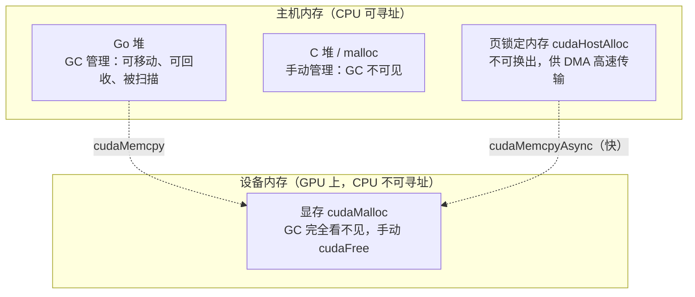

# 18.3 显存与垃圾回收的分界

[15.6](../../part5toolchain/ch15compile/cgo.md) 讲过 cgo 的指针规则：Go 的对象不归 C 管，
GC 随时可能搬走或回收它，所以 C 不得在调用返回后还持有一个未钉住的 Go 指针。那是从「Go 与 C
两块内存」的二元世界推出来的。GPU 把这张地图复杂化了：现在至少有**四种**内存，分属不同的管辖，
遵守不同的规矩。这一节要先把这张地图画清楚，再看垃圾回收器与它们各自的分界划在哪里，
以及哪一条分界最容易在异步传输里被踩穿。

## 18.3.1 一张内存地图

一个用 Go 驱动 GPU 的程序，运行时面对的内存大致分四块：



四块里，只有第一块 **Go 堆**归 GC 管，第 12、13 章那套分配与回收、那套可达性扫描，作用范围就到
这里为止。后三块对 GC 而言是「境外」：C 堆是手动 `malloc`/`free` 的，页锁定内存由 CUDA 分配，
而**显存根本不在 CPU 的地址空间里**,CPU 连解引用它都做不到。理解这一节的全部诀窍，
就是时刻分清一个指针到底落在哪一块。

## 18.3.2 设备指针不是 Go 指针

先说一个会让人松一口气的事实。`C.cudaMalloc` 返回的是一个**设备地址**,它指向显存里的某个位置。
这个地址在 Go 程序里通常以 `unsafe.Pointer` 或 `uintptr` 的形式存着，可它**根本不指向主机内存**,
更不指向 Go 堆。它对 CPU 来说只是一个不能解引用的数字。

这件事的直接后果是：**cgo 的指针规则对设备指针不适用，GC 也永远不会去碰它**。15.6 里那套
`cgoCheckPointer` 的递归扫描、那条「Go 指针不得指向未钉住的 Go 指针」的禁令，针对的都是「指向
Go 堆的指针」。设备指针不指向 Go 堆，于是它可以被随意地传给 C、存进 C 的结构体、长期持有，
没有任何一条指针规则会被触犯，cgocheck 不会对它 panic，回收器也不会因为它而多扫一个字节。

代价是天平的另一端：**设备内存完全是手动管理的**。GC 不会替你回收一块 `cudaMalloc` 出来的显存，
你必须自己 `cudaFree`,忘了就是显存泄漏。Go 的内存安全在显存这块土地上不成立，这里的规矩和
`C.malloc` 一样，是 C 的规矩。常见的稳妥做法，是用一个 Go 包装类型把设备指针裹起来，
配一个 `Free()` 方法，再用 `runtime.AddCleanup`（或 `SetFinalizer`）兜底，让一块 Go 对象被回收时
顺带释放它名下的那块显存。

## 18.3.3 两个「钉住」别搞混

GPU 编程里有两个都叫「钉住」（pin）的东西，分属上面地图的不同区域，初学者极易混为一谈。把它们
摆在一起辨清，是这一节的关键。

**其一，GC 意义上的钉住：`runtime.Pinner`（Go 1.21）。** 它作用在 **Go 堆**上，
作用是让 GC 在一段时间内不要移动、也不要回收某个 Go 对象。它的文档写得很直白：被 `Pin` 的对象
「在 `Unpin` 之前不会被垃圾回收器移动或释放」，并且它专门支持「让 C 内存在 cgo 调用返回之后，
仍安全地持有这个 Go 指针，只要对象保持被钉住」。这正是 15.6 提过的、比 `C.malloc` 更轻的那一手。

**其二，操作系统意义上的钉住：页锁定内存（page-locked / pinned memory，`cudaHostAlloc`、
`cudaMallocHost`）。** 它和 GC 一点关系都没有，作用在**操作系统的分页**上：把一块主机内存
锁定，让 OS 的换页机制不要把它换出到磁盘。为什么 GPU 在意这个？因为 GPU 经由 DMA 直接读写主机
内存，而 DMA 要求目标物理页**固定不动**。一块普通的可换页内存，DMA 引擎不能安全地直接搬运；
页锁定内存可以，于是异步传输（`cudaMemcpyAsync`）也只有用它才能真正跑起来。

| | `runtime.Pinner` | 页锁定内存 `cudaHostAlloc` |
|---|---|---|
| 管辖者 | Go 的垃圾回收器 | 操作系统的分页器 |
| 作用对象 | Go 堆上的对象 | 主机物理页 |
| 防止的是 | GC 移动 / 回收 | OS 换出 / 重定位物理页 |
| 解决的问题 | C 安全持有 Go 指针 | DMA 高速、异步传输 |

两者名字撞车，含义却正交。一块 Go 堆上的 `[]byte`,既是**可被 GC 移动的**，又是**可被 OS 换出的**;
`Pinner` 只摁住前者，摁不住后者。这就引出了下一节那个最容易出错的场景。

## 18.3.4 异步传输：隐式钉住不够

把一块 Go 的 `[]byte` 拷到显存，同步与异步两种写法，安全性天差地别。

**同步拷贝是安全的。** `cudaMemcpy` 在 C 调用期间把数据搬完才返回。15.6 说过，调用期间传入的
Go 指针是「隐式钉住」的，整个拷贝都发生在这段隐式钉住的窗口内，所以直接把 `&buf[0]` 递过去
没有问题：

```go
buf := make([]byte, n)
// 同步：拷贝在调用内完成，隐式钉住覆盖了全程，安全
C.cudaMemcpy(dst, unsafe.Pointer(&buf[0]), C.size_t(n), C.cudaMemcpyHostToDevice)
```

**异步拷贝则暗藏一个对应不上的生命周期。** `cudaMemcpyAsync` 把传输命令压进流后**立即返回**,
真正的 DMA 在之后某个时刻才发生（18.1 的「入队即返回」）。问题就在这里：隐式钉住只持续到**调用
返回**那一刻，而 DMA 发生在调用返回**之后**。窗口对不上。一旦调用返回、隐式钉住失效，GC 就重新
获得了移动或回收 `buf` 的自由，而此时 DMA 可能正要去读它,读到的是一块已被搬走或挪作他用的内存。

```go
// 错误：异步拷贝返回后，隐式钉住已失效，但 DMA 还没发生
C.cudaMemcpyAsync(dst, unsafe.Pointer(&buf[0]), C.size_t(n), kindH2D, stream)
// ←─ 调用已返回，隐式钉住到此为止；GC 现在可以动 buf，可 DMA 还没读它

// 正解一：用 Pinner 把钉住延长到 DMA 真正完成（流同步）之后
var pinner runtime.Pinner
pinner.Pin(&buf[0])
C.cudaMemcpyAsync(dst, unsafe.Pointer(&buf[0]), C.size_t(n), kindH2D, stream)
C.cudaStreamSynchronize(stream) // DMA 到此确实完成
pinner.Unpin()                  // 现在才解钉

// 正解二（更优）：数据直接放在 GC 管不着、又页锁定的主机内存里
//   既绕开了 GC 的生命周期问题，又满足 DMA 对页锁定的要求，
//   异步传输还更快。代价是这块内存要自己 cudaFreeHost
h := C.cudaHostAlloc(...) // 页锁定、非 Go 堆
// ... 往 h 里填数据 ...
C.cudaMemcpyAsync(dst, h, C.size_t(n), kindH2D, stream)
```

这个例子把 18.3.3 那两个「钉住」的正交性落到了实处：正解一用 `Pinner` 解决了 **GC 生命周期**
的问题（让 `buf` 在 DMA 期间不被动），但 `buf` 仍是可换页的，DMA 性能并非最优；正解二用页锁定
内存同时解决了**生命周期**（它不在 GC 视野内）与 **DMA 性能**（它页锁定）两件事，代价是回到手动
管理。真实的高性能数据通路，几乎都用正解二，并把这样一块页锁定缓冲复用成「暂存区」（staging
buffer），在 Go 堆与显存之间来回搬运。

## 18.3.5 统一内存：把分界模糊掉，但没有取消

近年的硬件与驱动提供了**统一内存**（unified memory，`cudaMallocManaged`）：一个指针，CPU 和
GPU 都能解引用，底层由驱动按缺页在主机与设备之间自动迁移物理页。它确实抹平了「主机指针 / 设备
指针」的割裂，写起来省心很多。

但要看清，它模糊的是**地址空间**的分界，没有取消**所有权**的分界。这块统一内存依然由
`cudaMallocManaged` 分配、由 `cudaFree` 释放，依然在 Go 堆之外，依然不归 GC 管。它把
「程序员要不要手动写 `cudaMemcpy`」这件事交给了驱动，却没有把「这块内存归谁回收」交给 GC。
对本书反复强调的那条主线来说，结论没有变：**只要内存不在 Go 堆里，垃圾回收器就既不管它的命，
也不保它的安全**。统一内存只是让跨界的数据搬运更顺手，分界本身还在那里。

## 小结

GPU 把 cgo 的「两块内存」扩成了四块，而垃圾回收器的管辖始终只到 Go 堆为止。由此落下几条分界：
设备指针不是 Go 指针，于是它免受指针规则约束，却也得不到 GC 的回收，必须手动 `cudaFree`;
两个都叫「钉住」的东西分属 GC 与操作系统，正交而不可互相替代；异步传输最易出错，因为隐式钉住的
窗口短于 DMA 的生命周期，要么用 `Pinner` 把窗口延长到流同步之后，要么干脆把数据放进页锁定的
非 Go 内存；统一内存模糊了地址空间，却没有把所有权还给 GC。

至此，[18.1](./boundary.md) 的「过桥要快」、[18.2](./sched.md) 的「过桥会占住线程」、与这一节的
「桥上的内存归谁管」，把 FFI 边界上的三件事都说全了。最后一节 [18.4](./model.md) 回到并发模型
本身，看 GPU 的异步、设备的并行，与 goroutine 的并发，三者究竟是什么关系。

## 延伸阅读的文献

1. The Go Authors. *runtime.Pinner.* https://pkg.go.dev/runtime#Pinner
   （`Pin`/`Unpin` 的语义：阻止 GC 移动或回收，并支持 C 在调用返回后持有）
2. The Go Authors. *runtime.AddCleanup* 与 *runtime.SetFinalizer.*
   https://pkg.go.dev/runtime#AddCleanup
   （为包装设备内存的 Go 对象挂上释放回调，兜底显存生命周期）
3. NVIDIA. *CUDA C++ Programming Guide: Page-Locked Host Memory / Unified Memory.*
   https://docs.nvidia.com/cuda/cuda-c-programming-guide/
   （`cudaHostAlloc` 页锁定内存与 DMA、`cudaMallocManaged` 统一内存）
4. NVIDIA. *How to Optimize Data Transfers in CUDA C/C++.* NVIDIA Technical Blog.
   https://developer.nvidia.com/blog/how-optimize-data-transfers-cuda-cc/
   （页锁定暂存区与异步传输为何更快）
5. 本书 [12 内存分配](../../part4memory/ch12alloc)、
   [13 垃圾回收](../../part4memory/ch13gc)、
   [15.6 cgo 指针传递规则](../../part5toolchain/ch15compile/cgo.md)、
   [18.1 跨越 FFI 边界](./boundary.md)、[18.2 调度器与阻塞的外部调用](./sched.md)。
