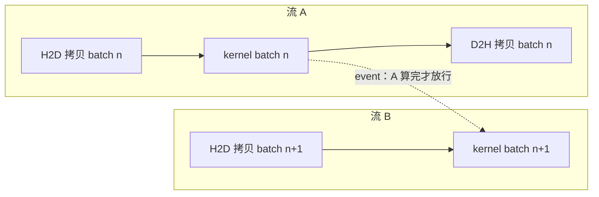

# 18.4 异步编程模型

前三节都在讲 FFI 边界上的「成本」：过桥要快（[18.1](./boundary.md)）、过桥会占住线程
（[18.2](./sched.md)）、桥上的内存归谁管（[18.3](./memory.md)）。这一节换一个角度，
回到**并发模型**本身。Go 的并发是 goroutine 与通道，GPU 的并发是另一套东西，CPU 自己还藏着
第三套。把这三套并行摆清楚、看明白它们怎么对接，是这一章的收尾，也是理解「何时该把活儿推过边界、
何时压根不必」的关键。

## 18.4.1 三种并行，别混为一谈

「并发」（concurrency）与「并行」（parallelism）的区分，第 9 章借 Rob Pike 的话讲过：并发是
**把程序拆成可独立推进的部分**的结构，并行是**同时执行**的事实。带着这把尺子，眼前这三套各占
什么位置就清楚了。

- **goroutine 并发。** Go 的看家本领，M:N 的**任务级**并发。每个 goroutine 是一段独立的控制流，
  廉价、可阻塞、靠通道通信。它回答的是「如何把程序组织成许多并发的任务」。

- **SIMT（GPU）。** Single Instruction, Multiple Thread。一次 kernel 启动铺开一张由成千上万个
  线程组成的网格，它们**跑同一段程序、各自处理一个数据元素**，硬件以 warp（NVIDIA 上 32 个线程
  一组）为单位近乎锁步地推进。它回答的是「如何让海量数据元素被同一段计算并行碾过」。
  编程模型是：为单个元素写好 kernel，然后启动一整张网格。

- **SIMD（CPU）。** Single Instruction, Multiple Data。在**一个** CPU 核内，一条指令同时作用于
  一个向量寄存器里的多个数据通道（4、8、16 路）。它是 CPU 自带的**数据级**并行，不需要 GPU、
  不跨任何边界。

这三者是**正交的轴**，可以叠加：一个 Go 程序完全可以用 goroutine 并发地处理多个请求，
在每个请求的 CPU 内循环里用 SIMD 向量化，再把最重的矩阵乘用 SIMT 推给 GPU。把它们混为一谈
（比如「一个 GPU 线程就像一个 goroutine」）会从一开始就把设计带偏:goroutine 是为**可阻塞的
任务**生的，GPU 线程是为**无分支的密集算术**生的，两者的设计假设南辕北辙。

## 18.4.2 流与事件：设备自带一套并发，Go 只需喂它

GPU 的异步，[18.1](./boundary.md) 已经见过：命令入队即返回，GPU 在自己的时间线上执行。把这套
异步组织起来的，是两个原语。

**流（stream）是设备的并发单元。** 同一个流内的命令按提交顺序串行执行；不同的流之间彼此独立，
可以重叠。于是「一边用流 A 做 H2D 拷贝，一边用流 B 算上一批的 kernel」成为可能，传输与计算
就此并行。**事件（event）是细粒度的同步点**:`cudaEventRecord` 在流里埋一个标记，
`cudaStreamWaitEvent` 让另一个流等这个标记到达。流加事件，本质上拼出的是一张**异步任务的有向
无环图**(DAG)。



关键的认识在这里：**设备已经自带了一套完整的并发模型**。流与事件构成的这张 DAG，就是 GPU 这侧
组织异步工作的方式。Go 这侧要做的，**不是用 goroutine 把它再实现一遍**,而是去**喂它、观察它**。
一个常见的反模式，是给每个 kernel 开一个 goroutine、让 goroutine 同步等它,这恰好踩中
[18.2.3](./sched.md) 的线程膨胀，又把设备本就有的 DAG 用一堆昂贵的阻塞线程拙劣地模拟了一遍。

正确的对接，是让 Go 的并发粒度对齐到**独立的流水线**，而非单个 kernel：

```go
// 每条独立的流水线一个 goroutine，各自拥有一个流（沿用 18.2.5 的单一拥有者形态）
// goroutine 之间用通道传递「这一批好了」，而非用通道传递每个 kernel
func pipeline(in <-chan Batch, out chan<- Result) {
    stream := C.cudaStreamCreate(...)
    for b := range in {
        submitAsync(stream, b)            // 一整条 拷入→算→拷出 异步压进流
        C.cudaStreamSynchronize(stream)   // 只在这条流水线的边界上同步一次
        out <- collect(b)
    }
}
```

goroutine 负责**任务级**的编排（哪条流水线、批次如何流动、结果送给谁），流与事件负责**设备级**
的异步与依赖。两套并发各司其职，在「一个 goroutine 拥有一个流」的地方干净地缝合。这正是把第 10
章的通道、[18.2.5](./sched.md) 的单一拥有者形态，落到异构计算上的样子。

## 18.4.3 SIMD：不跨界的那条并行

把镜头从 GPU 拉回 CPU,会发现第三套并行有一个前两节求之不得的性质：**它不跨任何边界**。

SIMD 是 CPU 核内的数据并行，数据就在主机内存、就在 Go 堆里，计算就地发生。这意味着前三节那一整套
成本一笔都不用付：没有 cgo 边界穿越，没有 launch 延迟，没有 H2D/D2H 拷贝，没有显存，
没有页锁定，没有 `Pinner`,也不给调度器添任何乱。它是「数据并行」这件事在 Go 世界**内部**的形态，
恰好是 [18.1](./boundary.md) 那张桥的反面。

过去，Go 程序要用 SIMD，只能写**手工汇编**(运行时、`crypto`、不少高性能库都是这么做的）或者绕道
cgo,两条路都把代码推出了可移植、可读的 Go。**Go 1.27 引入了实验性的 `simd` 包**（需开启
`GOEXPERIMENT=simd`),第一次让 SIMD 能用可移植的 Go 表达出来：

```go
//go:build goexperiment.simd
import "simd"

// 把两段 float32 逐元素相加，编译为一条向量指令处理一整组通道
func addVec(a, b, dst []float32) {
    var z simd.Float32s
    lanes := z.Len()                // 一个向量容纳多少个 float32，运行期由硬件决定
    i := 0
    for ; i+lanes <= len(a); i += lanes {
        va := simd.LoadFloat32s(a[i:])
        vb := simd.LoadFloat32s(b[i:])
        va.Add(vb).Store(dst[i:])   // 一条 AVX/NEON 加法覆盖多个通道
    }
    for ; i < len(a); i++ {         // 处理尾部不足一个向量的残余
        dst[i] = a[i] + b[i]
    }
}
```

`simd` 包的设计有两点值得记：其一，**向量长度无关**。类型如 `Float32s`、`Int8s` 不把宽度写死，
同一份代码在支持 AVX512 的机器上用更宽的寄存器、在只有 NEON 的机器上用较窄的，宽度由
`.Len()` 在运行期给出，写代码时不必假定。其二，**硬件有则用、无则模拟**。底层经
`simd/archsimd` 映射到 amd64 的 AVX/AVX2/AVX512 或 arm64 的 NEON，没有对应硬件时退化为纯 Go
模拟，保证可移植。它还提供掩码（mask）类型来表达「只对满足条件的通道动手」，
以及 `MulAdd` 这样的融合乘加，恰好是矩阵乘、卷积、几何变换这些热点内循环最常用的运算。

需要诚实地标注：截至本书写作，`simd` 仍是 **Go 1.27 的实验特性**,API 可能调整，需显式开启
`GOEXPERIMENT`。但它指向的方向很清楚：把一类原本只能靠汇编或 GPU 才能拿到的并行，收回到 Go
语言内部、收回到那条不跨界的快路上。

## 18.4.4 该不该过桥：把一整章的成本算总账

有了 SIMD 这个「不跨界」的参照，整章的成本账终于可以合到一处来算了。同样一段数据并行的计算，
摆在面前的常常是两个选项：**就地用 SIMD 在 CPU 上算**,还是**推过边界交给 GPU 的 SIMT**?

天平的两端，正是前面四节反复称量的东西。GPU 的吞吐远高于 CPU，可要兑现这份吞吐，
得先付清 18.1 到 18.3 的全部过桥费：边界穿越、launch 延迟、双向数据拷贝、显存的手动管理。
SIMD 没有任何过桥费，但单核的并行宽度有限，吞吐的天花板低得多。于是：

- **数据小、算术密度低、或数据本就在 Go 堆里**：往往 SIMD 胜。过桥费会把 GPU 那点吞吐优势吃光，
  甚至倒亏。一次只处理几千个元素，光是拷进拷出就够 CPU 把它算完好几遍。
- **数据大、算术密度高、且会被反复使用**：GPU 胜。当 kernel 的计算量足够大，过桥费被摊薄到可以
  忽略，SIMT 的海量并行才真正兑现成压倒性的吞吐。把数据一次搬上显存、反复计算、最后才取回，
  正是为了让那笔固定的过桥费摊到尽可能多的计算上。

这条取舍没有一刀切的阈值，它随数据规模、算术密度、硬件而移动。但它把这一整章收束成了一句话：
**FFI 边界的成本，恰恰是判断「值不值得用 GPU」的那杆秤**。把边界的代价算清楚，才知道一段计算
是该留在 Go 的世界里就地用 SIMD 解决，还是值得推过桥去借 GPU 的海量并行。

## 小结

这一章用四节解剖了 Go 与 GPU 之间那条 FFI 边界：过桥的固定成本逼着我们减少跨界、用异步把代价
藏进重叠（18.1）；一次真正的阻塞会占住整条线程、靠 sysmon 抢回 P，并发起来则换成线程膨胀，
把设计推向钉住线程的单一拥有者（18.2）；桥上的四种内存里只有 Go 堆归 GC 管，设备指针免于指针
规则却也得不到回收，异步传输最易在生命周期上栽跟头（18.3）；而并发模型上，设备自带流与事件
组成的异步 DAG，Go 只需用「一个 goroutine 拥有一个流」去喂它，至于不跨界的数据并行，
则有 Go 1.27 的 `simd` 把它收回了语言内部（18.4）。

一以贯之的是同一条线索：**边界是一切成本的来源，也是一切设计的支点**。下一章转向图形，
那是最古老的异构负载，我们会看到同样这条边界，在渲染管线、图形上下文、与浏览器里，
以另外几副面孔再次出现。

## 延伸阅读的文献

1. Rob Pike. *Concurrency Is Not Parallelism.* 2012.
   https://go.dev/blog/waza-talk
   （并发与并行的经典区分，理解三种并行各自位置的起点）
2. The Go Authors. *Package simd（Go 1.27 实验特性，需 GOEXPERIMENT=simd）.*
   实现见 `src/simd/`，文档见 `simd/doc.go`：
   https://github.com/golang/go/tree/master/src/simd
   （可移植、向量长度无关的 SIMD 类型与操作，AVX/NEON 后端或纯 Go 模拟）
3. NVIDIA. *CUDA C++ Programming Guide: Streams and Events.*
   https://docs.nvidia.com/cuda/cuda-c-programming-guide/
   （流的并发与重叠、事件与 `cudaStreamWaitEvent` 构成的依赖 DAG）
4. NVIDIA. *Volta Architecture / Independent Thread Scheduling*（SIMT 与 warp 的执行模型）.
   https://docs.nvidia.com/cuda/cuda-c-programming-guide/#simt-architecture
5. 本书 [9 goroutine 调度器](../../part3concurrency/ch09sched)、
   [10 通道与 select](../../part3concurrency/ch10chan)、
   [18.1 跨越 FFI 边界](./boundary.md)、[18.2 调度器与阻塞的外部调用](./sched.md)、
   [18.3 显存与垃圾回收的分界](./memory.md)、
   [19.3 软件渲染与并行](../ch19graphics/software.md)。
