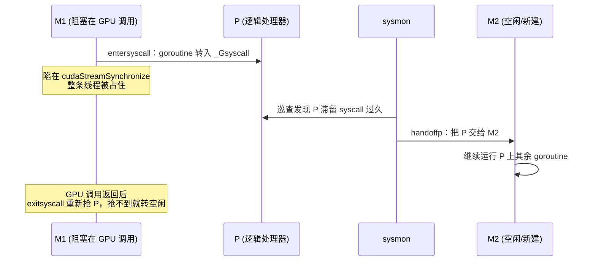

# 18.2 调度器与阻塞的外部调用

[18.1](./boundary.md) 给出的药方是「异步、少同步」：把命令压进流，立即返回，只在末尾等一次。
可那「末尾的一次」终归要等。`cudaStreamSynchronize` 会一直阻塞，直到 GPU 把整条流排空；一次
同步的 `cudaMemcpy`,一次没走异步路径的驱动调用，都会让 Go 这侧的线程实打实地停在 C 里。
本节要问的就是：当一次跨界**真的会长时间阻塞**时，[第 9 章](../../part3concurrency/ch09sched)
那套调度机器会怎样反应？它会不会被一个卡在 GPU 上的调用拖垮？

答案要从两个方向看。Go 阻塞在 C 里是一个方向，C 反过来回调 Go 是另一个方向，调度器在这两个
方向上各有一套应对。

## 18.2.1 一次阻塞的跨界，调度器看见的是什么

先回忆第 9 章的图景：调度器在 M（系统线程）、P（逻辑处理器，数量受 `GOMAXPROCS` 限制）、
G（goroutine）三者上编排并发，一个 M 必须先绑定一个 P 才能运行 Go 代码。

15.6 已经讲过，`cgocall` 在跨界前会调用 `entersyscall`。这一步的意义此刻变得关键：
**在调度器的记账里，一次 cgo 调用和一次系统调用是同一回事**。M 被标记为「正处于系统调用中」，
它承载的 goroutine 转入 `_Gsyscall` 状态。这里有一个随版本演进的实现细节值得一提：早先的
运行时还专门给 P 设过一个 `_Psyscall` 状态来表示「这个 P 正陷在系统调用里」，但 **Go 1.26 起
这个 P 状态已退役**（源码里留作 `_Psyscall_unused`），改为直接看 goroutine 的状态来判断一个 P
是否在系统调用中。这次精简并非无关紧要，它顺带把每次 cgo 跨界的固定开销削减了约三成,正是
[18.1.2](./boundary.md) 那「第一笔成本」被运行时自己磨薄的一例。从这一刻起到 C 调用返回，
有一条铁律：

> 调度器既看不见、也无法抢占一个正在 C 代码里执行的 goroutine。承载它的那个 M，
> 在整个 C 调用期间被牢牢占住。

道理在 15.6 说过：C 代码跑在 M 的 `g0` 系统栈上，运行时无法移动它、无法在它中间插入抢占点、
也无法扫描它的栈。所以这个 M 别无选择，只能陪着这次 GPU 调用一起等。但请注意，被占住的是
**M**,不是 **P**。P 是稀缺资源（最多 `GOMAXPROCS` 个），M 相对廉价。调度器要保的是别让一个
阻塞的调用白白霸占一个 P，把其他 goroutine 也饿死。

## 18.2.2 sysmon 把 P 抢回去

救场的正是第 9 章那个不绑定 P、独立运行的监控线程 **sysmon**。它周期性地巡查所有 P，其中一件
事就是 `retake`：把陷在系统调用里太久的 P 收回来，交给别的 M。这套机器原样适用于阻塞的 cgo 调用。

```go
// runtime/proc.go: retake 的相关分支（裁剪后的速写）
// 对每个陷在系统调用里的 P（其 goroutine 处于 _Gsyscall）：
if syscallBlockedTooLong(pp) {        // 超过约一个 sysmon tick（量级在数十微秒）
    thread.takeP()                    // 把 P 从阻塞的 M 手里夺走
    handoffp(pp)                      // 交给另一个 M，让它继续跑这个 P 上的其他 G
}
```

于是一次阻塞的 GPU 调用绝不会冻住整个程序：sysmon 在数十微秒的量级上就会把 P 移交出去，
剩下 `GOMAXPROCS - 1` 份的并发照常推进。那个卡在 C 里的 M，等 GPU 调用终于返回时，
会在 `exitsyscall` 里重新竞争一个 P；抢到就接着跑，抢不到就把自己这个 goroutine 挂回全局队列，
M 转入空闲。



这就是第一个方向的结论：**阻塞的跨界拖不垮调度器**。P 这层稀缺资源由 sysmon 保住了。
代价只是那个 M 被占了一程，以及一次 P 的移交带来的些许周转。

## 18.2.3 真正的代价：线程膨胀

代价虽小，却有一处会被并发放大，必须看清。

对比一下两种阻塞。一个 goroutine 阻塞在**通道**或**互斥锁**上时，调度器把它**挂起**（park），
M 随即被释放去跑别的 goroutine，一个 M 能服务成千上万个这样阻塞着的 goroutine,这正是 Go
「goroutine 廉价」的根基。可一个 goroutine 阻塞在 **cgo 调用**里时，它**无法被挂起**：C 代码
正占着这条线程的栈，运行时搬不走它。于是这个 goroutine 与它的 M 被死死绑在一起，直到 C 返回。

把这件事放到并发场景里，结论就尖锐了：

> 每一个**同时**阻塞在 GPU 调用里的 goroutine，都要独占一个 OS 线程。

如果你给每个请求开一个 goroutine、让它**同步地**等 GPU 跑完，那么 N 个并发请求就会撑起多达 N 个
线程。goroutine 的廉价在这里失效了，你付的是线程的价钱。而讽刺的是，这些线程绝大多数时间只是
在干等，因为一块 GPU 物理上就是串行地消化命令，N 个线程抢的还是同一个设备。

这正是 15.6 决策表里「高并发且 C 调用可能阻塞：谨慎」那一行的全部分量，也反过来印证了 18.1
为什么要那么强调异步。把它落成两条可操作的设计取向：

- **别把同步的设备调用撒进大量 goroutine。** 同步等待 GPU 的 goroutine 越多，线程越多，收益却
  并不随之增长，因为设备就一个。
- **用异步 + 少量 goroutine 喂流。** 让少数几个 goroutine 把命令异步压进流（18.1），它们不必
  在等待中占着线程，设备照样被喂满。

18.2.5 还会给出一种更彻底的收束形态：干脆让**一个**专属 goroutine 独占设备。

## 18.2.4 反方向：外部线程回调 Go

到此都在说「Go 阻塞在 C 里」。可桥是双向的。GPU 运行时常常会创建**自己的线程**,比如流的完成
回调（`cudaLaunchHostFunc` 注册的主机函数会在驱动的某个线程上被调用）。当这样一条线程反过来
要调用一个 Go 函数时，麻烦来了：**这是一条 Go 运行时从未创建、也不认识的线程，它没有绑定任何 M**。
而没有 M，就没有 `g0`、没有调度上下文，Go 代码根本无从跑起。

运行时为此备了一手，叫 **extra M**。`runtime/proc.go` 里的 `needm` 专门处理这种情形：

```go
// 一条外部（非 Go 创建）线程回调进 Go 时：
// needm 从一个预备好的 extra M 链表里借一个 M，
// 它自带 g0 与 curg，临时充当这次回调的调度栈与当前 goroutine。
// 回调结束（或该 C 线程退出）后，dropm 把这个 M 还回链表。
```

为保证「随时有一个 M 可借」，运行时在启用 cgo 的程序启动时就给这条链表播下一个种子 M，并维持
「总比需要的多一个」的不变量：`needm` 一旦借走了最后一个，它的首要任务就是再造一个备用 M 挂回去。
每个 extra M 都有自己的 `g0` 和 `curg`,在回调期间被「借用」。

代价是：`needm` 不便宜，它可能要新建线程、要分配内存，远比一次普通的 goroutine 切换重。一条
**频繁**回调 Go 的外部线程，会反复付这笔借还的开销。所以工程上的取向是：尽量减少「外部线程主动
回调 Go」的频率，能用「Go 这侧轮询结果」替代「让 C 回调通知」时，往往更划算。

## 18.2.5 钉住一个线程来拥有设备

前面两个方向的压力，最终都指向同一种设计，而它还顺带解决了一个本节尚未点破的问题:**上下文的
线程亲和**。

许多设备 API 是**绑定线程**的。一个 CUDA 上下文、一个 OpenGL 上下文（[19.2](../ch19graphics/bindings.md)
会细谈），是「当前于某一条特定 OS 线程」的概念。可 goroutine 会在不同的 M 之间迁移：这次在
线程 A 上跑，下次可能被调度到线程 B。若你在 A 上建好了上下文，goroutine 一迁移到 B，
上下文就不在了，设备调用直接出错。

解法是 `runtime.LockOSThread`：把一个 goroutine **钉死**在它当前的 M 上，此后它绝不迁移，
所有设备调用都经由同一条线程发出。把这一手与前面的线程成本合起来看，一个干净的形态浮现出来：

```go
// 一个专属「设备 goroutine」：独占设备、钉住线程、对外只暴露一个 channel
func deviceWorker(reqs <-chan Request) {
    runtime.LockOSThread()         // 钉住：上下文从此只在这条线程上
    defer runtime.UnlockOSThread()
    ctx := C.createContext()       // 上下文绑定到这条线程
    defer C.destroyContext(ctx)
    for r := range reqs {          // 串行地服务请求，命令异步压进流
        r.result <- submit(ctx, r) // 其余 goroutine 通过 channel 与它通信
    }
}
```

这个形态一举解决了三件事。其一，**线程亲和**：上下文始终在同一条钉住的线程上，不会因 goroutine
迁移而失效。其二，**线程数**：无论上游有多少 goroutine 在发请求，真正触碰设备的只有这一个、
钉住一条线程的 worker，杜绝了 18.2.3 的线程膨胀。其三，**回到 Go 的本色**：设备这个共享资源被
一个 goroutine 独占，其余 goroutine 通过通道与它通信，「不要通过共享内存来通信」这句箴言，
在最贴近硬件的地方又一次成立了。第 21 章的 Agent 会再次用到这个「单一拥有者 + 通道」的形态。

## 小结

FFI 边界不会压垮调度器，但它会从两处给调度器施压。Go 阻塞在 C 里时，那个 M 被整段占住、无法被
挂起，只能靠 sysmon 把稀缺的 P 抢回去救场；并发地这样阻塞，会换来线程膨胀，因为陷在 cgo 里的
goroutine 不像陷在通道里的那样廉价。反方向上，外部线程回调 Go 又得临时借一个 extra M，那也是一笔
开销。两股压力把设计推向同一种形态：不要把阻塞的设备调用撒给大量 goroutine，而是让少数几个、
必要时钉住线程的 goroutine 独占设备，再用通道把它接回程序的其余部分。

调度器的账算清了，还剩内存这本账：跨界递来递去的指针，哪些归 GC 管、哪些是设备地址、回收器又
凭什么不去碰它们。这是 [18.3](./memory.md) 的事。

## 延伸阅读的文献

1. The Go Authors. *runtime/proc.go.*
   https://github.com/golang/go/blob/master/src/runtime/proc.go
   （`entersyscall`/`exitsyscall`、sysmon 的 `retake`/`handoffp`、`needm`/`dropm` 与 extra M）
2. The Go Authors. *runtime.LockOSThread.* https://pkg.go.dev/runtime#LockOSThread
   （把 goroutine 钉在一条 OS 线程上，用于线程亲和的设备/图形上下文）
3. NVIDIA. *CUDA C++ Programming Guide: Asynchronous Concurrent Execution / Stream Callbacks.*
   https://docs.nvidia.com/cuda/cuda-c-programming-guide/
   （`cudaLaunchHostFunc` 等在驱动线程上回调主机代码的机制）
4. Dmitry Vyukov. *Scalable Go Scheduler Design Doc.*
   https://golang.org/s/go11sched
   （M/P/G 模型与系统调用下的 P 移交，sysmon 设计的源头）
5. 本书 [9.5 线程管理](../../part3concurrency/ch09sched/thread.md)、
   [9.8 系统监控](../../part3concurrency/ch09sched/sysmon.md)、
   [15.6 cgo](../../part5toolchain/ch15compile/cgo.md)、
   [18.1 跨越 FFI 边界](./boundary.md)、[18.3 显存与垃圾回收的分界](./memory.md)。
