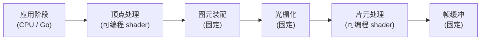

# 19.1 渲染管线与 Go 的位置

第 18 章把 GPU 当作一台「通用并行计算设备」来读。但 GPU 的本名是 **Graphics** Processing Unit,
它最初、也最本职的工作是渲染图形。早在「用 GPU 做通用计算」成为口号之前的二十年，显卡就已经在
为屏幕上的每一个像素做并行运算了。所以图形是**最古老的异构负载**,GPU 上那套大规模并行的硬件，
本就是为它而生。这一章回到这条本源，看 Go 在图形里扮演什么角色，而起点是看清那条贯穿一切的
**渲染管线**,以及 Go 的代码究竟坐在它的哪个位置。

## 19.1.1 管线：一条分段的数据流

把一堆三维顶点变成屏幕上一帧彩色图像，GPU 走的是一条**分段的流水线**。每一段读入上一段的输出，
做一类固定的变换，再交给下一段。经典的图形管线大致是这样：

这条管线里，有些段是**固定功能**的（图元装配、光栅化、帧缓冲混合），由硬件写死，你只能配置参数；
有些段是**可编程**的，顶点处理与片元处理各跑一段叫 **shader**(着色器）的小程序，由你提供。
光栅化是这条线的心脏：它把一个三角形「填」成一片覆盖到的像素，决定了哪些片元需要被着色。
整条管线天然适合 GPU,因为每个顶点、每个片元都可以被同一段 shader 独立地、并行地处理,
这正是第 18 章说的 SIMT。

## 19.1.2 Go 坐在哪里：CPU 侧的编排者

关键的问题来了：这条管线上，Go 的代码坐在哪一段？

答案是**最左边那一段，且仅此一段**:应用阶段。Go 跑在 CPU 上，它做的事是「准备数据、下达命令」:
把场景的顶点、纹理、变换矩阵组织好，上传到显存，然后发起一次次**绘制调用**(draw call),
告诉 GPU「用这套数据、这套 shader，画」。一旦绘制调用发出，后面那几段顶点处理、光栅化、片元处理
全在 GPU 上跑，Go 不再介入，只在最后需要时把结果取回或交给窗口系统显示。

这意味着图形编程里有**两道边界**,而不是一道。

第一道是熟悉的 **FFI 边界**。一次绘制调用，本质就是 [18.1](../ch18gpu/boundary.md) 说的命令提交:
经 cgo 进入图形驱动，把一条绘制命令压进队列，立即返回，GPU 在自己的时间线上异步执行。
18.1 那张「入队即返回」的图，原样适用于 `glDrawElements` 或 `vkCmdDraw`。渲染一帧要发很多次
绘制调用，于是 18.1 那条「减少跨界次数」的告诫，在这里化身为图形程序员天天念叨的「减少 draw call」。

第二道边界更微妙，是**语言**的边界。shader 不是用 Go 写的,它用 GLSL、SPIR-V、WGSL、HLSL 这些
专门的着色语言写成，由各自的编译器编译成 GPU 能执行的代码。**你无法用 Go 写一段在 GPU 上运行的
shader**。于是图形程序天然是「双语」的:Go 在 CPU 侧编排、管理资源、驱动每帧的逻辑，shader 在
GPU 侧做真正的逐顶点、逐像素计算。Go 与 shader 之间通过约定好的接口（顶点属性、uniform 变量、
纹理绑定）对接。看清这道语言边界很重要：它划定了 Go 在图形里能做什么、不能做什么,Go 是导演，
不是演员。

## 19.1.3 绘制调用的成本，与现代 API 的转向

既然渲染一帧要发大量绘制调用，而每次绘制调用都是一次跨界，绘制调用的固定成本就成了图形性能的
经典瓶颈。历史上，一次 draw call 要经过驱动做大量的状态校验与转换，CPU 侧的这笔开销常常比 GPU
实际画那个三角形还贵。应对之道与 18.1 同源,都是**把更多的活儿塞进一次跨界**:

- **批处理（batching）**:把许多用同一套状态的物体合并成一次绘制调用。
- **实例化（instancing）**:用一次绘制调用画出同一个网格的成百上千个副本（一片草、一群人），
  只是每个副本的变换不同。

更深的转向发生在 API 层面。老的 OpenGL 是**即时**风格的:你一条条地设状态、发命令，驱动在背后
替你做大量隐式的管理与校验，每次 draw call 都重新来一遍。新一代的**显式** API,Vulkan、Metal、
Direct3D 12、以及 Web 上的 WebGPU,把这套管理从驱动**搬到了应用这一侧**:你预先把一串命令录制进
**命令缓冲**(command buffer),校验只做一次，之后整批提交。这与 18.1 的 CUDA Graph 是同一种思想:
把一长串命令的构造与提交分离，让重复提交几乎零成本。

这个转向对 Go 是利好。命令缓冲的构造发生在 CPU 上，是大量的数据结构编排与内存管理工作,而这
恰恰是 Go 擅长的:并发地在多个 goroutine 上录制多个命令缓冲，再统一提交，正好把第 9、10 章那套
并发能力用在了图形的关键路径上。显式 API 让 Go 在图形里的角色从「薄薄一层绑定」变成了「实实在在
的命令编排者」。Go 生态里 Ebitengine、Gio 这些项目，底层做的正是这件事:在 CPU 侧高效地组织好
每帧的命令，再经由一道尽量薄的边界交给 GPU。

## 小结

GPU 的本职是图形,渲染管线是一条分段的数据流，固定功能段与可编程的 shader 段交替。Go 在这条
管线上只坐一个位置:CPU 上的应用阶段,负责准备数据、发起绘制调用。由此图形编程有两道边界:
一道是 18.1 那条 FFI 边界（绘制调用即命令提交，「减少 draw call」就是「减少跨界」），另一道是
语言边界（shader 用专门的着色语言写，Go 写不了 GPU 上的 shader，只能当导演）。绘制调用的固定
成本催生了批处理与实例化，而 Vulkan、WebGPU 这代显式 API 把命令编排搬回 CPU 侧，反倒让 Go 的
并发能力有了用武之地。

下一节深入第一道边界在图形里的一个特殊麻烦:图形上下文为什么被钉死在一条特定的 OS 线程上，
以及 [18.2.5](../ch18gpu/sched.md) 的 `LockOSThread` 为什么在这里不是技巧而是必需。

## 延伸阅读的文献

1. Tomas Akenine-Möller, Eric Haines, Naty Hoffman, et al.
   *Real-Time Rendering, 4th Edition.* CRC Press, 2018.
   （实时渲染管线的权威教材，第 2 至 3 章详述各阶段）
2. The Khronos Group. *Vulkan Specification: Rendering and Command Buffers.*
   https://registry.khronos.org/vulkan/
   （显式 API 如何用命令缓冲把命令录制与提交分离）
3. The Khronos Group. *WebGPU Specification.* https://www.w3.org/TR/webgpu/
   （Web 上的现代显式图形/计算 API；与 19.4 相关）
4. Cass Everitt, Tim Foley, et al. *Approaching Zero Driver Overhead (AZDO).*
   GDC, 2014.
   （绘制调用驱动开销的来源与削减手法）
5. Ebitengine. https://ebitengine.org/ ，Gio. https://gioui.org/
   （Go 生态里在 CPU 侧编排图形命令的两个实例）
6. 本书 [18.1 跨越 FFI 边界](../ch18gpu/boundary.md)、
   [18.4 异步编程模型](../ch18gpu/model.md)、
   [19.2 图形绑定与线程亲和](./bindings.md)。
