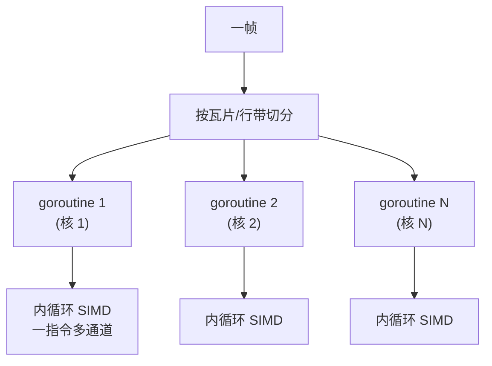

# 19.3 软件渲染与并行

前两节的渲染都要过一道边界:把数据和命令交给 GPU,付清第 18 章那一整套过桥费，还要伺候图形上下文
的线程纪律（[19.2](./bindings.md)）。这一节走另一条路:**软件渲染**,完全在 CPU 上算出每一个像素，
不碰 GPU、不碰驱动、不碰任何 FFI 边界。这条路一度被认为是「慢而无用的退路」,可它恰恰是把 Go
的并发能力，以及 Go 1.27 的 `simd`,用在图形上的最佳舞台。

## 19.3.1 为什么还要软件渲染

GPU 这么快，为什么还有人在 CPU 上渲染?因为有几类场景，GPU 要么用不上，要么不划算。

- **没有 GPU 可用。** 服务器端批量生成图片、缩略图、图表、PDF 渲染，跑在没有显卡、也没有显示器
  的无头（headless）机器上。这是 Go 最主流的部署形态，恰恰也是 GPU 最缺席的地方。
- **要确定性与可移植。** 软件渲染的结果逐位可复现，不受驱动版本、显卡型号的影响。需要「同一份
  输入在任何机器上渲染出逐像素相同的图」时(测试基线、文档生成），软件渲染是唯一可靠的选择。
- **图省心、要全控。** 没有上下文、没有线程纪律、没有边界，渲染器就是一段普通的 Go 代码，
  可读、可调试、可单步,每一个像素怎么来的都看得见。Go 标准库的 `image`、`image/draw`、
  `golang.org/x/image`,以及社区里的纯 Go 渲染器（如 `polyred`),走的都是这条路。

把这几条收成一句:软件渲染是**边界的另一面**。第 18、19 章前面反复计算的过桥成本，在这里一笔
都不存在，代价是放弃了 GPU 的海量吞吐。于是问题从「怎么过桥更便宜」变成了「**不过桥，怎么把
CPU 的并行榨干**」。答案有两层，正好对应第 18.4 节那个三种并行的分类里属于 CPU 的两种:
goroutine 的任务并行，与 SIMD 的数据并行。

## 19.3.2 把屏幕切成瓦片：goroutine 级并行

软件渲染有一个先天的好性质:**像素之间大多互不依赖**。一帧图像上不同区域的像素，可以完全独立地
算出来。这是教科书级的「易并行」(embarrassingly parallel)问题,而 Go 的 goroutine 正是为这种
任务级并行生的。

标准做法是**分块**(tiling):把画面切成若干瓦片或扫描线带，每个 goroutine 认领一块，
各算各的，互不干扰。

```go
// 把帧缓冲按行带切分，每个 goroutine 渲染一带，彼此不重叠
func renderParallel(fb *Framebuffer, scene *Scene, workers int) {
    var wg sync.WaitGroup
    rows := fb.Height / workers
    for w := 0; w < workers; w++ {
        y0, y1 := w*rows, (w+1)*rows
        wg.Add(1)
        go func(y0, y1 int) {        // 每个 goroutine 一条独立的行带
            defer wg.Done()
            for y := y0; y < y1; y++ {
                renderScanline(fb, scene, y) // 只写自己这带的像素
            }
        }(y0, y1)
    }
    wg.Wait()
}
```

有一处第 11、13 章埋下的暗礁要绕开:**伪共享与写竞争**。只要保证每个 goroutine 写的是帧缓冲里
**互不重叠**的区域，就没有数据竞争，连锁都不需要。这正是上面按行带切分、而非让多个 goroutine
争抢同一片像素的原因。划分得当，渲染的吞吐几乎随核数线性增长，这是 goroutine 在图形上最直接的
红利。这一层是**任务级**并行:把「画一帧」拆成「画很多块」,交给调度器铺到多个核上。

## 19.3.3 内循环的向量化：SIMD

任务级并行把活儿分到了多个核，可每个核**内部**那层数据并行还没榨取。渲染的最内层循环,逐像素地
做颜色混合、向量点乘、插值、光照,是一连串对小数组的、整齐划一的算术。这正是 [18.4.3](../ch18gpu/model.md)
说的 SIMD 的用武之地:一条指令同时处理一个向量寄存器里的多个数据通道。

过去 Go 要在这层用上 SIMD,只有两条不体面的路。一是**手写汇编**:标准库的 `image/draw`、
`x/image` 里那些热点函数，至今藏着各架构的手写 SIMD 汇编。二是**指望编译器自动向量化**,
但 Go 编译器在这件事上做得很有限，靠不住。两条路要么牺牲可移植与可读，要么干脆拿不到向量化。

**Go 1.27 的实验性 `simd` 包**(需 `GOEXPERIMENT=simd`,见 18.4.3)第一次让软件渲染的内循环能用
可移植的 Go 显式地向量化。以最常见的 alpha 混合为例,`dst = src·α + dst·(1-α)`,逐通道是一个
乘加,正好落在 `simd` 的融合乘加 `MulAdd` 上:

```go
//go:build goexperiment.simd
import "simd"

// 把一行像素的某个颜色通道，按 alpha 与背景混合（示意）
// src、dst、alpha 都是 []float32，一条指令推进一整组通道
func blendRow(dst, src, alpha []float32) {
    var z simd.Float32s
    lanes := z.Len()
    one := simd.BroadcastFloat32s(1.0)
    i := 0
    for ; i+lanes <= len(dst); i += lanes {
        s := simd.LoadFloat32s(src[i:])
        d := simd.LoadFloat32s(dst[i:])
        a := simd.LoadFloat32s(alpha[i:])
        // MulAdd(y, z) 返回 x*y + z，于是 dst = s*a + d*(1-a)
        out := s.MulAdd(a, d.Mul(one.Sub(a)))
        out.Store(dst[i:])
    }
    for ; i < len(dst); i++ {            // 残余尾部标量收尾
        dst[i] = src[i]*alpha[i] + dst[i]*(1-alpha[i])
    }
}
```

两点和 18.4.3 一致、值得在图形语境里再强调:其一，**向量长度无关**,`lanes` 在运行期由硬件给出，
同一份混合代码在 AVX512 的服务器上一次推进 16 个 float32，在 ARM 的 NEON 上推进 4 个，
无需为每种宽度各写一份。其二，**有硬件则用、无则纯 Go 模拟**,保证这段渲染代码在任何目标上都能
编译运行,这正是软件渲染最看重的可移植性。需再次诚实标注:`simd` 仍是 1.27 的实验特性,API 可能
变动。

## 19.3.4 两层并行的合成，与 GPU 的分野

把两层叠起来，软件渲染在 CPU 上的并行图景就完整了:



**外层用 goroutine 把帧切成块、铺满所有核（任务并行），内层用 SIMD 把每个核的算术拉满（数据
并行）。** 这两层正交，乘在一起:N 个核，每核一次处理 W 个通道，理想情况下相对朴素标量串行能
快上约 N×W 倍。这是 Go 程序不出进程、不碰任何边界，能从一块 CPU 上榨出的并行极限。

那么它和 GPU 的分野在哪?答案就是 [18.4.4](../ch18gpu/model.md) 算过的那笔总账，在图形上的具体
化。GPU 渲染吞吐远高，但要付过桥费与上下文的线程纪律;软件渲染吞吐有上限，却零边界、确定、
可移植、能在任何无头机器上跑。于是分野清晰:**实时、高分辨率、重着色的交互式渲染**归 GPU(游戏、
实时三维);**无头批量、确定性、中小规模、或干脆没有显卡的场景**归软件渲染(服务端出图、文档与
图表、渲染测试基线)。同一杆秤,边界的成本,又一次称出了该把活儿放在桥的哪一边。

## 小结

软件渲染是 FFI 边界的另一面:放弃 GPU 的吞吐，换来零过桥成本、确定性、可移植，以及在无头机器上
照常出图的能力,而这正是 Go 最主流的部署形态。把 CPU 的并行榨干靠两层:外层用 goroutine 把画面
切块、铺满多核（任务并行，注意按不重叠区域切分以避开写竞争),内层用 SIMD 向量化逐像素的算术
（数据并行,Go 1.27 的 `simd` 让它第一次能用可移植的 Go 写出，而非手写汇编)。两层正交相乘，
逼近一块 CPU 的并行极限。要不要改用 GPU，仍由第 18.4 那杆「边界成本」的秤来称。

CPU 与 GPU 两条渲染路都看过了。最后一节把场景换到浏览器:[19.4](./wasm.md) 看 Go 编译成
WebAssembly 之后，渲染的边界又落在了哪里，以及 WebGPU 如何在浏览器里重演这一整套异构计算的故事。

## 延伸阅读的文献

1. The Go Authors. *Package image/draw 与 golang.org/x/image.*
   https://pkg.go.dev/image/draw ，https://pkg.go.dev/golang.org/x/image
   （Go 标准与扩展图像库；热点函数的手写 SIMD 汇编实现）
2. The Go Authors. *Package simd（Go 1.27 实验特性，需 GOEXPERIMENT=simd）.*
   https://github.com/golang/go/tree/master/src/simd
   （`MulAdd`、`Broadcast`、向量长度无关的类型，用于内循环向量化）
3. changkun. *polyred: a 3D graphics facility in pure Go.*
   https://github.com/changkun/polyred
   （纯 Go 的软件三维渲染器，分块并行与可移植性的实践）
4. Matt Pharr, Wenzel Jakob, Greg Humphreys. *Physically Based Rendering, 4th ed.*
   2023. https://pbr-book.org/
   （软件渲染器的体系结构，含分块并行与向量化的工程讨论）
5. 本书 [9 goroutine 调度器](../../part3concurrency/ch09sched)、
   [11 同步原语与模式](../../part3concurrency/ch11sync)、
   [18.4 异步编程模型](../ch18gpu/model.md)、
   [19.1 渲染管线与 Go 的位置](./pipeline.md)、[19.4 浏览器中的渲染](./wasm.md)。
