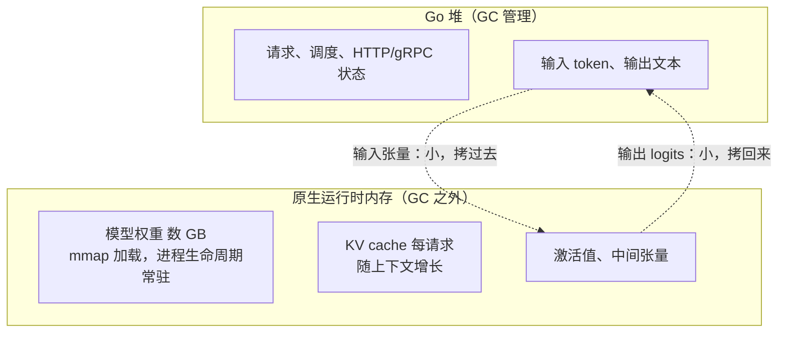

# 20.1 推理运行时与 FFI

第 18、19 章反复出现的那道 FFI 边界，到了大模型这里有了它最当下的一副面孔。训练大模型几乎是
Python 与 CUDA 的天下，可当一个模型训好、要被部署去**服务**千万次请求时，舞台换了主角，
Go 在这一层站得很稳。这一章讲 Go 如何承担 AI 的推理与服务，而第一节要先解决最底层的问题:
Go 自己并不做矩阵乘，它得接入一个本地推理运行时,而这次接入，又是第 18 章那道边界。

## 20.1.1 训练在 Python，推理与服务在哪

先把分工看清。**训练**是一件研究性的事:试不同的结构、调超参、看损失曲线，要的是表达的灵活与
生态的丰富，Python 加 PyTorch、再加 CUDA，是它无可争议的家园。Go 在训练这一侧没有位置，
也不必有。

但**推理与服务**是另一种事。模型已经冻结，权重不再变，剩下的问题清一色是**系统问题**:怎么用
高吞吐、低延迟地服务大量并发请求;怎么把一个几 GB 的模型稳定地装进内存、喂给设备;怎么做成一个
能一键部署、抗住生产流量、好监控好运维的服务。把这串问题念一遍，会发现它正是 Go 被设计出来要
解决的那一类:静态编译的单文件部署、天生的并发、可控的内存、成熟的网络栈。所以「训练归 Python、
推理与服务归 Go」不是偶然的站队，而是两种工作的性质把两门语言各自吸到了它擅长的那一层。
当下最流行的本地大模型服务 Ollama,正是用 Go 写就的。

## 20.1.2 接入本地推理运行时：又是那道边界

Go 站在服务层，可矩阵乘、注意力、量化这些真正吃算力的活儿，Go 并不亲自做,它把这些交给一个
**本地推理运行时**:`llama.cpp`/`ggml`(C/C++)、ONNX Runtime、或厂商的运行时。这些运行时是
用 C/C++ 写的高度优化的张量计算库，能调度 CPU 的 SIMD、也能驱动 GPU。Go 要用它们，
靠的还是 cgo。

于是第 18 章的整套机制原样回来了。Ollama 的文档说得很直白:它「包含用 CGO 编译的原生代码」,
原生推理引擎用 CMake 构建，按需编译出 CUDA、ROCm、Vulkan 等后端。这意味着 15.6 与第 18 章讲过的
代价一并继承:构建期需要 C/C++ 工具链、失去纯 Go 的轻便（[15.6.4](../../part5toolchain/ch15compile/cgo.md)),
运行期每次跨界要付那笔状态转换的税。Ollama 文档甚至点出了一个 15.6 没细说的脆弱处:Go 与 C
两侧共享的数据结构「可能不同步，导致意外崩溃」,这正是 cgo 把两个世界缝在一起时，缝合处最阴险的
一类 bug。

关键的设计纪律也和 18.1 一致:**粗粒度**。你绝不会为每一个算子跨一次界,而是一次 cgo 调用就让
运行时「把这一批 token 前向算完」,把成百上千个算子的执行整个留在 C 那侧的一次调用里。
18.1 说 GPU 负载天生是细粒度命令的洪流，而推理运行时的可贵之处，正在于它替你把这股洪流挡在了
边界的 C 一侧，只在 Go 面前留下一个粗粒度的接口。

## 20.1.3 张量的所有权穿过边界

接入之后，最要紧的工程问题是**内存**,因为大模型的内存以 GB 计，一次跨界拷贝的代价是实打实的。
把 18.3 那张内存地图套到推理上，所有权的划分一目了然:

要点有三。其一，**模型权重不在 Go 堆里**。它们由运行时分配，通常用 `mmap` 把 GGUF 这类权重
文件直接映射进地址空间，在整个进程生命周期常驻。这是一块几 GB 的、GC 完全不该插手的内存,
Go 的回收器既不扫描它、也不回收它，正是 18.3「设备/原生指针不是 Go 指针」的直接体现。
若错把这么大一块东西塞进 Go 堆，会给 GC 带来灾难性的扫描负担。

其二，**KV cache 是每请求的大块状态**。自回归生成时，运行时为每个序列维护一份键值缓存，
随上下文长度增长,它同样活在原生内存里，由运行时管理生命周期。Go 这侧持有的，只是一个指向它的
句柄。

其三，**只有小东西才值得跨界拷贝**。输入的 token、输出的 logits 与文本，相对权重是小量，
拷过边界无妨。真正的大块,权重、KV cache、激活值,全程留在原生一侧，Go 绝不把它们搬进自己的堆。
这就是推理里的「零拷贝」精神:让 GB 级的数据**待在原地**,Go 只递句柄、只搬小数据，
绝不让一次请求触发一次 GB 级的跨界搬运。把这条守住，FFI 边界的内存成本才不会失控。

## 20.1.4 进程内还是进程外

最后是 [18.1.4](../ch18gpu/boundary.md) 那个选择，在推理部署里再次浮现，而且尤为关键:把运行时
**嵌进同一个进程**,还是让它**另起一个进程**?

**进程内（cgo 嵌入）。** 把 `ggml`/`llama.cpp` 直接 cgo 链进 Go 服务，一个二进制跑天下,
Ollama 就是这条路。优点是没有进程间通信、没有序列化，输入输出在同一地址空间里直接传句柄,
延迟最低、部署最简。代价是全盘继承 cgo:构建要 C 工具链、失去交叉编译的轻便，而且,
**一个崩在 C 里的推理运行时会把整个 Go 服务一起带走**,18.2 说过运行时管不住 C 的崩溃，
一次原生段错误就是整个进程的终结。

**进程外（IPC/RPC）。** 把推理运行时跑成一个独立服务（如 `llama.cpp` 自带的 server、
vLLM、Triton），Go 进程通过 gRPC 或 HTTP 与它通信。Go 这侧于是一行 cgo 都没有，纯 Go 的工具链
性质全数保住，推理进程崩了也只是一个可重启的依赖，不会拖垮 Go 服务。代价是多了一道序列化与
跨进程通信，延迟略增，部署多了一个组件要编排。

没有放之四海的答案。要极致延迟、要单文件部署、且愿意背上 cgo,选进程内;要隔离、要纯 Go、
要把推理当作一个可独立伸缩与重启的后端，选进程外。这恰是 18.1.4 说的那句话:**FFI 边界不是
铁律，而是一个可以挪动的设计选择**,在推理部署里，它直接决定了你的系统拓扑。

## 小结

模型训好之后，服务它是一个系统问题，而系统问题正是 Go 的主场,这是 Go 站上 AI 推理与服务层的
根由。但 Go 不亲自算张量，它经 cgo 接入 `ggml`、ONNX Runtime 这类原生运行时，于是第 18 章那道
边界连同它的全部代价一并回归:粗粒度调用的纪律、构建期的 C 工具链负担、运行期的跨界税，
以及 Ollama 点名的「两侧数据结构不同步」这类缝合处的崩溃。内存上，把 18.3 的地图套过来,
GB 级的权重（常 `mmap` 常驻)、每请求的 KV cache、激活值全留在原生一侧，Go 只递句柄、只搬
token 与 logits 这些小数据，守住推理的「零拷贝」。而把运行时嵌进进程还是另起一个进程，
是 18.1.4 那个可挪动边界的又一次抉择，直接决定系统拓扑。

权重与张量的家安顿好了，下一节走进数据本身:[20.2](./tokenize.md) 看一段文本如何被切成 token、
又如何变回文本，以及为什么第 5 章关于字符串与字节的那套机制，在这里关系到正确与否。

## 延伸阅读的文献

1. Ollama. *Development / CGO and native runtime.*
   https://github.com/ollama/ollama
   （用 CGO 嵌入原生推理引擎、CMake 构建多后端、两侧数据结构同步的脆弱性）
2. Georgi Gerganov 等. *llama.cpp 与 ggml.*
   https://github.com/ggml-org/llama.cpp ，https://github.com/ggml-org/ggml
   （C/C++ 张量运行时、GGUF 权重格式与 `mmap` 加载、KV cache）
3. Microsoft. *ONNX Runtime C API.*
   https://onnxruntime.ai/docs/api/c/
   （以 C API 暴露的推理运行时，可经 cgo 接入 Go）
4. vLLM. *vLLM: Easy, Fast, and Cheap LLM Serving.*
   https://docs.vllm.ai/
   （进程外推理服务的代表，Go 经 RPC 接入的对端）
5. 本书 [15.6 cgo](../../part5toolchain/ch15compile/cgo.md)、
   [18.1 跨越 FFI 边界](../ch18gpu/boundary.md)、
   [18.3 显存与垃圾回收的分界](../ch18gpu/memory.md)、
   [20.2 分词与张量](./tokenize.md)、[20.3 服务、批处理与流式](./serving.md)。
