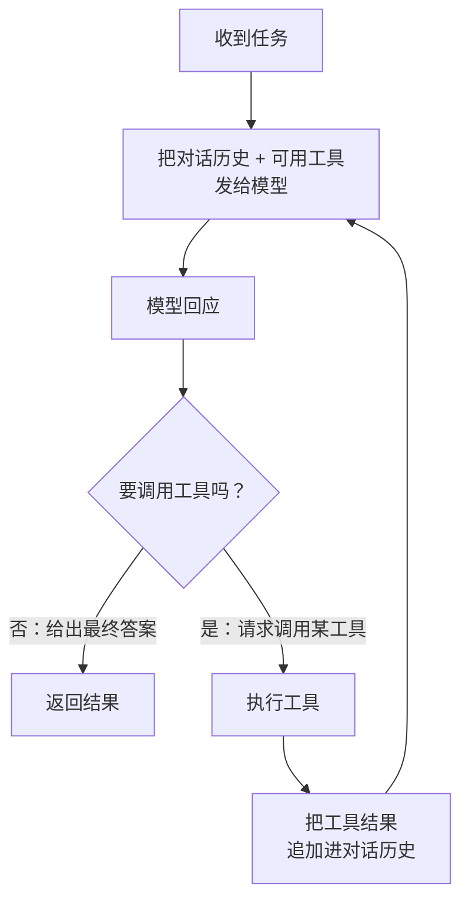

# 21.1 Agent 控制循环

第 20 章讲的是 Go 服务一个模型,请求进、token 流出。可当下的系统往往更进一步:让模型不只回答，
还能**调用工具、连成多步、自主推进**,直到把一个任务办完。这就是 **AI Agent**。Agent 听起来很
玄,本书的立场一以贯之:把模型的智能搁在一边，只看运行时那一面。这样看，一个 Agent 不过是一个
**控制循环**,而控制循环正是计算机科学最古老、最朴素的结构之一。这一章就用这个视角，
把 Agent 还原成一个 Go 程序员熟悉的并发问题。

## 21.1.1 把 Agent 还原成一个控制循环

剥掉所有花哨的说法，一个 Agent 的核心是一个循环:



把这张图读一遍:把上下文（对话历史加可用工具的描述)发给模型;模型要么给出最终答案（循环结束），
要么请求调用某个工具;若是后者，就执行那个工具，把结果追加回上下文，再发给模型,如此往复。
所谓「自主」「智能体」，机制上就是**这个带工具调用的循环**。模型负责在每一步决定「下一步做什么」,
而 Agent 运行时负责忠实地执行这个循环:维护上下文、调度工具、把结果喂回去。

这个认识是解魅的，也是解放的。它告诉我们:写一个 Agent 框架，**不需要任何机器学习**,需要的是
把一个循环、一组工具、一份不断增长的上下文，组织得正确、并发、可靠,而这些全是本书前面讲过的
东西。

## 21.1.2 它是一台状态机

把这个循环看得再细一点，它其实是一台**状态机**。每一轮，Agent 处在某个明确的状态里:

- **思考中**:等模型返回（一次第 20 章意义上的推理请求，往往是流式的)。
- **待执行工具**:模型已决定调用某工具，正准备或正在执行它。
- **整合中**:工具有了结果，正把它追加进上下文。
- **完成 / 失败**:循环终止。

把这些状态**显式**地写出来，而不是让它们隐式地散落在控制流里，在工程上有实打实的好处。其一，
**可观测**:任一时刻都能报告「这个 Agent 卡在哪一步」,对调试和监控至关重要。其二，**可持久化与
可恢复**:一个长跑的 Agent 任务可能要数分钟、调几十个工具，把状态显式化，就能把它存盘、在崩溃后
从断点续跑，而不是从头再来。其三，**可控**:超时、重试、人工介入，都更容易挂在显式的状态转移上。
Go 没有花哨的状态机框架，但一个带 `state` 字段的结构体加一个 `for` 加一个 `switch`,
朴素得正好:

```go
type Agent struct {
    state   State
    history []Message // 不断增长的上下文
    tools   map[string]Tool
}

func (a *Agent) Run(ctx context.Context, task string) (string, error) {
    a.history = append(a.history, userMsg(task))
    for {
        select {
        case <-ctx.Done():
            return "", ctx.Err() // 整个任务级的取消，见 21.3
        default:
        }
        resp := a.model.Infer(ctx, a.history) // 思考中
        if resp.IsFinal() {
            return resp.Text, nil             // 完成
        }
        result := a.tools[resp.Call.Name].Invoke(ctx, resp.Call.Args) // 待执行工具
        a.history = append(a.history, assistantMsg(resp), toolMsg(result)) // 整合中
    }
}
```

这段三十行不到的骨架，就是一个 Agent 的全部运行时核心。它没有一行涉及模型内部，全是上下文管理、
分支与循环,是地地道道的 Go 工程代码。

## 21.1.3 每个 Agent 一个 goroutine，还是集中编排

单个 Agent 是一个循环，那**许多** Agent 呢?这就回到了并发设计。两种取向，各有其位。

**每个 Agent 一个 goroutine。** 最自然的形态:一个 Agent 的循环就是一个 goroutine，
彼此隔离，各跑各的。第 9 章说 goroutine 廉价，开成千上万个不在话下,而 Agent 的循环大部分时间在
**等**(等模型、等工具的 I/O)，正是 goroutine 最舒服的工况。多 Agent 协作（一个主 Agent 派生
若干子 Agent 去并行办子任务）也顺理成章，就是第 10 章的扇出扇入:主 goroutine 派生子 goroutine、
用通道收集它们的结果。

**集中编排。** 当许多 Agent **争抢同一份稀缺资源**时，纯粹的「各跑各的」就不够了。最典型的稀缺
资源就是模型后端,无论是第 20 章那个进程内的推理服务，还是一个有速率限制的远端 API,它的吞吐
有限。成千上万个 Agent goroutine 同时发推理请求，会瞬间打爆后端。这时需要一个集中的调度层，
把所有 Agent 的模型调用收口到一处，做排队、限流、优先级。其形态正是 [18.2.5](../ch18gpu/sched.md)
与 [20.3](../ch20inference/serving.md) 反复出现的那个:**一个共享资源被一个拥有者管起来，
众多使用者通过通道与它通信**。Agent 越多，这个收口处的背压与公平就越要紧,这是 21.3 的话题。

## 21.1.4 Agent 站在第 20 章之上

最后定位一下这一章在全书的位置。一个 Agent 的每一次「思考」，都是一次第 20 章意义上的推理请求,
那条会流式吐 token、需要背压与取消的 token 流。所以 **Agent 是第 20 章那个推理服务的客户端**,
它的控制循环，是在反复地消费 20.3 那条流。

这也意味着边界变了。第 18 到 20 章，那道核心边界是**进程内的 FFI**(cgo 到设备、到运行时);
而到了 Agent 这一层，模型后端常常在另一个进程、甚至另一台机器上，边界变成了**网络 RPC**。
但 [18.1.4](../ch18gpu/boundary.md) 早就说过，FFI 边界与进程间边界只是同一个设计选择的不同
位置。边界换了形式，纪律没变:还是要流式、要背压、要取消，只是这次跨越的是网络而非 cgo。
第 21 章于是站在第 20 章的肩膀上，把同一套并发纪律，用在了一个更高、更自主的循环里。

## 小结

把模型的智能搁在一边，一个 AI Agent 在运行时眼里就是一个控制循环:发上下文给模型，模型要么
给出答案、要么请求调用工具，执行工具、把结果追加回上下文，循环往复。它是一台状态机，
把状态显式化能换来可观测、可恢复、可控,而 Go 用一个结构体加 `for`/`switch` 就够朴素地表达它，
全程不沾一点机器学习。许多 Agent 的并发，则在「每个 Agent 一个 goroutine」与「集中编排稀缺的
模型后端」之间权衡，后者又是那个熟悉的「单一拥有者 + 通道」形态。归根结底，Agent 是第 20 章
推理服务的客户端，它把同一套流式、背压、取消的纪律，搬到了一个跨网络、更自主的循环上。

循环的骨架立住了，循环里最关键的动作是「调用工具」。下一节 [21.2](./mcp.md) 深入工具调用本身:
工具如何被描述、被分发，以及 Model Context Protocol 如何用一套协议把工具标准化地接给模型。

## 延伸阅读的文献

1. Shunyu Yao 等. *ReAct: Synergizing Reasoning and Acting in Language Models.*
   ICLR, 2023. https://arxiv.org/abs/2210.03629
   （「推理-行动」交替循环，Agent 控制循环的代表性形式化）
2. Anthropic. *Building Effective Agents.* 2024.
   https://www.anthropic.com/research/building-effective-agents
   （把 Agent 看作工具调用循环与工作流的工程视角）
3. Lilian Weng. *LLM Powered Autonomous Agents.* 2023.
   https://lilianweng.github.io/posts/2023-06-23-agent/
   （Agent 的规划、记忆、工具使用等组成部分综述）
4. 本书 [9 goroutine 调度器](../../part3concurrency/ch09sched)、
   [10 通道与 select](../../part3concurrency/ch10chan)、
   [18.2 调度器与阻塞的外部调用](../ch18gpu/sched.md)、
   [20.3 服务、批处理与流式](../ch20inference/serving.md)、
   [21.2 工具调用与 MCP](./mcp.md)。
