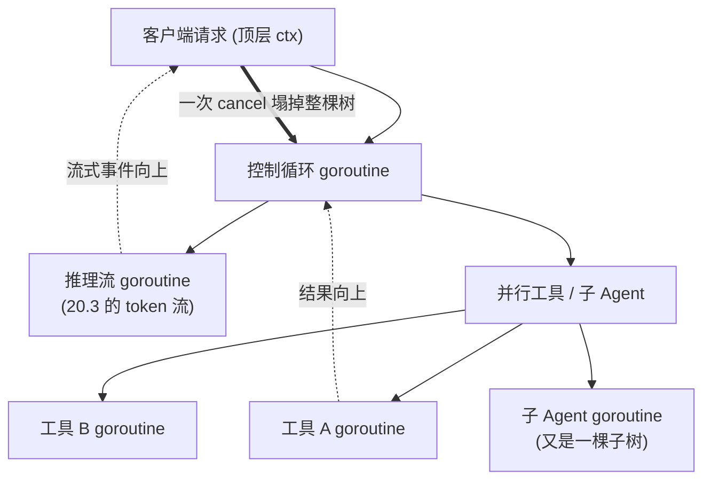

# 21.3 流式、背压与取消

[21.1](./loop.md) 立起了 Agent 的控制循环，[21.2](./mcp.md) 讲清了循环里的工具调用。这最后一节，
把第 7 章的 context 与第 10、11 章的并发原语请上台做全书的谢幕演出,因为一个生产级的 Agent，
真正的难处不在循环的骨架，而在贯穿整条链路的三件事:流式、背压、取消。它们彼此缠绕，
而把它们统一起来的，是一个 Go 程序员再熟悉不过的形状,一棵由 context 绑定的 goroutine 树。

## 21.3.1 整条链路都是流式的

先看清数据在 Agent 里怎么流。一个请求从客户端进来，落到 Agent 的控制循环;循环每一步向模型发起
一次推理，而那次推理是 [20.3](../ch20inference/serving.md) 讲的**流式 token 流**;循环还会调用
工具，工具自身也可能慢、可能流式返回。于是**流式不是某一层的特性，而是贯穿整条链路的常态**。

这带来一个体验上的要求:用户不该盯着空白等 Agent 默默跑完几十步。模型在想什么、正调用哪个工具、
工具回了什么，都应当**边发生边呈现**。这意味着 Agent 不只是消费下层的流，它还要**再生产**一条
自己的事件流向上吐:把「模型正在输出的 token」「开始调用工具 X」「工具 X 返回了」这些事件，
实时地流给客户端。一条流进、一条流出，中间是控制循环,这又是第 10 章「goroutine 经通道把事件
逐个传出」的句式，只是这次传的是 Agent 的执行事件。

## 21.3.2 取消必须穿透每一层

流式之外，最硬的需求是**取消**。用户随时可能点「停止」、可能关掉连接;一个上层任务失败，
正在并行跑的兄弟任务就该立刻停手。一次取消，必须能穿透 Agent 那一整摞调用层,而这正是第 7 章
`context` 被设计出来要做的事。

把一个 ctx 从最顶端（客户端请求）一路透传下去:进入控制循环，传给每一次 `model.Infer`,
传给每一次 `tool.Invoke`,再传进工具内部的每一次 HTTP、每一次数据库查询。这样，
顶端一个 `cancel()`,`ctx.Done()` 的信号就会同时抵达每一层:模型停止生成（释放 20.1 那块
每请求的 KV cache),在飞的工具 I/O 当即中止。整摞调用栈像多米诺一样干净地倒下，没有泄漏的
goroutine、没有继续空转烧钱的推理。

```go
// 一个 ctx 贯穿全链：循环、推理、工具、工具内的 I/O
func (a *Agent) step(ctx context.Context) error {
    stream, err := a.model.InferStream(ctx, a.history) // 取消 → 停止生成
    if err != nil { return err }
    for ev := range stream {
        a.emit(ev)                                     // 再生产事件流向上
        if ev.IsToolCall() {
            // 工具调用也带着同一个 ctx，取消一路抵达工具内部
            res, err := a.callTool(ctx, ev.Call)       // 见 21.2，ctx 透传
            if err != nil { return err }
            a.history = append(a.history, toolMsg(res))
        }
    }
    return ctx.Err()
}
```

但这里藏着一条与第 18 章呼应的**深刻边界**,值得专门点出。`context` 的取消是**协作式**的:
它只是把 `Done()` 通道关掉，**指望每一层主动去检查并退出**。任何一层若不理会 ctx，取消就在那里
断流。最棘手的一类，恰是 [18.2](../ch18gpu/sched.md) 讲过的:**一个陷在阻塞 cgo 调用里的工具，
是无法被取消的**。Go 的运行时尚且无法抢占一个跑在 C 里的线程，`context` 这一纸协作式的约定更
无能为力。于是一个调用本地推理运行时、或调用某个 C 库的工具，一旦进入那次阻塞的跨界，
上层的取消就只能等它自己返回。这把第 18 章的边界故事，和第 21 章的取消故事，缝在了同一个点上:
**协作式取消的边界，恰好止于不可抢占的 FFI 边界**。设计 Agent 的工具时，这是必须心里有数的一道
裂缝,能用进程外、能用可取消的 I/O，就别把不可取消的阻塞 cgo 放进取消要穿过的路径上。

## 21.3.3 背压与扇出：让慢的那一环反压回去

第三件是**背压**,而它和取消、流式是同一个系统的三个面。

顺着 21.3.1 那条流想:如果客户端读得慢，Agent 向上吐事件的通道就会满;通道一满，Agent 消费模型
token 流的速度就被迫慢下来;而这又会（20.3）让模型的生成阻塞、攥着 KV cache 不放。**慢消费者的
压力，沿着整条流一路反压回最底层的设备。** 这不是坏事，这正是第 10 章说的有界通道作为背压阀的
价值,它逼着整条链路按最慢一环的节奏走，而不是让快的一头把内存堆爆。关键是每一跳的通道都要
**有界**,让背压能传导，而非在某处积压成无界的内存增长。

当 Agent 派生**并行**的子任务（同时调多个工具、派生多个子 Agent)时，背压与取消还要和扇出扇入
合流。第 10 章的扇出扇入在这里有个顺手的封装,`errgroup`:它给一组并行 goroutine 绑定同一个
派生 ctx,任何一个返回错误，就取消这个 ctx，于是其余兄弟任务一并收手。

```go
// 并行调用多个工具：共享一个可取消的 ctx，一个失败则全体收手
g, ctx := errgroup.WithContext(ctx)
results := make([]Result, len(calls))
for i, call := range calls {
    i, call := i, call
    g.Go(func() error {
        r, err := a.callTool(ctx, call) // 同一个 ctx：取消穿透每个分支
        results[i] = r
        return err
    })
}
err := g.Wait() // 等全部完成，或在首个错误处提前取消其余
```

一个失败带动全体取消，正是 21.3.2 那棵取消树在「并行」这条边上的体现。扇出制造分支，
共享的 ctx 保证这些分支能被一并取消，有界通道保证它们之间的背压能传导。三者合在一处，
并行的 Agent 才既快又可控。

## 21.3.4 一棵由 context 绑定的 goroutine 树

把这一章三节收拢，一个 Agent 在运行时眼里的全貌，是**一棵由 context 绑定的 goroutine 树**:



树的每个节点是一个 goroutine:控制循环、推理流、并行的工具、递归派生的子 Agent。树的每条边上，
**流式**让事件向上涌出，**背压**让慢节点反压上游，**取消**让顶端一个信号塌掉整棵子树。
而这棵树的每一样零件,goroutine、通道、`select`、`context`、`errgroup`,无一不是本书前面早已
讲透的东西。Agent 这个 2020 年代最新、最热的负载，在运行时层面没有要求任何新机制,它要求的，
恰好是 Go 用十余年打磨的那套并发与取消。

## 小结

一个生产级 Agent 的难处不在循环骨架，而在贯穿全链的流式、背压与取消。流式是常态:Agent 消费下层
的 token 流，又再生产自己的执行事件流向上,让用户边发生边看见。取消必须穿透每一层,一个从顶端
透传的 ctx 让 `Done()` 同时抵达推理、工具、工具内的 I/O，整摞调用干净倒下,但它是协作式的，
止于第 18 章那道不可抢占的阻塞 FFI 边界，这是设计工具时必须正视的裂缝。背压沿流一路反压回设备，
要靠每一跳的有界通道传导;并行的扇出则用 `errgroup` 把共享 ctx 与扇入收束，一个失败带动全体取消。
三者合一，一个 Agent 就是一棵由 context 绑定的 goroutine 树:边上流着事件与背压，根上一个取消
塌掉整棵树。

## 本章与本部分的收束

第 21 章把 Agent 还原成了控制循环、工具调用、与一棵取消树,通篇没有用到任何机器学习，
用到的全是第 7、9、10、11 章的并发与取消。这恰是第六部分一以贯之的发现:从 GPU 到图形、
到推理、到 Agent，这些被冠以「异构」「AI」之名的新负载，在运行时层面要求的并非新魔法，
而是同一套老原理在新场景里的应用,FFI 边界的成本核算、单一拥有者加通道的资源管理、
协作式的取消与背压。本书开篇说「代码总可以推倒重来，但原理却能永生」,第六部分正是这句话的
一次兑现:框架一年一换，可挡在框架背后的那道边界、那棵取消树、那条「不要通过共享内存来通信」的
箴言，会一直在那里。把这些原理握在手里，无论下一个被热炒的负载叫什么名字，你都认得出它运行时
的骨架。

至此，从第一部分的全景与历史，到这一部分的异构与 AI，全书的旅程告一段落。愿这些深入底层的原理，
成为读者面对任何新工作负载时，那双能看穿表象的眼睛。

## 延伸阅读的文献

1. The Go Authors. *Package context.* https://pkg.go.dev/context
   （协作式取消沿调用树传播,Agent 取消树的机制基础)
2. Sameer Ajmani. *Go Concurrency Patterns: Context.* The Go Blog, 2014.
   https://go.dev/blog/context
   （context 的设计意图:把取消与截止时间贯穿一棵 goroutine 树)
3. The Go Authors. *Package golang.org/x/sync/errgroup.*
   https://pkg.go.dev/golang.org/x/sync/errgroup
   （扇出扇入加共享可取消 ctx，一个失败带动全体收手)
4. 本书 [7 错误处理与 context](../../part2lang/ch07errors)、
   [10 通道与 select](../../part3concurrency/ch10chan)、
   [11 同步原语与模式](../../part3concurrency/ch11sync)、
   [18.2 调度器与阻塞的外部调用](../ch18gpu/sched.md)、
   [20.3 服务、批处理与流式](../ch20inference/serving.md)、
   [21.1 Agent 控制循环](./loop.md)、[21.2 工具调用与 MCP](./mcp.md)。
