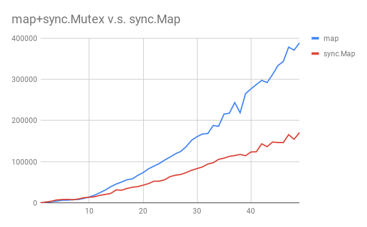

# 11 标准库：sync.Map

sync.Map 宣称内部做了特殊的优化，在两种情况下由于普通的 map+mutex。在研究源码之前我们先来看看测试结果。
在测试中，我们测试了：n 个 key 中，每个 key 产生 1 次写行为，每个 key 产生 n 次读行为。

下面是随 n 变化的性能结果



**图1：`map`+`sync.Mutex` 、`map`+`sync.RWMutex` 与 `sync.Map` 之间单次写多次读场景下的性能对比**

下面我们来研究一下 sync.Map 的具体优化细节。

## 结构

既然是并发安全，因此 sync.Map 一定会包含 Mutex。那么宣称的多次读场景下的优化一定是使用了某种特殊的
机制来保证安全的情况下可以不再使用 Mutex。

```go
// Map 是一种并发安全的 map[interface{}]interface{}，在多个 goroutine 中没有额外的锁条件
// 读取、存储和删除操作的时间复杂度平均为常量
//
// Map 类型非常特殊，大部分代码应该使用原始的 Go map。它具有单独的锁或协调以获得类型安全且更易维护。
//
// Map 类型针对两种常见的用例进行优化：
// 1. 给定 key 只会产生写一次但是却会多次读，类似乎只增的缓存
// 2. 多个 goroutine 读、写以及覆盖不同的 key
// 这两种情况下，与单独使用 Mutex 或 RWMutex 的 map 相比，会显著降低竞争情况
//
// 零值 Map 为空且可以直接使用，Map 使用后不能复制
type Map struct {
	mu Mutex

	// read 包含 map 内容的一部分，这些内容对于并发访问是安全的（有或不使用 mu）。
	//
	// read 字段 load 总是安全的，但是必须使用 mu 进行 store。
	//
	// 存储在 read 中的 entry 可以在没有 mu 的情况下并发更新，
	// 但是更新已经删除的 entry 需要将 entry 复制到 dirty map 中，并使用 mu 进行删除。
	read atomic.Value // 只读

	// dirty 含了需要 mu 的 map 内容的一部分。为了确保将 dirty map 快速地转为 read map，
	// 它还包括了 read map 中所有未删除的 entry。
	//
	// 删除的 entry 不会存储在 dirty map 中。在 clean map 中，被删除的 entry 必须被删除并添加到 dirty 中，
	// 然后才能将新的值存储为它
	//
	// 如果 dirty map 为 nil，则下一次的写行为会通过 clean map 的浅拷贝进行初始化
	dirty map[interface{}]*entry

	// misses 计算了从 read map 上一次更新开始的 load 数，需要 lock 以确定 key 是否存在。
	//
	// 一旦发生足够的 misses 足以囊括复制 dirty map 的成本，dirty map 将被提升为 read map（处于未修改状态）
	// 并且 map 的下一次 store 将生成新的 dirty 副本。
	misses int
}
```

在这个结构中，可以看到 `read` 和 `dirty` 分别对应两个 `map`，但 `read` 的结构比较特殊，是一个 `atomic.Value` 类型。
先不去管它，我们直接理解为一个 map，之后再来详细看它。

从 `misses` 的描述中可以大致看出 sync.Map 的思路是发生足够多的读时，就将 dirty map 复制一份到 read map 上。
从而实现在 read map 上的读操作不再需要昂贵的 Mutex 操作。

## `Store()`

我们先来看看 `Store()`。

```go
// Store 存储 key 对应的 value
func (m *Map) Store(key, value interface{}) {
	// 获得 read map
	read, _ := m.read.Load().(readOnly)

	// 修改一个已经存在的值
	// 读取 read map 中的值
	// 如果读到了，则尝试更新 read map 的值，如果更新成功，则直接返回，否则还要继续处理（当且仅当要更新的值被标记为删除）
	// 如果没读到，则还要继续处理（read map 中不存在）
	if e, ok := read.m[key]; ok && e.tryStore(&value) {
		return
	}
    (...)
}
```

可以看到，首先发生的是更新已经存在值的情况：
更新操作直接更新 read map 中的值，如果成功则不需要进行任何操作，如果没有成功才继续处理。

我们来看一下 `tryStore`。

```go
// tryStore 在 entry 还没有被删除的情况下存储其值
//
// 如果 entry 被删除了，则 tryStore 返回 false 且不修改 entry
func (e *entry) tryStore(i *interface{}) bool {

	// 读取 entry
	p := atomic.LoadPointer(&e.p)

	// 如果 entry 已经删除，则无法存储，返回
	if p == expunged {
		return false
	}

	for {
		// 交换 p 和 i 的值，原子操作，如果成功则立即返回
		if atomic.CompareAndSwapPointer(&e.p, p, unsafe.Pointer(i)) {
			return true
		}

		// 如果没有成功，则再读一次 entry
		p = atomic.LoadPointer(&e.p)
		// 如果 entry 已经删除，则无法存储，返回
		if p == expunged {
			return false
		}

		// 再次尝试，说明只要 key 不删除，那么更新操作一定会直接更新 read map，不涉及 dirty map
	}
}
```

从 `tryStore` 可以看出，在更新操作中只要没有发生 key 的删除情况，即值已经在 dirty map 中标记为删除，
更新操作一定只更新到 read map 中，不涉及与 dirty map 之间的数据同步。

我们继续看 `Store()` 剩下的部分。下面的情况就相对复杂一些了，在锁住结构后，
要做的第一件事情就是更新刚才读过的 read map。刚才我们仅仅只是修改一个已经存在的值，
现在我们面临三种情况：

**情况1**

```go
// Store 存储 key 对应的 value
func (m *Map) Store(key, value interface{}) {
	(...)

	m.mu.Lock()
	// 经过刚才的一系列操作，read map 可能已经更新了
	// 因此需要再读一次
	read, _ = m.read.Load().(readOnly)

	if e, ok := read.m[key]; ok {
		// 修改一个已经存在的值
		if e.unexpungeLocked() {
			// 说明 entry 先前是被标记为删除了的，现在我们又要存储它，只能向 dirty map 进行更新了
			m.dirty[key] = e
		}
		// 无论先前删除与否，都要更新 read map
		e.storeLocked(&value)
	} else if e, ok := m.dirty[key]; ok {
		(...)
	} else {
		(...)
	}
	m.mu.Unlock()
}
```

这种情况下，本质上还分两种情况：

1. 可能因为是一个已经删除的值（之前的 `tryStore` 失败）
2. 可能先前仅保存在 dirty map 然后同步到了 read map（这是可能的，我们后面读 Load 时再来分析 dirty map 是如何同步到 read map 的）

对于第一种而言，我们需要重新将这个已经删除的值标记为没有删除，然后将这个值同步回 dirty map（删除操作只删除 dirty map，之后再说）
对于第二种状态，我们直接更新 read map，不需要打扰 dirty map。

**情况2**

```go
// Store 存储 key 对应的 value
func (m *Map) Store(key, value interface{}) {
	(...)
	if e, ok := read.m[key]; ok {
		(...)
	} else if e, ok := m.dirty[key]; ok {
		e.storeLocked(&value) // 更新 dirty map 的值即可
	} else {
		(...)
	}
	m.mu.Unlock()
}
```

我们发现 read map 中没有想要更新的值，那么看一下 dirty map 有没有，结果发现是有的，
那么我们直接修改 dirty map，不去打扰 read map。

**情况3**

```go
// Store 存储 key 对应的 value
func (m *Map) Store(key, value interface{}) {
	(...)
	if e, ok := read.m[key]; ok {
		(...)
	} else if e, ok := m.dirty[key]; ok {
		(...)
	} else {
		// 如果 dirty map 里没有 read map 没有的值（两者相同）
		if !read.amended {
			// 首次添加一个新的值到 dirty map 中
			// 确保已被分配并标记为 read map 是不完备的(dirty map 有 read map 没有的)
			m.dirtyLocked()
			// 更新 amended，标记 read map 中缺少了值（标记为两者不同）
			m.read.Store(readOnly{m: read.m, amended: true})
		}
		// 不管 read map 和 dirty map 相同与否，正式保存新的值
		m.dirty[key] = newEntry(value)
	}
	m.mu.Unlock()
}
// 只是简单的创建一个 entry
// entry 是一个对应于 map 中特殊 key 的 slot
type entry struct {
	// p 指向 interface{} 类型的值，用于保存 entry
	//
	// 如果 p == nil，则 entry 已被删除，且 m.dirty == nil
	//
	// 如果 p == expunged, 则 entry 已经被删除，m.dirty != nil ，则 entry 不在 m.dirty 中
	//
	// 否则，entry 仍然有效，且被记录在 m.read.m[key] ，但如果 m.dirty != nil，则在 m.dirty[key] 中
	//
	// 一个 entry 可以被原子替换为 nil 来删除：当 m.dirty 是下一个创建的，它会自动将 nil 替换为 expunged 且
	// 让 m.dirty[key] 成为未设置的状态。
	//
	// 与一个 entry 关联的值可以被原子替换式的更新，提供的 p != expunged。如果 p == expunged，
	// 则与 entry 关联的值只能在 m.dirty[key] = e 设置后被更新，因此会使用 dirty map 来查找 entry。
	p unsafe.Pointer // *interface{}
}
func newEntry(i interface{}) *entry {
	return &entry{p: unsafe.Pointer(&i)}
}
```

read map 和 dirty map 都没有，只能是存储一个新值了。当然，在更新之前
我们还要再检查一下 read map 和 dirty map 的状态。
如果 read map 和 dirty map 中存储的内容是相同的，那么我们这次存储新的数据
只会存储在 dirty map 中，因此会造成 read map 和 dirty map 的不一致。

read map 和 dirty map 相同的情况，首先调用 `dirtyLocked()`。

```go
func (m *Map) dirtyLocked() {
	// 如果 dirty map 为空，则一切都很好，返回
	if m.dirty != nil {
		return
	}

	// 获得 read map
	read, _ := m.read.Load().(readOnly)

	// 创建一个与 read map 大小一样的 dirty map
	m.dirty = make(map[interface{}]*entry, len(read.m))

	// 依次将 read map 的值复制到 dirty map 中。
	for k, e := range read.m {
		if !e.tryExpungeLocked() {
			m.dirty[k] = e
		}
	}
}

func (e *entry) tryExpungeLocked() (isExpunged bool) {

	// 获取 entry 的值
	p := atomic.LoadPointer(&e.p)

	// 如果 entry 值是 nil
	for p == nil {
		// 检查是否被标记为已经删除
		if atomic.CompareAndSwapPointer(&e.p, nil, expunged) {
			// 成功交换，说明被标记为删除
			return true
		}
		// 删除操作失败，说明 expunged 是 nil，则重新读取一下
		p = atomic.LoadPointer(&e.p)
	}

	// 直到读到的 p不为 nil 时，则判断是否是标记为删除的对象
	return p == expunged
}
```

这个步骤中将 read map 中没有被标记为删除的值全部同步到了 dirty map 中。
然后将 dirty map 标记为与 read map 不同，因为接下来我们马上要把向 dirty map 存值了。

好了，至此我们完成了整个存储过程。小结一下：

1. 存储过程遵循互不影响的原则，如果在 read map 中读到，则只更新 read map，如果在 dirty map 中读到，则只更新 dirty map。
2. 优先从 read map 中读，更新失败才读 dirty map。
3. 存储新值的时候，如果 dirty map 中没有 read map 中的值，那么直接将整个 read map 同步到 dirty map。这时原来的 dirty map 被彻底覆盖（一些值依赖 GC 进行清理）。

## `Load()`

Load 的操作就是从 dirty map 或者 read map 中查找所存储的值。

```go
// Load 返回了存储在 map 中对应于 key 的值 value，如果不存在则返回 nil
// ok 表示了值能否在 map 中找到
func (m *Map) Load(key interface{}) (value interface{}, ok bool) {
	// 拿到只读 read map
	read, _ := m.read.Load().(readOnly)

	// 从只读 map 中读 key 对应的 value
	e, ok := read.m[key]

	// 如果在 read map 中找不到，且 dirty map 包含 read map 中不存在的 key，则进一步查找
	if !ok && read.amended {
		m.mu.Lock()
		// 锁住后，再读一次 read map
		read, _ = m.read.Load().(readOnly)
		e, ok = read.m[key]
		// 如果这时 read map 确实读不到，且 dirty map 与 read map 不一致
		if !ok && read.amended {
			// 则从 dirty map 中读
			e, ok = m.dirty[key]
			// 无论 entry 是否找到，记录一次 miss：该 key 会采取 slow path 进行读取，直到
			// dirty map 被提升为 read map。
			m.missLocked()
		}
		m.mu.Unlock()
	}
	// 如果 read map 或者 dirty map 中找不到 key，则确实没找到，返回 nil 和 false
	if !ok {
		return nil, false
	}
	// 如果找到了，则返回读到的值
	return e.load()
}

func (e *entry) load() (value interface{}, ok bool) {
	// 读 entry 的值
	p := atomic.LoadPointer(&e.p)

	// 如果值为 nil 或者已经删除
	if p == nil || p == expunged {
		// 则读不到
		return nil, false
	}
	// 否则读值
	return *(*interface{})(p), true
}
```

可以看到：

1. 如果 read map 中已经找到了该值，则不需要去访问 dirty map（慢）。
2. 但如果没找到，且 dirty map 与 read map 没有差异，则也不需要去访问 dirty map。
3. 如果 dirty map 和 read map 有差异，则我们需要锁住整个 Map，然后再读取一次 read map 来防止并发导致的上一次读取失误
4. 如果锁住后，确实 read map 读取不到且 dirty map 和 read map 一致，则不需要去读 dirty map 了，直接解锁返回。
5. 如果锁住后，read map 读不到，且 dirty map 与 read map 不一致，则该 key 可能在 dirty map 中，我们需要从 dirty map 中读取，并记录一次 miss（在 read map 中 miss）。

当记录 miss 时，涉及 `missLocked` 操作：

```go
// 此方法调用时，整个 map 是锁住的
func (m *Map) missLocked() {
	// 增加一次 miss
	m.misses++

	// 如果 miss 的次数小于 dirty map 的 key 数
	// 则直接返回
	if m.misses < len(m.dirty) {
		return
	}

	// 否则将 dirty map 同步到 read map 去
	m.read.Store(readOnly{m: m.dirty})
	// 清空 dirty map
	m.dirty = nil
	// miss 计数归零
	m.misses = 0
}
```

可以看出，miss 如果大于了 dirty 所存储的 key 数时，会将 dirty map 同步到 read map，并将自身清空，miss 计数归零。

## `Delete()`

再来看删除操作。

```go
// Delete 删除 key 对应的 value
func (m *Map) Delete(key interface{}) {
	// 获得 read map
	read, _ := m.read.Load().(readOnly)

	// 从 read map 中读取需要删除的 key
	e, ok := read.m[key]

	// 如果 read map 中没找到，且 read map 与 dirty map 不一致
	// 说明要删除的值在 dirty map 中
	if !ok && read.amended {
		// 在 dirty map 中需要加锁
		m.mu.Lock()
		// 再次读 read map
		read, _ = m.read.Load().(readOnly)
		// 从 read map 中取值
		e, ok = read.m[key]
		// 没取到，read map 和 dirty map 不一致
		if !ok && read.amended {
			// 删除 dierty map 的值
			delete(m.dirty, key)
		}
		m.mu.Unlock()
	}
	// 如果 read map 中找到了
	if ok {
		// 则执行删除
		e.delete()
	}
}

func (e *entry) delete() (hadValue bool) {
	for {
		// 读取 entry 的值
		p := atomic.LoadPointer(&e.p)

		// 如果 p 等于 nil，或者 p 已经标记删除
		if p == nil || p == expunged {
			// 则不需要删除
			return false
		}
		// 否则，将 p 的值与 nil 进行原子换
		if atomic.CompareAndSwapPointer(&e.p, p, nil) {
			// 删除成功（本质只是接触引用，实际上是留给 GC 清理）
			return true
		}
	}
}
```

从实现上来看，删除操作相对简单，当需要删除一个值时，移除 read map 中的值，本质上仅仅只是解除对变量的引用。
实际的回收是由 GC 进行处理。
如果 read map 中并未找到要删除的值，才会去尝试删除 dirty map 中的值。

## `Range()`

有了上面的存取基础，这时候来看 Range 一切都显得很自然：

```go
// Range 为每个 key 顺序的调用 f。如果 f 返回 false，则 range 会停止迭代。
//
// Range 的时间复杂度可能会是 O(N) 即便是 f 返回 false。
func (m *Map) Range(f func(key, value interface{}) bool) {
	// 读取 read map
	read, _ := m.read.Load().(readOnly)
	// 如果 read map 和 dirty map 不一致，则需要进一步操作
	if read.amended {
		m.mu.Lock()
		// 再读一次，如果还是不一致，则将 dirty map 提升为 read map
		read, _ = m.read.Load().(readOnly)
		if read.amended {
			read = readOnly{m: m.dirty}
			m.read.Store(read)
			m.dirty = nil
			m.misses = 0
		}
		m.mu.Unlock()
	}

	// 在 read 变量中读（可能是 read map ，也可能是 dirty map 同步过来的 map）
	for k, e := range read.m {
		// 读 readOnly，load 会检查该值是否被标记为删除
		v, ok := e.load()
		// 如果已经删除，则跳过
		if !ok {
			continue
		}
		// 如果 f 返回 false，则停止迭代
		if !f(k, v) {
			break
		}
	}
}
```

既然要 Range 整个 map，则需要考虑 dirty map 与 read map 不一致的问题，如果不一致，则直接将 dirty map 同步到 read map 中。

## `LoadOrStore`

```go
// LoadOrStore 在 key 已经存在时，返回存在的值，否则存储当前给定的值
// loaded 为 true 表示 actual 读取成功，否则为 false 表示 value 存储成功
func (m *Map) LoadOrStore(key, value interface{}) (actual interface{}, loaded bool) {
	// 读 read map
	read, _ := m.read.Load().(readOnly)
	// 如果 read map 中已经读到
	if e, ok := read.m[key]; ok {
		// 尝试存储（可能 key 是一个已删除的 key）
		actual, loaded, ok := e.tryLoadOrStore(value)
		// 如果存储成功，则直接返回
		if ok {
			return actual, loaded
		}
	}

	// 否则，涉及 dirty map，加锁
	m.mu.Lock()
	// 再读一次 read map
	read, _ = m.read.Load().(readOnly)
	if e, ok := read.m[key]; ok {
		// 如果 read map 中已经读到，则看该值是否被删除
		if e.unexpungeLocked() {
			// 没有被删除，则通过 dirty map 存
			m.dirty[key] = e
		}
		actual, loaded, _ = e.tryLoadOrStore(value)
	} else if e, ok := m.dirty[key]; ok { // 如果 read map 没找到, dirty map 找到了
		// 尝试 laod or store，并记录 miss
		actual, loaded, _ = e.tryLoadOrStore(value)
		m.missLocked()
	} else { // 否则就是存一个新的值
		// 如果 read map 和 dirty map 相同，则开始标记不同
		if !read.amended {
			m.dirtyLocked()
			m.read.Store(readOnly{m: read.m, amended: true})
		}
		// 存到 dirty map 中去
		m.dirty[key] = newEntry(value)
		actual, loaded = value, false
	}
	m.mu.Unlock()

	// 返回存取状态
	return actual, loaded
}
```

我们已经看过 Load 或 Store 的单独过程了，`LoadOrStore` 方法无非是两则的结合，比较简单，这里就不再细说了。

## `atomic.Value`

我们最后来看一下 `atomic.Value`。`atomic.Value` 位于 atomic 包中，提供了一种具备原子存取的结构。
其自身的结构非常简单：

```go
// Value 提供了相同类型值的原子 load 和 store 操作
// 零值的 Load 会返回 nil
// 一旦 Store 被调用，Value 不能被复制
type Value struct {
	v interface{}
}
```

它仅仅只是对要存储的值进行了一层封装。我们来看它的 Load 方法：

```go
// ifaceWords 定义了 interface{} 的内部表示。
type ifaceWords struct {
	typ  unsafe.Pointer
	data unsafe.Pointer
}

// Load 返回最近存储的值集合
// 如果已经没有 Value 调用 Store 则会返回 nil
func (v *Value) Load() (x interface{}) {
	// 获得自身结构的指针，因为 v 存储的是任意类型
	// 在 go 中，interface 的内存布局有类型指针和数据指针两部分表示
	vp := (*ifaceWords)(unsafe.Pointer(v))
	// 获得存储值的类型指针
	typ := LoadPointer(&vp.typ)
	// 如果存储的类型为 nil 或者呈正在存储的状态（全 1，在 Store 中解释）
	if typ == nil || uintptr(typ) == ^uintptr(0) {
		// 则说明 Value 当前没有保存值
		return nil
	}
	// 否则从 data 字段中读取数据
	data := LoadPointer(&vp.data)
	xp := (*ifaceWords)(unsafe.Pointer(&x))
	// 将复制得到的 typ 给到 x
	xp.typ = typ
	// 将复制出来的 data 给到 x
	xp.data = data
	return
}
```

从这个 Load 方法中我们了解到了 Go 中的 `interface{}` 本质上有两段内容组成，一个是 type 区域，另一个是实际的数据区域。
这个 Load 方法的实现，本质上就是将内部存储的类型和数据都复制一份并返回（避免逃逸）。

再来看 Store。

```go
// Store 将 Value 的值设置为 x
// Store 的 Value x 必须为相同的类型
// Store 不同类型会导致 panic，nil 也是如此
func (v *Value) Store(x interface{}) {
	// nil 直接 panic
	if x == nil {
		panic("sync/atomic: store of nil value into Value")
	}

	// Value 存储值的指针
	vp := (*ifaceWords)(unsafe.Pointer(v))
	// 要存储的 x 的指针
	xp := (*ifaceWords)(unsafe.Pointer(&x))

	for {
		// 读 Value 存储值的类型
		typ := LoadPointer(&vp.typ)
		// 如果类型还是 nil
		if typ == nil {
			// 说明这是第一次存储
			// 禁止当前 goroutine 可以被抢占，来保证第一次存储顺利完成
			// 否则会导致 GC 发现一个假类型
			runtime_procPin()
			// 先存一个标志位（全 1）
			if !CompareAndSwapPointer(&vp.typ, nil, unsafe.Pointer(^uintptr(0))) {
				// 如果没有成功，则标志为可抢占，下次再试
				runtime_procUnpin()
				continue
			}
			// 如果标志位设置成功，则将数据存入
			StorePointer(&vp.data, xp.data)
			StorePointer(&vp.typ, xp.typ)
			// 存储成功，再标志位可抢占，直接返回
			runtime_procUnpin()
			return
		}
		// 如果第一次保存正在进行，则等待 continue
		if uintptr(typ) == ^uintptr(0) {
			continue
		}
		// 第一次存储完成，检查类型是否正确，不正确直接 panic
		if typ != xp.typ {
			panic("sync/atomic: store of inconsistently typed value into Value")
		}
		// 不替换类型，直接保存数据
		StorePointer(&vp.data, xp.data)
		return
	}
}
```

可以看到 `atomic.Value` 的存取通过 `unsafe.Pointer(^uintptr(0))` 作为第一次存取的标志位，当 `atomic.Value`
进行第一次存储时，会将当前 goroutine 设置为不可抢占，并将要存储类型进行标记，再存入实际的数据与类型。当存储完毕后，即可解除不可抢占，返回。
在不可抢占期间，有并发的 goroutine 再此存储时，如果标记没有被类型替换掉，则说明第一次存储还未完成，由 for 循环进行等待。

## 总结

我们来回顾一下 sync.Map 中 read map 和 dirty map 的同步过程：

1. 当 Store 一个新值会发生：read map --> dirty map
2. dirty map --> read map：当 read map 进行 Load 失败 len(dirty map) 次之后发生

因此，无论是存储还是读取，read map 中的值一定能在 dirty map 中找到。无论两者如何同步，sync.Map 通过 entry 指针操作，
保证数据永远只有一份，一旦 read map 中的值修改，dirty map 中保存的指针就能直接读到修改后的值。

当存储新值时，一定发生在 dirty map 中。当读取旧值时，如果 read map 读到则直接返回，如果没有读到，则尝试加锁去 dirty map 中取。
这也就是官方宣称的 sync.Map 适用于一次写入多次读取的情景。

## 许可

[Go under the hood](https://github.com/changkun/go-under-the-hood) | CC-BY-ND 4.0 & MIT &copy; [changkun](https://changkun.de)